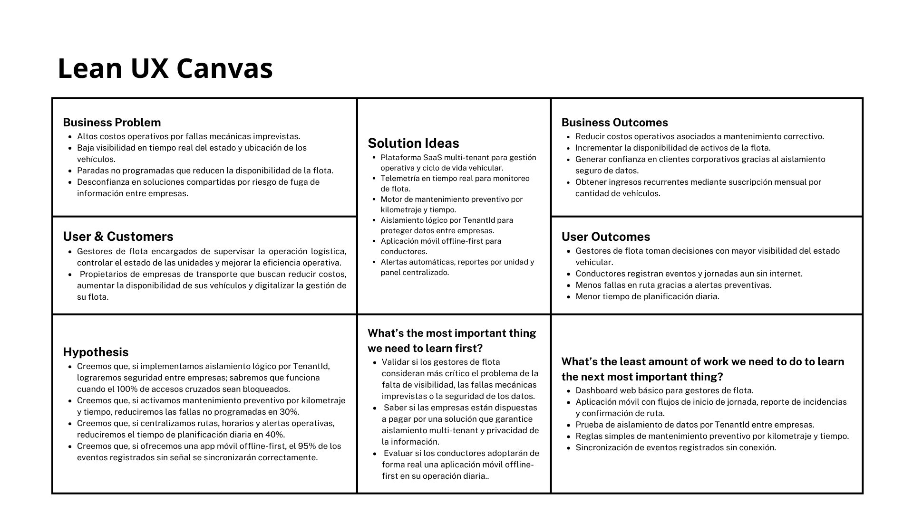

# Capítulo I: Introducción

<h2 id="11-startup-profile">1.1 Startup Profile</h2>

<h3 id="111-descripción-de-la-startup">1.1.1 Descripción de la Startup</h3>

GosLogic es una startup de base tecnológica conformada por estudiantes de Ingeniería de Software de la Universidad Peruana de Ciencias Aplicadas (UPC). Nuestra organización nace con el propósito fundamental de optimizar la gestión empresarial a través del desarrollo de software de alta calidad, con un enfoque estratégico y especializado en el sector de la logística.

Nos distinguimos en el mercado por nuestro rigor técnico, priorizando siempre la aplicación de criterios sólidos de ingeniería en cada etapa del ciclo de vida del producto. Para GosLogic, la calidad no es solo un objetivo, sino un estándar que alcanzamos mediante el uso de arquitecturas modernas, patrones de diseño y metodologías ágiles.

Nuestra cultura organizacional se sustenta en dos pilares críticos: el aprendizaje continuo y autónomo, y la búsqueda constante de la excelencia técnica. Esto nos permite integrar rápidamente nuevos conocimientos y tecnologías para resolver problemas complejos de manera eficiente.

A largo plazo, la visión de GosLogic es convertirse en un aliado estratégico para las pequeñas y medianas empresas, liderando su transformación digital y optimizando sus procesos logísticos para hacerlas más competitivas en un entorno globalizado y altamente digitalizado.

<h3 id="112-perfiles-de-integrantes-del-equipo">1.1.2 Perfiles de integrantes del equipo</h3>

<table border="1">
  <tr>
      <td style="text-align:center;"></td>
      <td><strong>Angelo Solano - u20231B775</strong> Mi nombre es Angelo Solano, soy estudiante de Ingeniería de Software en la UPC. Me apasiona la tecnología y todo lo relacionado con el desarrollo de software. Me gusta enfrentarme a desafíos complejos y encontrar soluciones creativas. Estoy en constante aprendizaje, siempre buscando mejorar mis habilidades en programación y análisis de sistemas. Me considero una persona comprometida con mis proyectos y con ganas de crecer tanto profesionalmente como personalmente. Disfruto trabajar en equipo y siempre trato de aportar lo mejor de mí en todo lo que hago.</td>
  </tr>
  <tr>
      <td style="text-align:center;"></td>
      <td><strong>Sergio Iglesias - u202316118</strong> Mi nombre es Sergio Iglesias, tengo 20 años y estoy cursando mi 7to ciclo de la carrera de Ingeniería de Software en la UPC. Soy una persona proactiva, creativa y con gran pasión por la tecnología. Me destaco por mi capacidad de resolver problemas de manera eficiente y mi habilidad para trabajar colaborativamente en proyectos complejos. Estoy comprometido con el aprendizaje continuo y siempre busco aplicar las mejores prácticas en el desarrollo de software. Mi objetivo es contribuir significativamente al éxito de este proyecto y crecer profesionalmente en el campo de la ingeniería de software.</td>
  </tr>
  <tr>
      <td style="text-align:center;"></td>
      <td><strong>Martin Gonzales - u202319724</strong> Mi nombre es Martin Gonzales, tengo 20 años y estoy cursando mi 7to ciclo de la carrera de Ingeniería de Software en la UPC. Me caracterizo por mi interés en la programación, la tecnología y el aprendizaje continuo. Tengo una actitud analítica y organizada, lo que me permite desarrollar proyectos académicos y prácticos con dedicación, buscando siempre aplicar los conocimientos adquiridos de manera efectiva.</td>
  </tr>
    <tr>
      <td style="text-align:center;"></td>
      <td><strong>Eduardo Cossar - u202312109</strong> Mi nombre es Eduardo Cossar. Soy estudiante de la carrera de Ingeniería de Software, tengo 20 años y actualmente estoy cursando el septimo ciclo en la UPC. Me considero una persona responsable y comprometida con un gran interés por la tecnología. Como integrante de este equipo, me comprometo a brindar todo mi apoyo y participación activa para afrontar los desafíos que se presenten y dar lo mejor de mí para lograr el éxito de este proyecto.</td>
  </tr>

  <tr>
      <td style="text-align:center;"></td>
      <td><strong>Maria Fernanda Mostajo - u202312874</strong> Mi nombre es Maria Fernanda Mostajo, estoy estudiando la carrera de Ingeniería de Software en la UPC, tengo conocimientos en los lenguajes de programación C++, Python, HTML, CSS, JavaScript y SQL. Además, cuento con habilidades de trabajo en equipo, el cual me permitira realizar un buen trabajo y cumplir con los objetivos planteados en el tiempo establecido.
</table>

<h2 id="12-solution-profile">1.2 Solution Profile</h2>

<h3 id="121-nombre-del-producto">1.2.1 Nombre del producto</h3>

El producto de software que desarrollaremos como startup es <strong>Orion</strong>

<h3 id="122-antecedentes-y-problemática">1.2.2 Antecedentes y problemática</h3>

<h4> Antecedentes </h4>

En el Perú, las PYMES representan el 99.1% del tejido empresarial formal y aportan el 20.2% del PBI nacional (PRODUCE, 2025). Sin embargo, el sector logístico atraviesa una dualidad crítica: mientras el comercio electrónico exige inmediatez, existe una brecha tecnológica profunda donde el 66% de las PYMES aún depende de procesos manuales o herramientas básicas como Excel para gestionar su cadena de suministro. Según el Ministerio de la Producción (PRODUCE), solo el 9% de estas empresas alcanza una madurez digital avanzada. En este escenario, Orion surge como una plataforma diseñada bajo paradigmas de Microservicios y Domain-Driven Design (DDD) para democratizar el acceso a herramientas de alta ingeniería que optimicen la logística y permitan a las PYMES competir en un mercado globalizado.

<h4>Problemática (5W 2h)</h4>

#### **Who (¿Quién?)**

El segmento objetivo son las PYMES peruanas del sector comercial y de servicios logísticos que gestionan un volumen crítico de inventario y distribución, pero que operan con un nivel de madurez digital "incipiente" o "encaminado"

#### **What (¿Qué?)**

Ineficiencia operativa sistémica caracterizada por la falta de trazabilidad en tiempo real, errores críticos de inventario y la incapacidad de integrar sistemas fragmentados (ventas, almacén y distribución).

#### **Where (¿Dónde?)**

El problema se concentra geográficamente en nodos de alta presión como Lima y Callao (donde se ubica el 63.2% de las MYPEs), y se manifiesta técnicamente en la desconexión entre el back-office logístico y el front-office digital.

#### **When (¿Cuándo?)**

La crisis de gestión se agudiza en picos estacionales como la Campaña Escolar (25-40% de ventas anuales), Fiestas Patrias y los Cyber Days, donde el aumento de demanda sobrepasa la capacidad de respuesta de los sistemas manuales.

#### **Why (¿Por qué?)**

La causa raíz es el uso de arquitecturas monolíticas y silos de datos que impiden la escalabilidad. Además, el alto costo de implementación de software tradicional (señalado por el 39% de empresas como barrera principal) limita la adopción tecnológica.

#### **How (¿Cómo?)**

Se manifiesta a través de un 20% de entregas fallidas en el primer intento y retrasos de hasta 15 días en nodos logísticos clave, lo que genera una pérdida de confianza que aleja al 89% de los clientes tras una mala experiencia.

#### **How Much (¿Cuánto?)**

La ineficiencia eleva los costos logísticos hasta un 21.1% sobre las ventas (frente al 15% en grandes corporaciones). Esto incluye pérdidas de aproximadamente 15 euros por cada entrega fallida y tasas de devolución (logística inversa) que alcanzan el 41% en temporadas altas.

<h3 id="123-lean-ux-process">1.2.3 Lean UX Process</h3>

<h4 id="1231-lean-ux-problem-statement">1.2.3.1 Lean UX Problem Statement</h4>

Nuestra solución busca proveer una plataforma SaaS multi-tenant que permita centralizar la gestión operativa y el ciclo de vida vehicular, integrando telemetría en tiempo real y mantenimiento preventivo.

Hemos observado que las empresas de transporte sufren altos costos operativos debido a fallas mecánicas imprevistas y la falta de visibilidad en tiempo real de sus vehículos, lo que repercute en la disponibilidad de sus activos.

¿Cómo podemos optimizar la gestión de mantenimiento y la visibilidad de la flota para reducir paradas no programadas?

Nuestra solución busca garantizar la privacidad y el aislamiento total de los datos mediante una arquitectura basada en TenantId, asegurando que la información sensible de una empresa sea inaccesible para sus competidores.

Hemos observado que las soluciones tradicionales no ofrecen un aislamiento seguro, lo que genera desconfianza y miedo a la fuga de información estratégica entre empresas del mismo sector.

¿Cómo puede nuestra arquitectura asegurar un aislamiento lógico total que brinde seguridad y confianza a cada cliente corporativo?

Nuestra solución busca proveer una herramienta móvil con enfoque offline-first para que los conductores registren eventos y telemetría sin interrupciones, independientemente de la cobertura de red.

Hemos observado que los conductores suelen transitar por zonas sin cobertura, lo que ocasiona la pérdida de registros críticos de jornada, ubicación y eventos de mantenimiento.

¿Cómo podemos garantizar que el registro de datos sea continuo y resiliente en zonas con conectividad intermitente?

<h4 id="1232-lean-ux-assumptions">1.2.3.2 Lean UX Assumptions</h4>

**Business Assumptions:**

- Creemos que nuestros usuarios necesitan un control estricto sobre el ciclo de vida de sus vehículos para evitar reparaciones correctivas costosas.
- Estas necesidades se pueden satisfacer con un motor de reglas preventivas basado en telemetría (KM y tiempo) y un panel de control centralizado.
- Nuestros clientes iniciales serán múltiples empresas de transporte de carga y logística en Perú que buscan optimizar su flota y gestionar personal de campo.
- El valor más importante que un cliente quiere de nuestros servicios es la garantía de privacidad (multi-tenancy) y la reducción de incidentes mecánicos en ruta.
- El cliente también va a obtener reportes de rendimiento por unidad, alertas automáticas y mayor vida útil de sus activos.
- Vamos a obtener la mayoría de los clientes mediante venta directa B2B, demostraciones técnicas de seguridad de datos y presencia en ferias de logística.
- Vamos a obtener ingresos mediante una suscripción mensual escalable basada en la cantidad de vehículos monitoreados.
- Nuestra competencia en el mercado serán sistemas de GPS básicos, hojas de cálculo manuales o software legacy sin capacidades predictivas ni de aislamiento seguro.
- Vamos a tener ventaja frente a nuestra competencia debido a la arquitectura segura por TenantId, la resiliencia offline de la app y la optimización de costos en telemetría (Google Maps).
- El mayor riesgo del servicio es una posible vulneración de seguridad o fuga de información entre tenants, lo que afectaría la confianza de las empresas clientes y la continuidad del negocio.
- Lo resolveremos implementando aislamiento lógico estricto por TenantId en toda la arquitectura, controles de acceso por roles, cifrado de datos en tránsito y en reposo, auditoría de accesos y pruebas periódicas de seguridad.

**User Assumptions:**

- **¿Quién es el usuario?** Los gestores de flota que toman decisiones estratégicas y los conductores que operan las unidades en campo bajo diversas condiciones de red.
- **¿Qué problemas tiene nuestro producto que resolver?** La incertidumbre sobre el estado mecánico de los vehículos, la falta de seguridad en plataformas compartidas y la pérdida de datos en zonas rurales o carreteras sin señal.
- **¿Qué características son importantes?** Aislamiento lógico de datos, alertas preventivas automáticas, visualización en mapas con bajo consumo de datos y una app móvil que funcione sin internet.
- **¿Dónde encaja nuestro producto en su trabajo o vida?** Se integra en la rutina diaria del conductor al iniciar jornada y en la gestión diaria del supervisor para monitorear indicadores de mantenimiento y ubicación.
- **¿Cuándo y cómo es nuestro producto usado?** Se usa en tiempo real durante el trayecto de los vehículos y para la planificación de ingresos a taller. Se accede vía web (gestores) y móvil (conductores).
- **¿Cómo debe verse nuestro producto y cómo debe comportarse?** Debe ser profesional, con dashboards de alto impacto visual para gestores, y una interfaz simplificada de alto contraste para conductores en ruta.

<h4 id="1233-lean-ux-hypothesis">1.2.3.3 Lean UX Hypothesis</h4>

**Hypothesis Statement 01**  
Creemos que implementando aislamiento lógico estricto por TenantId para todas las operaciones de la plataforma, sabremos que hemos tenido éxito cuando el 100% de las pruebas de acceso cruzado entre empresas sean bloqueadas y validadas en QA.

**Hypothesis Statement 02**  
Creemos que activando reglas de mantenimiento preventivo por kilometraje y tiempo (aceite, neumáticos y revisiones), sabremos que hemos tenido éxito cuando las fallas no programadas se reduzcan en al menos 30% durante los primeros seis meses.

**Hypothesis Statement 03**  
Creemos que centralizando en Orion la asignación de rutas, horarios, estado de unidades y alertas operativas, sabremos que hemos tenido éxito cuando el tiempo de planificación diaria del gestor se reduzca en 40%.

**Hypothesis Statement 04**  
Creemos que ofreciendo una capacitación guiada sobre la app móvil de Orion a los conductores, sabremos que hemos tenido éxito cuando al menos el 85% complete correctamente los flujos clave (inicio/fin de jornada, reporte de eventos y confirmación de ruta) en el primer mes.

**Hypothesis Statement 05**  
Creemos que implementando sincronización diferida en la app móvil para operar sin señal, sabremos que hemos tenido éxito cuando el 95% de eventos registrados offline se sincronicen correctamente al recuperar conectividad.

**Hypothesis Statement 06**  
Creemos que aplicando caché y control de frecuencia de actualización en Google Maps, sabremos que hemos tenido éxito cuando el costo mensual de consumo de mapas se reduzca en 35% sin afectar la precisión del monitoreo de flota.

<h4 id="1234-lean-ux-canvas">1.2.3.4 Lean UX Canvas</h4>

  

<h2 id="13-segmentos-objetivo">1.3 Segmentos objetivo</h2>

Con el fin de llegar de manera efectiva a clientes potenciales, hemos definido a los siguientes segmentos objetivos para la plataforma Orion.

### **Segmento objetivo #1: Gestor de flota**

Es el profesional responsable de la toma de decisiones estratégicas y la supervisión de la cadena de suministro dentro de la empresa cliente. Su principal preocupación es la eficiencia operativa y la reducción de los costos logísticos.

<strong>Aspectos demográficos:</strong>

Sexo: Masculino y femenino.

Rango de edad: 30–50 años.

Nivel socioeconómico: Clases B y C.

<strong>Aspectos geográficos: </strong>

Nacionalidad: Perú.

Zona geográfica: Urbana (principalmente Lima y provincias con alta actividad logística).

<strong>Aspectos psicográficos:</strong>

Intereses: Optimización de recursos, monitoreo en tiempo real, análisis de datos para la toma de decisiones y transformación digital.

Estilo de vida: Profesional orientado a resultados, acostumbrado a gestionar múltiples activos y personal bajo presión.

Actitudes: Busca herramientas que eliminen la incertidumbre y los procesos manuales (papel/Excel) para tener un control total sobre la ubicación y estado de sus unidades.

<strong>Necesidades clave:</strong>

Panel de control centralizado para visualizar la flota.

Reportes automáticos de cumplimiento de rutas.

Reducción de costos por kilómetros en vacío y mantenimiento preventivo.

<strong>Comportamiento digital: </strong>

Usuario de herramientas ERP, plataformas SaaS de gestión y aplicaciones de comunicación corporativa.

### **Segmento objetivo #2: Propietarios**

Es el personal operativo encargado de la ejecución física del transporte y distribución. Es el usuario principal de la aplicación móvil de Orion durante sus jornadas laborales.

<strong>Aspectos demográficos:</strong>

Sexo: Masculino (mayoría según estadísticas del sector).

Rango de edad: 25–55 años.

Nivel socioeconómico: Clases C y D.

<strong>Aspectos geográficos: </strong>

Nacionalidad: Perú.

Zona geográfica: Rutas urbanas e interprovinciales.

<strong>Aspectos psicográficos: </strong>

Intereses: Facilidad de navegación, rapidez en el reporte de incidencias, herramientas que faciliten su trabajo diario sin añadir burocracia digital.

Estilo de vida: Dinámico, pasa la mayor parte del día en ruta y depende críticamente de su dispositivo móvil.

Actitudes: Práctico y directo; prefiere aplicaciones intuitivas que funcionen con pocos toques y que no consuman excesivos datos móviles.

<strong>Necesidades clave:</strong>

Hojas de ruta digitales claras y actualizadas.

Mecanismo simple para reportar entregas o problemas en la vía.

Navegación asistida y comunicación directa con la central.

<strong>Comportamiento digital: </strong>

Usuario habitual de aplicaciones de mensajería (WhatsApp) y navegación (Waze/Google Maps). Acostumbrado al uso de apps móviles pero con poca paciencia para flujos de usuario complejos.