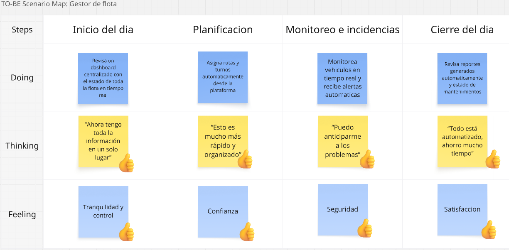
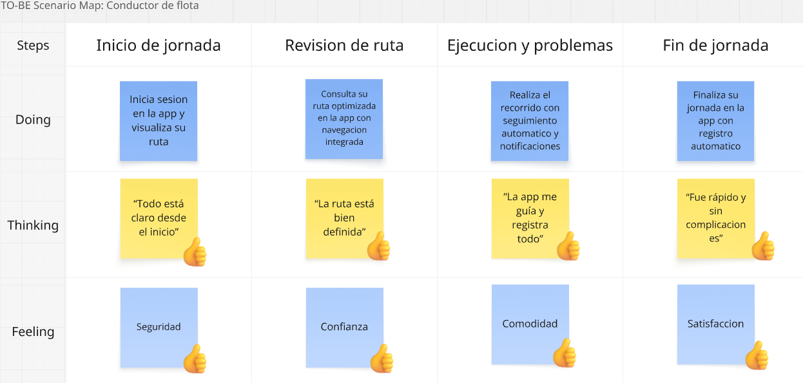

# Capítulo III: Requirements Specification

<h2 id="31-to-be-scenario-mapping">3.1 To-Be Scenario Mapping</h2>

En el To-Be Scenario Map se representa la experiencia del usuario considerando la implementación de la solución propuesta. Este mapa se construye a partir del análisis del AS-IS, con el objetivo de evidenciar cómo el sistema puede mejorar las actividades y procesos que realiza cada user persona en su día a día.

De esta manera, se desarrollaron los mapas TO-BE para cada user persona tomando como base las situaciones identificadas previamente. El proceso inició con la revisión de cada fase del AS-IS, identificando oportunidades de mejora que la plataforma Orion podría ofrecer. Posteriormente, se redefinieron aquellas actividades que serían optimizadas mediante el uso del sistema, incorporando automatización, centralización de la información y monitoreo en tiempo real. Luego, se analizaron los pensamientos que surgirían al utilizar la solución, adoptando la perspectiva de cada usuario. A continuación, se identificaron las emociones asociadas a estos nuevos escenarios, permitiendo evidenciar una mejora en la experiencia general. Finalmente, se evaluaron los aspectos positivos predominantes y cómo la solución contribuye a reducir los problemas detectados en la situación actual.

<b> User Persona 1: Gestor de Flota </b>

  

Al comparar ambos mapas, se evidencia una mejora significativa en la gestión de la flota vehicular del gestor de flota. Esta mejora no solo optimiza las tareas operativas, sino que también le permite dedicar más tiempo a actividades estratégicas como la planificación y la toma de decisiones. Además, se reduce la ocurrencia de fallas inesperadas y descoordinaciones, gracias al monitoreo en tiempo real y a las alertas de mantenimiento preventivo, lo que facilita un mayor control de la operación.

<b> User Persona 2: Conductor de Flota </b>

  

Al comparar ambos mapas, se observa una mejora en la experiencia del conductor de flota durante la ejecución de sus actividades. Esta mejora simplifica sus tareas diarias, permitiéndole trabajar con mayor claridad y menor esfuerzo. Asimismo, se reducen problemas como la falta de información o la dependencia de procesos manuales, ya que ahora cuenta con una aplicación que le brinda instrucciones claras, seguimiento de su recorrido y registro automático de su jornada, mejorando así su desempeño y comodidad en el trabajo.

<h2 id="32-user-stories">3.2 User Stories</h2>

En esta sección se presentan las épicas del producto Orion, redactadas para organizar los requisitos funcionales y no funcionales que guían el alcance del proyecto.

<h3 id="321-epics">3.2.1 Epics</h3>

<table border="1" style="border-collapse: collapse; width: 100%; font-size: 0.95rem;">
  <thead>
    <tr>
      <th style="padding: 0.5rem;">Epic ID</th>
      <th style="padding: 0.5rem;">Título</th>
      <th style="padding: 0.5rem;">Descripción</th>
    </tr>
  </thead>
  <tbody>
    <tr>
      <td style="padding: 0.5rem;">E01</td>
      <td style="padding: 0.5rem;">Gestión Multi-Tenant y Seguridad</td>
      <td style="padding: 0.5rem;">Como administrador de plataforma, quiero gestionar tenants, accesos y protección de información, para garantizar aislamiento seguro entre empresas clientes.</td>
    </tr>
    <tr>
      <td style="padding: 0.5rem;">E02</td>
      <td style="padding: 0.5rem;">Monitoreo y Telemetría</td>
      <td style="padding: 0.5rem;">Como gestor de flota, quiero visualizar posiciones, rutas y eventos en tiempo real, para mejorar el control operativo diario.</td>
    </tr>
    <tr>
      <td style="padding: 0.5rem;">E03</td>
      <td style="padding: 0.5rem;">Mantenimiento Preventivo</td>
      <td style="padding: 0.5rem;">Como gestor de flota, quiero programar mantenimientos y controlar el estado técnico de las unidades, para reducir fallas y evitar multas.</td>
    </tr>
    <tr>
      <td style="padding: 0.5rem;">E04</td>
      <td style="padding: 0.5rem;">Gestión de Despacho Operativo</td>
      <td style="padding: 0.5rem;">Como coordinador de operaciones, quiero asignar conductores, vehículos y rutas de forma dinámica, para optimizar recursos según la demanda.</td>
    </tr>
    <tr>
      <td style="padding: 0.5rem;">E05</td>
      <td style="padding: 0.5rem;">App Móvil del Conductor</td>
      <td style="padding: 0.5rem;">Como conductor, quiero registrar mi jornada y reportar incidencias desde la app, para mantener trazabilidad y respuesta rápida en campo.</td>
    </tr>
    <tr>
      <td style="padding: 0.5rem;">E06</td>
      <td style="padding: 0.5rem;">Resiliencia y Continuidad</td>
      <td style="padding: 0.5rem;">Como administrador de infraestructura, quiero que el sistema tolere fallos y se recupere automáticamente, para asegurar continuidad del servicio sin interrupciones críticas.</td>
    </tr>
    <tr>
      <td style="padding: 0.5rem;">E07</td>
      <td style="padding: 0.5rem;">Desempeño y Escalabilidad</td>
      <td style="padding: 0.5rem;">Como responsable técnico, quiero mantener baja latencia y escalar la plataforma ante mayor carga, para sostener el rendimiento con crecimiento de usuarios y eventos.</td>
    </tr>
    <tr>
      <td style="padding: 0.5rem;">E08</td>
      <td style="padding: 0.5rem;">Calidad e Integración</td>
      <td style="padding: 0.5rem;">Como equipo de desarrollo, quiero contar con pruebas automatizadas y APIs estandarizadas, para facilitar mantenimiento e integración con terceros.</td>
    </tr>
  </tbody>
</table>

<h3 id="322-user-stories">3.2.2 User Stories</h3>

Requisitos definidos junto con el conjunto de User Stories y Epics para los requisitos identificados. Los User Stories incluyen Acceptance Criteria.

<table border="1" style="border-collapse: collapse; width: 100%; font-size: 0.95rem;">
  <thead>
    <tr>
      <th style="padding: 0.5rem;">Epic / User Story ID</th>
      <th style="padding: 0.5rem;">Título</th>
      <th style="padding: 0.5rem;">Descripción</th>
      <th style="padding: 0.5rem;">Criterios de Aceptación</th>
      <th style="padding: 0.5rem;">Relacionado con (Epic ID)</th>
    </tr>
  </thead>
  <tbody>
    <tr>
      <td style="padding: 0.5rem;">US01</td>
      <td style="padding: 0.5rem;">Configuración de Tenant</td>
      <td style="padding: 0.5rem;">Como administrador del sistema, quiero crear perfiles de empresa únicos, para que cada cliente tenga su propio espacio de trabajo aislado.</td>
      <td style="padding: 0.5rem;">Escenario 1: Crear tenant con datos válidos DADO que el administrador está autenticado CUANDO registra una empresa con datos completos y válidos ENTONCES el sistema debe crear un tenantId único  Escenario 2: Validar campos obligatorios DADO que el administrador está en el formulario de creación CUANDO intenta guardar sin completar campos obligatorios ENTONCES el sistema debe bloquear el registro y mostrar los campos faltantes  Escenario 3: Evitar duplicidad de empresa DADO que ya existe una empresa con el mismo identificador tributario CUANDO el administrador intenta crearla nuevamente ENTONCES el sistema debe rechazar la operación por duplicidad  Escenario 4: Confirmar estado inicial del tenant DADO que el tenant fue creado correctamente CUANDO el administrador consulta su detalle ENTONCES el sistema debe mostrarlo como activo con configuración base</td>
      <td style="padding: 0.5rem;">E01</td>
    </tr>
    <tr>
      <td style="padding: 0.5rem;">US02</td>
      <td style="padding: 0.5rem;">Aislamiento de Datos</td>
      <td style="padding: 0.5rem;">Como gestor de flota, quiero que mis datos de conductores y rutas sean invisibles para otras empresas, para garantizar la privacidad comercial.</td>
      <td style="padding: 0.5rem;">Escenario 1: Bloquear acceso entre tenants DADO que un usuario pertenece al tenant A CUANDO intenta consultar datos del tenant B ENTONCES el sistema debe denegar el acceso  Escenario 2: Restringir resultados al tenant autenticado DADO que el usuario realiza una búsqueda de rutas o conductores CUANDO el sistema procesa la consulta ENTONCES solo debe devolver información del tenant autenticado  Escenario 3: Verificar fuga de datos DADO que se ejecutan pruebas de seguridad inter-tenant CUANDO se revisan los resultados ENTONCES no debe existir exposición de datos entre empresas</td>
      <td style="padding: 0.5rem;">E01</td>
    </tr>
    <tr>
      <td style="padding: 0.5rem;">US03</td>
      <td style="padding: 0.5rem;">Gestión de Usuarios y Roles</td>
      <td style="padding: 0.5rem;">Como gestor de flota, quiero invitar usuarios con roles específicos, para delegar la supervisión de la flota.</td>
      <td style="padding: 0.5rem;">Escenario 1: Invitar usuario con rol DADO que el gestor tiene permisos de administración CUANDO envía una invitación y asigna un rol ENTONCES el sistema debe registrar la invitación en estado pendiente  Escenario 2: Completar registro del invitado DADO que el usuario recibió su invitación CUANDO acepta y completa sus datos ENTONCES el sistema debe asociarlo al tenant correcto  Escenario 3: Restringir permisos por rol DADO que el usuario tiene rol monitor CUANDO intenta ingresar a módulos administrativos ENTONCES el sistema debe bloquear el acceso  Escenario 4: Auditar cambios de rol DADO que un administrador modifica un rol CUANDO confirma el cambio ENTONCES el sistema debe actualizar permisos y guardar trazabilidad</td>
      <td style="padding: 0.5rem;">E01</td>
    </tr>
    <tr>
      <td style="padding: 0.5rem;">US04</td>
      <td style="padding: 0.5rem;">Autenticación JWT</td>
      <td style="padding: 0.5rem;">Como gestor, quiero acceder mediante tokens JWT, para asegurar autenticación robusta en el sistema.</td>
      <td style="padding: 0.5rem;">Escenario 1: Login exitoso DADO que el usuario ingresa credenciales válidas CUANDO presiona Iniciar sesión ENTONCES el sistema debe emitir un token JWT válido  Escenario 2: Login fallido DADO que el usuario ingresa credenciales incorrectas CUANDO intenta autenticarse ENTONCES el sistema debe mostrar mensaje de error de autenticación  Escenario 3: Acceso con token inválido DADO que el usuario consume una API protegida con token inválido o vencido CUANDO el backend valida el token ENTONCES debe responder con estado no autorizado</td>
      <td style="padding: 0.5rem;">E01</td>
    </tr>
    <tr>
      <td style="padding: 0.5rem;">US05</td>
      <td style="padding: 0.5rem;">Expiración de Sesión</td>
      <td style="padding: 0.5rem;">Como gestor, quiero que la sesión expire automáticamente tras inactividad, para reducir el riesgo de acceso no autorizado.</td>
      <td style="padding: 0.5rem;">Escenario 1: Expirar sesión por inactividad DADO que el usuario tiene sesión activa CUANDO transcurren 30 minutos sin interacción ENTONCES el sistema debe expirar la sesión automáticamente  Escenario 2: Solicitar reautenticación DADO que la sesión ya expiró CUANDO el usuario intenta acceder a un módulo protegido ENTONCES el sistema debe redirigirlo al inicio de sesión  Escenario 3: Mantener sesión con actividad DADO que el usuario mantiene actividad dentro del periodo permitido CUANDO navega entre módulos ENTONCES el sistema debe conservar su sesión activa</td>
      <td style="padding: 0.5rem;">E01</td>
    </tr>
    <tr>
      <td style="padding: 0.5rem;">US06</td>
      <td style="padding: 0.5rem;">Cifrado HTTPS de Telemetría</td>
      <td style="padding: 0.5rem;">Como administrador, quiero que toda la telemetría se transmita vía HTTPS, para evitar interceptación de datos.</td>
      <td style="padding: 0.5rem;">Escenario 1: Aceptar tráfico seguro DADO que la telemetría se envía por HTTPS CUANDO llega al backend ENTONCES el sistema debe procesarla correctamente  Escenario 2: Rechazar tráfico no seguro DADO que se intenta enviar telemetría por HTTP CUANDO el request entra al sistema ENTONCES debe ser rechazado o redirigido a HTTPS  Escenario 3: Verificar cumplimiento de cifrado DADO una auditoría de comunicaciones CUANDO se revisan los endpoints productivos ENTONCES toda transmisión de telemetría debe estar cifrada</td>
      <td style="padding: 0.5rem;">E01</td>
    </tr>
    <tr>
      <td style="padding: 0.5rem;">US07</td>
      <td style="padding: 0.5rem;">Filtro Obligatorio por TenantId</td>
      <td style="padding: 0.5rem;">Como arquitecto, quiero que toda consulta a BD incluya TenantId, para asegurar 0% de fuga entre empresas.</td>
      <td style="padding: 0.5rem;">Escenario 1: Aplicar filtro obligatorio DADO que se ejecuta una consulta de negocio CUANDO accede a la base de datos ENTONCES la consulta debe incluir tenantId obligatoriamente  Escenario 2: Bloquear consultas inseguras DADO que una consulta no incluye tenantId CUANDO intenta ejecutarse ENTONCES el sistema debe rechazarla por política de seguridad  Escenario 3: Validar aislamiento en integración DADO pruebas de integración multi-tenant CUANDO se prueban endpoints de lectura ENTONCES solo deben retornar datos del tenant autenticado  Escenario 4: Registrar accesos críticos DADO una operación sensible sobre datos CUANDO se completa la consulta ENTONCES el sistema debe guardar traza de auditoría</td>
      <td style="padding: 0.5rem;">E01</td>
    </tr>
    <tr>
      <td style="padding: 0.5rem;">US08</td>
      <td style="padding: 0.5rem;">Visualización en Mapa</td>
      <td style="padding: 0.5rem;">Como gestor de flota, quiero ver la ubicación en tiempo real de mis vehículos, para optimizar la logística.</td>
      <td style="padding: 0.5rem;">Escenario 1: Mostrar unidades activas DADO que existen vehículos transmitiendo GPS CUANDO el gestor abre el mapa ENTONCES el sistema debe mostrar marcadores por unidad  Escenario 2: Actualizar posiciones en tiempo real DADO que llegan nuevas coordenadas CUANDO el evento es procesado ENTONCES la ubicación en mapa debe refrescarse automáticamente  Escenario 3: Identificar unidad sin señal DADO que una unidad deja de enviar eventos CUANDO supera el umbral de inactividad ENTONCES el sistema debe marcarla como desactualizada  Escenario 4: Filtrar visualización DADO múltiples unidades visibles CUANDO el gestor aplica filtros por estado o zona ENTONCES el mapa debe mostrar solo las unidades filtradas</td>
      <td style="padding: 0.5rem;">E02</td>
    </tr>
    <tr>
      <td style="padding: 0.5rem;">US09</td>
      <td style="padding: 0.5rem;">Historial de Rutas</td>
      <td style="padding: 0.5rem;">Como gestor de flota, quiero consultar el recorrido histórico de una unidad, para verificar el cumplimiento de las rutas.</td>
      <td style="padding: 0.5rem;">Escenario 1: Consultar por fecha y unidad DADO una unidad seleccionada CUANDO el gestor define un rango de fechas ENTONCES el sistema debe mostrar el recorrido histórico correspondiente  Escenario 2: Ver detalle de traza DADO una ruta histórica disponible CUANDO el gestor abre su detalle ENTONCES debe visualizar hora, posición y eventos asociados  Escenario 3: Manejar consulta sin resultados DADO un rango sin datos registrados CUANDO se ejecuta la búsqueda ENTONCES el sistema debe informar que no existen recorridos</td>
      <td style="padding: 0.5rem;">E02</td>
    </tr>
    <tr>
      <td style="padding: 0.5rem;">US10</td>
      <td style="padding: 0.5rem;">Gestión de Geocercas</td>
      <td style="padding: 0.5rem;">Como gestor de flota, quiero definir zonas permitidas, para recibir alertas cuando un vehículo salga del perímetro autorizado.</td>
      <td style="padding: 0.5rem;">Escenario 1: Crear geocerca DADO que el gestor está en el módulo de geocercas CUANDO define un perímetro válido y lo guarda ENTONCES el sistema debe registrar la geocerca para su tenant  Escenario 2: Editar geocerca DADO una geocerca existente CUANDO el gestor modifica nombre o perímetro ENTONCES el sistema debe actualizar la configuración  Escenario 3: Eliminar geocerca DADO una geocerca activa CUANDO el gestor solicita eliminarla ENTONCES el sistema debe pedir confirmación antes de borrar  Escenario 4: Asociar geocerca a operación DADO una geocerca creada CUANDO se asocia a una flota o ruta ENTONCES debe quedar habilitada para monitoreo</td>
      <td style="padding: 0.5rem;">E02</td>
    </tr>
    <tr>
      <td style="padding: 0.5rem;">US11</td>
      <td style="padding: 0.5rem;">Alertas por Geocerca</td>
      <td style="padding: 0.5rem;">Como gestor de flota, quiero recibir alertas si un vehículo sale del perímetro autorizado, para actuar oportunamente.</td>
      <td style="padding: 0.5rem;">Escenario 1: Detectar salida de perímetro DADO que el vehículo está dentro de una geocerca CUANDO cruza el límite hacia afuera ENTONCES el sistema debe generar una alerta inmediata  Escenario 2: Mostrar información de alerta DADO una alerta generada CUANDO el gestor la revisa ENTONCES debe ver unidad, hora y ubicación exacta  Escenario 3: Registrar reingreso DADO que el vehículo vuelve al perímetro CUANDO reingresa a la geocerca ENTONCES el sistema debe registrar evento de normalización  Escenario 4: Priorizar alertas simultáneas DADO múltiples alertas activas CUANDO se listan en el panel ENTONCES el sistema debe ordenarlas por criticidad y recencia</td>
      <td style="padding: 0.5rem;">E02</td>
    </tr>
    <tr>
      <td style="padding: 0.5rem;">US12</td>
      <td style="padding: 0.5rem;">Alertas de Kilometraje</td>
      <td style="padding: 0.5rem;">Como gestor de flota, quiero recibir alertas automáticas de cambio de aceite, para evitar daños mecánicos por exceso de uso.</td>
      <td style="padding: 0.5rem;">Escenario 1: Generar alerta por umbral DADO un umbral configurado para mantenimiento CUANDO el kilometraje supera el límite ENTONCES el sistema debe crear una alerta automática  Escenario 2: Notificar al responsable DADO una alerta de mantenimiento activa CUANDO el gestor abre notificaciones ENTONCES debe visualizar unidad afectada y tipo de servicio recomendado  Escenario 3: Reiniciar ciclo tras mantenimiento DADO que se registró el servicio realizado CUANDO se confirma el mantenimiento ENTONCES el sistema debe reiniciar el ciclo de control de kilometraje  Escenario 4: Visualizar próximos mantenimientos DADO varias unidades registradas CUANDO el gestor consulta el panel ENTONCES debe ver el orden de prioridad por proximidad al umbral</td>
      <td style="padding: 0.5rem;">E03</td>
    </tr>
    <tr>
      <td style="padding: 0.5rem;">US13</td>
      <td style="padding: 0.5rem;">Registro de Activos</td>
      <td style="padding: 0.5rem;">Como gestor de flota, quiero registrar el estado de neumáticos y frenos, para proyectar gastos de renovación anual.</td>
      <td style="padding: 0.5rem;">Escenario 1: Registrar estado técnico DADO una unidad seleccionada CUANDO el gestor registra estado de frenos y neumáticos ENTONCES el sistema debe guardar estado, fecha y responsable  Escenario 2: Consultar historial técnico DADO que existen inspecciones previas CUANDO el gestor consulta la unidad ENTONCES debe visualizar el historial cronológico de evaluaciones  Escenario 3: Alertar condición crítica DADO que una inspección reporta estado crítico CUANDO se guarda el registro ENTONCES el sistema debe emitir una alerta preventiva</td>
      <td style="padding: 0.5rem;">E03</td>
    </tr>
    <tr>
      <td style="padding: 0.5rem;">US14</td>
      <td style="padding: 0.5rem;">Control de Revisiones Técnicas</td>
      <td style="padding: 0.5rem;">Como gestor de flota, quiero programar revisiones legales, para evitar multas por documentos vencidos.</td>
      <td style="padding: 0.5rem;">Escenario 1: Programar vencimientos DADO un vehículo con documentación vigente CUANDO se registran fechas de revisión ENTONCES el sistema debe programar recordatorios automáticos  Escenario 2: Alertar vencimiento próximo DADO una revisión cercana a su fecha límite CUANDO entra en ventana de alerta ENTONCES el sistema debe notificar al responsable  Escenario 3: Marcar riesgo legal DADO una revisión vencida CUANDO el gestor revisa el estado del vehículo ENTONCES el sistema debe mostrar riesgo legal activo</td>
      <td style="padding: 0.5rem;">E03</td>
    </tr>
    <tr>
      <td style="padding: 0.5rem;">US15</td>
      <td style="padding: 0.5rem;">Asignación Dinámica</td>
      <td style="padding: 0.5rem;">Como gestor de flota, quiero asignar conductores a vehículos y rutas específicas según la demanda del día.</td>
      <td style="padding: 0.5rem;">Escenario 1: Asignar despacho válido DADO conductores, vehículos y rutas disponibles CUANDO el gestor confirma la asignación ENTONCES el sistema debe registrar el despacho exitosamente  Escenario 2: Bloquear conductor no disponible DADO un conductor fuera de turno CUANDO el gestor intenta asignarlo ENTONCES el sistema debe impedir la asignación  Escenario 3: Detectar conflicto de recurso DADO un vehículo ocupado en el mismo horario CUANDO se intenta asignar otra ruta ENTONCES el sistema debe mostrar conflicto de solapamiento  Escenario 4: Reasignar recurso DADO una asignación existente CUANDO el gestor cambia conductor o unidad ENTONCES el sistema debe actualizar el despacho y notificar a involucrados  Escenario 5: Mantener trazabilidad DADO cualquier alta o cambio de asignación CUANDO se guarda la operación ENTONCES el sistema debe registrar usuario, fecha y motivo del cambio</td>
      <td style="padding: 0.5rem;">E04</td>
    </tr>
    <tr>
      <td style="padding: 0.5rem;">US16</td>
      <td style="padding: 0.5rem;">Disponibilidad de Personal</td>
      <td style="padding: 0.5rem;">Como gestor de flota, quiero ver quién está en turno activo, para no sobrepasar las horas permitidas de manejo.</td>
      <td style="padding: 0.5rem;">Escenario 1: Visualizar estado de turnos DADO conductores registrados CUANDO el gestor abre el panel de disponibilidad ENTONCES debe ver estado por turno y zona  Escenario 2: Controlar límite de horas DADO un conductor con horas máximas excedidas CUANDO se intenta asignar una ruta ENTONCES el sistema debe bloquear la asignación  Escenario 3: Reflejar cambios en tiempo real DADO que un conductor cambia de estado CUANDO se actualiza su turno ENTONCES el panel debe reflejar el cambio inmediatamente  Escenario 4: Filtrar personal elegible DADO múltiples conductores activos CUANDO el gestor aplica filtros operativos ENTONCES el sistema debe mostrar solo los aptos para asignación</td>
      <td style="padding: 0.5rem;">E04</td>
    </tr>
    <tr>
      <td style="padding: 0.5rem;">US17</td>
      <td style="padding: 0.5rem;">Reporte de Jornada</td>
      <td style="padding: 0.5rem;">Como conductor, quiero marcar inicio y fin de jornada desde la app, para que mi tiempo laborado quede registrado.</td>
      <td style="padding: 0.5rem;">Escenario 1: Iniciar jornada DADO conductor autenticado en la app CUANDO presiona Iniciar jornada ENTONCES el sistema debe registrar la hora de inicio  Escenario 2: Finalizar jornada DADO una jornada iniciada CUANDO presiona Finalizar jornada ENTONCES el sistema debe registrar hora de cierre y duración  Escenario 3: Evitar cierre inválido DADO que no existe jornada iniciada CUANDO intenta finalizar jornada ENTONCES el sistema debe bloquear la acción e informar el motivo</td>
      <td style="padding: 0.5rem;">E05</td>
    </tr>
    <tr>
      <td style="padding: 0.5rem;">US18</td>
      <td style="padding: 0.5rem;">Recepción de Horarios</td>
      <td style="padding: 0.5rem;">Como conductor, quiero ver mi cronograma diario en el móvil, para saber qué unidad debo operar.</td>
      <td style="padding: 0.5rem;">Escenario 1: Ver cronograma del día DADO que el conductor tiene asignaciones CUANDO abre el módulo de cronograma ENTONCES el sistema debe mostrar ruta, hora y unidad asignada  Escenario 2: Actualizar cambios de despacho DADO que el gestor modifica una asignación CUANDO el cambio se confirma ENTONCES la app del conductor debe reflejar la actualización  Escenario 3: Mostrar ausencia de tareas DADO que el conductor no tiene asignaciones CUANDO ingresa al cronograma ENTONCES el sistema debe mostrar estado sin tareas programadas</td>
      <td style="padding: 0.5rem;">E05</td>
    </tr>
    <tr>
      <td style="padding: 0.5rem;">US19</td>
      <td style="padding: 0.5rem;">Reporte de Incidentes</td>
      <td style="padding: 0.5rem;">Como conductor, quiero enviar fotos de fallas mecánicas desde la app, para que el gestor programe el taller de inmediato.</td>
      <td style="padding: 0.5rem;">Escenario 1: Reportar con evidencia DADO una falla detectada en ruta CUANDO el conductor registra descripción y adjunta fotografía ENTONCES el sistema debe crear el incidente con evidencia  Escenario 2: Validar campos obligatorios DADO un reporte incompleto CUANDO intenta enviarlo ENTONCES el sistema debe bloquear el registro y mostrar errores  Escenario 3: Notificar al gestor DADO un incidente registrado correctamente CUANDO el sistema lo procesa ENTONCES debe notificar al gestor de flota  Escenario 4: Priorizar incidencia crítica DADO una incidencia de severidad alta CUANDO se clasifica el reporte ENTONCES el sistema debe destacarlo con prioridad máxima</td>
      <td style="padding: 0.5rem;">E05</td>
    </tr>
    <tr>
      <td style="padding: 0.5rem;">US20</td>
      <td style="padding: 0.5rem;">Botón de Pánico</td>
      <td style="padding: 0.5rem;">Como conductor, quiero activar una alerta de emergencia, para que la central reciba mi ubicación exacta al instante.</td>
      <td style="padding: 0.5rem;">Escenario 1: Emitir alerta de emergencia DADO conductor en operación CUANDO presiona el botón de pánico ENTONCES el sistema debe enviar alerta con ubicación GPS actual  Escenario 2: Recepción en central DADO una alerta emitida CUANDO llega al centro de monitoreo ENTONCES la central debe visualizar unidad, hora y coordenadas  Escenario 3: Reintento por conectividad DADO conectividad inestable CUANDO falle el primer envío ENTONCES la app debe reintentar automáticamente hasta confirmar recepción  Escenario 4: Trazabilidad de atención DADO que la alerta fue recibida CUANDO el operador inicia atención ENTONCES el sistema debe registrar el estado del caso  Escenario 5: Cancelación controlada DADO una activación accidental CUANDO el conductor solicita cancelar la alerta ENTONCES el sistema debe requerir validación y dejar registro del evento</td>
      <td style="padding: 0.5rem;">E05</td>
    </tr>
    <tr>
      <td style="padding: 0.5rem;">US21</td>
      <td style="padding: 0.5rem;">Persistencia Local Offline</td>
      <td style="padding: 0.5rem;">Como conductor, quiero que la app móvil guarde eventos offline en SQLite, para garantizar la experiencia en zonas sin señal.</td>
      <td style="padding: 0.5rem;">Escenario 1: Guardar evento sin red DADO ausencia de conectividad CUANDO el conductor registra un evento ENTONCES la app debe almacenarlo en SQLite local  Escenario 2: Persistencia tras reinicio DADO eventos pendientes guardados localmente CUANDO la app se cierra y se vuelve a abrir ENTONCES los eventos deben mantenerse disponibles  Escenario 3: Consultar cola local DADO múltiples eventos offline CUANDO el conductor revisa pendientes ENTONCES el sistema debe mostrarlos en orden cronológico</td>
      <td style="padding: 0.5rem;">E05</td>
    </tr>
    <tr>
      <td style="padding: 0.5rem;">US22</td>
      <td style="padding: 0.5rem;">Sincronización Inteligente</td>
      <td style="padding: 0.5rem;">Como conductor, quiero que la app sincronice automáticamente los datos pendientes al recuperar señal, para no perder información registrada en modo offline.</td>
      <td style="padding: 0.5rem;">Escenario 1: Sincronizar al recuperar señal DADO que vuelve la conectividad CUANDO inicia el proceso de sincronización ENTONCES la app debe enviar la cola pendiente automáticamente  Escenario 2: Aplicar backoff exponencial DADO un error temporal del servidor CUANDO falle un intento de envío ENTONCES el sistema debe reintentar con backoff exponencial  Escenario 3: Evitar duplicados DADO un evento ya confirmado por backend CUANDO finaliza la sincronización ENTONCES no debe reenviarse ni duplicarse  Escenario 4: Limpiar pendientes enviados DADO que todos los eventos fueron aceptados CUANDO termina el proceso ENTONCES la app debe marcar la cola local como sincronizada</td>
      <td style="padding: 0.5rem;">E05</td>
    </tr>
    <tr>
      <td style="padding: 0.5rem;">US23</td>
      <td style="padding: 0.5rem;">Circuit Breaker</td>
      <td style="padding: 0.5rem;">Como gestor, quiero que el sistema active un Circuit Breaker si Google Maps falla, para no bloquear la operación.</td>
      <td style="padding: 0.5rem;">Escenario 1: Abrir circuito por fallas DADO fallas consecutivas del proveedor de mapas CUANDO supera el umbral configurado ENTONCES el sistema debe abrir el Circuit Breaker  Escenario 2: Operar en modo degradado DADO circuito abierto CUANDO se solicitan funciones dependientes del proveedor ENTONCES el sistema debe responder con fallback sin bloquear operación  Escenario 3: Intentar recuperación controlada DADO cumplido el tiempo de enfriamiento CUANDO se ejecuta una prueba al proveedor ENTONCES el circuito debe pasar a estado half-open  Escenario 4: Cerrar circuito por estabilidad DADO respuestas exitosas en estado half-open CUANDO se cumple la política de recuperación ENTONCES el circuito debe volver a estado cerrado</td>
      <td style="padding: 0.5rem;">E06</td>
    </tr>
    <tr>
      <td style="padding: 0.5rem;">US24</td>
      <td style="padding: 0.5rem;">Recuperación ante Caídas</td>
      <td style="padding: 0.5rem;">Como administrador, quiero que el sistema autorrecupere microservicios caídos, para restaurar la operación en el menor tiempo posible.</td>
      <td style="padding: 0.5rem;">Escenario 1: Detectar servicio no saludable DADO un microservicio con fallo CUANDO el orquestador ejecuta healthcheck ENTONCES debe identificarlo como no saludable  Escenario 2: Ejecutar autorecuperación DADO un servicio no saludable CUANDO se activa la política de recuperación ENTONCES el sistema debe reiniciarlo automáticamente  Escenario 3: Alertar fallo persistente DADO múltiples reinicios fallidos CUANDO se supera el umbral definido ENTONCES el sistema debe generar alerta crítica al equipo técnico</td>
      <td style="padding: 0.5rem;">E06</td>
    </tr>
    <tr>
      <td style="padding: 0.5rem;">US25</td>
      <td style="padding: 0.5rem;">Latencia de Telemetría GPS</td>
      <td style="padding: 0.5rem;">Como gestor de flota, quiero que la telemetría GPS se procese y visualice con baja latencia, para tomar decisiones operativas en tiempo real.</td>
      <td style="padding: 0.5rem;">Escenario 1: Medir latencia de punta a punta DADO operación en condiciones nominales CUANDO se mide el tiempo entre la emisión GPS y su visualización en el mapa ENTONCES la latencia p95 debe ser menor a 3 segundos  Escenario 2: Alertar degradación de rendimiento DADO que la latencia supera el umbral definido CUANDO se ejecuta el monitoreo técnico ENTONCES el sistema debe generar una alerta de rendimiento  Escenario 3: Priorizar procesamiento de eventos recientes DADO una alta tasa de eventos GPS entrantes CUANDO el sistema procesa la cola de telemetría ENTONCES debe priorizar los eventos más recientes para mantener frescura en el mapa  Escenario 4: Visualizar métricas históricas DADO que existen mediciones de rendimiento almacenadas CUANDO el equipo técnico consulta el panel de métricas ENTONCES debe visualizar tendencia de latencia por intervalo de tiempo  Escenario 5: Bloquear release por incumplimiento de latencia DADO que la validación de rendimiento falla en CI CUANDO la latencia no cumple el umbral objetivo ENTONCES el pipeline debe marcar el despliegue como no aprobado</td>
      <td style="padding: 0.5rem;">E07</td>
    </tr>
    <tr>
      <td style="padding: 0.5rem;">US26</td>
      <td style="padding: 0.5rem;">Autoescalado Horizontal de Servicios</td>
      <td style="padding: 0.5rem;">Como administrador de plataforma, quiero escalar horizontalmente los servicios ante picos de tráfico, para mantener estabilidad y continuidad del sistema.</td>
      <td style="padding: 0.5rem;">Escenario 1: Escalar ante incremento de carga DADO una carga superior al umbral de operación normal CUANDO el uso promedio de CPU supera el límite configurado ENTONCES el orquestador debe crear nuevas réplicas automáticamente  Escenario 2: Mantener servicio durante el escalado DADO que se activó el escalamiento CUANDO los usuarios continúan operando ENTONCES el sistema debe mantener disponibilidad sin interrupciones críticas  Escenario 3: Liberar recursos cuando baja la demanda DADO que el tráfico vuelve a niveles normales CUANDO el uso de recursos se estabiliza ENTONCES el sistema debe reducir réplicas de forma controlada para optimizar costos</td>
      <td style="padding: 0.5rem;">E07</td>
    </tr>
    <tr>
      <td style="padding: 0.5rem;">US27</td>
      <td style="padding: 0.5rem;">Cobertura Mínima de Pruebas</td>
      <td style="padding: 0.5rem;">Como equipo de QA, quiero validar una cobertura mínima automatizada, para asegurar calidad antes de cada despliegue.</td>
      <td style="padding: 0.5rem;">Escenario 1: Ejecutar pruebas en pipeline DADO que se inicia una ejecución de CI CUANDO corren las pruebas unitarias e integración ENTONCES el sistema debe generar reporte de cobertura automáticamente  Escenario 2: Bloquear despliegue por baja cobertura DADO que la cobertura global es menor al 80% CUANDO finaliza la validación de calidad ENTONCES el pipeline debe marcar la build como fallida</td>
      <td style="padding: 0.5rem;">E08</td>
    </tr>
    <tr>
      <td style="padding: 0.5rem;">US28</td>
      <td style="padding: 0.5rem;">API REST Estandarizada para Integración</td>
      <td style="padding: 0.5rem;">Como integrador externo, quiero consumir APIs REST documentadas, para integrar sistemas de terceros en menor tiempo y con menos errores.</td>
      <td style="padding: 0.5rem;">Escenario 1: Publicar contrato API DADO que existe un módulo expuesto a terceros CUANDO el equipo publica su especificación OpenAPI ENTONCES los endpoints, esquemas y códigos de respuesta deben quedar documentados  Escenario 2: Validar autenticación y consumo DADO un tercero con credenciales válidas CUANDO consume los endpoints principales ENTONCES el sistema debe responder según contrato y políticas de seguridad  Escenario 3: Detectar cambios incompatibles DADO una nueva versión de API CUANDO se ejecutan pruebas de contrato ENTONCES el sistema debe alertar si existe ruptura de compatibilidad con consumidores actuales</td>
      <td style="padding: 0.5rem;">E08</td>
    </tr>

  </tbody>
</table>

<h2 id="33-impact-map">3.3 Impact Map</h2>

  

<h2 id="34-product-backlog">3.4. Product Backlog.</h2>

En esta sección se presenta el Product Backlog priorizado de Orion, organizado a partir de las User Stories funcionales identificadas para el sistema. Cada elemento incluye su orden de prioridad, identificador, título, descripción y estimación en Story Points.

<table border="1" style="border-collapse: collapse; width: 100%; font-size: 0.95rem;">
  <thead>
    <tr>
      <th style="padding: 0.5rem;">Orden</th>
      <th style="padding: 0.5rem;">User Story ID</th>
      <th style="padding: 0.5rem;">Título</th>
      <th style="padding: 0.5rem;">Descripción</th>
      <th style="padding: 0.5rem;">Story Points</th>
    </tr>
  </thead>
  <tbody>
    <tr>
      <td style="padding: 0.5rem;">1</td>
      <td style="padding: 0.5rem;">US01</td>
      <td style="padding: 0.5rem;">Configuración de Tenant</td>
      <td style="padding: 0.5rem;">Como administrador del sistema, quiero crear perfiles de empresa únicos, para que cada cliente tenga su propio espacio de trabajo aislado.</td>
      <td style="padding: 0.5rem;">5</td>
    </tr>
    <tr>
      <td style="padding: 0.5rem;">2</td>
      <td style="padding: 0.5rem;">US04</td>
      <td style="padding: 0.5rem;">Autenticación JWT</td>
      <td style="padding: 0.5rem;">Como gestor, quiero acceder mediante tokens JWT, para asegurar autenticación robusta en el sistema.</td>
      <td style="padding: 0.5rem;">3</td>
    </tr>
    <tr>
      <td style="padding: 0.5rem;">3</td>
      <td style="padding: 0.5rem;">US02</td>
      <td style="padding: 0.5rem;">Aislamiento de Datos</td>
      <td style="padding: 0.5rem;">Como gestor de flota, quiero que mis datos de conductores y rutas sean invisibles para otras empresas, para garantizar la privacidad comercial.</td>
      <td style="padding: 0.5rem;">8</td>
    </tr>
    <tr>
      <td style="padding: 0.5rem;">4</td>
      <td style="padding: 0.5rem;">US07</td>
      <td style="padding: 0.5rem;">Filtro Obligatorio por TenantId</td>
      <td style="padding: 0.5rem;">Como arquitecto, quiero que toda consulta a BD incluya TenantId, para asegurar 0% de fuga entre empresas.</td>
      <td style="padding: 0.5rem;">8</td>
    </tr>
    <tr>
      <td style="padding: 0.5rem;">5</td>
      <td style="padding: 0.5rem;">US03</td>
      <td style="padding: 0.5rem;">Gestión de Usuarios y Roles</td>
      <td style="padding: 0.5rem;">Como gestor de flota, quiero invitar usuarios con roles específicos, para delegar la supervisión de la flota.</td>
      <td style="padding: 0.5rem;">5</td>
    </tr>
    <tr>
      <td style="padding: 0.5rem;">6</td>
      <td style="padding: 0.5rem;">US05</td>
      <td style="padding: 0.5rem;">Expiración de Sesión</td>
      <td style="padding: 0.5rem;">Como gestor, quiero que la sesión expire automáticamente tras inactividad, para reducir el riesgo de acceso no autorizado.</td>
      <td style="padding: 0.5rem;">3</td>
    </tr>
    <tr>
      <td style="padding: 0.5rem;">7</td>
      <td style="padding: 0.5rem;">US06</td>
      <td style="padding: 0.5rem;">Cifrado HTTPS de Telemetría</td>
      <td style="padding: 0.5rem;">Como administrador, quiero que toda la telemetría se transmita vía HTTPS, para evitar interceptación de datos.</td>
      <td style="padding: 0.5rem;">3</td>
    </tr>
    <tr>
      <td style="padding: 0.5rem;">8</td>
      <td style="padding: 0.5rem;">US15</td>
      <td style="padding: 0.5rem;">Asignación Dinámica</td>
      <td style="padding: 0.5rem;">Como gestor de flota, quiero asignar conductores a vehículos y rutas específicas según la demanda del día.</td>
      <td style="padding: 0.5rem;">8</td>
    </tr>
    <tr>
      <td style="padding: 0.5rem;">9</td>
      <td style="padding: 0.5rem;">US16</td>
      <td style="padding: 0.5rem;">Disponibilidad de Personal</td>
      <td style="padding: 0.5rem;">Como gestor de flota, quiero ver quién está en turno activo, para no sobrepasar las horas permitidas de manejo.</td>
      <td style="padding: 0.5rem;">5</td>
    </tr>
    <tr>
      <td style="padding: 0.5rem;">10</td>
      <td style="padding: 0.5rem;">US18</td>
      <td style="padding: 0.5rem;">Recepción de Horarios</td>
      <td style="padding: 0.5rem;">Como conductor, quiero ver mi cronograma diario en el móvil, para saber qué unidad debo operar.</td>
      <td style="padding: 0.5rem;">3</td>
    </tr>
    <tr>
      <td style="padding: 0.5rem;">11</td>
      <td style="padding: 0.5rem;">US17</td>
      <td style="padding: 0.5rem;">Reporte de Jornada</td>
      <td style="padding: 0.5rem;">Como conductor, quiero marcar inicio y fin de jornada desde la app, para que mi tiempo laborado quede registrado.</td>
      <td style="padding: 0.5rem;">3</td>
    </tr>
    <tr>
      <td style="padding: 0.5rem;">12</td>
      <td style="padding: 0.5rem;">US08</td>
      <td style="padding: 0.5rem;">Visualización en Mapa</td>
      <td style="padding: 0.5rem;">Como gestor de flota, quiero ver la ubicación en tiempo real de mis vehículos, para optimizar la logística.</td>
      <td style="padding: 0.5rem;">8</td>
    </tr>
    <tr>
      <td style="padding: 0.5rem;">13</td>
      <td style="padding: 0.5rem;">US09</td>
      <td style="padding: 0.5rem;">Historial de Rutas</td>
      <td style="padding: 0.5rem;">Como gestor de flota, quiero consultar el recorrido histórico de una unidad, para verificar el cumplimiento de las rutas.</td>
      <td style="padding: 0.5rem;">5</td>
    </tr>
    <tr>
      <td style="padding: 0.5rem;">14</td>
      <td style="padding: 0.5rem;">US10</td>
      <td style="padding: 0.5rem;">Gestión de Geocercas</td>
      <td style="padding: 0.5rem;">Como gestor de flota, quiero definir zonas permitidas, para recibir alertas cuando un vehículo salga del perímetro autorizado.</td>
      <td style="padding: 0.5rem;">5</td>
    </tr>
    <tr>
      <td style="padding: 0.5rem;">15</td>
      <td style="padding: 0.5rem;">US11</td>
      <td style="padding: 0.5rem;">Alertas por Geocerca</td>
      <td style="padding: 0.5rem;">Como gestor de flota, quiero recibir alertas si un vehículo sale del perímetro autorizado, para actuar oportunamente.</td>
      <td style="padding: 0.5rem;">5</td>
    </tr>
    <tr>
      <td style="padding: 0.5rem;">16</td>
      <td style="padding: 0.5rem;">US12</td>
      <td style="padding: 0.5rem;">Alertas de Kilometraje</td>
      <td style="padding: 0.5rem;">Como gestor de flota, quiero recibir alertas automáticas de cambio de aceite, para evitar daños mecánicos por exceso de uso.</td>
      <td style="padding: 0.5rem;">5</td>
    </tr>
    <tr>
      <td style="padding: 0.5rem;">17</td>
      <td style="padding: 0.5rem;">US13</td>
      <td style="padding: 0.5rem;">Registro de Activos</td>
      <td style="padding: 0.5rem;">Como gestor de flota, quiero registrar el estado de neumáticos y frenos, para proyectar gastos de renovación anual.</td>
      <td style="padding: 0.5rem;">5</td>
    </tr>
    <tr>
      <td style="padding: 0.5rem;">18</td>
      <td style="padding: 0.5rem;">US14</td>
      <td style="padding: 0.5rem;">Control de Revisiones Técnicas</td>
      <td style="padding: 0.5rem;">Como gestor de flota, quiero programar revisiones legales, para evitar multas por documentos vencidos.</td>
      <td style="padding: 0.5rem;">3</td>
    </tr>
    <tr>
      <td style="padding: 0.5rem;">19</td>
      <td style="padding: 0.5rem;">US19</td>
      <td style="padding: 0.5rem;">Reporte de Incidentes</td>
      <td style="padding: 0.5rem;">Como conductor, quiero enviar fotos de fallas mecánicas desde la app, para que el gestor programe el taller de inmediato.</td>
      <td style="padding: 0.5rem;">5</td>
    </tr>
    <tr>
      <td style="padding: 0.5rem;">20</td>
      <td style="padding: 0.5rem;">US20</td>
      <td style="padding: 0.5rem;">Botón de Pánico</td>
      <td style="padding: 0.5rem;">Como conductor, quiero activar una alerta de emergencia, para que la central reciba mi ubicación exacta al instante.</td>
      <td style="padding: 0.5rem;">8</td>
    </tr>
    <tr>
      <td style="padding: 0.5rem;">21</td>
      <td style="padding: 0.5rem;">US21</td>
      <td style="padding: 0.5rem;">Persistencia Local Offline</td>
      <td style="padding: 0.5rem;">Como conductor, quiero que la app móvil guarde eventos offline en SQLite, para garantizar la experiencia en zonas sin señal.</td>
      <td style="padding: 0.5rem;">8</td>
    </tr>
    <tr>
      <td style="padding: 0.5rem;">22</td>
      <td style="padding: 0.5rem;">US22</td>
      <td style="padding: 0.5rem;">Sincronización Inteligente</td>
      <td style="padding: 0.5rem;">Como conductor, quiero que la app sincronice automáticamente los datos pendientes al recuperar señal, para no perder información registrada en modo offline.</td>
      <td style="padding: 0.5rem;">8</td>
    </tr>
  </tbody>
</table>

**Link del Trello:https://trello.com/invite/b/69f432bbe4fbd84d7926aa2c/ATTI61d4b7dffe97b1c335c47c6925e0e96d7AC04AE7/goslogic** 