# Capítulo IV: Product Architecture Design

<h2 id="41-desing-concepts-viewpoints--er-diagrams">4.1 Desing Concepts, ViewPoints & ER Diagrams</h2>

<em>Esta sección define las estructuras, elementos y relaciones fundamentales de la arquitectura de Orion
. Aplicando el método ADD v3, presentaremos nuestras decisiones de diseño a través de múltiples vistas (principios, patrones y diagramas), ya que un sistema complejo no puede representarse en una única perspectiva</em>

<h3 id="411-principles-statements">4.1.1 Principles Statements</h3>

1. **Aislamiento Lógico por Defecto (Seguridad Multi-Tenant)**
   - **Descripción:** Queda estrictamente prohibida la dependencia en el filtrado manual a nivel de código. Toda operación debe inyectar implícitamente el TenantId desde el API Gateway.
   - **Justificación de Negocio:** Protege el secreto industrial entre empresas competidoras en el modelo SaaS.

2. **Identidad Centralizada y Desacoplada (Atributo: Seguridad/Mantenibilidad)**
  - **Descripción**: La autenticación y autorización se delegan exclusivamente a un servicio de IAM (Identity and Access Management) independiente. Los microservicios de negocio (Bounded Contexts) solo consumen tokens validados por el API Gateway.
  - **Justificación de Negocio:** Permite que el sistema crezca sin replicar lógica de seguridad en cada microservicio y facilita la auditoría de accesos.

3. **Aislamiento de Proveedores Externos (Interoperabilidad)**
   - **Descripción:** Las integraciones con servicios de terceros deberán canalizarse obligatoriamente a través de un patrón de Capa Anticorrupción (Anti-Corruption Layer).
   - **Justificación de Negocio:** Independencia tecnológica y control de costos frente a terceros.

4. **Diseño para el Fallo y Degradación Elegante (Resiliencia)**
   - **Descripción:** Implementación de Circuit Breaker en llamadas externas. Si el mapa falla, se usa caché.
   - **Justificación de Negocio:** Continuidad operativa crítica en la gestión de flotas.

5. **Llamadas Asincrónicas sobre Sincrónicas para Alta Carga (Performance)**
   - **Descripción:** Ingesta masiva de GPS mediante Event-Driven Architecture y Message Brokers.
   - **Justificación de Negocio:** Absorción de picos de carga durante horas punta sin degradar la UI del gestor
6. **Persistencia Local como Estándar Móvil u "Offline-First" (Operatividad)**
   - **Descripción:** Almacenamiento local en dispositivos móviles (SQLite) y sincronización con Retry & Backoff
   - **Justificación de Negocio:** Garantiza trazabilidad en rutas con baja conectividad.

<h3 id="412-approaches-statements-architectural-styles--patterns">4.1.2 Approaches Statements Architectural Styles & Patterns</h3>

<h4>4.1.2.1 Approaches Statements</h4>

Para Orion, la aplicación de **Domain-Driven Design (DDD)**  constituye el marco estratégico fundamental para gestionar la complejidad de una plataforma SaaS multi-tenant orientada al sector logístico.

*   **Modelado Basado en el Dominio:**
    Priorizamos el desarrollo del Core Domain, compuesto por los contextos de **Dispatch & Routing**, **Telemetry & Tracking** y **Maintenance**. Estos representan la ventaja competitiva y la lógica crítica de Orion. Los aspectos comunes y transversales se delegan al subdominio genérico de **Identity & Tenancy**, permitiendo que la lógica de negocio logística evolucione de forma independiente a la infraestructura de seguridad y gestión de organizaciones.

*   **Límites de Contexto Estrictos (Bounded Contexts):**
    Se establecen fronteras explícitas para evitar la contaminación de modelos y asegurar la cohesión. Orion se descompone en seis contextos especializados:
    *   **Identity & Tenancy:** Responsable único de la jerarquía de organizaciones y la emisión de claims de seguridad mediante tokens JWT.
    *   **Fleet Management:** Gestiona el inventario de activos físicos y perfiles de conductores, aplicando políticas de **Row-Level Security (RLS)** para el aislamiento de datos.
    *   **Dispatch & Routing:** Modela la planificación y ejecución de viajes, protegido de la volatilidad de APIs externas mediante una **Anti-Corruption Layer (ACL)**.
    *   **Telemetry & Tracking:** Contexto optimizado para la ingesta de eventos de alta frecuencia, utilizando un enfoque asíncrono para garantizar la escalabilidad.
    *   **Maintenance:** Orquesta la salud de la flota y la programación de servicios técnicos a través del consumo de eventos de kilometraje provenientes de telemetría.
    *   **Alerts & Notifications:** Servicio transversal encargado del despacho de mensajes críticos y operativos hacia los usuarios finales.

*   **Estrategia de Comunicación y Resiliencia:**
    Adoptamos un enfoque híbrido: comunicaciones sincrónicas vía **REST APIs** para procesos transaccionales y administrativos, y comunicaciones asíncronas basadas en eventos para la telemetría y el motor de alertas. Se implementan tácticas de **Circuit Breaker** en los puntos de integración con servicios de terceros para asegurar que una falla externa no provoque una degradación sistémica de la plataforma.

*   **Lenguaje Ubicuo (Ubiquitous Language):**
    Se garantiza que términos críticos como **Tenant, Despacho, Geocerca, Viaje y Alerta** mantengan una definición única y consistente desde los requerimientos funcionales hasta la implementación técnica en el código fuente y los contratos de las APIs. Esto elimina la fricción semántica entre los stakeholders del negocio y el equipo de desarrollo.

<h4>4.1.2.2 Architectural Styles & Patterns</h4>

**A. Estilos Arquitectónicos**

*   **Microservices Architecture:** Se adopta este estilo para permitir el despliegue y escalado independiente de los seis bounded contexts. Esto asegura que la alta carga del servicio de Telemetría no afecte la disponibilidad del módulo de Mantenimiento o Fleet Management.
*   **Event-Driven Architecture:** Utilizado para el procesamiento asíncrono de coordenadas GPS y generación de alertas. Este estilo permite desacoplar los servicios productores (Telemetry) de los consumidores (Alerts, Maintenance), absorbiendo picos de tráfico sin degradar la experiencia del usuario.
*   **RESTful API:** Estilo de comunicación predominante para las interacciones sincrónicas entre el frontend (Web/Mobile) y el API Gateway.

**B. Patrones Arquitectónicos y Tácticas de Diseño**

*   **API Gateway Pattern:** Actúa como el punto de entrada único para todos los clientes. Implementa la lógica de enrutamiento hacia los microservicios y actúa como el primer nivel de seguridad al validar tokens JWT en conjunto con el IAM.
*   **Identity and Access Management (IAM):** Patrón centralizado para la gestión de identidades que garantiza que el `TenantId` sea inyectado en cada petición. Esto asegura que la autenticación sea agnóstica a la lógica de negocio de los microservicios.
*   **Row-Level Security (RLS):** Táctica de persistencia aplicada en el motor de base de datos SQL para garantizar el aislamiento multi-tenant. Filtra automáticamente los registros basándose en el contexto de sesión, mitigando el riesgo de exposición de datos entre empresas competidoras.
*   **Anti-Corruption Layer (ACL):** Aplicado en el contexto de Dispatch & Routing para interactuar con proveedores externos de mapas. Traduce los contratos de terceros a un modelo interno estable, protegiendo el Core Domain de cambios externos.
*   **Circuit Breaker:** Implementado en las integraciones con servicios externos. Previene fallos en cascada al "abrir el circuito" ante errores recurrentes, permitiendo que Orion opere en modo degradado o utilice datos en caché.

<h3 id="413-context-diagram">4.1.3 Context Diagram</h3>

El <strong>Context Diagram</strong> ilustra las principales entidades externas, sistemas y usuarios que interactúan con la plataforma Orion, así como sus canales de integración y límites de contexto clave. Este diagrama ayuda a comprender el alcance del sistema y su relación con el entorno organizacional y tecnológico.

  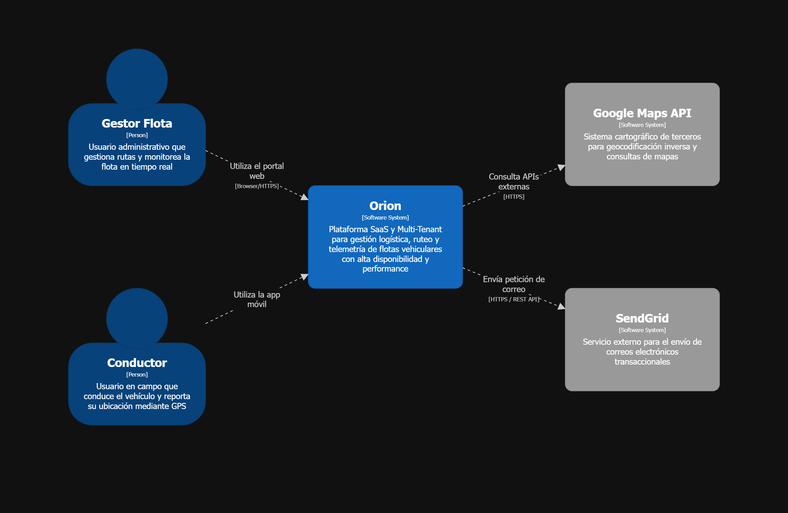

<h3 id="414-approach-driven-viewpoints-diagrams">4.1.4 Approach driven ViewPoints Diagrams</h3>

Para complementar la visión estática de la arquitectura, se han elaborado diagramas de comportamiento que detallan la dinámica operativa de Orion.

Diagrama de contenedores

  

Diagramas de actividades
  - Gestión de incidente y mantenimiento correctivo
  - Procesamiento de telemetría
Diagramas de estado:
  - Ciclo de vida del vehículo
  - Parada en hoja de ruta
  
<h3 id="415-relationalnon-relational-database-diagram">4.1.5 Relational/Non Relational Database Diagram</h3>

#### **I. Argumentación de la decisión tecnológica**

Para nuestra plataforma, se ha decidido implementar una arquitectura de persistencia políglota basada en **PostgreSQL** y su extensión **TimescaleDB**, descartando soluciones puramente NoSQL debido a la complejidad de las relaciones y la necesidad de integridad transaccional.

Esta decisión se basa en los siguientes aspectos: 

*   **Integridad Multi-Tenant**: El sistema exige vínculos estrictos e inquebrantables entre la empresa (Tenant), sus activos y los datos de despacho. El modelo relacional garantiza esta integridad referencial mediante llaves foráneas (FK), asegurando que los datos de un cliente nunca se filtren a otro.
*   **Tratamiento de Series Temporales**: A diferencia de una base de datos relacional estándar, el uso de **TimescaleDB** permite manejar la telemetría masiva mediante *hypertables*. Esto ofrece el rendimiento de una base de datos NoSQL para escrituras, manteniendo la potencia de las consultas SQL para el historial de rutas.
*   **Cómputo Geoespacial Eficiente**: La gestión de geocercas y el monitoreo de arribos se resuelven de forma nativa mediante **PostGIS**. Esto permite calcular si un camión entró en su zona de entrega directamente en la base de datos, optimizando el rendimiento antes de procesar alertas en el backend.
*   **Agregación Analítica para Logística**: La generación de reportes (kilómetros recorridos por flota, cumplimiento de mantenimiento y eficiencia de conductores) se beneficia de las capacidades de agregación complejas que ofrece el lenguaje SQL, cruciales para la toma de decisiones del Gestor de Flota.

#### **II. Diagramas de Base de Datos**

##### IAM database diagram

  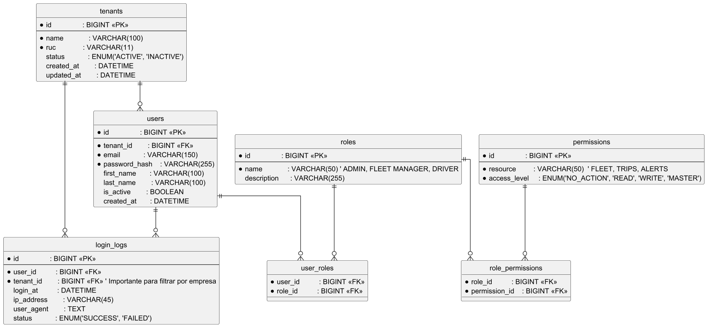

##### Fleet database diagram

  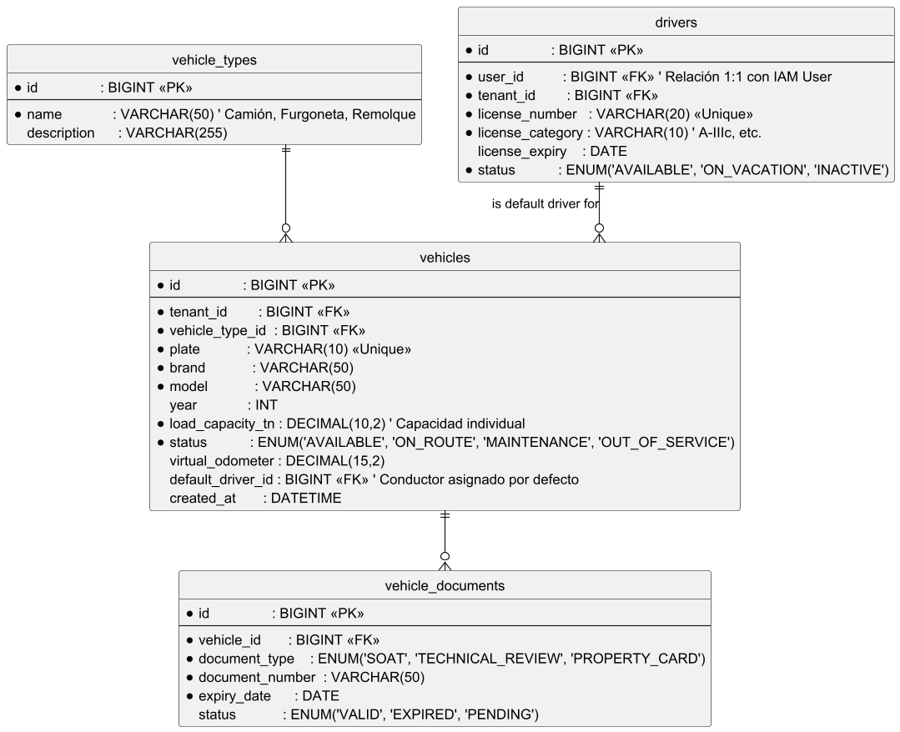

##### Dispatch database diagram

  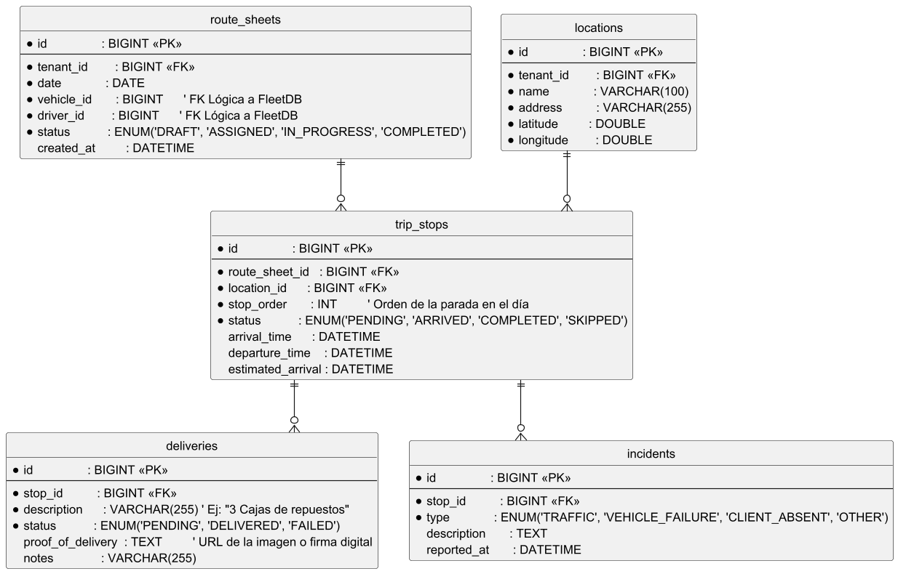

##### Maintenance database diagram

  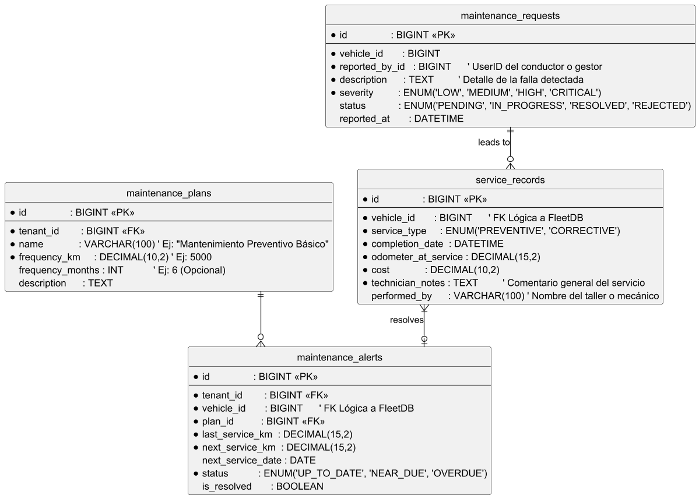

##### Telemetry database diagram

  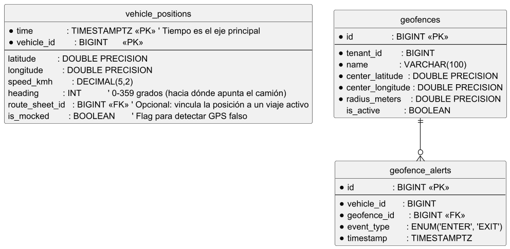

<h3 id="416-design-patterns">4.1.6 Design Patterns</h3>

Para la construcción de Orion, se ha decidido implementar un conjunto de patrones de diseño de software basados en los lineamientos de GoF y arquitecturas empresariales que garantizan el desacoplamiento, la mantenibilidad y el aislamiento de dominios en un entorno Multi-Tenant. Los patrones seleccionados para el contexto específico de este proyecto son los siguientes:

#### **1. Repository Pattern - Patrón Repositorio**
*   **Propósito**: Actuar como un intermediario entre la capa de dominio y la capa de persistencia de datos, ocultando los detalles técnicos del acceso a las distintas bases de datos.
*   **Aplicación en el proyecto**: Es crítico para gestionar la persistencia políglota del sistema. Se utiliza para encapsular consultas complejas en PostgreSQL  y, especialmente, para manejar las funciones de agregación de tiempo en TimescaleDB dentro del microservicio de Telemetría. Esto permite que la lógica de negocio permanezca intacta si se decide cambiar el ORM o la estructura de las tablas en el futuro.

#### **2. Adapt Pattern - Patrón adaptador**
*   **Propósito**: Convertir la interfaz de una clase en otra interfaz que el cliente espera, permitiendo que clases con interfaces incompatibles trabajen juntas.
*   **Aplicación en el proyecto**: Se implementa para la integración con servicios externos como la API de Google Maps. Esto garantiza que si el proveedor externo cambia su contrato o si se decide migrar a otra plataforma como Mapbox, solo se deba modificar el adaptador, manteniendo el núcleo del backend intacto.

#### **3. Observer Pattern (Patrón Observador)**
*   **Propósito**: Definir una dependencia de uno-a-muchos entre objetos, de forma que cuando el objeto principal cambie su estado, todos sus dependientes sean notificados automáticamente.
*   **Aplicación en el proyecto**: Es el motor de la arquitectura *Event-Driven* de Orion. Cuando el `TelemetryService` procesa una coordenada y detecta un evento, actúa como el sujeto que publica un mensaje en el **Message Broker**. Los microservicios de Notification y Dispatch actúan como observadores que reaccionan de forma desacoplada para actualizar el estado de la entrega o enviar alertas al gestor en tiempo real.

#### **4. Strategy Pattern (Patrón Estrategia)**
*   **Propósito**: Definir una familia de algoritmos, encapsular cada uno y hacerlos intercambiables en tiempo de ejecución, permitiendo que el algoritmo varíe independientemente de los clientes que lo utilizan.
*   **Aplicación en el proyecto**: Se utiliza para el cálculo del Próximo Servicio de Mantenimiento. Dependiendo del tipo de vehículo o de las políticas específicas de cada Tenant, el sistema inyecta una estrategia de cálculo diferente (basada en kilometraje acumulado, tiempo transcurrido o reglas personalizadas), permitiendo que el microservicio de mantenimiento sea altamente flexible ante nuevos requerimientos de negocio

#### **5. Dependency Injection (Inyección de Dependencias)**
*   **Propósito**: Externalizar la creación y gestión de las dependencias de una clase, pasándolas dinámicamente en tiempo de ejecución en lugar de instanciarlas manualmente.
*   **Aplicación en el proyecto**: Es el eje central de los frameworks utilizados en el Backend. El contenedor de Inversión de Control (IoC) inyecta automáticamente los repositorios y adaptadores necesarios según el contexto. Esto es fundamental para cumplir con el atributo de calidad de testeabilidad, ya que permite inyectar Mocks o simulaciones durante las pruebas unitarias de la lógica de ruteo y telemetría sin depender de bases de datos o APIs externas activas.

<h3 id="417-tactics">4.1.7 Tactics</h3>

Según la taxonomía del SEI, una táctica arquitectónica es una decisión de diseño atómica destinada a controlar la respuesta del sistema ante estímulos que afectan sus atributos de calidad. Mientras que los patrones resuelven problemas de composición global, las tácticas son mecanismos específicos que, en conjunto, forman la estrategia para satisfacer los architectural drivers de Orion. La siguiente tabla detalla las tácticas seleccionadas, vinculándolas directamente con los componentes definidos en el modelo C4.

<table border="1" style="border-collapse: collapse; width: 100%; font-size: 0.95rem;">
  <thead>
    <tr>
      <th style="padding: 0.55rem; width: 14%; text-align: left;">Atributo de Calidad</th>
      <th style="padding: 0.55rem; width: 22%; text-align: left;">Táctica Seleccionada</th>
      <th style="padding: 0.55rem; width: 18%; text-align: left;">Componente Asociado (Artefacto)</th>
      <th style="padding: 0.55rem; width: 46%; text-align: left;">Justificación / Aplicación</th>
    </tr>
  </thead>
  <tbody>
    <tr>
      <td style="padding: 0.55rem; vertical-align: top;">Disponibilidad</td>
      <td style="padding: 0.55rem; vertical-align: top;">Redundancia Activa (<em>Active Redundancy</em>)</td>
      <td style="padding: 0.55rem; vertical-align: top;"><em>Load Balancer</em> y réplicas de microservicios (contenedores backend Orion)</td>
      <td style="padding: 0.55rem; vertical-align: top;">Se despliegan múltiples instancias homogéneas de los microservicios detrás de un balanceador de carga, de modo que la indisponibilidad de una réplica no constituye un punto único de fallo (SPOF). Esta táctica materializa tolerancia a fallos mediante redundancia activa y distribución de peticiones, alineada con la continuidad operativa exigida por el modelo SaaS.</td>
    </tr>
    <tr>
      <td style="padding: 0.55rem; vertical-align: top;">Disponibilidad</td>
      <td style="padding: 0.55rem; vertical-align: top;">Degradación Controlada</td>
      <td style="padding: 0.55rem; vertical-align: top;">Contenedor <strong>TelemetryService</strong></td>
      <td style="padding: 0.55rem; vertical-align: top;">Se aplica  <em>Circuit Breaker</em> sobre las invocaciones a la API de Google Maps: ante latencia extrema o errores sostenidos, el circuito abre y el sistema evita propagar la falla en cascada, operando en modo degradado para preservar la disponibilidad percibida del monitoreo cartográfico.</td>
    </tr>
    <tr>
      <td style="padding: 0.55rem; vertical-align: top;">Performance</td>
      <td style="padding: 0.55rem; vertical-align: top;">Introducir Concurrencia (<em>Introduce Concurrency</em>)</td>
      <td style="padding: 0.55rem; vertical-align: top;">Contenedor <strong>Message Broker</strong></td>
      <td style="padding: 0.55rem; vertical-align: top;">La ingesta masiva de telemetría GPS se procesa asíncronamente. Los productores publican eventos en el broker y los consumidores los procesan concurrentemente. Ello absorbe picos de carga y evita la degradación de respuessta bajo alta concurrencia.</td>
    </tr>
    <tr>
      <td style="padding: 0.55rem; vertical-align: top;">Performance</td>
      <td style="padding: 0.55rem; vertical-align: top;">Múltiples Copias de Datos (<em>Caching</em>)</td>
      <td style="padding: 0.55rem; vertical-align: top;">Almacén en memoria <strong>Redis</strong> (caché)</td>
      <td style="padding: 0.55rem; vertical-align: top;">Se replica temporalmente el resultado de operaciones costosas y repetidas —notablemente respuestas de geocodificación y datos cartográficos derivados— para reducir la latencia end-to-end y la presión sobre APIs externas y bases de datos, mejorando el tiempo de respuesta bajo consultas frecuentes desde los paneles de gestión.</td>
    </tr>
    <tr>
      <td style="padding: 0.55rem; vertical-align: top;">Interoperabilidad</td>
      <td style="padding: 0.55rem; vertical-align: top;">Uso de un Intermediario</td>
      <td style="padding: 0.55rem; vertical-align: top;">Contenedor <strong>API Gateway</strong></td>
      <td style="padding: 0.55rem; vertical-align: top;">El gateway actúa como fachada única de entrada: centraliza enrutamiento, políticas transversales (autenticación, límites de tasa, versionado) y uniformidad de contratos hacia los microservicios internos, facilitando que clientes heterogéneos y sistemas externos interactúen con Orion sin conocer la topología fina del backend.</td>
    </tr>
    <tr>
      <td style="padding: 0.55rem; vertical-align: top;">Interoperabilidad</td>
      <td style="padding: 0.55rem; vertical-align: top;">Manejo de Interfaces / Capa Anticorrupción</td>
      <td style="padding: 0.55rem; vertical-align: top;">Interfaces públicas REST/JSON (expuestas vía API Gateway y servicios de integración)</td>
      <td style="padding: 0.55rem; vertical-align: top;">Los sistemas corporativos de terceros (p. ej., ERPs) consumen recursos en formato JSON estándar sobre HTTP, mientras una capa anticorrupción aísla el modelo canónico interno de Orion de representaciones propietarias o evolutivas. Así se minimiza el acoplamiento semántico y se estabiliza el contrato de intercambio de datos de kilometraje y activos frente a cambios en el dominio interno.</td>
    </tr>
    <tr>
      <td style="padding: 0.55rem; vertical-align: top;">Usabilidad</td>
      <td style="padding: 0.55rem; vertical-align: top;">Iniciativa del Sistema (<em>System Initiative</em>)</td>
      <td style="padding: 0.55rem; vertical-align: top;">Contenedor <strong>MobileApp</strong> (cliente)</td>
      <td style="padding: 0.55rem; vertical-align: top;">La aplicación adopta un modelo <em>offline-first</em> con persistencia local en SQLite. Al recuperar la conexión, el sistema inicia la sincronización sin que el conductor deba reintentar manualmente.
    </tr>
  </tbody>
</table>

La conjugación coherente de las tácticas anteriores define la estrategia arquitectónica de Orion: la redundancia y degradación controlada aseguran un servicio continuo; la concurrencia mediada por broker y la persistencia especializada en series temporales sostienen el rendimiento bajo picos de telemetría; la intermediación a través del Gateway garantiza el aislamiento lógico de datos por Tenant y habilita integraciones empresariales predecibles; finalmente, la iniciativa del sistema en el cliente móvil cierra la brecha de usabilidad en entornos de conectividad débil. En conjunto, estas decisiones constituyen el cimiento técnico que hace viable el despliegue escalable y seguro del producto.

<h2 id="42-architectural-drivers">4.2 Architectural Drivers</h2>

Los <em>Architectural Drivers</em> son aquellos requisitos funcionales o de calidad cuyo impacto es tan elevado que condicionan de forma directa la estructura, las tecnologías y los riesgos aceptables del sistema. En el marco de ADD v3, identificarlos y priorizarlos permite centrar el diseño de Orion en las decisiones que realmente importan para una plataforma SaaS de telemetría vehicular. En esta sección se sintetiza ese conjunto motriz que alinea negocio, operación del servicio y atributos de calidad priorizados.

<h2 id="418-design-purpose">4.1.8 Design Purpose</h2>

Orion es un proyecto desarrollado desde cero (<em>greenfield</em>) dentro de un dominio logístico maduro. Al no existir un sistema legado que condicione nuestra topología, el diseño arquitectónico inicial es crucial para definir la estructura general de la plataforma. Siguiendo la metodología Attribute-Driven Design (ADD v3) del Software Engineering Institute (SEI), el propósito de este diseño no es solo documentar, sino generar un artefacto lo suficientemente detallado que guíe al equipo de desarrollo durante la fase de construcción. De esta forma, establecemos la topología base (componentes, flujos de comunicación y responsabilidades) que conectará nuestras necesidades de negocio SaaS con las soluciones técnicas Cloud-Native.

De acuerdo con los lineamientos de este documento, el objetivo de esta sección es explicar el propósito del proceso de diseño de la aplicación para permitir la implementación coherente con las entidades arquitectónicas definidas en los modelos y vistas de la arquitectura del sistema. En la práctica, esto significa que todas las decisiones que tomemos durante las iteraciones del ADD deben mantener una trazabilidad directa con las vistas del modelo C4 (especialmente el diagrama de contenedores). El diseño actuará como nuestra regla de coherencia: evitará que, durante la etapa de programación, el equipo tome decisiones aisladas, cree acoplamientos innecesarios o implemente bases de datos que rompan el estilo arquitectónico acordado.

Finalmente, esta arquitectura funciona como una herramienta de comunicación y gestión de riesgos para todo el equipo técnico. Nos permite enfrentar los principales retos de Orion de manera estructurada y no como tareas improvisadas. Estos retos incluyen:

<ul>
  <li>garantizar el aislamiento de datos (<em>multi-tenant</em>);</li>
  <li>construir nuestro propio módulo de seguridad (<em>AuthService</em> <em>in-house</em>);</li>
  <li>asegurar el funcionamiento de la app móvil en zonas sin cobertura (<em>offline-first</em>); y</li>
  <li>soportar la ingesta asíncrona de telemetría masiva.</li>
</ul>

Por lo tanto, el propósito de este diseño es trazar la hoja de ruta para construir los microservicios principales como Fleet y Dispatch, garantizando que el sistema final cumpla estrictamente con los atributos de calidad priorizados.

<h2 id="419-primary-functionality-primary-user-stories">4.1.9 Primary Functionality (Primary User Stories)</h2>

En la metodología ADD v3, la <em>funcionalidad primaria</em> no lista todo lo que hará el sistema, sino que aísla únicamente las capacidades que definen su arquitectura base. Por ello, de acuerdo con la rúbrica de evaluación, en esta sección se <strong>identifican los requisitos que afectan la estructura de la aplicación</strong>; es decir, aquellas decisiones que nos obligaron a definir contenedores, componentes y bases de datos.

Se han seleccionado cuatro historias de usuario clave que dictan la topología de Orion. Para garantizar la coherencia del diseño, todas mantienen una trazabilidad directa con el <em>Product Backlog</em> del Capítulo III (sección 3.2.2) y sus detalles operativos se sustentan en los Requisitos No Funcionales (<strong>RNF01</strong> a <strong>RNF05</strong>) previamente documentados.

<table border="1" style="border-collapse: collapse; width: 100%; font-size: 0.95rem;">
  <thead>
    <tr>
      <th style="padding: 0.55rem; width: 10%; text-align: left;">ID original</th>
      <th style="padding: 0.55rem; width: 18%; text-align: left;">Funcionalidad primaria</th>
      <th style="padding: 0.55rem; width: 30%; text-align: left;">Descripción representativa (User Story)</th>
      <th style="padding: 0.55rem; width: 42%; text-align: left;">Impacto arquitectónico y driver</th>
    </tr>
  </thead>
  <tbody>
    <tr>
      <td style="padding: 0.55rem; vertical-align: top;"><strong>US-09</strong></td>
      <td style="padding: 0.55rem; vertical-align: top;">Ingesta masiva y consulta de telemetría</td>
      <td style="padding: 0.55rem; vertical-align: top;">Como gestor de flota, quiero consultar el recorrido histórico de una unidad para verificar el cumplimiento de las rutas asignadas.</td>
      <td style="padding: 0.55rem; vertical-align: top;">Impacta el <strong>Performance</strong>: la consulta histórica sobre un volumen creciente de posiciones nos exige desacoplar la escritura de la telemetría del hilo principal. Esto justifica una arquitectura orientada a eventos con un <strong>MessageBroker</strong> y la persistencia en una base de datos de series de tiempo (<strong>TimescaleDB</strong>), alineado a las métricas del <strong>RNF03</strong>.</td>
    </tr>
    <tr>
      <td style="padding: 0.55rem; vertical-align: top;"><strong>US-08</strong></td>
      <td style="padding: 0.55rem; vertical-align: top;">Monitoreo cartográfico y despacho</td>
      <td style="padding: 0.55rem; vertical-align: top;">Como gestor de flota, quiero visualizar la ubicación de mis vehículos en tiempo real sobre Google Maps para optimizar la logística.</td>
      <td style="padding: 0.55rem; vertical-align: top;">Impacta la <strong>Disponibilidad</strong>: la capa cartográfica introduce un punto de fragilidad crítico por la dependencia de una API externa. Esto nos obliga a implementar la táctica de <strong>Circuit Breaker</strong> en el <strong>TelemetryMapsService</strong> para limitar la propagación de fallos y preservar el servicio perimetral (<strong>RNF01</strong> y <strong>RNF02</strong>).</td>
    </tr>
    <tr>
      <td style="padding: 0.55rem; vertical-align: top;"><strong>US-21</strong></td>
      <td style="padding: 0.55rem; vertical-align: top;">Sincronización de operatividad en campo</td>
      <td style="padding: 0.55rem; vertical-align: top;">Como conductor, quiero que la app móvil guarde eventos offline en SQLite para garantizar la experiencia en zonas sin señal.</td>
      <td style="padding: 0.55rem; vertical-align: top;">Impacta la <strong>Usabilidad</strong>: afecta directamente la continuidad operativa en campo (<strong>RNF05</strong>). Nos obliga a modelar el contenedor <strong>MobileApp</strong> con un enfoque <em>offline-first</em> (<strong>SQLite</strong>) y diseñar una resincronización automática con la táctica de <strong>Retry</strong> con <strong>Backoff Exponencial</strong>.</td>
    </tr>
    <tr>
      <td style="padding: 0.55rem; vertical-align: top;"><strong>US-04</strong></td>
      <td style="padding: 0.55rem; vertical-align: top;">Aislamiento multi-tenant y control de acceso</td>
      <td style="padding: 0.55rem; vertical-align: top;">Como gestor, quiero acceder mediante tokens JWT para asegurar una autenticación robusta y aislada.</td>
      <td style="padding: 0.55rem; vertical-align: top;">Impacta la <strong>Seguridad</strong> e <strong>Interoperabilidad</strong>: la validación segura de usuarios motiva la construcción de un <strong>AuthService</strong> <em>in-house</em> y un <strong>ApiGateway</strong> como fachada. Además, el aislamiento lógico entre empresas se asegura aplicando políticas de <strong>Row-Level Security</strong> en la base de datos según el <strong>TenantId</strong> (<strong>RNF04</strong>).</td>
    </tr>
  </tbody>
</table>

<strong>Conclusión:</strong> En conjunto, estas cuatro funcionalidades primarias conforman el núcleo operativo de Orion y justifican la elección de un estilo arquitectónico basado en Microservicios. Las necesidades estrictas de desempeño asíncrono, resiliencia ante proveedores externos, integración limpia con terceros, aislamiento multi-tenant y soporte operativo sin conexión hacen inviable la elección de una arquitectura monolítica tradicional.

<h2 id="4110-quality-attribute-scenarios">4.1.10 Quality Attribute Scenarios</h2>

En ADD v3, un <em>escenario de atributo de calidad</em> fija estímulo, medioambiente, artefacto afectado, respuesta esperada y medida verificable, lo que permite evaluar el diseño sin ambigüedad. A continuación, cinco escenarios para Orion; cada uno aísla un solo atributo, distingue la <strong>fuente</strong> (siempre externa al sistema) del <strong>artefacto</strong> (componente interno) y se presenta en una tabla de <strong>seis filas</strong>: fuente, estímulo, medioambiente, artefacto, respuesta y medida de respuesta.

<strong>Escenario 1 — Performance (latencia en telemetría)</strong>

<table border="1" style="border-collapse: collapse; width: 100%; font-size: 0.95rem; margin-bottom: 1.1rem;">
  <tbody>
    <tr>
      <td style="padding: 0.55rem; width: 28%; vertical-align: top; font-weight: 600;">Fuente de estímulo</td>
      <td style="padding: 0.55rem; vertical-align: top;">Dispositivos GPS del conductor (terminales en borde de red).</td>
    </tr>
    <tr>
      <td style="padding: 0.55rem; vertical-align: top; font-weight: 600;">Estímulo</td>
      <td style="padding: 0.55rem; vertical-align: top;">Envío continuo de coordenadas de posición hacia la plataforma.</td>
    </tr>
    <tr>
      <td style="padding: 0.55rem; vertical-align: top; font-weight: 600;">Medioambiente</td>
      <td style="padding: 0.55rem; vertical-align: top;">Carga nominal equivalente a 2000 eventos de telemetría por minuto.</td>
    </tr>
    <tr>
      <td style="padding: 0.55rem; vertical-align: top; font-weight: 600;">Artefacto</td>
      <td style="padding: 0.55rem; vertical-align: top;">Contenedores <strong>MessageBroker</strong> y <strong>TelemetryMapsService</strong>.</td>
    </tr>
    <tr>
      <td style="padding: 0.55rem; vertical-align: top; font-weight: 600;">Respuesta</td>
      <td style="padding: 0.55rem; vertical-align: top;">El sistema ingiere y procesa las coordenadas por vías asíncronas, sin bloquear los hilos principales de los servicios de consulta ni de la interfaz de monitoreo.</td>
    </tr>
    <tr>
      <td style="padding: 0.55rem; vertical-align: top; font-weight: 600;">Medida de respuesta</td>
      <td style="padding: 0.55rem; vertical-align: top;">Latencia percentil 95 entre la emisión del evento y su visualización en el mapa menor o igual a 3 segundos.</td>
    </tr>
  </tbody>
</table>

<strong>Escenario 2 — Disponibilidad (circuito de apertura ante fallo del proveedor cartográfico)</strong>

<table border="1" style="border-collapse: collapse; width: 100%; font-size: 0.95rem; margin-bottom: 1.1rem;">
  <tbody>
    <tr>
      <td style="padding: 0.55rem; width: 28%; vertical-align: top; font-weight: 600;">Fuente de estímulo</td>
      <td style="padding: 0.55rem; vertical-align: top;">API de Google Maps (servicio de terceros fuera del perímetro de despliegue de Orion).</td>
    </tr>
    <tr>
      <td style="padding: 0.55rem; vertical-align: top; font-weight: 600;">Estímulo</td>
      <td style="padding: 0.55rem; vertical-align: top;">El proveedor devuelve cinco errores consecutivos en un intervalo de 60 segundos.</td>
    </tr>
    <tr>
      <td style="padding: 0.55rem; vertical-align: top; font-weight: 600;">Medioambiente</td>
      <td style="padding: 0.55rem; vertical-align: top;">Operación normal de monitoreo cartográfico de la flota.</td>
    </tr>
    <tr>
      <td style="padding: 0.55rem; vertical-align: top; font-weight: 600;">Artefacto</td>
      <td style="padding: 0.55rem; vertical-align: top;">Contenedor <strong>TelemetryMapsService</strong>.</td>
    </tr>
    <tr>
      <td style="padding: 0.55rem; vertical-align: top; font-weight: 600;">Respuesta</td>
      <td style="padding: 0.55rem; vertical-align: top;">Activación del modo degradado mediante la táctica de <em>circuit breaker</em> y atención de solicitudes de mapa desde caché local.</td>
    </tr>
    <tr>
      <td style="padding: 0.55rem; vertical-align: top; font-weight: 600;">Medida de respuesta</td>
      <td style="padding: 0.55rem; vertical-align: top;">El modo de contingencia queda activo en menos de 2 segundos desde el cumplimiento de la condición de error.</td>
    </tr>
  </tbody>
</table>

<strong>Escenario 3 — Usabilidad (sincronización tras operación offline)</strong>

<table border="1" style="border-collapse: collapse; width: 100%; font-size: 0.95rem; margin-bottom: 1.1rem;">
  <tbody>
    <tr>
      <td style="padding: 0.55rem; width: 28%; vertical-align: top; font-weight: 600;">Fuente de estímulo</td>
      <td style="padding: 0.55rem; vertical-align: top;">Dispositivo móvil del conductor.</td>
    </tr>
    <tr>
      <td style="padding: 0.55rem; vertical-align: top; font-weight: 600;">Estímulo</td>
      <td style="padding: 0.55rem; vertical-align: top;">Recuperación de la conectividad de red tras un periodo de operación sin enlace de datos.</td>
    </tr>
    <tr>
      <td style="padding: 0.55rem; vertical-align: top; font-weight: 600;">Medioambiente</td>
      <td style="padding: 0.55rem; vertical-align: top;">Zona con señal restablecida y cola de eventos pendientes de sincronización almacenada localmente.</td>
    </tr>
    <tr>
      <td style="padding: 0.55rem; vertical-align: top; font-weight: 600;">Artefacto</td>
      <td style="padding: 0.55rem; vertical-align: top;">Contenedor <strong>MobileApp</strong> con motor de persistencia local <strong>SQLite</strong>.</td>
    </tr>
    <tr>
      <td style="padding: 0.55rem; vertical-align: top; font-weight: 600;">Respuesta</td>
      <td style="padding: 0.55rem; vertical-align: top;">Inicio automático de la resincronización en segundo plano mediante reintentos con <em>backoff</em> exponencial.</td>
    </tr>
    <tr>
      <td style="padding: 0.55rem; vertical-align: top; font-weight: 600;">Medida de respuesta</td>
      <td style="padding: 0.55rem; vertical-align: top;">Sincronización exitosa de al menos el 95 % de los eventos pendientes en menos de 60 segundos, sin duplicados en el registro remoto.</td>
    </tr>
  </tbody>
</table>

<strong>Escenario 4 — Usabilidad (facilidad de aprendizaje en primer uso)</strong>

<table border="1" style="border-collapse: collapse; width: 100%; font-size: 0.95rem; margin-bottom: 1.1rem;">
  <tbody>
    <tr>
      <td style="padding: 0.55rem; width: 28%; vertical-align: top; font-weight: 600;">Fuente de estímulo</td>
      <td style="padding: 0.55rem; vertical-align: top;">Conductor de flota sin experiencia previa en la aplicación.</td>
    </tr>
    <tr>
      <td style="padding: 0.55rem; vertical-align: top; font-weight: 600;">Estímulo</td>
      <td style="padding: 0.55rem; vertical-align: top;">Primer intento de iniciar la jornada laboral desde la aplicación móvil.</td>
    </tr>
    <tr>
      <td style="padding: 0.55rem; vertical-align: top; font-weight: 600;">Medioambiente</td>
      <td style="padding: 0.55rem; vertical-align: top;">Operación en campo bajo condiciones habituales de iluminación y conectividad.</td>
    </tr>
    <tr>
      <td style="padding: 0.55rem; vertical-align: top; font-weight: 600;">Artefacto</td>
      <td style="padding: 0.55rem; vertical-align: top;">Interfaz de usuario del contenedor <strong>MobileApp</strong>.</td>
    </tr>
    <tr>
      <td style="padding: 0.55rem; vertical-align: top; font-weight: 600;">Respuesta</td>
      <td style="padding: 0.55rem; vertical-align: top;">La aplicación guía al conductor mediante un flujo paso a paso hasta completar el registro inicial de jornada.</td>
    </tr>
    <tr>
      <td style="padding: 0.55rem; vertical-align: top; font-weight: 600;">Medida de respuesta</td>
      <td style="padding: 0.55rem; vertical-align: top;">Finalización del reporte inicial en menos de 3 minutos sin asistencia de un instructor ni de soporte remoto.</td>
    </tr>
  </tbody>
</table>

<strong>Escenario 5 — Seguridad (aislamiento multi-tenant)</strong>

<table border="1" style="border-collapse: collapse; width: 100%; font-size: 0.95rem; margin-bottom: 1.25rem;">
  <tbody>
    <tr>
      <td style="padding: 0.55rem; width: 28%; vertical-align: top; font-weight: 600;">Fuente de estímulo</td>
      <td style="padding: 0.55rem; vertical-align: top;">Usuario autenticado perteneciente al inquilino «Empresa A» (gestor de flota).</td>
    </tr>
    <tr>
      <td style="padding: 0.55rem; vertical-align: top; font-weight: 600;">Estímulo</td>
      <td style="padding: 0.55rem; vertical-align: top;">Solicitud de acceso deliberada a un recurso de datos atribuido al inquilino «Empresa B».</td>
    </tr>
    <tr>
      <td style="padding: 0.55rem; vertical-align: top; font-weight: 600;">Medioambiente</td>
      <td style="padding: 0.55rem; vertical-align: top;">Operación rutinaria bajo modelo de despliegue SaaS multi-organización.</td>
    </tr>
    <tr>
      <td style="padding: 0.55rem; vertical-align: top; font-weight: 600;">Artefacto</td>
      <td style="padding: 0.55rem; vertical-align: top;">Contenedores <strong>ApiGateway</strong> y <strong>TenantService</strong>, en coordinación con políticas de <strong>Row-Level Security</strong> en el motor de base de datos.</td>
    </tr>
    <tr>
      <td style="padding: 0.55rem; vertical-align: top; font-weight: 600;">Respuesta</td>
      <td style="padding: 0.55rem; vertical-align: top;">Validación de políticas de aislamiento por identificador de inquilino y denegación de la solicitud antes de materializar datos ajenos.</td>
    </tr>
    <tr>
      <td style="padding: 0.55rem; vertical-align: top; font-weight: 600;">Medida de respuesta</td>
      <td style="padding: 0.55rem; vertical-align: top;">Código de estado HTTP 403 en el 100 % de los intentos indebidos y registro del evento en el log de auditoría del sistema.</td>
    </tr>
  </tbody>
</table>

<h2 id="4111-constraints">4.1.11 Constraints</h2>

En el diseño de la arquitectura de software, las restricciones (<em>constraints</em>) son decisiones o condiciones impuestas por el entorno, el cliente o el modelo de negocio que poseen cero grados de libertad. Es decir, no son objeto de negociación y el arquitecto debe adaptar la solución técnica para cumplirlas de manera estricta.

Para el proyecto Orion se han identificado las siguientes restricciones críticas y su impacto directo sobre los atributos de calidad prioritarios:

<table border="1" style="border-collapse: collapse; width: 100%; font-size: 0.95rem;">
  <thead>
    <tr>
      <th style="padding: 0.55rem; text-align: left; width: 10%;">ID</th>
      <th style="padding: 0.55rem; text-align: left; width: 26%;">Restricción impuesta</th>
      <th style="padding: 0.55rem; text-align: left;">Descripción e impacto arquitectónico</th>
    </tr>
  </thead>
  <tbody>
    <tr>
      <td style="padding: 0.55rem; vertical-align: top;">CON-01</td>
      <td style="padding: 0.55rem; vertical-align: top;">Uso de software de terceros (Google Maps)</td>
      <td style="padding: 0.55rem; vertical-align: top;">Dependencia innegociable de una API externa para la visualización cartográfica y geocodificación.  <strong>Impacto en Disponibilidad e Interoperabilidad:</strong> Obliga a construir una capa de abstracción para estandarizar la comunicación y aplicar tácticas de <em>Circuit Breaker</em> para que el sistema siga operando si el proveedor falla.</td>
    </tr>
    <tr>
      <td style="padding: 0.55rem; vertical-align: top;">CON-02</td>
      <td style="padding: 0.55rem; vertical-align: top;">Topología de red intermitente</td>
      <td style="padding: 0.55rem; vertical-align: top;">Los conductores operan en zonas rurales y carreteras sin cobertura móvil garantizada de forma continua.  <strong>Impacto en Usabilidad:</strong> Impone como restricción innegociable que la aplicación móvil soporte operación <em>offline-first</em> con persistencia local (<strong>SQLite</strong>) para asegurar que el usuario siempre pueda registrar sus eventos sin bloqueos.</td>
    </tr>
    <tr>
      <td style="padding: 0.55rem; vertical-align: top;">CON-03</td>
      <td style="padding: 0.55rem; vertical-align: top;">Entorno de despliegue Cloud-Native</td>
      <td style="padding: 0.55rem; vertical-align: top;">Por definición académica y comercial del proyecto, la solución debe existir íntegramente en la nube mediante microservicios.  <strong>Impacto en Performance y Disponibilidad:</strong> Obliga a utilizar balanceadores de carga y un esquema elástico que soporte escalamiento dinámico ante altas cargas de tráfico logístico.</td>
    </tr>
    <tr>
      <td style="padding: 0.55rem; vertical-align: top;">CON-04</td>
      <td style="padding: 0.55rem; vertical-align: top;">Aislamiento multi-tenant (privacidad de datos)</td>
      <td style="padding: 0.55rem; vertical-align: top;">Por mandato estricto del modelo de negocio SaaS, es obligatorio particionar lógicamente los datos de clientes competidores.  <strong>Impacto en Performance y Seguridad:</strong> Exige implementar políticas de <em>Row-Level Security</em> según el <strong>TenantId</strong> en la base de datos transaccional, lo cual requerirá estrategias de indexación avanzadas para que las validaciones cruzadas no degraden el desempeño general.</td>
    </tr>
    <tr>
      <td style="padding: 0.55rem; vertical-align: top;">CON-05</td>
      <td style="padding: 0.55rem; vertical-align: top;">Uso de tecnologías Open Source (presupuesto)</td>
      <td style="padding: 0.55rem; vertical-align: top;">Por restricciones de presupuesto y viabilidad del modelo SaaS comercial, se prohíbe el uso de bases de datos o gestores propietarios costosos.  <strong>Impacto en el diseño:</strong> Restringe la elección de tecnología a un <em>stack</em> Open Source, forzando el uso de <strong>PostgreSQL</strong>, <strong>Redis</strong> y <strong>Apache ActiveMQ</strong> para toda la persistencia relacional principal, la caché y la mensajería orientada a eventos.</td>
    </tr>
    <tr>
      <td style="padding: 0.55rem; vertical-align: top;">CON-06</td>
      <td style="padding: 0.55rem; vertical-align: top;">Estándares de integración (interoperabilidad)</td>
      <td style="padding: 0.55rem; vertical-align: top;">Por mandato de interoperabilidad con sistemas externos de terceros (ERP de las empresas), la comunicación debe darse mediante protocolos específicos.  <strong>Impacto en Interoperabilidad:</strong> Obliga a que los microservicios expongan sus contratos estrictamente a través de APIs <strong>RESTful</strong> en formato <strong>JSON</strong> y especificación <strong>OpenAPI</strong>.</td>
    </tr>
  </tbody>
</table>

<h2 id="4112-architectural-concerns">4.1.12 Architectural Concerns</h2>

Para el SEI, una <em>architectural concern</em> (preocupación arquitectónica) es un tema que condiciona de forma directa la forma del sistema: enlaza requisitos, contexto y restricciones con decisiones de diseño (vistas, estilos, contenedores). En Orion, las vistas, las tácticas y la asignación de responsabilidades a contenedores son la respuesta explícita a cada preocupación que identificamos.

Un <strong>riesgo</strong> es la posibilidad de que una preocupación se materialice y perjudique objetivos o requisitos (por ejemplo, confianza del cliente, disponibilidad o coste operativo) si no hay contramedida. El diseño no elimina el riesgo: lo deja documentado y asocia mitigaciones que el equipo puede revisar y verificar.

<table border="1" style="border-collapse: collapse; width: 100%; font-size: 0.95rem; margin-bottom: 1rem;">
  <thead>
    <tr>
      <th style="padding: 0.55rem; text-align: left; width: 9%;">ID</th>
      <th style="padding: 0.55rem; text-align: left; width: 22%;">Preocupación arquitectónica</th>
      <th style="padding: 0.55rem; text-align: left; width: 34%;">Riesgo</th>
      <th style="padding: 0.55rem; text-align: left; width: 35%;">Mitigación arquitectónica</th>
    </tr>
  </thead>
  <tbody>
    <tr>
      <td style="padding: 0.55rem; vertical-align: top;"><strong>CRN-01</strong></td>
      <td style="padding: 0.55rem; vertical-align: top;">Aislamiento y fuga de datos corporativos (<strong>Seguridad</strong>)</td>
      <td style="padding: 0.55rem; vertical-align: top;">Al operar como sistema <strong>multi-tenant</strong>, un error en consultas o en la propagación del contexto de inquilino podría exponer la flota de una empresa frente a un competidor, destruyendo la confianza en el modelo SaaS.</td>
      <td style="padding: 0.55rem; vertical-align: top;">Hemos establecido el <strong>TenantId</strong> como eje transversal, con políticas de <strong>Row-Level Security</strong> en <strong>PostgreSQL</strong> y validación estricta mediante el contenedor <strong>AuthService</strong> <em>in-house</em> y el <strong>ApiGateway</strong>.</td>
    </tr>
    <tr>
      <td style="padding: 0.55rem; vertical-align: top;"><strong>CRN-02</strong></td>
      <td style="padding: 0.55rem; vertical-align: top;">Dependencia crítica y costos de proveedores externos (<strong>Disponibilidad</strong>)</td>
      <td style="padding: 0.55rem; vertical-align: top;">La dependencia intensiva de <strong>Google Maps</strong> para ruteo y cartografía puede generar costos insostenibles por sobreconsumo de cuotas de API y, si el proveedor falla, provocar <strong>caídas en cascada</strong> en el monitoreo.</td>
      <td style="padding: 0.55rem; vertical-align: top;">Hemos introducido una capa de <strong>caché</strong> con <strong>Redis</strong> para optimizar consultas de geocodificación inversa y aplicado la táctica de <strong>Circuit Breaker</strong> en el contenedor <strong>TelemetryMapsService</strong>.</td>
    </tr>
    <tr>
      <td style="padding: 0.55rem; vertical-align: top;"><strong>CRN-03</strong></td>
      <td style="padding: 0.55rem; vertical-align: top;">Sobrecarga por ingesta masiva concurrente (<strong>Performance</strong>)</td>
      <td style="padding: 0.55rem; vertical-align: top;">Recibir coordenadas GPS cada cinco segundos desde miles de vehículos en paralelo puede <strong>bloquear los hilos principales</strong> de la base de datos y colapsar el monitoreo en tiempo real.</td>
      <td style="padding: 0.55rem; vertical-align: top;">Hemos <strong>desacoplado</strong> la ingesta mediante un <strong>MessageBroker</strong> (<strong>Apache ActiveMQ</strong>) bajo una arquitectura <strong>orientada a eventos</strong>, delegando la persistencia histórica en una base de datos de series de tiempo (<strong>TimescaleDB</strong>).</td>
    </tr>
    <tr>
      <td style="padding: 0.55rem; vertical-align: top;"><strong>CRN-04</strong></td>
      <td style="padding: 0.55rem; vertical-align: top;">Continuidad operativa en zonas sin cobertura (<strong>Usabilidad</strong> / operatividad)</td>
      <td style="padding: 0.55rem; vertical-align: top;">Los conductores transitan con frecuencia por <strong>áreas rurales</strong> sin red de datos, lo que ocasionaría pérdida de eventos de telemetría y de reportes de entrega.</td>
      <td style="padding: 0.55rem; vertical-align: top;">Hemos diseñado el contenedor <strong>MobileApp</strong> en modelo <strong>offline-first</strong> con persistencia local en <strong>SQLite</strong> y <strong>resincronización automática</strong> mediante la táctica de <strong>Retry</strong> con <strong>Backoff Exponencial</strong>.</td>
    </tr>
  </tbody>
</table>

<h2 id="43-add-iterations">4.3 ADD Iterations</h2>

Esta sección documenta las iteraciones del método Attribute-Driven Design (ADD v3) aplicadas al proyecto Orion: en cada ciclo se seleccionan drivers, se eligen conceptos de diseño y se refinan elementos arquitectónicos hasta satisfacer el objetivo acotado de la iteración. Lo que sigue expone de manera secuencial esas decisiones y su justificación, preservando la trazabilidad entre requisitos y estructura del sistema.

<h3 id="431-iteration-1-establishing-initial-system-structure">4.3.1 Iteration 1: Establishing Initial System Structure</h3>

En la primera iteración del Attribute-Driven Design (ADD v3), el objetivo declarado por el SEI es <em>Establishing Initial System Structure</em>: fijar la estructura inicial del sistema. Nos centramos, por tanto, en delinear la <strong>topología base Cloud-Native</strong> de Orion, el <strong>patrón de despliegue</strong> (microservicios, contenedores y puntos de entrada) y la <strong>arquitectura de referencia</strong> mínima capaz de sostener el modelo <strong>multi-tenant</strong> y la <strong>ingesta de telemetría</strong> sin comprometer de antemano iteraciones posteriores de refinamiento.

<h4 id="4311-architectural-design-backlog-1">4.3.1.1 Architectural Design Backlog 1</h4>

El <em>Architectural Design Backlog</em> de esta iteración no es un backlog de Scrum de historias de usuario: es el conjunto acotado de <strong>drivers arquitectónicos</strong> (funcionalidad primaria, escenarios de atributos de calidad, restricciones y preocupaciones) que hemos elegido <strong>resolver solo en esta vuelta</strong> de ADD. La tabla siguiente enumera esos drivers con su tipo y una descripción operativa.

<table border="1" style="border-collapse: collapse; width: 100%; font-size: 0.95rem; margin-bottom: 1rem;">
  <thead>
    <tr>
      <th style="padding: 0.55rem; text-align: left; width: 14%;">Driver ID</th>
      <th style="padding: 0.55rem; text-align: left; width: 22%;">Tipo de driver</th>
      <th style="padding: 0.55rem; text-align: left;">Descripción del driver</th>
    </tr>
  </thead>
  <tbody>
    <tr>
      <td style="padding: 0.55rem; vertical-align: top;"><strong>CRN-General</strong></td>
      <td style="padding: 0.55rem; vertical-align: top;">Concern (<em>architectural concern</em>)</td>
      <td style="padding: 0.55rem; vertical-align: top;">Establecer la estructura inicial general del sistema (base <em>greenfield</em> / delimitación del alcance estructural de la primera iteración).</td>
    </tr>
    <tr>
      <td style="padding: 0.55rem; vertical-align: top;"><strong>US-04</strong></td>
      <td style="padding: 0.55rem; vertical-align: top;">Primary functionality</td>
      <td style="padding: 0.55rem; vertical-align: top;">Aislamiento multi-tenant y control de acceso mediante tokens <strong>JWT</strong>.</td>
    </tr>
    <tr>
      <td style="padding: 0.55rem; vertical-align: top;"><strong>US-09</strong></td>
      <td style="padding: 0.55rem; vertical-align: top;">Primary functionality</td>
      <td style="padding: 0.55rem; vertical-align: top;">Ingesta masiva y consulta histórica de telemetría de vehículos.</td>
    </tr>
    <tr>
      <td style="padding: 0.55rem; vertical-align: top;"><strong>QA-01</strong> (Escenario 1)</td>
      <td style="padding: 0.55rem; vertical-align: top;">Quality attribute</td>
      <td style="padding: 0.55rem; vertical-align: top;"><strong>Performance:</strong> soportar la carga nominal de 2000 eventos/min sin bloquear hilos críticos y con latencia p95 entre emisión y visualización ≤ 3 s.</td>
    </tr>
    <tr>
      <td style="padding: 0.55rem; vertical-align: top;"><strong>QA-05</strong> (Escenario 5)</td>
      <td style="padding: 0.55rem; vertical-align: top;">Quality attribute</td>
      <td style="padding: 0.55rem; vertical-align: top;"><strong>Seguridad:</strong> aislamiento estricto multi-tenant; denegación del <strong>100 %</strong> de accesos cruzados indebidos (HTTP <strong>403</strong>) con trazabilidad en auditoría.</td>
    </tr>
    <tr>
      <td style="padding: 0.55rem; vertical-align: top;"><strong>CON-03</strong></td>
      <td style="padding: 0.55rem; vertical-align: top;">Constraint</td>
      <td style="padding: 0.55rem; vertical-align: top;">Entorno de despliegue <strong>Cloud-Native</strong> basado íntegramente en <strong>microservicios</strong>.</td>
    </tr>
    <tr>
      <td style="padding: 0.55rem; vertical-align: top;"><strong>CON-05</strong></td>
      <td style="padding: 0.55rem; vertical-align: top;">Constraint</td>
      <td style="padding: 0.55rem; vertical-align: top;">Uso exclusivo de tecnologías <strong>Open Source</strong> (<strong>PostgreSQL</strong>, <strong>Redis</strong>, <strong>Apache ActiveMQ</strong>) para persistencia principal, caché y mensajería orientada a eventos.</td>
    </tr>
    <tr>
      <td style="padding: 0.55rem; vertical-align: top;"><strong>CRN-01</strong></td>
      <td style="padding: 0.55rem; vertical-align: top;">Concern (<em>architectural concern</em>)</td>
      <td style="padding: 0.55rem; vertical-align: top;">Riesgo de <strong>fuga de datos corporativos</strong> entre inquilinos (<strong>seguridad</strong> multi-tenant).</td>
    </tr>
    <tr>
      <td style="padding: 0.55rem; vertical-align: top;"><strong>CRN-03</strong></td>
      <td style="padding: 0.55rem; vertical-align: top;">Concern (<em>architectural concern</em>)</td>
      <td style="padding: 0.55rem; vertical-align: top;">Riesgo de <strong>sobrecarga</strong> por ingesta masiva concurrente de telemetría (<strong>performance</strong>).</td>
    </tr>
  </tbody>
</table>

<h4 id="4312-establish-iteration-goal-by-selecting-drivers">4.3.1.2 Establish Iteration Goal by Selecting Drivers</h4>

<strong>Objetivo de la iteración.</strong> Nuestro objetivo principal en esta iteración es abordar la preocupación arquitectónica general (<strong>CRN-General</strong>) de establecer la estructura inicial del sistema (<em>establishing an overall initial system structure</em>). Esto implica definir la arquitectura de referencia, el patrón de despliegue principal en la nube y las tecnologías base de Orion antes de profundizar en tácticas locales.

<strong>Justificación de los drivers seleccionados.</strong> Hemos seleccionado los drivers del Backlog 1 porque representan el núcleo innegociable del sistema, el cual no puede postergarse sin riesgo de refactorización masiva.

<strong>Seguridad multi-tenant.</strong> El aislamiento lógico de los clientes (<strong>US-04</strong>, <strong>QA-05</strong>, <strong>CRN-01</strong>) debe resolverse desde el día cero. El <strong>TenantId</strong> condiciona el diseño transversal de todas las bases de datos y obliga a definir un <strong>ApiGateway</strong> que centralice las políticas de acceso.

<strong>Performance por alta concurrencia.</strong> La ingesta masiva de telemetría (<strong>US-09</strong>, <strong>QA-01</strong>, <strong>CRN-03</strong>) dicta la topología del <em>backend</em>. Soportar esta carga exige definir tempranamente una arquitectura orientada a eventos (<em>Event-Driven</em>) apoyada en un <strong>MessageBroker</strong> para desacoplar las coordenadas del hilo transaccional principal.

<strong>Restricciones innegociables.</strong> El diseño de estos contenedores estará gobernado obligatoriamente por el entorno <strong>Cloud-Native</strong> (<strong>CON-03</strong>) y el uso estricto de tecnologías <strong>Open Source</strong> como <strong>PostgreSQL</strong>, <strong>Redis</strong> y <strong>Apache ActiveMQ</strong> (<strong>CON-05</strong>), en coherencia con la restricción documentada en el Backlog 1.

<strong>Nota de exclusión.</strong> Hemos diferido de manera estratégica a la Iteración 2 los requerimientos vinculados al modo <em>offline</em> de la aplicación móvil y al <strong>Circuit Breaker</strong> de <strong>Google Maps</strong>. Abordarlos ahora dispersaría el foco; su diseño óptimo requiere que el núcleo del <em>backend</em> (mensajería y multi-tenant) ya esté cimentado.

<h4 id="4313-choose-one-or-more-elements-of-the-system-to-refine">4.3.1.3 Choose One or More Elements of the System to Refine</h4>

Dado que el proyecto Orion se desarrolla bajo un enfoque *greenfield* (desde cero), hemos seleccionado **el sistema completo** (*the entire system*) como único elemento a refinar en esta iteración, conforme al paso 3 de ADD v3. Aún no existen contenedores ni subsistemas formalmente instanciados; por ello las decisiones de esta etapa se aplican a la delimitación de la **arquitectura de referencia** general y al **patrón de despliegue** principal.

<h4 id="4314-choose-one-or-more-design-concepts-that-satisfy-the-selected-drivers">4.3.1.4 Choose One or More Design Concepts That Satisfy the Selected Drivers</h4>

En el paso 4 de ADD v3 hemos identificado los enfoques de diseño (arquitecturas de referencia, patrón de despliegue, tácticas y familias tecnológicas) que materializan los drivers del Backlog 1, priorizando coherencia técnica frente a los escenarios de telemetría, multi-tenant y restricciones de nube y stack abierto. La tabla siguiente consolida cada concepto con su categoría ADD, la trazabilidad a identificadores de driver y la justificación adoptada en Orion.

<table border="1" style="border-collapse: collapse; width: 100%; font-size: 0.95rem;">
  <thead>
    <tr>
      <th style="padding: 0.5rem;">Concepto de diseño</th>
      <th style="padding: 0.5rem;">Categoría</th>
      <th style="padding: 0.5rem;">Drivers satisfechos</th>
      <th style="padding: 0.5rem;">Justificación (<em>rationale</em>)</th>
    </tr>
  </thead>
  <tbody>
    <tr>
      <td style="padding: 0.5rem;"><em>Microservices Architecture</em></td>
      <td style="padding: 0.5rem;">Arquitectura de referencia</td>
      <td style="padding: 0.5rem;">CRN-General, CON-03</td>
      <td style="padding: 0.5rem;">Permite dividir el sistema en módulos independientes (despacho, telemetría, inquilinos) que escalan por separado, cumpliendo la restricción de diseño en la nube.</td>
    </tr>
    <tr>
      <td style="padding: 0.5rem;"><em>Event-Driven Architecture</em> (EDA)</td>
      <td style="padding: 0.5rem;">Arquitectura de referencia</td>
      <td style="padding: 0.5rem;">US-09, QA-01, CRN-03</td>
      <td style="padding: 0.5rem;">Desacopla la ingesta masiva de coordenadas GPS del procesamiento síncrono del negocio, garantizando latencias menores a 3 segundos bajo alta carga.</td>
    </tr>
    <tr>
      <td style="padding: 0.5rem;"><em>Public Cloud &amp; Container Orchestration</em></td>
      <td style="padding: 0.5rem;">Patrón de despliegue</td>
      <td style="padding: 0.5rem;">CON-03</td>
      <td style="padding: 0.5rem;">El despliegue de contenedores distribuidos garantiza alta disponibilidad y auto-escalamiento dinámico frente a picos de tráfico de la flota.</td>
    </tr>
    <tr>
      <td style="padding: 0.5rem;"><em>Row-Level Security</em> y autenticación centralizada (JWT)</td>
      <td style="padding: 0.5rem;">Táctica arquitectónica (seguridad)</td>
      <td style="padding: 0.5rem;">US-04, QA-05, CRN-01</td>
      <td style="padding: 0.5rem;">Establece el <em>TenantId</em> como barrera lógica a nivel de base de datos y puerta de enlace, impidiendo accesos cruzados entre empresas competidoras (SaaS).</td>
    </tr>
    <tr>
      <td style="padding: 0.5rem;"><em>Message Queuing</em> (mensajería asíncrona)</td>
      <td style="padding: 0.5rem;">Táctica arquitectónica (rendimiento)</td>
      <td style="padding: 0.5rem;">QA-01, CRN-03</td>
      <td style="padding: 0.5rem;">Introduce concurrencia y evita el bloqueo de hilos en el <em>backend</em> principal al encolar los eventos de telemetría.</td>
    </tr>
    <tr>
      <td style="padding: 0.5rem;"><em>Open Source Data &amp; Broker Stack</em></td>
      <td style="padding: 0.5rem;">Familia tecnológica</td>
      <td style="padding: 0.5rem;">CON-05</td>
      <td style="padding: 0.5rem;">Instanciaremos bases relacionales (PostgreSQL) para el <em>core</em>, bases de series de tiempo (TimescaleDB) para históricos de GPS y un <em>message broker</em> (Apache ActiveMQ) para cumplir la restricción presupuestal de no usar software propietario.</td>
    </tr>
  </tbody>
</table>

#### 4.3.1.5 Instantiate Architectural Elements, Allocate Responsibilities, and Define Interfaces

A partir de la arquitectura de microservicios y del enfoque orientado a eventos seleccionados en el paso anterior, en esta etapa procedemos a instanciar los elementos arquitectónicos reales que conformarán la estructura base del sistema (alineados directamente con el Nivel 2 de Contenedores del modelo C4).

A cada elemento instanciado se le ha asignado una responsabilidad cohesionada y exclusiva. Asimismo, se han definido sus interfaces de comunicación preliminares (protocolos y sintaxis), garantizando el cumplimiento de los drivers prioritarios de seguridad multi-tenant, disponibilidad y rendimiento bajo alta carga.

<table border="1" style="border-collapse: collapse; width: 100%; font-size: 0.95rem;">
  <thead>
    <tr>
      <th style="padding: 0.5rem;">Elemento instanciado (Contenedor C4)</th>
      <th style="padding: 0.5rem;">Responsabilidad asignada</th>
      <th style="padding: 0.5rem;">Interfaz preliminar (Protocolo)</th>
    </tr>
  </thead>
  <tbody>
    <tr>
      <td style="padding: 0.5rem; vertical-align: top;"><strong>ApiGateway</strong></td>
      <td style="padding: 0.5rem; vertical-align: top;">Punto de entrada único que enruta las peticiones de los clientes. Inyecta el TenantId en el contexto, gestiona el rate limiting y centraliza la validación de tokens JWT.</td>
      <td style="padding: 0.5rem; vertical-align: top;">Expone HTTPS/REST hacia el exterior y enruta vía HTTP/REST hacia los microservicios internos.</td>
    </tr>
    <tr>
      <td style="padding: 0.5rem; vertical-align: top;"><strong>TenantService</strong></td>
      <td style="padding: 0.5rem; vertical-align: top;">Gestiona el ciclo de vida de las empresas clientes (inquilinos) y administra las políticas transversales de Row-Level Security para el aislamiento estricto de datos.</td>
      <td style="padding: 0.5rem; vertical-align: top;">Expone HTTP/REST y se conecta vía JDBC a la base de datos central.</td>
    </tr>
    <tr>
      <td style="padding: 0.5rem; vertical-align: top;"><strong>FleetDispatchService</strong></td>
      <td style="padding: 0.5rem; vertical-align: top;">Orquesta la creación de hojas de ruta, el despacho de vehículos y la asignación dinámica de conductores de forma particionada y aislada por Tenant.</td>
      <td style="padding: 0.5rem; vertical-align: top;">Expone HTTP/REST y se conecta vía JDBC a la base de datos central.</td>
    </tr>
    <tr>
      <td style="padding: 0.5rem; vertical-align: top;"><strong>TelemetryMapsService</strong></td>
      <td style="padding: 0.5rem; vertical-align: top;">Procesa las coordenadas GPS en tiempo real, aplica lógica de negocio sobre la telemetría e integra cartografía aplicando la táctica de Circuit Breaker contra fallas de Google Maps.</td>
      <td style="padding: 0.5rem; vertical-align: top;">Consume eventos asíncronos vía AMQP, expone HTTP/REST y escribe vía TCP en la BD de series de tiempo.</td>
    </tr>
    <tr>
      <td style="padding: 0.5rem; vertical-align: top;"><strong>MessageBroker</strong> (Apache ActiveMQ)</td>
      <td style="padding: 0.5rem; vertical-align: top;">Encola masivamente los eventos de telemetría bajo alta concurrencia para desacoplar la ingesta de las coordenadas GPS del hilo transaccional principal del sistema.</td>
      <td style="padding: 0.5rem; vertical-align: top;">Recibe mensajes vía MQTT (desde dispositivos móviles) y despacha vía AMQP a los consumidores.</td>
    </tr>
    <tr>
      <td style="padding: 0.5rem; vertical-align: top;"><strong>CoreDB</strong> (PostgreSQL)</td>
      <td style="padding: 0.5rem; vertical-align: top;">Almacenamiento transaccional ACID del core del negocio (flotas, usuarios, rutas), aplicando políticas innegociables de Row-Level Security mediante el TenantId.</td>
      <td style="padding: 0.5rem; vertical-align: top;">JDBC / TCP (Puerto 5432).</td>
    </tr>
    <tr>
      <td style="padding: 0.5rem; vertical-align: top;"><strong>TelemetryDB</strong> (TimescaleDB)</td>
      <td style="padding: 0.5rem; vertical-align: top;">Almacenamiento histórico masivo de posiciones GPS, optimizado específicamente para altas tasas de ingesta y consultas analíticas de series de tiempo.</td>
      <td style="padding: 0.5rem; vertical-align: top;">TCP / Protocolo nativo de Postgres.</td>
    </tr>
  </tbody>
</table>

<h4 id="4316-sketch-views-c4--uml-and-record-design-decisions">4.3.1.6 Sketch Views (C4 & UML) and Record Design Decisions</h4>

Diseño inicial de la arquitectura de Orion:

  
   
  <em>Context Diagram de la arquitectura de Orion. 
  </em>

Diagrama de contenedores:

  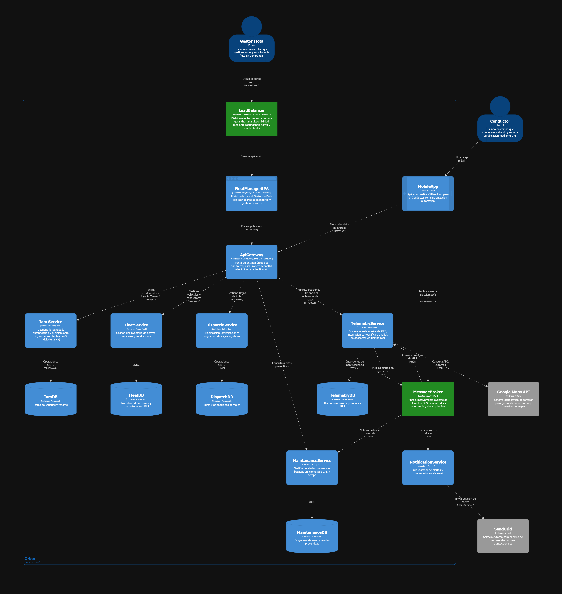
   
  <em>Containers Diagram de la arquitectura de Orion. 
  </em>

Diagramas de componentes:

<h5 id="iam-component">IAMService (Identity & Access Management)</h5>

  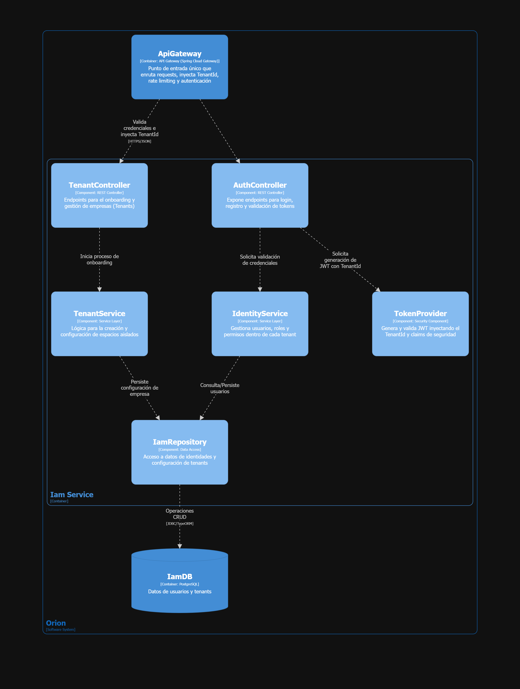
   
  <em></em>

<h5 id="telemetry-component">TelemetryService</h5>

  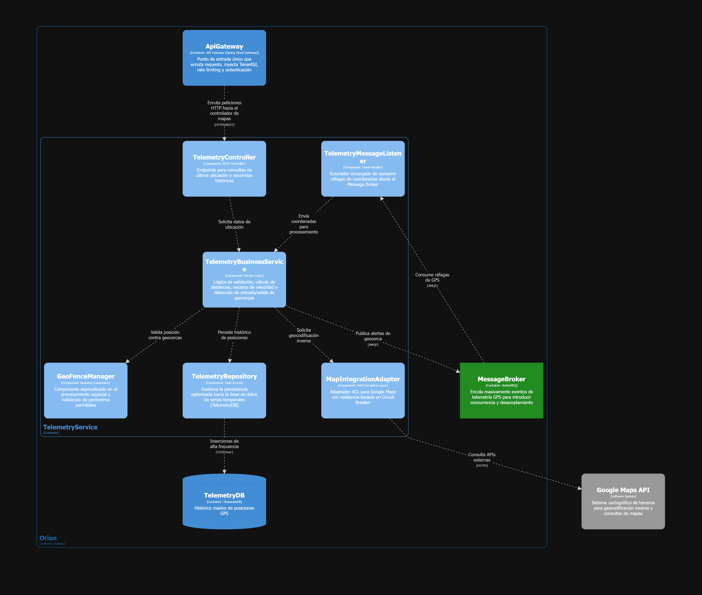
   
  <em></em>

<h5 id="fleet-component">FleetService</h5>

  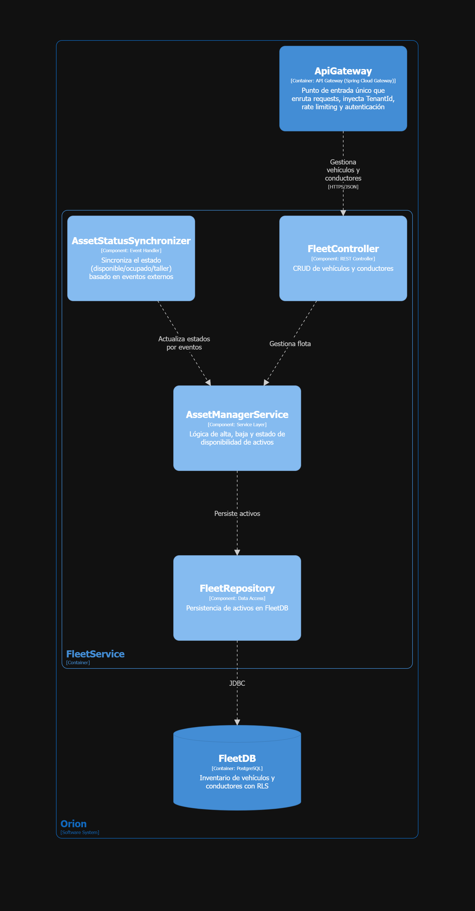
   
  <em></em>

<h5 id="dispatch-component">DispatchService</h5>

  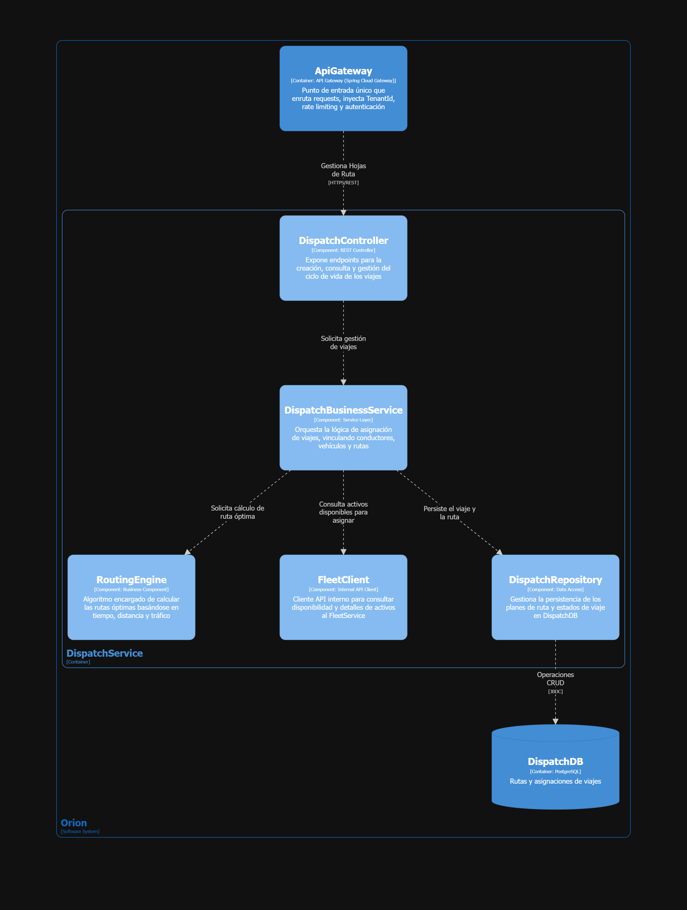
   
  <em></em>

<h5 id="maintenance-component">MaintenanceService</h5>

  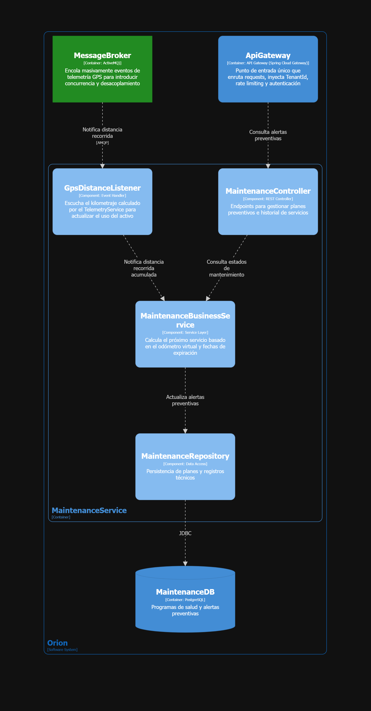
   
  <em></em>

<h5 id="notification-component">NotificationService</h5>

  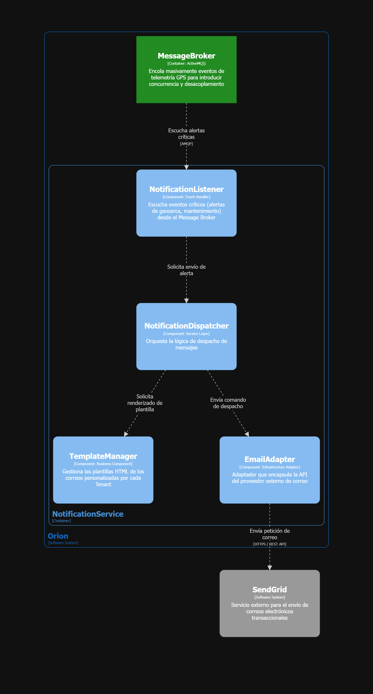
   
  <em></em>

<h4 id="4317-analysis-of-current-design-and-review-iteration-goal-kanban-board">4.3.1.7 Analysis of Current Design and Review Iteration Goal (Kanban Board)</h4>

En el Paso 7 de ADD v3 hemos evaluado el diseño actual frente a los drivers seleccionados en el <em>Architectural Design Backlog</em> de la iteración, clasificando si cada preocupación queda abordada de manera completa, parcial o aún no resuelta. La tabla siguiente resume el resultado de esa revisión y vincula cada agrupación de drivers con las decisiones arquitectónicas instrumentadas durante el ciclo:

<table border="1" style="border-collapse: collapse; width: 100%; font-size: 0.95rem;">
  <thead>
    <tr>
      <th style="padding: 0.55rem; text-align: left; width: 22%;">Driver ID</th>
      <th style="padding: 0.55rem; text-align: left; width: 18%;">Estado (Status)</th>
      <th style="padding: 0.55rem; text-align: left;">Decisiones de Diseño Tomadas (Design Decisions)</th>
    </tr>
  </thead>
  <tbody>
    <tr>
      <td style="padding: 0.55rem; vertical-align: top;"><strong>CRN-General</strong> (Estructura Inicial)</td>
      <td style="padding: 0.55rem; vertical-align: top;">Completely Addressed</td>
      <td style="padding: 0.55rem; vertical-align: top;">Se estableció la topología base del sistema mediante una arquitectura de Microservicios y Orientada a Eventos, identificando los contenedores principales (C4 Nivel 2) y el patrón de despliegue Cloud-Native.</td>
    </tr>
    <tr>
      <td style="padding: 0.55rem; vertical-align: top;"><strong>US-04</strong>, <strong>QA-05</strong>, <strong>CRN-01</strong> (Seguridad Multi-Tenant)</td>
      <td style="padding: 0.55rem; vertical-align: top;">Completely Addressed</td>
      <td style="padding: 0.55rem; vertical-align: top;">Se instanció el TenantService y el ApiGateway, delegando el aislamiento estricto de datos mediante la táctica de Row-Level Security en PostgreSQL (CoreDB).</td>
    </tr>
    <tr>
      <td style="padding: 0.55rem; vertical-align: top;"><strong>CON-03</strong>, <strong>CON-05</strong> (Cloud-Native y Open Source)</td>
      <td style="padding: 0.55rem; vertical-align: top;">Completely Addressed</td>
      <td style="padding: 0.55rem; vertical-align: top;">Se seleccionó un stack tecnológico 100% Open Source (PostgreSQL, TimescaleDB, Apache ActiveMQ) y una estructura basada en contenedores para cumplir las restricciones de entorno y presupuesto.</td>
    </tr>
    <tr>
      <td style="padding: 0.55rem; vertical-align: top;"><strong>US-09</strong>, <strong>QA-01</strong>, <strong>CRN-03</strong> (Performance por Alta Concurrencia)</td>
      <td style="padding: 0.55rem; vertical-align: top;">Partially Addressed</td>
      <td style="padding: 0.55rem; vertical-align: top;">Se introdujo el MessageBroker (ActiveMQ) para encolar la telemetría masiva y desacoplar la ingesta, pero aún es necesario refinar el diseño interno de la base de datos de series de tiempo (TelemetryDB) en la siguiente iteración para garantizar los tiempos de respuesta.</td>
    </tr>
  </tbody>
</table>

<h3>Revisión del Objetivo y Kanban Board</h3>

Hemos constatado que el objetivo de esta primera iteración se cumple con éxito: la arquitectura de referencia y los contenedores definidos cubren de forma integral los bloques base del sistema. Asimismo, dejan explícitamente como objetivo central para la Iteración 2 el refinamiento de la base de datos de telemetría y el diseño del componente <em>offline-first</em> con persistencia local para la aplicación móvil del conductor.

Para preservar la trazabilidad entre el modelo arquitectónico y la ejecución operativa, hemos actualizado en el tablero ágil del equipo las historias de usuario asociadas y los refinamientos pendientes. De este modo, el seguimiento de las tareas de diseño de esta y las futuras iteraciones se gestiona de forma transparente.

Enlace de trello: https://trello.com/invite/b/69f56589e0cac55f7b1a3608/ATTI3155f3901eeb23694ea9a16fa5d2a589076C55C5/architectural-design-backlog-1-goslogic

    

