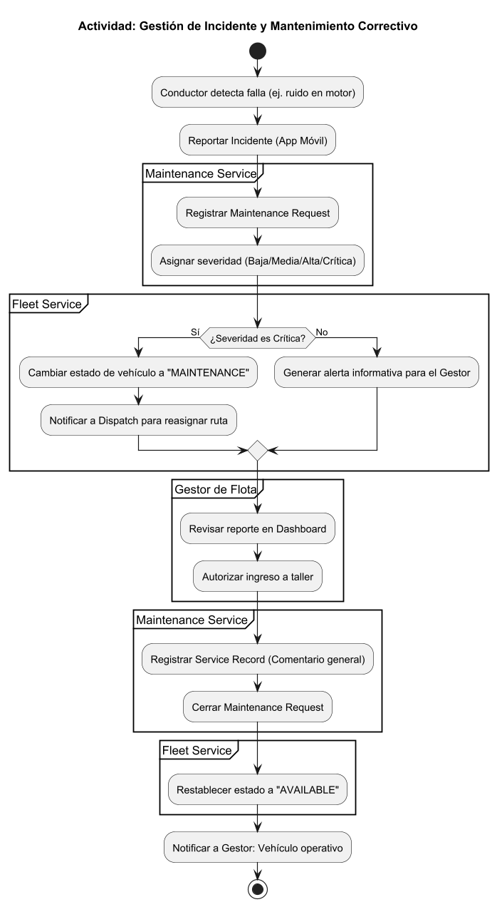
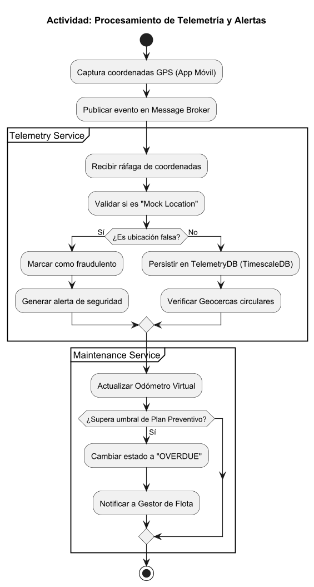
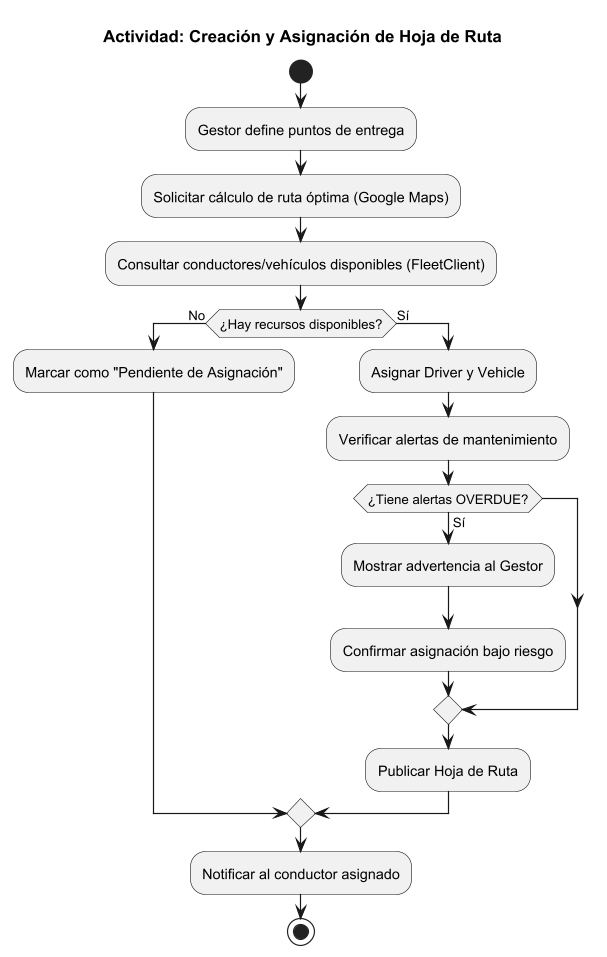
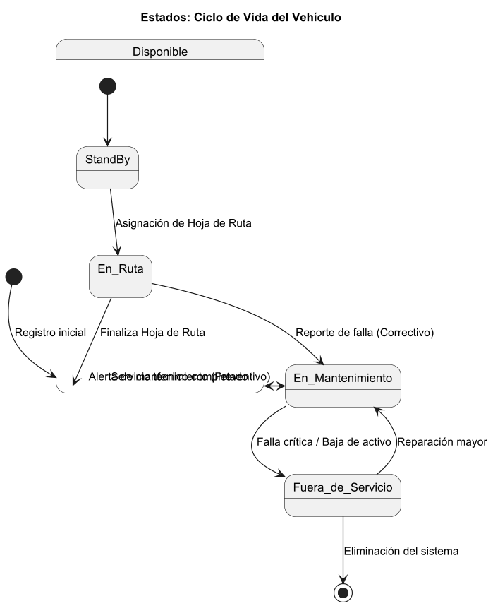
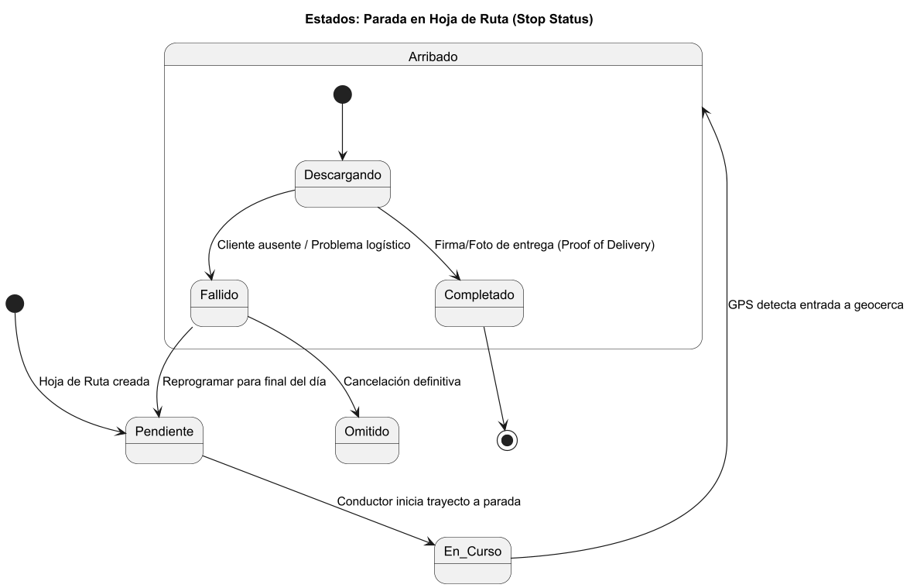

# Capítulo IV: Product Architecture Design

<h2 id="41-desing-concepts-viewpoints--er-diagrams">4.1 Desing Concepts, ViewPoints & ER Diagrams</h2>

<em>Esta sección define las estructuras, elementos y relaciones fundamentales de la arquitectura de Orion
. Aplicando el método ADD v3, presentaremos nuestras decisiones de diseño a través de múltiples vistas (principios, patrones y diagramas), ya que un sistema complejo no puede representarse en una única perspectiva</em>

<h3 id="411-principles-statements">4.1.1 Principles Statements</h3>

1. **Aislamiento Lógico por Defecto (Seguridad Multi-Tenant)**
   - **Descripción:** Queda estrictamente prohibida la dependencia en el filtrado manual a nivel de código. Toda operación debe inyectar implícitamente el TenantId desde el API Gateway.
   - **Justificación de Negocio:** Protege el secreto industrial entre empresas competidoras en el modelo SaaS.

2. **Identidad Centralizada y Desacoplada (Atributo: Seguridad/Mantenibilidad)**
  - **Descripción**: La autenticación y autorización se delegan exclusivamente a un servicio de IAM (Identity and Access Management) independiente. Los microservicios de negocio (Bounded Contexts) solo consumen tokens validados por el API Gateway.
  - **Justificación de Negocio:** Permite que el sistema crezca sin replicar lógica de seguridad en cada microservicio y facilita la auditoría de accesos.

3. **Aislamiento de Proveedores Externos (Interoperabilidad)**
   - **Descripción:** Las integraciones con servicios de terceros deberán canalizarse obligatoriamente a través de un patrón de Capa Anticorrupción (Anti-Corruption Layer).
   - **Justificación de Negocio:** Independencia tecnológica y control de costos frente a terceros.

4. **Diseño para el Fallo y Degradación Elegante (Resiliencia)**
   - **Descripción:** Implementación de Circuit Breaker en llamadas externas. Si el mapa falla, se usa caché.
   - **Justificación de Negocio:** Continuidad operativa crítica en la gestión de flotas.

5. **Llamadas Asincrónicas sobre Sincrónicas para Alta Carga (Performance)**
   - **Descripción:** Ingesta masiva de GPS mediante Event-Driven Architecture y Message Brokers.
   - **Justificación de Negocio:** Absorción de picos de carga durante horas punta sin degradar la UI del gestor
6. **Persistencia Local como Estándar Móvil u "Offline-First" (Operatividad)**
   - **Descripción:** Almacenamiento local en dispositivos móviles (SQLite) y sincronización con Retry & Backoff
   - **Justificación de Negocio:** Garantiza trazabilidad en rutas con baja conectividad.

<h3 id="412-approaches-statements-architectural-styles--patterns">4.1.2 Approaches Statements Architectural Styles & Patterns</h3>

<h4>4.1.2.1 Approaches Statements</h4>

Para Orion, la aplicación de **Domain-Driven Design (DDD)**  constituye el marco estratégico fundamental para gestionar la complejidad de una plataforma SaaS multi-tenant orientada al sector logístico.

*   **Modelado Basado en el Dominio:**
    Priorizamos el desarrollo del Core Domain, compuesto por los contextos de **Dispatch & Routing**, **Telemetry & Tracking** y **Maintenance**. Estos representan la ventaja competitiva y la lógica crítica de Orion. Los aspectos comunes y transversales se delegan al subdominio genérico de **Identity & Tenancy**, permitiendo que la lógica de negocio logística evolucione de forma independiente a la infraestructura de seguridad y gestión de organizaciones.

*   **Límites de Contexto Estrictos (Bounded Contexts):**
    Se establecen fronteras explícitas para evitar la contaminación de modelos y asegurar la cohesión. Orion se descompone en seis contextos especializados:
    *   **Identity & Tenancy:** Responsable único de la jerarquía de organizaciones y la emisión de claims de seguridad mediante tokens JWT.
    *   **Fleet Management:** Gestiona el inventario de activos físicos y perfiles de conductores, aplicando políticas de **Row-Level Security (RLS)** para el aislamiento de datos.
    *   **Dispatch & Routing:** Modela la planificación y ejecución de viajes, protegido de la volatilidad de APIs externas mediante una **Anti-Corruption Layer (ACL)**.
    *   **Telemetry & Tracking:** Contexto optimizado para la ingesta de eventos de alta frecuencia, utilizando un enfoque asíncrono para garantizar la escalabilidad.
    *   **Maintenance:** Orquesta la salud de la flota y la programación de servicios técnicos a través del consumo de eventos de kilometraje provenientes de telemetría.
    *   **Alerts & Notifications:** Servicio transversal encargado del despacho de mensajes críticos y operativos hacia los usuarios finales.

*   **Estrategia de Comunicación y Resiliencia:**
    Adoptamos un enfoque híbrido: comunicaciones sincrónicas vía **REST APIs** para procesos transaccionales y administrativos, y comunicaciones asíncronas basadas en eventos para la telemetría y el motor de alertas. Se implementan tácticas de **Circuit Breaker** en los puntos de integración con servicios de terceros para asegurar que una falla externa no provoque una degradación sistémica de la plataforma.

*   **Lenguaje Ubicuo (Ubiquitous Language):**
    Se garantiza que términos críticos como **Tenant, Despacho, Geocerca, Viaje y Alerta** mantengan una definición única y consistente desde los requerimientos funcionales hasta la implementación técnica en el código fuente y los contratos de las APIs. Esto elimina la fricción semántica entre los stakeholders del negocio y el equipo de desarrollo.

<h4>4.1.2.2 Architectural Styles & Patterns</h4>

**A. Estilos Arquitectónicos**

*   **Microservices Architecture:** Se adopta este estilo para permitir el despliegue y escalado independiente de los seis bounded contexts. Esto asegura que la alta carga del servicio de Telemetría no afecte la disponibilidad del módulo de Mantenimiento o Fleet Management.
*   **Event-Driven Architecture:** Utilizado para el procesamiento asíncrono de coordenadas GPS y generación de alertas. Este estilo permite desacoplar los servicios productores (Telemetry) de los consumidores (Alerts, Maintenance), absorbiendo picos de tráfico sin degradar la experiencia del usuario.
*   **RESTful API:** Estilo de comunicación predominante para las interacciones sincrónicas entre el frontend (Web/Mobile) y el API Gateway.

**B. Patrones Arquitectónicos y Tácticas de Diseño**

*   **API Gateway Pattern:** Actúa como el punto de entrada único para todos los clientes. Implementa la lógica de enrutamiento hacia los microservicios y actúa como el primer nivel de seguridad al validar tokens JWT en conjunto con el IAM.
*   **Identity and Access Management (IAM):** Patrón centralizado para la gestión de identidades que garantiza que el `TenantId` sea inyectado en cada petición. Esto asegura que la autenticación sea agnóstica a la lógica de negocio de los microservicios.
*   **Row-Level Security (RLS):** Táctica de persistencia aplicada en el motor de base de datos SQL para garantizar el aislamiento multi-tenant. Filtra automáticamente los registros basándose en el contexto de sesión, mitigando el riesgo de exposición de datos entre empresas competidoras.
*   **Anti-Corruption Layer (ACL):** Aplicado en el contexto de Dispatch & Routing para interactuar con proveedores externos de mapas. Traduce los contratos de terceros a un modelo interno estable, protegiendo el Core Domain de cambios externos.
*   **Circuit Breaker:** Implementado en las integraciones con servicios externos. Previene fallos en cascada al "abrir el circuito" ante errores recurrentes, permitiendo que Orion opere en modo degradado o utilice datos en caché.

<h3 id="413-context-diagram">4.1.3 Context Diagram</h3>

El <strong>Context Diagram</strong> ilustra las principales entidades externas, sistemas y usuarios que interactúan con la plataforma Orion, así como sus canales de integración y límites de contexto clave. Este diagrama ayuda a comprender el alcance del sistema y su relación con el entorno organizacional y tecnológico.

  

<h3 id="414-approach-driven-viewpoints-diagrams">4.1.4 Approach driven ViewPoints Diagrams</h3>

Para complementar la visión estática de la arquitectura, se han elaborado diagramas de comportamiento que detallan la dinámica operativa de Orion.

### Diagramas Complementarios de la Arquitectura

#### 1. Diagrama de Contenedores

  
   
  <em>Diagrama de Contenedores de la plataforma Orion. 
  </em>

---

#### 2. Diagramas de Actividades

<ul>
  <li>
    <strong>Gestión de incidente y mantenimiento correctivo</strong> 
    
    <em></em>
  </li>
  <li>
    <strong>Procesamiento de telemetría</strong> 
    
    <em></em>
  </li>
  <li>
    <strong>Creación y asignación de hoja de ruta</strong> 
    
    <em></em>
  </li>
</ul>

---

#### 3. Diagramas de Estado

<ul>
  <li>
    <strong>Ciclo de vida del vehículo</strong> 
    
    <em></em>
  </li>
  <li>
    <strong>Parada en hoja de ruta</strong> 
    
    <em></em>
  </li>
</ul>
  
<h3 id="415-relationalnon-relational-database-diagram">4.1.5 Relational/Non Relational Database Diagram</h3>

#### **I. Argumentación de la decisión tecnológica**

Para nuestra plataforma, se ha decidido implementar una arquitectura de persistencia políglota basada en **PostgreSQL** y su extensión **TimescaleDB**, descartando soluciones puramente NoSQL debido a la complejidad de las relaciones y la necesidad de integridad transaccional.

Esta decisión se basa en los siguientes aspectos: 

*   **Integridad Multi-Tenant**: El sistema exige vínculos estrictos e inquebrantables entre la empresa (Tenant), sus activos y los datos de despacho. El modelo relacional garantiza esta integridad referencial mediante llaves foráneas (FK), asegurando que los datos de un cliente nunca se filtren a otro.
*   **Tratamiento de Series Temporales**: A diferencia de una base de datos relacional estándar, el uso de **TimescaleDB** permite manejar la telemetría masiva mediante *hypertables*. Esto ofrece el rendimiento de una base de datos NoSQL para escrituras, manteniendo la potencia de las consultas SQL para el historial de rutas.
*   **Cómputo Geoespacial Eficiente**: La gestión de geocercas y el monitoreo de arribos se resuelven de forma nativa mediante **PostGIS**. Esto permite calcular si un camión entró en su zona de entrega directamente en la base de datos, optimizando el rendimiento antes de procesar alertas en el backend.
*   **Agregación Analítica para Logística**: La generación de reportes (kilómetros recorridos por flota, cumplimiento de mantenimiento y eficiencia de conductores) se beneficia de las capacidades de agregación complejas que ofrece el lenguaje SQL, cruciales para la toma de decisiones del Gestor de Flota.

#### **II. Diagramas de Base de Datos**

##### IAM database diagram

  

##### Fleet database diagram

  

##### Dispatch database diagram

  

##### Maintenance database diagram

  

##### Telemetry database diagram

  

<h3 id="416-design-patterns">4.1.6 Design Patterns</h3>

Para la construcción de Orion, se ha decidido implementar un conjunto de patrones de diseño de software basados en los lineamientos de GoF y arquitecturas empresariales que garantizan el desacoplamiento, la mantenibilidad y el aislamiento de dominios en un entorno Multi-Tenant. Los patrones seleccionados para el contexto específico de este proyecto son los siguientes:

#### **1. Repository Pattern - Patrón Repositorio**
*   **Propósito**: Actuar como un intermediario entre la capa de dominio y la capa de persistencia de datos, ocultando los detalles técnicos del acceso a las distintas bases de datos.
*   **Aplicación en el proyecto**: Es crítico para gestionar la persistencia políglota del sistema. Se utiliza para encapsular consultas complejas en PostgreSQL  y, especialmente, para manejar las funciones de agregación de tiempo en TimescaleDB dentro del microservicio de Telemetría. Esto permite que la lógica de negocio permanezca intacta si se decide cambiar el ORM o la estructura de las tablas en el futuro.

#### **2. Adapt Pattern - Patrón adaptador**
*   **Propósito**: Convertir la interfaz de una clase en otra interfaz que el cliente espera, permitiendo que clases con interfaces incompatibles trabajen juntas.
*   **Aplicación en el proyecto**: Se implementa para la integración con servicios externos como la API de Google Maps. Esto garantiza que si el proveedor externo cambia su contrato o si se decide migrar a otra plataforma como Mapbox, solo se deba modificar el adaptador, manteniendo el núcleo del backend intacto.

#### **3. Observer Pattern (Patrón Observador)**
*   **Propósito**: Definir una dependencia de uno-a-muchos entre objetos, de forma que cuando el objeto principal cambie su estado, todos sus dependientes sean notificados automáticamente.
*   **Aplicación en el proyecto**: Es el motor de la arquitectura *Event-Driven* de Orion. Cuando el `TelemetryService` procesa una coordenada y detecta un evento, actúa como el sujeto que publica un mensaje en el **Message Broker**. Los microservicios de Notification y Dispatch actúan como observadores que reaccionan de forma desacoplada para actualizar el estado de la entrega o enviar alertas al gestor en tiempo real.

#### **4. Strategy Pattern (Patrón Estrategia)**
*   **Propósito**: Definir una familia de algoritmos, encapsular cada uno y hacerlos intercambiables en tiempo de ejecución, permitiendo que el algoritmo varíe independientemente de los clientes que lo utilizan.
*   **Aplicación en el proyecto**: Se utiliza para el cálculo del Próximo Servicio de Mantenimiento. Dependiendo del tipo de vehículo o de las políticas específicas de cada Tenant, el sistema inyecta una estrategia de cálculo diferente (basada en kilometraje acumulado, tiempo transcurrido o reglas personalizadas), permitiendo que el microservicio de mantenimiento sea altamente flexible ante nuevos requerimientos de negocio

#### **5. Dependency Injection (Inyección de Dependencias)**
*   **Propósito**: Externalizar la creación y gestión de las dependencias de una clase, pasándolas dinámicamente en tiempo de ejecución en lugar de instanciarlas manualmente.
*   **Aplicación en el proyecto**: Es el eje central de los frameworks utilizados en el Backend. El contenedor de Inversión de Control (IoC) inyecta automáticamente los repositorios y adaptadores necesarios según el contexto. Esto es fundamental para cumplir con el atributo de calidad de testeabilidad, ya que permite inyectar Mocks o simulaciones durante las pruebas unitarias de la lógica de ruteo y telemetría sin depender de bases de datos o APIs externas activas.

<h3 id="417-tactics">4.1.7 Tactics</h3>

Según la taxonomía del SEI, una táctica arquitectónica es una decisión de diseño atómica destinada a controlar la respuesta del sistema ante estímulos que afectan sus atributos de calidad. Mientras que los patrones resuelven problemas de composición global, las tácticas son mecanismos específicos que, en conjunto, forman la estrategia para satisfacer los architectural drivers de Orion. La siguiente tabla detalla las tácticas seleccionadas, vinculándolas directamente con los componentes definidos en el modelo C4.

<table border="1" style="border-collapse: collapse; width: 100%; font-size: 0.95rem;">
  <thead>
    <tr>
      <th style="padding: 0.55rem; width: 14%; text-align: left;">Atributo de Calidad</th>
      <th style="padding: 0.55rem; width: 22%; text-align: left;">Táctica Seleccionada</th>
      <th style="padding: 0.55rem; width: 18%; text-align: left;">Componente Asociado (Artefacto)</th>
      <th style="padding: 0.55rem; width: 46%; text-align: left;">Justificación / Aplicación</th>
    </tr>
  </thead>
  <tbody>
    <tr>
      <td style="padding: 0.55rem; vertical-align: top;">Disponibilidad</td>
      <td style="padding: 0.55rem; vertical-align: top;">Redundancia Activa (<em>Active Redundancy</em>)</td>
      <td style="padding: 0.55rem; vertical-align: top;"><em>Load Balancer</em> y réplicas de microservicios (contenedores backend Orion)</td>
      <td style="padding: 0.55rem; vertical-align: top;">Se despliegan múltiples instancias homogéneas de los microservicios detrás de un balanceador de carga, de modo que la indisponibilidad de una réplica no constituye un punto único de fallo (SPOF). Esta táctica materializa tolerancia a fallos mediante redundancia activa y distribución de peticiones, alineada con la continuidad operativa exigida por el modelo SaaS.</td>
    </tr>
    <tr>
      <td style="padding: 0.55rem; vertical-align: top;">Disponibilidad</td>
      <td style="padding: 0.55rem; vertical-align: top;">Degradación Controlada</td>
      <td style="padding: 0.55rem; vertical-align: top;">Contenedor <strong>TelemetryService</strong></td>
      <td style="padding: 0.55rem; vertical-align: top;">Se aplica  <em>Circuit Breaker</em> sobre las invocaciones a la API de Google Maps: ante latencia extrema o errores sostenidos, el circuito abre y el sistema evita propagar la falla en cascada, operando en modo degradado para preservar la disponibilidad percibida del monitoreo cartográfico.</td>
    </tr>
    <tr>
      <td style="padding: 0.55rem; vertical-align: top;">Performance</td>
      <td style="padding: 0.55rem; vertical-align: top;">Introducir Concurrencia (<em>Introduce Concurrency</em>)</td>
      <td style="padding: 0.55rem; vertical-align: top;">Contenedor <strong>Message Broker</strong></td>
      <td style="padding: 0.55rem; vertical-align: top;">La ingesta masiva de telemetría GPS se procesa asíncronamente. Los productores publican eventos en el broker y los consumidores los procesan concurrentemente. Ello absorbe picos de carga y evita la degradación de respuessta bajo alta concurrencia.</td>
    </tr>
    <tr>
      <td style="padding: 0.55rem; vertical-align: top;">Performance</td>
      <td style="padding: 0.55rem; vertical-align: top;">Múltiples Copias de Datos (<em>Caching</em>)</td>
      <td style="padding: 0.55rem; vertical-align: top;">Almacén en memoria <strong>Redis</strong> (caché)</td>
      <td style="padding: 0.55rem; vertical-align: top;">Se replica temporalmente el resultado de operaciones costosas y repetidas —notablemente respuestas de geocodificación y datos cartográficos derivados— para reducir la latencia end-to-end y la presión sobre APIs externas y bases de datos, mejorando el tiempo de respuesta bajo consultas frecuentes desde los paneles de gestión.</td>
    </tr>
    <tr>
      <td style="padding: 0.55rem; vertical-align: top;">Interoperabilidad</td>
      <td style="padding: 0.55rem; vertical-align: top;">Uso de un Intermediario</td>
      <td style="padding: 0.55rem; vertical-align: top;">Contenedor <strong>API Gateway</strong></td>
      <td style="padding: 0.55rem; vertical-align: top;">El gateway actúa como fachada única de entrada: centraliza enrutamiento, políticas transversales (autenticación, límites de tasa, versionado) y uniformidad de contratos hacia los microservicios internos, facilitando que clientes heterogéneos y sistemas externos interactúen con Orion sin conocer la topología fina del backend.</td>
    </tr>
    <tr>
      <td style="padding: 0.55rem; vertical-align: top;">Interoperabilidad</td>
      <td style="padding: 0.55rem; vertical-align: top;">Manejo de Interfaces / Capa Anticorrupción</td>
      <td style="padding: 0.55rem; vertical-align: top;">Interfaces públicas REST/JSON (expuestas vía API Gateway y servicios de integración)</td>
      <td style="padding: 0.55rem; vertical-align: top;">Los sistemas corporativos de terceros (p. ej., ERPs) consumen recursos en formato JSON estándar sobre HTTP, mientras una capa anticorrupción aísla el modelo canónico interno de Orion de representaciones propietarias o evolutivas. Así se minimiza el acoplamiento semántico y se estabiliza el contrato de intercambio de datos de kilometraje y activos frente a cambios en el dominio interno.</td>
    </tr>
    <tr>
      <td style="padding: 0.55rem; vertical-align: top;">Usabilidad</td>
      <td style="padding: 0.55rem; vertical-align: top;">Iniciativa del Sistema (<em>System Initiative</em>)</td>
      <td style="padding: 0.55rem; vertical-align: top;">Contenedor <strong>MobileApp</strong> (cliente)</td>
      <td style="padding: 0.55rem; vertical-align: top;">La aplicación adopta un modelo <em>offline-first</em> con persistencia local en SQLite. Al recuperar la conexión, el sistema inicia la sincronización sin que el conductor deba reintentar manualmente.
    </tr>
  </tbody>
</table>

La conjugación coherente de las tácticas anteriores define la estrategia arquitectónica de Orion: la redundancia y degradación controlada aseguran un servicio continuo; la concurrencia mediada por broker y la persistencia especializada en series temporales sostienen el rendimiento bajo picos de telemetría; la intermediación a través del Gateway garantiza el aislamiento lógico de datos por Tenant y habilita integraciones empresariales predecibles; finalmente, la iniciativa del sistema en el cliente móvil cierra la brecha de usabilidad en entornos de conectividad débil. En conjunto, estas decisiones constituyen el cimiento técnico que hace viable el despliegue escalable y seguro del producto.

<h2 id="42-architectural-drivers">4.2 Architectural Drivers</h2>

Los <em>Architectural Drivers</em> son aquellos requisitos funcionales o de calidad cuyo impacto es tan elevado que condicionan de forma directa la estructura, las tecnologías y los riesgos aceptables del sistema. En el marco de ADD v3, identificarlos y priorizarlos permite centrar el diseño de Orion en las decisiones que realmente importan para una plataforma SaaS de telemetría vehicular. En esta sección se sintetiza ese conjunto motriz que alinea negocio, operación del servicio y atributos de calidad priorizados.

<h2 id="418-design-purpose">4.1.8 Design Purpose</h2>

El presente diseño arquitectónico de Orion concebido bajo un enfoque de desarrollo Greenfield tiene como propósito fundamental permitir la implementación coherente con las entidades arquitectónicas definidas en los modelos y vistas de la arquitectura del sistema. De acuerdo con la metodología Attribute-Driven Design (ADD v3), este propósito actúa como el principal insumo directivo, transformando los requisitos abstractos del negocio logístico en estructuras de software concretas, viables y escalables antes de iniciar la etapa de codificación.

Para materializar esta coherencia, el proceso de diseño se ha estructurado estrictamente en torno a los cuatro Architectural Drivers que dictan la viabilidad operativa y comercial de la plataforma SaaS:

Performance (Rendimiento): Establecer una base orientada a eventos y alta concurrencia que garantice la ingesta masiva de telemetría GPS sin cuellos de botella.

Disponibilidad (Resiliencia): Orquestar una infraestructura con redundancia activa y tolerancia a fallos, asegurando la continuidad del despacho logístico 24/7 sin puntos únicos de falla (SPOF).

Interoperabilidad: Diseñar contratos y capas de adaptación (Anti-Corruption Layers) que permitan una integración ágil, estandarizada y segura con proveedores externos críticos como Google Maps.

Usabilidad (Soporte Operativo): Habilitar una arquitectura en el frontend móvil que priorice la operatividad continua (offline-first), brindando feedback claro al conductor en zonas de baja conectividad.

En conclusión, el propósito de este diseño trasciende la simple elaboración de diagramas; busca establecer una "brújula técnica" irrefutable para el equipo de desarrollo. Garantiza que cada microservicio, política de aislamiento Multi-Tenant e integración construida en las iteraciones de ADD contribuya directamente a mitigar los riesgos técnicos y a maximizar la eficiencia de la gestión de flotas de Orion.

<h2 id="419-primary-functionality-primary-user-stories">4.1.9 Primary Functionality (Primary User Stories)</h2>

De acuerdo con la metodología Attribute-Driven Design (ADD v3) del Software Engineering Institute (SEI), el propósito de esta sección no es inventariar el conjunto completo de requisitos funcionales del sistema. Por el contrario, consiste en identificar de manera deliberada únicamente aquellos requisitos que afectan directamente la estructura de la aplicación.

Para el proyecto Orion, se han aislado cuatro historias de usuario primarias (Primary User Stories). Estas funcionalidades han sido seleccionadas porque su nivel de complejidad técnica tensiona la topología del software y obliga a materializar decisiones arquitectónicas concretas para satisfacer nuestros cuatro Architectural Drivers principales: Performance, Disponibilidad, Interoperabilidad y Usabilidad.

A continuación, se detalla la funcionalidad primaria y su impacto directo en la arquitectura:

<table border="1" style="border-collapse: collapse; width: 100%; font-size: 0.95rem;">
  <thead>
    <tr>
      <th style="padding: 0.55rem; width: 7%; text-align: left;">ID</th>
      <th style="padding: 0.55rem; width: 17%; text-align: left;">Funcionalidad Primaria</th>
      <th style="padding: 0.55rem; width: 30%; text-align: left;">Descripción (User Story)</th>
      <th style="padding: 0.55rem; width: 46%; text-align: left;">Impacto Arquitectónico y Driver</th>
    </tr>
  </thead>
  <tbody>
    <tr>
      <td style="padding: 0.55rem; vertical-align: top;">US-01</td>
      <td style="padding: 0.55rem; vertical-align: top;">Transmisión Masiva de Ubicación</td>
      <td style="padding: 0.55rem; vertical-align: top;">Como conductor, quiero que mi ubicación GPS se transmita automáticamente en segundo plano durante mi turno para que la central registre mi recorrido.</td>
      <td style="padding: 0.55rem; vertical-align: top;">Impacta el Performance: La alta concurrencia generada obliga a aplicar la táctica de Control de Demanda de Recursos. Justifica la creación del contenedor MessageBroker (ej. Apache Kafka) para encolar la telemetría de forma asíncrona, evitando cuellos de botella en el sistema bajo alta carga.</td>
    </tr>
    <tr>
      <td style="padding: 0.55rem; vertical-align: top;">US-02</td>
      <td style="padding: 0.55rem; vertical-align: top;">Monitoreo Cartográfico en Tiempo Real</td>
      <td style="padding: 0.55rem; vertical-align: top;">Como gestor de flota, quiero ver la ubicación de mis vehículos activos en Google Maps para optimizar la logística operativa.</td>
      <td style="padding: 0.55rem; vertical-align: top;">Impacta la Disponibilidad: La dependencia de un servicio externo crítico exige tolerancia a fallos. Obliga a implementar la táctica de Circuit Breaker en el contenedor TelemetryMapsService, permitiendo que el sistema degrade de forma controlada y siga operando (mostrando caché) si la API de mapas no responde.</td>
    </tr>
    <tr>
      <td style="padding: 0.55rem; vertical-align: top;">US-03</td>
      <td style="padding: 0.55rem; vertical-align: top;">Integración y Exportación de Datos</td>
      <td style="padding: 0.55rem; vertical-align: top;">Como gestor de flota, quiero que el sistema sea interoperable mediante interfaces estandarizadas, para intercambiar información de mis activos con otros sistemas corporativos de manera útil.</td>
      <td style="padding: 0.55rem; vertical-align: top;">Impacta la Interoperabilidad: Obliga a diseñar interfaces personalizadas (táctica de Manejo de Interfaces) mediante la creación del ApiGateway y un Sincronizador, los cuales actúan como una capa anticorrupción que expone y traduce los datos en formato JSON estándar.</td>
    </tr>
    <tr>
      <td style="padding: 0.55rem; vertical-align: top;">US-04</td>
      <td style="padding: 0.55rem; vertical-align: top;">Registro y Sincronización Offline</td>
      <td style="padding: 0.55rem; vertical-align: top;">Como conductor, quiero que mis reportes de jornada se guarden localmente si pierdo la conexión y se envíen automáticamente al recuperar la señal de red.</td>
      <td style="padding: 0.55rem; vertical-align: top;">Impacta la Usabilidad: La operación en zonas rurales fuerza a diseñar el contenedor MobileApp con un modelo offline-first. Exige implementar almacenamiento local (SQLite) y proveer iniciativa del sistema mediante tácticas de Retry con Backoff exponencial para sincronizar datos en segundo plano sin intervención manual.</td>
    </tr>
  </tbody>
</table>

<strong>Conclusión:</strong> En conjunto, estas cuatro funcionalidades primarias conforman el núcleo operativo de Orion y justifican la elección de un estilo arquitectónico basado en Microservicios. Las necesidades estrictas de desempeño asíncrono, resiliencia ante proveedores externos, integración limpia con terceros y soporte operativo sin conexión hacen inviable la elección de una arquitectura monolítica tradicional.

<h2 id="4110-quality-attribute-scenarios">4.1.10 Quality Attribute Scenarios</h2>

En la arquitectura de software, los requerimientos no funcionales suelen ser inherentemente ambiguos si no se definen con rigor. Por ello, los Architectural Drivers del sistema se formalizan mediante Escenarios de Atributos de Calidad. Cada escenario se documenta con la plantilla institucional adoptada en este documento: una tabla vertical de dos columnas donde la primera fila identifica el nombre del escenario junto a la etiqueta <em>Escenario</em>, y las filas subsiguientes desglosan el atributo de calidad, el estímulo, el entorno operativo, el artefacto afectado (alineado con los contenedores del modelo C4 cuando aplica), la fuente del estímulo y la respuesta observable del sistema —incluyendo criterios cuantificables de verificación cuando corresponde.

A continuación se presentan los cuatro escenarios críticos asociados a Disponibilidad, Performance, Interoperabilidad y Usabilidad:

<table border="1" style="border-collapse: collapse; width: 100%; font-size: 0.95rem; margin-bottom: 1.25rem;">
  <tbody>
    <tr>
      <th style="padding: 0.55rem; width: 28%; text-align: left;">Escenario</th>
      <th style="padding: 0.55rem; text-align: left;">Indisponibilidad del proveedor cartográfico</th>
    </tr>
    <tr>
      <td style="padding: 0.55rem; vertical-align: top; font-weight: 600;">Atributo de calidad</td>
      <td style="padding: 0.55rem; vertical-align: top;">Disponibilidad (resiliencia frente a fallos externos).</td>
    </tr>
    <tr>
      <td style="padding: 0.55rem; vertical-align: top; font-weight: 600;">Estímulo</td>
      <td style="padding: 0.55rem; vertical-align: top;">La API de mapas deja de responder o exhibe latencia extrema.</td>
    </tr>
    <tr>
      <td style="padding: 0.55rem; vertical-align: top; font-weight: 600;">Entorno</td>
      <td style="padding: 0.55rem; vertical-align: top;">Operación normal durante el monitoreo cartográfico de la flota.</td>
    </tr>
    <tr>
      <td style="padding: 0.55rem; vertical-align: top; font-weight: 600;">Artefacto</td>
      <td style="padding: 0.55rem; vertical-align: top;">Contenedor <strong>TelemetryMapsService</strong>.</td>
    </tr>
    <tr>
      <td style="padding: 0.55rem; vertical-align: top; font-weight: 600;">Fuente</td>
      <td style="padding: 0.55rem; vertical-align: top;">API externa (Google Maps).</td>
    </tr>
    <tr>
      <td style="padding: 0.55rem; vertical-align: top; font-weight: 600;">Respuesta</td>
      <td style="padding: 0.55rem; vertical-align: top;">El sistema activa la táctica de <em>Circuit Breaker</em>, detiene las peticiones al proveedor defectuoso y muestra la última ubicación almacenada en caché. El modo de contingencia debe activarse en menos de 2 segundos sin degradar la operatividad del resto de microservicios.</td>
    </tr>
  </tbody>
</table>

<table border="1" style="border-collapse: collapse; width: 100%; font-size: 0.95rem; margin-bottom: 1.25rem;">
  <tbody>
    <tr>
      <th style="padding: 0.55rem; width: 28%; text-align: left;">Escenario</th>
      <th style="padding: 0.55rem; text-align: left;">Alta carga de telemetría</th>
    </tr>
    <tr>
      <td style="padding: 0.55rem; vertical-align: top; font-weight: 600;">Atributo de calidad</td>
      <td style="padding: 0.55rem; vertical-align: top;">Performance (desempeño bajo concurrencia).</td>
    </tr>
    <tr>
      <td style="padding: 0.55rem; vertical-align: top; font-weight: 600;">Estímulo</td>
      <td style="padding: 0.55rem; vertical-align: top;">Los conductores envían su ubicación GPS de forma simultánea hacia el sistema central.</td>
    </tr>
    <tr>
      <td style="padding: 0.55rem; vertical-align: top; font-weight: 600;">Entorno</td>
      <td style="padding: 0.55rem; vertical-align: top;">Hora punta de tráfico logístico (alta carga de red).</td>
    </tr>
    <tr>
      <td style="padding: 0.55rem; vertical-align: top; font-weight: 600;">Artefacto</td>
      <td style="padding: 0.55rem; vertical-align: top;">Contenedor <strong>Message Broker</strong> (Apache Kafka / RabbitMQ).</td>
    </tr>
    <tr>
      <td style="padding: 0.55rem; vertical-align: top; font-weight: 600;">Fuente</td>
      <td style="padding: 0.55rem; vertical-align: top;">500 conductores simultáneos.</td>
    </tr>
    <tr>
      <td style="padding: 0.55rem; vertical-align: top; font-weight: 600;">Respuesta</td>
      <td style="padding: 0.55rem; vertical-align: top;">El sistema ingiere y encola masivamente los mensajes de forma asíncrona (arquitectura orientada a eventos), evitando colapsar el procesamiento síncrono principal. Criterio de éxito: latencia máxima de 3 segundos por mensaje desde su emisión hasta su visualización, con 0 % de pérdida de datos.</td>
    </tr>
  </tbody>
</table>

<table border="1" style="border-collapse: collapse; width: 100%; font-size: 0.95rem; margin-bottom: 1.25rem;">
  <tbody>
    <tr>
      <th style="padding: 0.55rem; width: 28%; text-align: left;">Escenario</th>
      <th style="padding: 0.55rem; text-align: left;">Integración con sistemas corporativos</th>
    </tr>
    <tr>
      <td style="padding: 0.55rem; vertical-align: top; font-weight: 600;">Atributo de calidad</td>
      <td style="padding: 0.55rem; vertical-align: top;">Interoperabilidad.</td>
    </tr>
    <tr>
      <td style="padding: 0.55rem; vertical-align: top; font-weight: 600;">Estímulo</td>
      <td style="padding: 0.55rem; vertical-align: top;">Solicitud de datos de kilometraje y recorrido de los vehículos mediante API REST.</td>
    </tr>
    <tr>
      <td style="padding: 0.55rem; vertical-align: top; font-weight: 600;">Entorno</td>
      <td style="padding: 0.55rem; vertical-align: top;">Al cierre del día operativo (operación normal).</td>
    </tr>
    <tr>
      <td style="padding: 0.55rem; vertical-align: top; font-weight: 600;">Artefacto</td>
      <td style="padding: 0.55rem; vertical-align: top;"><strong>API Gateway</strong> y <strong>TenantService</strong> (interfaces estandarizadas).</td>
    </tr>
    <tr>
      <td style="padding: 0.55rem; vertical-align: top; font-weight: 600;">Fuente</td>
      <td style="padding: 0.55rem; vertical-align: top;">Sistema corporativo de terceros (p. ej. ERP contable del cliente).</td>
    </tr>
    <tr>
      <td style="padding: 0.55rem; vertical-align: top; font-weight: 600;">Respuesta</td>
      <td style="padding: 0.55rem; vertical-align: top;">El sistema traduce los datos propietarios internos mediante una capa anticorrupción y entrega la información en formato JSON estándar. Criterio de éxito: intercambio con 100 % de precisión en los datos y curva de integración menor a 2 días de desarrollo para el tercero.</td>
    </tr>
  </tbody>
</table>

<table border="1" style="border-collapse: collapse; width: 100%; font-size: 0.95rem; margin-bottom: 1rem;">
  <tbody>
    <tr>
      <th style="padding: 0.55rem; width: 28%; text-align: left;">Escenario</th>
      <th style="padding: 0.55rem; text-align: left;">Registro de jornada sin conectividad</th>
    </tr>
    <tr>
      <td style="padding: 0.55rem; vertical-align: top; font-weight: 600;">Atributo de calidad</td>
      <td style="padding: 0.55rem; vertical-align: top;">Usabilidad (operatividad offline-first).</td>
    </tr>
    <tr>
      <td style="padding: 0.55rem; vertical-align: top; font-weight: 600;">Estímulo</td>
      <td style="padding: 0.55rem; vertical-align: top;">El conductor intenta registrar eventos de su jornada (p. ej. fin de turno) sin conexión a internet.</td>
    </tr>
    <tr>
      <td style="padding: 0.55rem; vertical-align: top; font-weight: 600;">Entorno</td>
      <td style="padding: 0.55rem; vertical-align: top;">Zona rural o carretera abierta sin cobertura de red móvil.</td>
    </tr>
    <tr>
      <td style="padding: 0.55rem; vertical-align: top; font-weight: 600;">Artefacto</td>
      <td style="padding: 0.55rem; vertical-align: top;">Contenedor <strong>MobileApp</strong> (cliente móvil).</td>
    </tr>
    <tr>
      <td style="padding: 0.55rem; vertical-align: top; font-weight: 600;">Fuente</td>
      <td style="padding: 0.55rem; vertical-align: top;">Conductor de la flota (usuario final).</td>
    </tr>
    <tr>
      <td style="padding: 0.55rem; vertical-align: top; font-weight: 600;">Respuesta</td>
      <td style="padding: 0.55rem; vertical-align: top;">La aplicación persiste el evento localmente (SQLite), muestra un indicador proactivo de modo offline y aplica reintentos en segundo plano con backoff exponencial. Criterio de éxito: feedback visual en menos de 200 ms y sincronización exitosa en menos de 5 segundos tras recuperar la señal.</td>
    </tr>
  </tbody>
</table>

<strong>Conclusión:</strong> La cuantificación explícita incluida en las respuestas abandona la subjetividad y establece el estándar de aceptación. Estos escenarios conforman la base sobre la cual el equipo de Quality Assurance (QA) validará el éxito de la arquitectura propuesta durante las pruebas.

<h2 id="4111-constraints">4.1.11 Constraints</h2>

En el diseño de la arquitectura de software, las restricciones (<em>constraints</em>) son decisiones o condiciones impuestas por el entorno, el cliente o el modelo de negocio que poseen cero grados de libertad: no son objeto de negociación y el arquitecto debe adaptar la solución técnica para cumplirlas de manera estricta.

Para el proyecto Orion se han identificado las siguientes restricciones críticas y su impacto directo sobre los cuatro atributos de calidad prioritarios:

<table border="1" style="border-collapse: collapse; width: 100%; font-size: 0.95rem;">
  <thead>
    <tr>
      <th style="padding: 0.55rem; text-align: left; width: 10%;">ID</th>
      <th style="padding: 0.55rem; text-align: left; width: 26%;">Restricción impuesta</th>
      <th style="padding: 0.55rem; text-align: left;">Descripción e impacto en los atributos de calidad</th>
    </tr>
  </thead>
  <tbody>
    <tr>
      <td style="padding: 0.55rem; vertical-align: top;">CON-01</td>
      <td style="padding: 0.55rem; vertical-align: top;">Uso de software de terceros (Google Maps)</td>
      <td style="padding: 0.55rem; vertical-align: top;">Dependencia innegociable de una API externa para la visualización cartográfica. <strong>Impacto en Disponibilidad e Interoperabilidad:</strong> Obliga a construir una capa anticorrupción para estandarizar la comunicación y aplicar tácticas de <em>Circuit Breaker</em> para que el sistema siga operando si el proveedor falla.</td>
    </tr>
    <tr>
      <td style="padding: 0.55rem; vertical-align: top;">CON-02</td>
      <td style="padding: 0.55rem; vertical-align: top;">Topología de red intermitente</td>
      <td style="padding: 0.55rem; vertical-align: top;">Los conductores operan en zonas rurales y carreteras sin cobertura móvil garantizada. <strong>Impacto en Usabilidad:</strong> Impone como restricción innegociable que la aplicación móvil soporte operación <em>offline-first</em> con persistencia local para asegurar que el usuario siempre pueda registrar sus eventos sin bloqueos.</td>
    </tr>
    <tr>
      <td style="padding: 0.55rem; vertical-align: top;">CON-03</td>
      <td style="padding: 0.55rem; vertical-align: top;">Entorno de despliegue Cloud-Native</td>
      <td style="padding: 0.55rem; vertical-align: top;">Por definición del proyecto, la solución debe existir íntegramente en la nube mediante microservicios. <strong>Impacto en Performance y Disponibilidad:</strong> Obliga a utilizar balanceadores de carga y un esquema elástico que soporte escalamiento dinámico ante altas cargas de tráfico logístico.</td>
    </tr>
    <tr>
      <td style="padding: 0.55rem; vertical-align: top;">CON-04</td>
      <td style="padding: 0.55rem; vertical-align: top;">Aislamiento multi-tenant (privacidad de datos)</td>
      <td style="padding: 0.55rem; vertical-align: top;">Por mandato del modelo SaaS, es obligatorio particionar lógicamente los datos de clientes competidores. <strong>Impacto en Performance:</strong> Exige implementar políticas de <em>Row-Level Security</em> en la base de datos transaccional, lo cual requerirá estrategias de indexación avanzadas para que las validaciones de seguridad cruzadas no degraden el desempeño.</td>
    </tr>
  </tbody>
</table>

<h2 id="4112-architectural-concerns">4.1.12 Architectural Concerns</h2>

Una preocupación arquitectónica (<em>architectural concern</em>) es un interés interno del arquitecto de software o del equipo de desarrollo con alto impacto en la arquitectura del sistema. Constituye el punto donde los requisitos y la solución técnica se articulan, dictando cómo se organizará el trabajo y cómo se gestionará la complejidad técnica para viabilizar el sistema a largo plazo.

Para Orion, las principales preocupaciones orientadas a satisfacer los drivers del sistema son las siguientes:

<table border="1" style="border-collapse: collapse; width: 100%; font-size: 0.95rem;">
  <thead>
    <tr>
      <th style="padding: 0.55rem; text-align: left; width: 10%;">ID</th>
      <th style="padding: 0.55rem; text-align: left; width: 28%;">Preocupación (<em>concern</em>)</th>
      <th style="padding: 0.55rem; text-align: left;">Descripción y estrategia orientada a atributos de calidad</th>
    </tr>
  </thead>
  <tbody>
    <tr>
      <td style="padding: 0.55rem; vertical-align: top;">CRN-01</td>
      <td style="padding: 0.55rem; vertical-align: top;">Establecer la estructura inicial (<em>greenfield</em>)</td>
      <td style="padding: 0.55rem; vertical-align: top;">Al tratarse de un desarrollo construido desde cero, se requiere una estructura base sólida que soporte los cuatro atributos críticos priorizados. <strong>Estrategia:</strong> Adoptar el patrón de microservicios acoplado con un API Gateway centralizado, garantizando desde el día uno la interoperabilidad con sistemas corporativos externos y la disponibilidad mediante instancias independientes.</td>
    </tr>
    <tr>
      <td style="padding: 0.55rem; vertical-align: top;">CRN-02</td>
      <td style="padding: 0.55rem; vertical-align: top;">Aprovechar conocimiento del equipo en asincronía</td>
      <td style="padding: 0.55rem; vertical-align: top;">El equipo cuenta con experiencia previa en flujos orientados a eventos y colas de mensajería. <strong>Estrategia:</strong> Utilizar ese conocimiento para implementar con rapidez el <em>Message Broker</em> (Apache Kafka), resolviendo la ingesta masiva de telemetría sin cuellos de botella en el hilo principal (<strong>Performance</strong>).</td>
    </tr>
    <tr>
      <td style="padding: 0.55rem; vertical-align: top;">CRN-03</td>
      <td style="padding: 0.55rem; vertical-align: top;">Complejidad de la sincronización móvil</td>
      <td style="padding: 0.55rem; vertical-align: top;">La construcción de aplicaciones móviles resilientes presenta retos elevados de sincronización diferida de datos. <strong>Estrategia:</strong> Priorizar el diseño de tácticas de reintento (<em>retry</em> con backoff exponencial) y el almacenamiento SQLite en los primeros sprints, garantizando la <strong>Usabilidad</strong> requerida por los conductores en campo.</td>
    </tr>
    <tr>
      <td style="padding: 0.55rem; vertical-align: top;">CRN-04</td>
      <td style="padding: 0.55rem; vertical-align: top;">Construcción <em>in-house</em> del control de acceso</td>
      <td style="padding: 0.55rem; vertical-align: top;">Por definición del líder técnico no se utilizarán proveedores externos de identidad (p. ej. Auth0/Cognito); el equipo asume la complejidad de crear el motor de autenticación desde cero. <strong>Estrategia:</strong> Diseñar e implementar un microservicio interno dedicado (<strong>AuthService</strong>) para la emisión y validación de tokens JWT. Ello asegura interoperabilidad al conservar control sobre la estructura del token y favorece disponibilidad al poder escalar el inicio de sesión de forma independiente de la operativa logística.</td>
    </tr>
  </tbody>
</table>

<h2 id="43-add-iterations">4.3 ADD Iterations</h2>

Esta sección documenta las iteraciones del método Attribute-Driven Design (ADD v3) aplicadas al proyecto Orion: en cada ciclo se seleccionan drivers, se eligen conceptos de diseño y se refinan elementos arquitectónicos hasta satisfacer el objetivo acotado de la iteración. Lo que sigue expone de manera secuencial esas decisiones y su justificación, preservando la trazabilidad entre requisitos y estructura del sistema.

<h3 id="431-iteration-1-establishing-initial-system-structure">4.3.1 Iteration 1: Establishing Initial System Structure</h3>

<h4 id="4311-architectural-design-backlog-1">4.3.1.1 Architectural Design Backlog 1</h4>

En esta primera iteración de ADD, se realiza una revisión exhaustiva de los inputs arquitectónicos para identificar y priorizar los drivers que guiarán el diseño inicial. La tabla siguiente consolida los drivers identificados, incluyendo su descripción, importancia para el negocio y dificultad arquitectónica. Esta priorización se basa en el impacto en la viabilidad del proyecto Orion como plataforma SaaS multi-tenant para gestión de flotas.

<table border="1" style="border-collapse: collapse; width: 100%; font-size: 0.95rem;">
  <thead>
    <tr>
      <th style="padding: 0.5rem;">ID del Driver</th>
      <th style="padding: 0.5rem;">Descripción</th>
      <th style="padding: 0.5rem;">Importancia para el Negocio</th>
      <th style="padding: 0.5rem;">Dificultad Arquitectónica</th>
    </tr>
  </thead>
  <tbody>
    <tr>
      <td style="padding: 0.5rem;">PF-1</td>
      <td style="padding: 0.5rem;">Gestión Multi-Tenant: Soporte para múltiples empresas clientes con aislamiento de datos.</td>
      <td style="padding: 0.5rem;">Alta</td>
      <td style="padding: 0.5rem;">Alta</td>
    </tr>
    <tr>
      <td style="padding: 0.5rem;">PF-2</td>
      <td style="padding: 0.5rem;">Ingesta de Telemetría GPS masiva: Procesamiento de grandes volúmenes de datos de ubicación en tiempo real.</td>
      <td style="padding: 0.5rem;">Alta</td>
      <td style="padding: 0.5rem;">Alta</td>
    </tr>
    <tr>
      <td style="padding: 0.5rem;">PF-3</td>
      <td style="padding: 0.5rem;">Monitoreo en Tiempo Real (App y Web): Visualización inmediata de posiciones y eventos en interfaces móviles y web.</td>
      <td style="padding: 0.5rem;">Alta</td>
      <td style="padding: 0.5rem;">Media</td>
    </tr>
    <tr>
      <td style="padding: 0.5rem;">QA-1</td>
      <td style="padding: 0.5rem;">Seguridad: Aislamiento lógico estricto por TenantId para prevenir fugas de datos entre empresas.</td>
      <td style="padding: 0.5rem;">Alta</td>
      <td style="padding: 0.5rem;">Alta</td>
    </tr>
    <tr>
      <td style="padding: 0.5rem;">QA-2</td>
      <td style="padding: 0.5rem;">Disponibilidad: Resiliencia con Circuit Breaker ante fallas de Google Maps para mantener operaciones críticas.</td>
      <td style="padding: 0.5rem;">Alta</td>
      <td style="padding: 0.5rem;">Media</td>
    </tr>
    <tr>
      <td style="padding: 0.5rem;">QA-3</td>
      <td style="padding: 0.5rem;">Performance: Alta carga asíncrona para telemetría, manejando picos sin degradación.</td>
      <td style="padding: 0.5rem;">Alta</td>
      <td style="padding: 0.5rem;">Alta</td>
    </tr>
    <tr>
      <td style="padding: 0.5rem;">QA-4</td>
      <td style="padding: 0.5rem;">Operatividad: App Móvil Offline-First para registro de eventos sin conectividad.</td>
      <td style="padding: 0.5rem;">Alta</td>
      <td style="padding: 0.5rem;">Media</td>
    </tr>
    <tr>
      <td style="padding: 0.5rem;">CON-1</td>
      <td style="padding: 0.5rem;">Uso intensivo de API de Google Maps: Dependencia crítica de servicios cartográficos externos.</td>
      <td style="padding: 0.5rem;">Alta</td>
      <td style="padding: 0.5rem;">Alta</td>
    </tr>
    <tr>
      <td style="padding: 0.5rem;">CON-2</td>
      <td style="padding: 0.5rem;">Conectividad móvil intermitente en carreteras: Limitaciones de red en zonas rurales.</td>
      <td style="padding: 0.5rem;">Alta</td>
      <td style="padding: 0.5rem;">Media</td>
    </tr>
    <tr>
      <td style="padding: 0.5rem;">CON-3</td>
      <td style="padding: 0.5rem;">Restricción de privacidad comercial: Protección estricta de datos sensibles de ubicación.</td>
      <td style="padding: 0.5rem;">Alta</td>
      <td style="padding: 0.5rem;">Alta</td>
    </tr>
    <tr>
      <td style="padding: 0.5rem;">CRN-1</td>
      <td style="padding: 0.5rem;">Establecer una estructura inicial de microservicios Cloud-Native: Definir la arquitectura base escalable.</td>
      <td style="padding: 0.5rem;">Alta</td>
      <td style="padding: 0.5rem;">Alta</td>
    </tr>
  </tbody>
</table>

<h4 id="4312-establish-iteration-goal-by-selecting-drivers">4.3.1.2 Establish Iteration Goal by Selecting Drivers</h4>

En esta primera iteración de ADD, el objetivo principal es lograr el concern CRN-1, estableciendo la estructura general inicial del sistema Orion mediante una arquitectura de microservicios Cloud-Native. Para alcanzar este objetivo, la iteración se centrará en seleccionar y abordar los drivers críticos que fundamentan la viabilidad del proyecto, específicamente QA-1 (seguridad con aislamiento por TenantId), QA-3 (performance para alta carga asíncrona en telemetría), CON-1 (uso intensivo de APIs de Google Maps) y CON-2 (conectividad móvil intermitente). Estos drivers se priorizan por su impacto directo en la escalabilidad, seguridad y operatividad de la plataforma, permitiendo una base sólida para iteraciones futuras.

<h4 id="4313-choose-one-or-more-elements-of-the-system-to-refine">4.3.1.3 Choose One or More Elements of the System to Refine</h4>

Dado que Orion es un desarrollo Greenfield (creado desde cero), el elemento del sistema a refinar en esta primera iteración es "todo el sistema" (the entire system). Esta elección permite identificar y definir las aplicaciones de alto nivel, capas arquitectónicas y componentes principales, estableciendo una estructura base que soporte los drivers seleccionados sin asumir diseños previos.

<h4 id="4314-choose-one-or-more-design-concepts-that-satisfy-the-selected-drivers">4.3.1.4 Choose One or More Design Concepts That Satisfy the Selected Drivers</h4>

Para satisfacer los drivers seleccionados en esta iteración (QA-1 Seguridad, QA-3 Performance, CON-1 Uso intensivo de APIs de Google Maps, CON-2 Conectividad móvil intermitente y CRN-1 Estructura inicial de microservicios Cloud-Native), se evalúan tres conceptos de diseño arquitectónico alternativos. Cada opción se analiza en términos de pros y contras, considerando su alineación con los requerimientos de Orion como plataforma SaaS multi-tenant para gestión de flotas vehiculares.

<table border="1" style="border-collapse: collapse; width: 100%; font-size: 0.95rem;">
  <thead>
    <tr>
      <th style="padding: 0.5rem;">Concepto de Diseño</th>
      <th style="padding: 0.5rem;">Pros</th>
      <th style="padding: 0.5rem;">Contras</th>
    </tr>
  </thead>
  <tbody>
    <tr>
      <td style="padding: 0.5rem;"><strong>Opción 1: Arquitectura de Microservicios con API Gateway y Event-Driven</strong> Implementa servicios independientes desplegables en contenedores, con un API Gateway para enrutamiento y validación de TenantId, y un bus de eventos para telemetría asíncrona.</td>
      <td style="padding: 0.5rem;">- Alta escalabilidad y resiliencia para picos de telemetría (QA-3). - Aislamiento nativo por TenantId en cada servicio (QA-1). - Soporte nativo para Cloud-Native y degradación elegante ante fallas de APIs externas (CON-1). - Facilita offline-first en móviles mediante sincronización diferida (CON-2).</td>
      <td style="padding: 0.5rem;">- Complejidad inicial en orquestación y monitoreo. - Mayor overhead en comunicación inter-servicios. - Requiere infraestructura avanzada (Kubernetes, etc.).</td>
    </tr>
    <tr>
      <td style="padding: 0.5rem;"><strong>Opción 2: Arquitectura Orientada a Servicios (SOA) con ESB</strong> Utiliza un Enterprise Service Bus (ESB) para mediación de servicios, con contratos WSDL para integración y orquestación centralizada.</td>
      <td style="padding: 0.5rem;">- Buena integración con APIs externas mediante transformación en ESB (CON-1). - Soporte para aislamiento lógico mediante políticas en el bus. - Escalabilidad moderada para cargas asíncronas.</td>
      <td style="padding: 0.5rem;">- Menos eficiente para alta concurrencia en telemetría (QA-3). - Punto único de fallo en ESB, afectando disponibilidad. - No optimizado para Cloud-Native ni offline-first (CON-2). - Mayor latencia en comparación con microservicios.</td>
    </tr>
    <tr>
      <td style="padding: 0.5rem;"><strong>Opción 3: Arquitectura Monolítica Modular con CQRS</strong> Estructura monolítica dividida en módulos (e.g., Tenant, Telemetry), con CQRS para separar comandos (escritura) de queries (lectura) para optimizar performance.</td>
      <td style="padding: 0.5rem;">- Simplicidad de desarrollo inicial y despliegue. - CQRS mejora performance en lecturas de telemetría (QA-3). - Fácil aislamiento por TenantId en módulos.</td>
      <td style="padding: 0.5rem;">- Limitaciones en escalabilidad horizontal (no Cloud-Native). - Dificultad para degradación ante fallas externas (CON-1). - No soporta offline-first eficientemente (CON-2). - Alto riesgo de acoplamiento y monolito grande.</td>
    </tr>
  </tbody>
</table>

La opción seleccionada es la <strong>Arquitectura de Microservicios con API Gateway y Event-Driven</strong>. Esta elección se justifica por su alineación directa con CRN-1 (estructura Cloud-Native), su capacidad para manejar QA-1 y QA-3 de manera nativa, y su flexibilidad para integrar CON-1 y CON-2 sin comprometer la escalabilidad. Aunque introduce complejidad inicial, es la más óptima para un proyecto Greenfield como Orion, permitiendo evolución incremental y resiliencia en un entorno SaaS multi-tenant.

<h4 id="4315-instantiate-architectural-elements-allocate-responsibilities-and-define-interfaces">4.3.1.5 Instantiate Architectural Elements, Allocate Responsibilities, and Define Interfaces</h4>

Basado en los conceptos seleccionados (Arquitectura de Microservicios con API Gateway, Event-Driven y patrón Offline-First), se instancian los elementos arquitectónicos de software (Contenedores) para Orion. El diseño se estructura respetando los Bounded Contexts definidos por Domain-Driven Design (DDD), garantizando alta cohesión y bajo acoplamiento.

<strong>Instanciación y Asignación de Responsabilidades:</strong>

<table border="1" style="border-collapse: collapse; width: 100%; font-size: 0.95rem;">
  <thead>
    <tr>
      <th style="padding: 0.5rem;">Elemento Arquitectónico</th>
      <th style="padding: 0.5rem;">Responsabilidades Principales</th>
    </tr>
  </thead>
  <tbody>
    <tr>
      <td style="padding: 0.5rem;">Orion Mobile App (Frontend)</td>
      <td style="padding: 0.5rem;">- Permite al conductor registrar su jornada y reportar incidentes. - Aplica patrón Offline-First con almacenamiento local (SQLite). - Captura y transmite telemetría GPS aplicando Retry con Backoff.</td>
    </tr>
    <tr>
      <td style="padding: 0.5rem;">Fleet Manager SPA (Frontend)</td>
      <td style="padding: 0.5rem;">- Portal web administrativo para la gestión logística de flotas. - Consume APIs para visualización de mapas en tiempo real y reportes.</td>
    </tr>
    <tr>
      <td style="padding: 0.5rem;">API Gateway (Routing/Security)</td>
      <td style="padding: 0.5rem;">- Punto de entrada único. Autentica mediante tokens JWT. - Intercepta peticiones para inyectar implícitamente el TenantId. - Aplica Rate Limiting para proteger contra sobrecargas.</td>
    </tr>
    <tr>
      <td style="padding: 0.5rem;">Tenant Management Service (Microservicio)</td>
      <td style="padding: 0.5rem;">- Crea y configura perfiles de clientes (Tenants) con aislamiento lógico. - Valida políticas de seguridad y roles sin depender de otros dominios.</td>
    </tr>
    <tr>
      <td style="padding: 0.5rem;">Fleet & Dispatch Service (Microservicio)</td>
      <td style="padding: 0.5rem;">- Corazón logístico: Gestiona vehículos, conductores y asignación de rutas. - Orquesta el mantenimiento preventivo basado en reglas de negocio.</td>
    </tr>
    <tr>
      <td style="padding: 0.5rem;">Telemetry & Maps Service (Microservicio)</td>
      <td style="padding: 0.5rem;">- Consume el bus de eventos para procesar coordenadas GPS. - Consulta APIs de Google Maps utilizando un Anti-Corruption Layer. - Aplica Circuit Breaker y cachea resultados (Redis) para reducir costos.</td>
    </tr>
    <tr>
      <td style="padding: 0.5rem;">Event Bus / Message Broker (Infraestructura)</td>
      <td style="padding: 0.5rem;">- Canal asíncrono (ej. Apache Kafka o RabbitMQ). - Transporta la telemetría GPS masiva desacoplando a los productores (App) de los consumidores (Microservicios).</td>
    </tr>
    <tr>
      <td style="padding: 0.5rem;">Core Relational DB (Persistencia)</td>
      <td style="padding: 0.5rem;">- Base de datos principal (ej. PostgreSQL) con esquema Multi-Tenant. - Aplica políticas Row-Level Security (RLS) por TenantId.</td>
    </tr>
    <tr>
      <td style="padding: 0.5rem;">Telemetry Time-Series DB (Persistencia)</td>
      <td style="padding: 0.5rem;">- Almacenamiento no relacional optimizado para alta velocidad de escritura (Logs históricos masivos de posiciones).</td>
    </tr>
  </tbody>
</table>

<strong>Definición de Interfaces de Comunicación:</strong>

<ul>
  <li><strong>API Gateway a Servicios Internos (Sincrónico):</strong> Interfaces RESTful documentadas con contratos OpenAPI (Swagger). Utilizan Data Transfer Objects (DTOs) para transferir datos estructurados, garantizando que el TenantId viaje de forma segura en las cabeceras.</li>
  <li><strong>App Móvil a Event Bus (Asincrónico):</strong> Protocolo de mensajería asíncrona para la telemetría utilizando formatos de serialización ligeros (como JSON o Avro) encapsulados en un evento TelemetryEvent (latitud, longitud, timestamp, vehicleId).</li>
  <li><strong>Telemetry & Maps Service a APIs Externas:</strong> Interfaces HTTP/HTTPS con autenticación de proveedor (Google Cloud), encapsuladas en un adaptador interno que traduce las respuestas de geocodificación al lenguaje ubicuo del dominio de Orion, logrando total interoperabilidad.</li>
</ul>

<h4 id="4316-sketch-views-c4--uml-and-record-design-decisions">4.3.1.6 Sketch Views (C4 & UML) and Record Design Decisions</h4>

<em>Contenido por desarrollar.</em>

<h4 id="4317-analysis-of-current-design-and-review-iteration-goal-kanban-board">4.3.1.7 Analysis of Current Design and Review Iteration Goal (Kanban Board)</h4>

El séptimo paso de la iteración ADD v3 exige una revisión explícita del grado en que las decisiones tomadas satisfacen los drivers seleccionados al inicio del ciclo. A continuación se consolida dicho análisis mediante una matriz de trazabilidad que relaciona cada identificador de driver con su estado de resolución y con las decisiones arquitectónicas instrumentadas en la iteración corriente.

<strong>Análisis del diseño actual respecto de los drivers de la iteración</strong>

<table border="1" style="border-collapse: collapse; width: 100%; font-size: 0.95rem;">
  <thead>
    <tr>
      <th style="padding: 0.55rem; text-align: left; width: 12%;">Driver ID</th>
      <th style="padding: 0.55rem; text-align: left; width: 22%;">Estado</th>
      <th style="padding: 0.55rem; text-align: left;">Decisiones de diseño (<em>Design Decisions</em>)</th>
    </tr>
  </thead>
  <tbody>
    <tr>
      <td style="padding: 0.55rem; vertical-align: top;">QA-01 (Disponibilidad)</td>
      <td style="padding: 0.55rem; vertical-align: top;"><em>Completely Addressed</em></td>
      <td style="padding: 0.55rem; vertical-align: top;">Se introdujo la táctica de Redundancia Activa mediante un <em>Load Balancer</em> y el patrón <em>Circuit Breaker</em> para aislar fallos de la API externa (Google Maps).</td>
    </tr>
    <tr>
      <td style="padding: 0.55rem; vertical-align: top;">QA-02 (Usabilidad)</td>
      <td style="padding: 0.55rem; vertical-align: top;"><em>Completely Addressed</em></td>
      <td style="padding: 0.55rem; vertical-align: top;">Se definió la estructura de la <strong>MobileApp</strong> bajo el enfoque <em>offline-first</em> con persistencia local en SQLite.</td>
    </tr>
    <tr>
      <td style="padding: 0.55rem; vertical-align: top;">QA-03 (Interoperabilidad)</td>
      <td style="padding: 0.55rem; vertical-align: top;"><em>Completely Addressed</em></td>
      <td style="padding: 0.55rem; vertical-align: top;">Se incluyó el contenedor <strong>ApiGateway</strong> para estandarizar las interfaces RESTful hacia los sistemas corporativos externos.</td>
    </tr>
    <tr>
      <td style="padding: 0.55rem; vertical-align: top;">QA-04 (Performance)</td>
      <td style="padding: 0.55rem; vertical-align: top;"><em>Completely Addressed</em></td>
      <td style="padding: 0.55rem; vertical-align: top;">Se incorporó un <strong>Message Broker</strong> (Apache Kafka) para introducir concurrencia e ingerir de forma asíncrona los eventos GPS masivos.</td>
    </tr>
    <tr>
      <td style="padding: 0.55rem; vertical-align: top;">CRN-01 (Estructura inicial)</td>
      <td style="padding: 0.55rem; vertical-align: top;"><em>Completely Addressed</em></td>
      <td style="padding: 0.55rem; vertical-align: top;">Se ha establecido satisfactoriamente la topología base del sistema <em>greenfield</em> mediante el estilo arquitectónico de microservicios Cloud-Native.</td>
    </tr>
  </tbody>
</table>

De acuerdo con la lectura precedente, el objetivo iterativo —establecer la estructura inicial del sistema Orion— queda satisfecho en su integridad: todos los drivers priorizados para esta vuelta ADD figuran como <em>Completely Addressed</em>, lo cual habilita el cierre formal del objetivo de diseño y la transición del trabajo arquitectónico hacia la ejecución incremental en el <em>Product Backlog</em>. Desde la perspectiva de gestión del proyecto, esta transición se materializa descomponiendo las decisiones ya fijadas en unidades de trabajo ejecutables que ingresan al flujo de valor del equipo, preservando la trazabilidad entre el modelo arquitectónico y las tareas operativas.

En coherencia con la práctica recomendada por ADD v3 de enlazar el refinamiento arquitectónico con la planificación operativa, las primeras tarjetas (<em>tasks</em>) que el equipo incorpora a la columna <strong>To-Do</strong> del tablero Kanban derivan directamente de los contenedores y tácticas definidos en esta iteración. Ejemplos representativos incluyen:

<ul>
  <li><strong>Task 1:</strong> Configuración de contenedores Docker para el ApiGateway y el LoadBalancer.</li>
  <li><strong>Task 2:</strong> Despliegue inicial del clúster de Apache Kafka (<em>Message Broker</em>) para las pruebas de ingesta de telemetría.</li>
  <li><strong>Task 3:</strong> Creación del esquema base en SQLite para la aplicación móvil (soporte offline).</li>
  <li><strong>Task 4:</strong> Esqueleto del microservicio TelemetryMapsService con integración del patrón Circuit Breaker y cliente hacia la API cartográfica externa.</li>
  <li><strong>Task 5:</strong> Definición de contratos OpenAPI preliminares publicados a través del ApiGateway para los servicios internos prioritarios.</li>
</ul>

En síntesis, la revisión confirma una base arquitectónica consistente con los drivers acordados y suficientemente estable para iniciar la construcción detallada de los microservicios del núcleo del dominio, manteniendo el ritmo de entrega sin comprometer la coherencia estructural establecida en esta primera iteración ADD.

