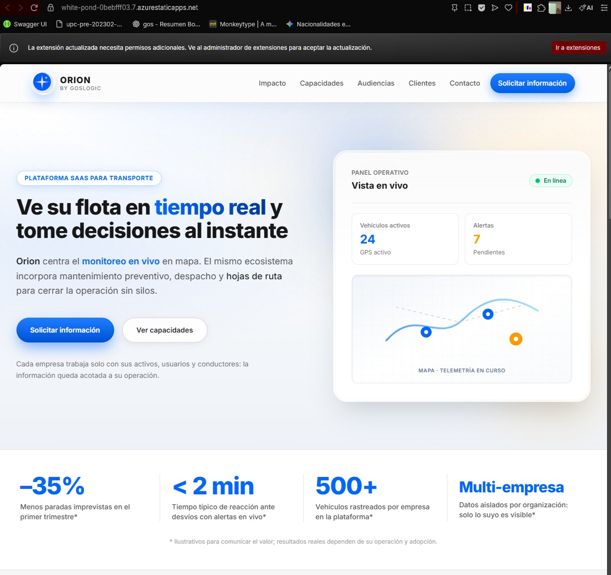
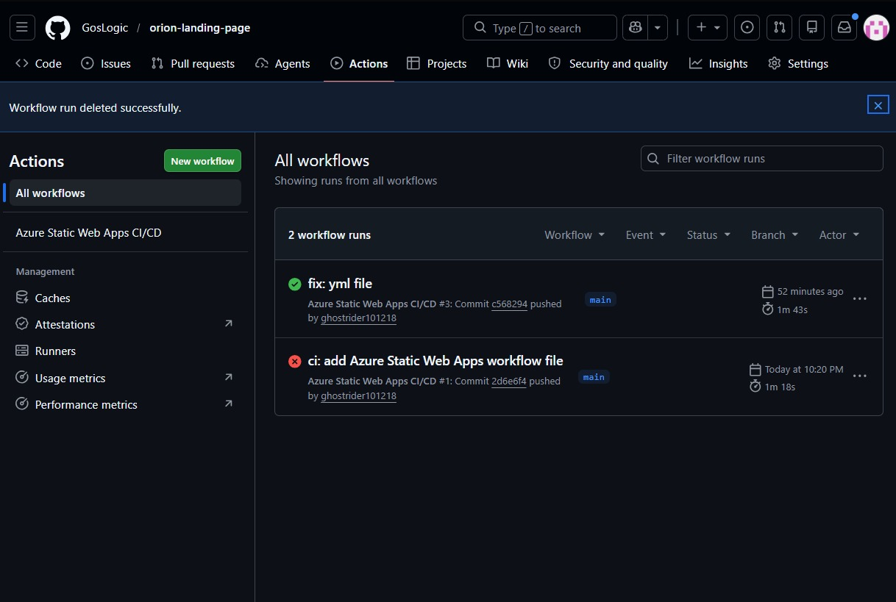
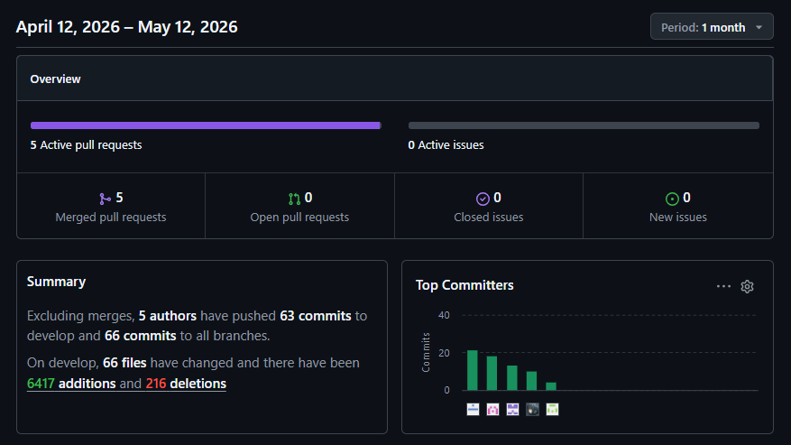
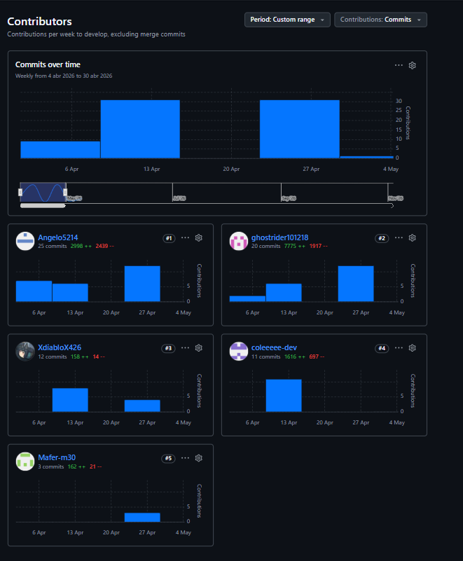

# Capítulo V: Product Implementation, Validation & Deployment

<h2 id="51-testing-suites--general-patterns">5.1 Testing Suites & General Patterns</h2>

En esta sección documentamos los patrones arquitectónicos aplicados en la implementación y las suites de pruebas (<em>testing suites</em>) configuradas en Orion para verificar, de forma sistemática y repetible, el cumplimiento de los atributos de calidad del sistema. Este enfoque articula pruebas automatizadas, aislamiento de dependencias y validación frente a requisitos funcionales explícitos. De este modo, garantizamos que la mantenibilidad del código, los controles de seguridad y la disponibilidad operativa del servicio queden respaldados por evidencia objetiva en el ciclo de desarrollo.

<h3 id="511-backend-application-core-testing-suite">5.1.1 Backend Application Core Testing Suite</h3>

El núcleo del backend de Orion se valida mediante un <em>test harness</em> que combina la verificación fina de componentes y la validación de comportamiento frente al <em>Product Backlog</em>.

<h4 id="5111-unit-testing">Pruebas unitarias (Unit Testing)</h4>

La lógica central del dominio, como los cálculos de ruteo en el DispatchService y las reglas de negocio, se comprueba mediante pruebas unitarias aisladas. Estas pruebas se ejecutan utilizando frameworks estándar del ecosistema elegido, como JUnit para Java/Spring Boot o Jest para Node.js. Para preservar el aislamiento y la velocidad de feedback, utilizamos <em>Mocks</em> e Inyección de Dependencias que sustituyen las conexiones externas, en particular el acceso a las bases de datos relacionales y de series temporales (PostgreSQL y TimescaleDB). Así, cada caso evalúa una unidad de código sin depender de la infraestructura externa.

<h4 id="5112-integration-acceptance-bdd">Pruebas de integración y de aceptación (BDD)</h4>

El vínculo entre el software entregado y las Historias de Usuario (<em>User Stories</em>) lo cubrimos mediante el enfoque Behavior-Driven Development (BDD). Utilizando el framework Cucumber y escenarios redactados en lenguaje Gherkin dentro de archivos .feature, expresamos el comportamiento esperado en un formato estructurado (Dado / Cuando / Entonces) comprensible tanto para el negocio como para el equipo técnico. Estos escenarios mapean de manera explícita los criterios de aceptación hacia pruebas automatizadas integradas en nuestro pipeline de CI/CD. Esto nos permite asegurar que ninguna funcionalidad clave sufra regresiones antes de su paso a producción.

<h3 id="512-pattern-based-backend-applications">5.1.2 Pattern Based Backend Application(s)</h3>

Hemos estructurado el interior de nuestros microservicios de Orion de manera uniforme, aplicando de forma consistente una arquitectura en capas basada en el patrón Controller-Service-Repository. Esta decisión nos permite separar claramente los límites de responsabilidad dentro de cada servicio, facilitar la evolución independiente de sus piezas y mantener una lectura predecible del código a medida que integramos nuevos casos de uso en la plataforma SaaS.

En la capa de presentación, el Controller expone las APIs RESTful, valida la sintaxis de las peticiones entrantes y delega el trabajo sin concentrar reglas de dominio. El Service actúa como el núcleo aplicativo: aquí reside toda la lógica de negocio (como la asignación de rutas o las validaciones de telemetría), de modo que los controladores permanecen delgados y enfocados puramente en HTTP. Por su parte, el Repository concentra el acceso a datos y abstrae los detalles de persistencia, interactuando con un modelo políglota donde PostgreSQL soporta el núcleo transaccional y TimescaleDB atiende las métricas de series temporales.

La orquestación entre estas tres capas se resuelve mediante el patrón de Inyección de Dependencias (<em>Dependency Injection</em>), el cual es central para cumplir con nuestro atributo de calidad de Testeabilidad. Al declarar dependencias explícitas y orientadas a interfaces, podemos inyectar <em>Mocks</em> de los repositorios durante las pruebas unitarias de los servicios. Esto nos permite validar reglas y flujos de negocio sin necesidad de levantar una base de datos real ni depender de la infraestructura externa.

<h3 id="513-pattern-based-custom-software-library">5.1.3 Pattern Based Custom Software Library</h3>

Para cumplir con el principio DRY (Don't Repeat Yourself) y centralizar la seguridad de la plataforma SaaS multi-tenant, hemos externalizado la lógica transversal en una librería personalizada o paquete común (Custom Software Library). Esta librería compartida es importada por todos nuestros microservicios y se encarga exclusivamente de la validación de firmas de tokens JWT y de la extracción segura del TenantId desde el contexto de la petición. De este modo, evitamos replicar código de seguridad en cada servicio y garantizamos que el aislamiento de datos se aplique de manera uniforme en toda la arquitectura.

<h3 id="514-framework-pattern-driven-refactoring-report">5.1.4 Framework Pattern Driven Refactoring Report</h3>

Durante la configuración inicial de la arquitectura, hemos refactorizado la base de código de los microservicios para alinearla estrictamente con los principios de Domain-Driven Design (DDD). Hemos reestructurado los paquetes internos de modo que los límites de contexto (Bounded Contexts), como la gestión de Telemetría, el Despacho de rutas y la Identidad, mantengan fronteras claras y alta cohesión. Esta refactorización previene el acoplamiento innecesario y prepara el sistema para que cada módulo pueda evolucionar y desplegarse de manera totalmente independiente.

<h2 id="52-software-configuration-management">5.2 Software Configuration Management</h2>

La Gestión de la Configuración del Software (<em>Software Configuration Management</em>, SCM) en Orion formaliza cómo definimos, versionamos y controlamos los artefactos que conforman una plataforma SaaS cloud-native orientada a telemetría de flotas. En esta sección describimos el entorno de desarrollo adoptado por el equipo, la política de gestión del código fuente sobre GitHub y las convenciones de estilo que mantienen la coherencia entre el frontend, el backend basado en Spring Boot y los escenarios de prueba en Gherkin.

<h3 id="521-software-development-environment-configuration">5.2.1 Software Development Environment Configuration</h3>

Para garantizar un ciclo de vida de desarrollo estandarizado y colaborativo, hemos definido el entorno de trabajo del equipo de ingeniería. A continuación se detallan las herramientas oficiales estructuradas por categoría, incluyendo su ruta de referencia (para plataformas SaaS) o ruta de descarga (para software local), cumpliendo con las exigencias de configuración del proyecto Orion.

<strong>1. Project &amp; Requirements Management</strong>

<ul>
<li><strong>Trello:</strong> Plataforma SaaS utilizada como tablero ágil (Kanban) para visualizar y actualizar el estado de las tareas e Historias de Usuario durante los Sprints. Ruta de referencia: <a href="https://trello.com">https://trello.com</a>.</li>
<li><strong>GitHub (Projects &amp; Issues):</strong> Herramienta SaaS para la trazabilidad de los hitos del proyecto y el control colaborativo mediante Pull Requests. Ruta de referencia: <a href="https://github.com">https://github.com</a>.</li>
</ul>

<strong>2. Product Design &amp; Architecture</strong>

<ul>
<li><strong>Figma:</strong> Plataforma SaaS para el prototipado de alta fidelidad y el diseño de interfaces (UX/UI) de la aplicación web y móvil. Ruta de referencia: <a href="https://www.figma.com">https://www.figma.com</a>.</li>
<li><strong>UXPressia:</strong> Herramienta SaaS corporativa utilizada durante la fase de análisis para elaborar los User Personas, Empathy Maps y As-Is / To-Be Scenario Maps. Ruta de referencia: <a href="https://uxpressia.com">https://uxpressia.com</a>.</li>
<li><strong>Lucidchart y Structurizr:</strong> Plataformas utilizadas para la diagramación de bases de datos, flujos lógicos y las vistas arquitectónicas del modelo C4. Rutas de referencia: <a href="https://www.lucidchart.com">https://www.lucidchart.com</a> | <a href="https://structurizr.com">https://structurizr.com</a>.</li>
</ul>

<strong>3. Software Development (IDEs &amp; SDKs)</strong>

<ul>
<li><strong>IntelliJ IDEA:</strong> Entorno de Desarrollo Integrado (IDE) principal, instalado localmente por los desarrolladores de backend para construir los microservicios en Java y Spring Boot. Ruta de descarga: <a href="https://www.jetbrains.com/idea/download">https://www.jetbrains.com/idea/download</a>.</li>
<li><strong>WebStorm:</strong> IDE especializado instalado localmente para el desarrollo del ecosistema frontend web. Ruta de descarga: <a href="https://www.jetbrains.com/webstorm/download">https://www.jetbrains.com/webstorm/download</a>.</li>
<li><strong>Visual Studio Code / Android Studio:</strong> IDEs configurados localmente para el desarrollo multiplataforma de la aplicación móvil del conductor. Rutas de descarga: <a href="https://code.visualstudio.com">https://code.visualstudio.com</a> | <a href="https://developer.android.com/studio">https://developer.android.com/studio</a>.</li>
<li><strong>Flutter SDK:</strong> Kit de desarrollo de software instalado localmente para compilar y ejecutar la aplicación móvil nativa con enfoque offline-first. Ruta de descarga: <a href="https://flutter.dev/docs/get-started/install">https://flutter.dev/docs/get-started/install</a>.</li>
</ul>

<strong>4. Software Testing</strong>

<ul>
<li><strong>Postman:</strong> Cliente API instalado localmente para el diseño, depuración y ejecución de pruebas manuales y automatizadas sobre los endpoints RESTful de nuestros microservicios. Ruta de descarga: <a href="https://www.postman.com/downloads">https://www.postman.com/downloads</a>.</li>
<li><strong>Cucumber:</strong> Framework integrado en el entorno de desarrollo para ejecutar pruebas de integración y de aceptación bajo el enfoque Behavior-Driven Development (BDD) utilizando lenguaje Gherkin. Ruta de referencia: <a href="https://cucumber.io">https://cucumber.io</a>.</li>
</ul>

<strong>5. Software Deployment &amp; Version Control</strong>

<ul>
<li><strong>Git:</strong> Sistema de control de versiones distribuido instalado en cada estación de trabajo para el seguimiento de modificaciones en el código fuente local. Ruta de descarga: <a href="https://git-scm.com/downloads">https://git-scm.com/downloads</a>.</li>
<li><strong>Docker Desktop:</strong> Herramienta de contenedorización local utilizada para levantar la base de datos (PostgreSQL/TimescaleDB) y las dependencias de infraestructura sin contaminar el sistema operativo del desarrollador. Ruta de descarga: <a href="https://www.docker.com/products/docker-desktop">https://www.docker.com/products/docker-desktop</a>.</li>
<li><strong>Google Cloud Platform / AWS:</strong> Proveedor de infraestructura en la nube elegido para el despliegue final de los contenedores en producción, respetando la arquitectura Cloud-Native exigida por el proyecto. Ruta de referencia: <a href="https://cloud.google.com">https://cloud.google.com</a> | <a href="https://aws.amazon.com">https://aws.amazon.com</a>.</li>
</ul>

<strong>6. Software Documentation</strong>

<ul>
<li><strong>Swagger UI (OpenAPI):</strong> Herramienta integrada internamente en nuestros microservicios para autogenerar y visualizar la documentación interactiva de nuestras APIs. Ruta de referencia: <a href="https://swagger.io/tools/swagger-ui">https://swagger.io/tools/swagger-ui</a>.</li>
</ul>

<strong>7. Core Frameworks &amp; Infrastructure Services</strong>

<ul>
<li><strong>Apache ActiveMQ:</strong> Message Broker de código abierto implementado para encolar masivamente los eventos de telemetría bajo alta concurrencia, desacoplando la ingesta de coordenadas GPS del hilo transaccional principal. Ruta de descarga: <a href="https://activemq.apache.org">https://activemq.apache.org</a>.</li>
<li><strong>Spring Cloud Eureka:</strong> Servidor de Service Discovery configurado para que todos los microservicios del backend se registren y se descubran dinámicamente en tiempo de ejecución. Ruta de referencia: <a href="https://spring.io/projects/spring-cloud-netflix">https://spring.io/projects/spring-cloud-netflix</a>.</li>
<li><strong>Astro:</strong> Framework web de alto rendimiento seleccionado para el desarrollo del portal administrativo del Gestor de Flota (FleetManagerSPA). Ruta de referencia: <a href="https://astro.build">https://astro.build</a>.</li>
</ul>

<h3 id="522-source-code-management">5.2.2 Source Code Management</h3>

Para el proyecto Orion hemos adoptado un flujo de trabajo estructurado sobre Git, utilizando GitHub como nuestra plataforma central de control de versiones y colaboración. Dado que nuestra arquitectura se basa en microservicios, manejamos un enfoque multi-repositorio donde cada contexto delimitado (como la gestión de Identidad, Flota, Despacho y Telemetría) cuenta con su propio repositorio oficial dentro de la organización del equipo.

<h4 id="5221-branching-gitflow">Estrategia de ramificación (GitFlow)</h4>

Implementamos rigurosamente GitFlow para organizar el trabajo en paralelo y asegurar la calidad del código. Las integraciones hacia la rama principal se realizan exclusivamente mediante Pull Requests (PR) sujetos a revisión por pares, lo cual reduce drásticamente el riesgo de regresiones. Nuestra estructura de ramas y sus convenciones de nomenclatura son las siguientes:

<ul>
<li><strong>main:</strong> Contiene el código estable que refleja exactamente lo que se encuentra desplegado en producción.</li>
<li><strong>develop:</strong> Línea de trabajo principal donde se integran las funcionalidades terminadas de cada iteración (Sprint).</li>
<li><strong>feature/:</strong> Ramas efímeras creadas a partir de develop para desarrollar historias de usuario concretas. Siguen la convención feature/US&lt;ID&gt;-&lt;descripcion&gt; (por ejemplo: feature/US01-tenant-config).</li>
<li><strong>release/:</strong> Ramas de preparación para los pases a producción. Siguen la convención release/v&lt;Version&gt;.</li>
<li><strong>hotfix/:</strong> Ramas creadas directamente desde main para resolver incidentes críticos. Siguen la convención hotfix/v&lt;Version&gt;.</li>
</ul>

<h4 id="5222-versioning-commits">Versionado y commits</h4>

Para mantener una trazabilidad profesional en todos nuestros repositorios, aplicamos la especificación Semantic Versioning 2.0.0 (MAJOR.MINOR.PATCH) al momento de etiquetar nuestras versiones de despliegue. Asimismo, el historial de cambios se mantiene limpio y estructurado adoptando el estándar Conventional Commits. Es una regla innegociable que cada mensaje de commit inicie con un prefijo estructural (como feat:, fix:, test:, docs:) seguido de una descripción clara.

<h4 id="5223-official-links">Enlaces oficiales del proyecto</h4>

A continuación detallamos el acceso a nuestro espacio de trabajo centralizado. Mientras los repositorios se mantengan privados por políticas académicas y de protección de código, se garantiza que los miembros del jurado y docentes cuentan con el alcance de acceso necesario para auditar la evidencia de commits adjunta en este informe.

El presente informe y sus capítulos en Markdown se versionan en el repositorio <a href="https://github.com/GosLogic/orion-report">https://github.com/GosLogic/orion-report</a>. La landing pública del producto se encuentra en <a href="https://github.com/GosLogic/orion-landing-page">https://github.com/GosLogic/orion-landing-page</a>.

<table border="1" style="border-collapse: collapse; width: 100%; font-size: 0.95rem;">
<thead>
<tr><th style="padding: 0.5rem;">Componente / Módulo</th><th style="padding: 0.5rem;">Enlace del repositorio (GitHub)</th></tr>
</thead>
<tbody>
<tr><td style="padding: 0.5rem;">Organización general (Orion)</td><td style="padding: 0.5rem;"><a href="https://github.com/GosLogic">https://github.com/GosLogic</a></td></tr>
<tr><td style="padding: 0.5rem;">IAM Service (Backend)</td><td style="padding: 0.5rem;"><a href="https://github.com/GosLogic/orion-backend">https://github.com/GosLogic/orion-backend</a></td></tr>
<tr><td style="padding: 0.5rem;">Fleet Service (Backend)</td><td style="padding: 0.5rem;"><a href="https://github.com/GosLogic/orion-backend">https://github.com/GosLogic/orion-backend</a></td></tr>
<tr><td style="padding: 0.5rem;">Dispatch Service (Backend)</td><td style="padding: 0.5rem;"><a href="https://github.com/GosLogic/orion-backend">https://github.com/GosLogic/orion-backend</a></td></tr>
<tr><td style="padding: 0.5rem;">Telemetry Service (Backend)</td><td style="padding: 0.5rem;"><a href="https://github.com/GosLogic/orion-backend">https://github.com/GosLogic/orion-backend</a></td></tr>
<tr><td style="padding: 0.5rem;">Mobile App (Flutter)</td><td style="padding: 0.5rem;"><a href="https://github.com/GosLogic/orion-mobile-app">https://github.com/GosLogic/orion-mobile-app</a></td></tr>
<tr><td style="padding: 0.5rem;">FleetManager SPA (Web)</td><td style="padding: 0.5rem;"><a href="https://github.com/GosLogic/orion-web-portal">https://github.com/GosLogic/orion-web-portal</a></td></tr>
</tbody>
</table>

<h3 id="523-source-code-style-guide--conventions">5.2.3 Source Code Style Guide & Conventions</h3>

Para asegurar la mantenibilidad a largo plazo y la coherencia técnica del proyecto Orion, hemos establecido como regla innegociable que todo el código fuente, los identificadores (variables, clases, métodos) y los mensajes de los commits deben redactarse estrictamente en idioma inglés. Además, el equipo ha adoptado las siguientes guías de estilo y convenciones oficiales según la tecnología.

<h4 id="5231-java-spring-backend">Java y Spring Boot (Backend)</h4>

Nos apegamos a la <a href="https://google.github.io/styleguide/javaguide.html">Google Java Style Guide</a>. Respetamos la convención de estructurar los paquetes por capa y por Bounded Context (separando claramente la capa de API, la lógica de negocio y la persistencia). Utilizamos PascalCase para las clases e interfaces, y camelCase para variables y métodos. Además, es obligatorio extraer cualquier secreto o configuración sensible hacia variables de entorno, evitando incrustar credenciales en el repositorio.

<h4 id="5232-astro-typescript-ui">Astro, TypeScript y UI (Frontend Web)</h4>

Para el portal administrativo, aplicamos la <a href="https://google.github.io/styleguide/tsguide.html">Google TypeScript Style Guide</a>. Exigimos tipado estricto, el uso de camelCase para funciones y PascalCase para componentes, evitando identificadores genéricos que oculten la intención del dominio (como id en lugar de tenantId). A nivel de interfaz, priorizamos el uso de HTML semántico (header, nav, main, section) y encapsulamos el CSS de forma modular dentro de cada componente .astro utilizando nombres de clase autodescriptivos separados por guiones medios (por ejemplo, .fleet-summary-card).

<h4 id="5233-flutter-dart-mobile">Flutter y Dart (Mobile App)</h4>

Para la aplicación móvil del conductor, seguimos las convenciones oficiales de <a href="https://dart.dev/effective-dart">Effective Dart</a>. Organizamos el código separando estrictamente la lógica de estado, los servicios de persistencia local (SQLite para el enfoque offline-first) y la interfaz de usuario. Utilizamos snake_case para nombrar los archivos y carpetas, y PascalCase para los widgets, priorizando la inmutabilidad mediante constructores constantes (const) para optimizar el rendimiento del dispositivo.

<h4 id="5234-gherkin-testing">Gherkin (Testing Suites)</h4>

Para nuestras pruebas de integración, adoptamos las prácticas descritas en <em>Gherkin: Conventions for Readable Specifications</em> y la referencia del ecosistema Cucumber. Redactamos los escenarios BDD respetando estrictamente las palabras clave en inglés (Given, When, Then, And), con saltos de línea claros entre pasos. Las formulaciones deben estar alineadas semánticamente a las Historias de Usuario de Orion, garantizando que los criterios de aceptación permanezcan trazables y auditables frente a las pruebas automatizadas (<em>step definitions</em>). Referencia: <a href="https://cucumber.io/docs/gherkin/reference/">https://cucumber.io/docs/gherkin/reference/</a>.

<h3 id="524-software-deployment-configuration">5.2.4 Software Deployment Configuration</h3>

Para el despliegue de la solución, se ha diseñado una estrategia híbrida que separa la capa de presentación de la capa de servicios, optimizando el uso de recursos en la nube y garantizando la visibilidad de los microservicios.

<h4 id="5241-frontend-layer">Capa de Frontend (Landing Page &amp; Web Application)</h4>

El despliegue de la Landing Page y la aplicación Frontend se realizará mediante Azure Static Web Apps (SWA). Esta elección permite aprovechar la integración nativa con GitHub Actions para flujos de CI/CD, asegurando que cada cambio en la rama principal se refleje automáticamente en un entorno de producción optimizado para contenido estático.

<h4 id="5242-microservices-backend-layer">Capa de Microservicios (Backend)</h4>

Dada la naturaleza de la arquitectura orientada a microservicios y el contexto académico del proyecto, se ha planificado la siguiente configuración de despliegue:

<strong>Service Discovery (Netflix Eureka):</strong> Se tiene previsto el despliegue de un servidor de Eureka que actuará como el registro central de servicios. Esto permitirá que los microservicios se localicen entre sí dinámicamente, facilitando la comunicación interna sin depender de configuraciones de red estáticas.

<strong>Contenerización con Docker:</strong> Cada microservicio será empaquetado en contenedores Docker. Se planea utilizar imágenes ligeras para asegurar un despliegue eficiente y una portabilidad completa entre los entornos de desarrollo de los integrantes y el entorno de nube.

<strong>Alojamiento en Azure:</strong> Los contenedores se desplegarán preferentemente en Azure App Services for Containers o mediante el uso de Azure Container Instances (ACI), permitiendo levantar el ecosistema completo (incluyendo el API Gateway y Eureka) de forma centralizada.

<strong>Gestión de Datos:</strong> Se utilizarán instancias gestionadas de bases de datos (como Azure SQL Database o PostgreSQL) para garantizar la persistencia y disponibilidad de la información de forma independiente al ciclo de vida de los contenedores de aplicación.

<h2 id="53-microservices-implementation">5.3 Microservices Implementation</h2>

<h3 id="521-sprint-1">5.2.1 Sprint 1</h3>

<h4 id="5211-sprint-backlog-1">5.2.1.1 Sprint Backlog 1</h4>

Proyecto en trello: https://trello.com/invite/b/69fe7cf4bc5c526cc5863c3e/ATTIb39ebbace93d6e6d898771ab5d5213121563F916/sprint-backlog-1-fundamentos-de-arquitectura

  

A continuación, se presenta la tabla con las tareas necesarias para completar satisfactoriamente este primer sprint. Además, se asignó un miembro del equipo a cada tarea a desarrollar y el estado de cada tarea.

| Sprint 1     | Sprint Backlog 1                              |                |                                                              |                                                                                                                                                                                        | Estimation (Hours) | Assigned to                          | Status |
|--------------|-----------------------------------------------|----------------|--------------------------------------------------------------|----------------------------------------------------------------------------------------------------------------------------------------------------------------------------------------|--------------------|--------------------------------------|--------|
| User Stories |                                               | Work Item/Task | Title                                                        | Description                                                                                                                                                                            |                    |                                      |        |
| US03         | Gestión de Usuarios y Roles                   | TS-01          | Diseñar estructura de usuarios y roles                       | Diseñar las entidades y relaciones necesarias para gestionar usuarios y roles dentro del sistema.                                                                                    | 0.5                | Gonzales Castillo, Angel Martin      | Done   |
|              |                                               | TS-02          | Implementar endpoint de registro de usuarios                 | Desarrollar el endpoint para registrar nuevos usuarios en el sistema con validaciones correspondientes.                                                                               | 0.6                | Solano Armas, Angelo Hector          | Done   |
|              |                                               | TS-03          | Implementar asignación de roles                              | Implementar la lógica para asignar roles a los usuarios según permisos definidos.                                                                                                     | 0.5                | Mostajo Orosco, Maria Fernanda       | Done   |
|              |                                               | TS-04          | Validar permisos según rol                                   | Implementar validaciones para restringir funcionalidades dependiendo del rol del usuario.                                                                                             | 0.5                | Iglesias Pérez, Sergio Sebastián     | Done   |
| US04         | Autenticación JWT                             | TS-05          | Configurar autenticación mediante JWT                        | Implementar autenticación basada en JSON Web Tokens para proteger el acceso al sistema.                                                                                               | 0.7                | Cossar Sánchez, Eduardo José         | Done   |
|              |                                               | TS-06          | Generar tokens de acceso                                     | Implementar la generación automática de tokens JWT al iniciar sesión correctamente.                                                                                                   | 0.4                | Gonzales Castillo, Angel Martin      | Done   |
|              |                                               | TS-07          | Validar tokens en solicitudes protegidas                     | Implementar middleware de validación de tokens para verificar autenticidad y permisos.                                                                                                | 0.6                | Solano Armas, Angelo Hector          | Done   |
| US05         | Expiración de Sesión                          | TS-08          | Configurar expiración automática de sesión                   | Implementar tiempo de expiración para sesiones autenticadas mediante JWT.                                                                                                             | 0.5                | Mostajo Orosco, Maria Fernanda       | Done   |
|              |                                               | TS-09          | Gestionar cierre de sesión por expiración                    | Implementar lógica que cierre automáticamente la sesión cuando el token expire.                                                                                                       | 0.4                | Iglesias Pérez, Sergio Sebastián     | Done   |
|              |                                               | TS-10          | Mostrar mensaje de sesión expirada                           | Implementar notificación visual para informar al usuario cuando su sesión haya expirado.                                                                                              | 0.3                | Cossar Sánchez, Eduardo José         | Done   |
| US08         | Visualización en Mapa                         | TS-11          | Diseñar interfaz de visualización del mapa                   | Diseñar la interfaz para mostrar rutas y ubicaciones dentro de un mapa interactivo.                                                                                                   | 0.6                | Gonzales Castillo, Angel Martin      | Done   |
|              |                                               | TS-12          | Integrar API de mapas                                        | Integrar un servicio de mapas para visualizar ubicaciones y recorridos dentro de la aplicación.                                                                                      | 0.8                | Solano Armas, Angelo Hector          | Done   |
|              |                                               | TS-13          | Mostrar rutas y ubicaciones en tiempo real                   | Implementar la lógica para visualizar rutas y posiciones actualizadas dentro del mapa.                                                                                                | 0.7                | Mostajo Orosco, Maria Fernanda       | Done   |
| US09         | Historial de Rutas                            | TS-14          | Diseñar estructura de almacenamiento de rutas                | Diseñar la estructura de datos necesaria para almacenar el historial de rutas recorridas.                                                                                             | 0.5                | Iglesias Pérez, Sergio Sebastián     | Done   |
|              |                                               | TS-15          | Implementar registro de rutas realizadas                     | Desarrollar la lógica para guardar automáticamente las rutas realizadas por el usuario.                                                                                               | 0.6                | Cossar Sánchez, Eduardo José         | Done   |
|              |                                               | TS-16          | Implementar visualización del historial de rutas             | Implementar la interfaz para consultar y visualizar el historial de rutas registradas.                                                                                                | 0.6                | Gonzales Castillo, Angel Martin      | Done   |
|              |                                               | TS-17          | Filtrar historial de rutas por fecha                         | Implementar filtros que permitan buscar rutas realizadas según fechas específicas.                                                                                                    | 0.4                | Solano Armas, Angelo Hector          | Done   |
| US13         | Registro de Activos                           | TS-18          | Diseñar estructura de activos                                | Diseñar las entidades y atributos necesarios para registrar los activos dentro del sistema.                                                                                           | 0.5                | Mostajo Orosco, Maria Fernanda       | Done   |
|              |                                               | TS-19          | Implementar registro de activos                              | Desarrollar la funcionalidad para registrar nuevos activos en la aplicación.                                                                                                          | 0.6                | Iglesias Pérez, Sergio Sebastián     | Done   |
|              |                                               | TS-20          | Validar datos de activos registrados                         | Implementar validaciones para asegurar la integridad de la información de los activos.                                                                                                | 0.4                | Cossar Sánchez, Eduardo José         | Done   |
| US17         | Reporte de Jornada                            | TS-21          | Diseñar interfaz de reporte de jornada                       | Diseñar la interfaz para visualizar y registrar reportes relacionados con la jornada laboral.                                                                                        | 0.5                | Gonzales Castillo, Angel Martin      | Done   |
|              |                                               | TS-22          | Implementar generación de reportes                           | Implementar la lógica para generar reportes de jornada con la información registrada por el usuario.                                                                                  | 0.7                | Solano Armas, Angelo Hector          | Done   |
|              |                                               | TS-23          | Exportar reporte de jornada                                  | Implementar funcionalidad para exportar reportes en formatos compatibles.                                                                                                             | 0.5                | Mostajo Orosco, Maria Fernanda       | Done   |
| US18         | Recepción de Horarios                         | TS-24          | Diseñar estructura de horarios                               | Diseñar la estructura de datos necesaria para almacenar horarios asignados.                                                                                                           | 0.4                | Iglesias Pérez, Sergio Sebastián     | Done   |
|              |                                               | TS-25          | Implementar recepción de horarios                            | Desarrollar la funcionalidad para recibir y mostrar horarios asignados al usuario.                                                                                                    | 0.6                | Cossar Sánchez, Eduardo José         | Done   |
|              |                                               | TS-26          | Validar visualización de horarios                            | Verificar que los horarios se visualicen correctamente según el usuario autenticado.                                                                                                  | 0.4                | Gonzales Castillo, Angel Martin      | Done   |

<h4 id="5212-development-evidence-for-sprint-review">5.2.1.2 Development Evidence for Sprint Review</h4>

En esta sección, se describen los principales avances de implementación realizados en este primer sprint. Se tienen como principales avances la implementación del Backend

A continuación, se muestra una tabla que contiene la información sobre los **commits** realizados que contienen las funcionalidades implementadas para completar el primer sprint.

| Repository                     | Branch                        | Commit Id                                | Commit Message                                                                          | Commited On |
|--------------------------------|-------------------------------|-------------------------------------------|-----------------------------------------------------------------------------------------|-------------|
| GosLogic/orion-backend-api     | feature/user-roles            | a73fd912bc45ef1da93bc4a8f20a12de45bc781a | feat(users): implement user roles and permissions management                            | 14/04/2026  |
| GosLogic/orion-backend-api     | feature/jwt-authentication    | c91be452df61aa74ce9fbd13e9f7acb6d51ae912 | feat(authentication): add JWT authentication and token generation                       | 15/04/2026  |
| GosLogic/orion-backend-api     | feature/session-expiration    | 84da0b3f9f4ec9a0bd74e8e4d61fbc0efaa82913 | feat(session): implement automatic session expiration handling                          | 16/04/2026  |
| GosLogic/orion-backend-api     | feature/route-history         | 7bcdf1a8a61e4f7cb36cfd1908db56aafec3d782 | feat(routes): add route history persistence and retrieval                               | 18/04/2026  |
| GosLogic/orion-backend-api     | feature/workday-reports       | d5f0ce31ea8d3e78bc7af1dbe16f9e4d6ab712fe | feat(reports): implement workday report generation                                      | 20/04/2026  |
| GosLogic/orion-mobile-app      | feature/map-visualization     | e12ab9837bcf91a2ef5d4ac6bc9fda71a8ce7211 | feat(map): integrate interactive map visualization for routes                           | 19/04/2026  |
| GosLogic/orion-mobile-app      | feature/assets-registration   | b61de0ac92fe84d7ac9e4a1fbd45c7ef102ab634 | feat(assets): implement asset registration interface                                    | 21/04/2026  |
| GosLogic/orion-mobile-app      | feature/schedule-reception    | 92ac71dfb64e8efcb9134f5d8aa4ce10be31df72 | feat(schedule): add schedule reception and visualization module                         | 22/04/2026  |
| GosLogic/orion-mobile-app      | feature/history-filters       | 3df7bc1ea82f64dcab1ef5c6b7d82f1ad7bc9132 | feat(history): add filters for route history by date                                    | 22/04/2026  |
| GosLogic/orion-mobile-app      | feature/session-management    | 8be1da6c7f4ae5db91cf73ea12f6b9dc5f8a31ef | feat(authentication): add expired session notification and automatic logout             | 17/04/2026  |
| GosLogic/orion-web-dashboard   | feature/workday-dashboard     | f4ce9a8db73ef2a9bc4fd12ea84cb7d9ef2c731a | feat(dashboard): create dashboard for workday reports                                   | 23/04/2026  |
| GosLogic/orion-web-dashboard   | feature/roles-management      | c6ae91df82cb57efda6e18ab73f1bc8de5a912bc | feat(admin): add user role administration panel                                         | 15/04/2026  |
| GosLogic/orion-web-dashboard   | feature/map-tracking          | 1bc9de73fa84c6ab72df913ec7abf5d8c13e94ad | feat(tracking): implement real-time location tracking on map                            | 20/04/2026  |
| GosLogic/orion-web-dashboard   | feature/report-export         | 4efbc912da73ce81ab5f4d7ce90a81fc73de5ab2 | feat(reports): add export functionality for workday reports                             | 24/04/2026  |
| GosLogic/orion-web-dashboard   | feature/assets-module         | 7da3bc91ef5a84dc72ab6e19cf73bd18ae6f2c91 | feat(assets): add asset management and registration module                              | 21/04/2026  |

<h4 id="5213-testing-suite-evidence-for-sprint-review">5.2.1.3 Testing Suite Evidence for Sprint Review</h4>

En esta sección se explica y presenta el conjunto de Unit Tests, Integration Tests y Acceptance Tests automatizados implementados para los Web Services relacionados con los User Stories especificados en el Sprint.

Para los Unit Tests se utilizó xUnit, verificando el comportamiento de las clases principales del backend y la lógica de negocio implementada en Flutter. Para los Acceptance Tests bajo el enfoque BDD, se elaboraron archivos .feature utilizando el lenguaje Gherkin, los cuales se relacionan directamente con los User Stories implementados.

A continuación, se muestran tablas que incluyen la relación de tests diseñados, junto con los id de commits relacionados con los avances en Testing para este Sprint. Los Unit Tests y los .feature de Gherkin están ubicados en el repositorio del backend.

| Repository                   | Branch                             | Commit Id                                | Commit Message                                                                          | Commited On |
|------------------------------|------------------------------------|-------------------------------------------|-----------------------------------------------------------------------------------------|-------------|
| GosLogic/orion-backend-api   | feature/authentication-tests       | 91ab5d73cf8e12db7ac5e94f1bde73ca9e8f12ac | test(authentication): add JWT authentication unit tests                                 | 25/04/2026  |
| GosLogic/orion-backend-api   | feature/session-tests              | 8fc2de71ab45f39ce17bd5af8c1de72fa95bc123 | test(session): validate session expiration scenarios                                    | 25/04/2026  |
| GosLogic/orion-backend-api   | feature/roles-tests                | b71ea5cf93ad7e12fc84bd19ef6ca7d28b4ce912 | test(users): add user role validation tests                                             | 26/04/2026  |
| GosLogic/orion-backend-api   | feature/routes-tests               | c95ab71df4ce8d2fb6e91ac73de54bf18ca3d721 | test(routes): add route history repository tests                                        | 27/04/2026  |
| GosLogic/orion-backend-api   | feature/report-tests               | d72bc18fa95de3ab81fc74de19ba6cf72ed1a593 | test(reports): validate workday report generation                                       | 27/04/2026  |
| GosLogic/orion-backend-api   | feature/assets-tests               | 6be1fd9ac37e4bc91de57af2c81bd63ea74cf192 | test(assets): add asset registration service tests                                      | 28/04/2026  |
| GosLogic/orion-backend-api   | feature/schedule-tests             | f4ad82ce91bc74ea3df8ab61c92ed57af18ce234 | test(schedule): validate assigned schedules retrieval                                   | 28/04/2026  |
| GosLogic/orion-backend-api   | feature/api-integration-tests      | 2de74bcf81ea5cd93abf74ed18fc62ba7d91ce53 | test(api): add integration tests for secured endpoints                                  | 29/04/2026  |
| GosLogic/orion-mobile-app    | feature/map-ui-tests               | a8dce712bf49ea73cf5d81ab27ce91df5bc7a214 | test(map): add UI tests for map visualization module                                    | 29/04/2026  |
| GosLogic/orion-mobile-app    | feature/history-ui-tests           | c31bf5ae74dc91fb28ce73da51fc84be9d12ac73 | test(history): validate route history filters and visualization                         | 30/04/2026  |
| GosLogic/orion-mobile-app    | feature/session-ui-tests           | e94fc17ab82de53bcf71ad95e3cb72fa81ce5d62 | test(authentication): add expired session notification tests                            | 30/04/2026  |
| GosLogic/orion-mobile-app    | feature/assets-ui-tests            | 74bc91de5af38ce27db51ac9fe72da84bc19ef63 | test(assets): validate asset registration form behavior                                 | 30/04/2026  |
| GosLogic/orion-web-dashboard | feature/dashboard-tests            | 1ac74de9bf25ca81ed73ab4fc91de82ba7cf519d | test(dashboard): add workday dashboard component tests                                  | 01/05/2026  |
| GosLogic/orion-web-dashboard | feature/export-tests               | 58de91ac7fb24ce83da71bf5c92ae17dc4ab8f31 | test(reports): validate export functionality for reports                                | 01/05/2026  |
| GosLogic/orion-web-dashboard | feature/tracking-tests             | 93ab71ce4df82bc51ae97fd3cb18da74fe5bc612 | test(tracking): add real-time tracking rendering tests                                  | 02/05/2026  |
| GosLogic/orion-web-dashboard | feature/acceptance-tests           | d18bc74ea52df91ac73eb4fd18ca95bf72de63a1 | chore(test): add acceptance test configuration and example scenarios                    | 02/05/2026  |\

<h4 id="5214-execution-evidence-for-sprint-review">5.2.1.4 Execution Evidence for Sprint Review</h4>

En esta sección, se presenta la evidencia de ejecución de los productos implementados en este sprint. Los logros incluyen el desarrollo y despliegue del Landing Page y la aplicación web.

A continuación, se muestran las capturas de pantalla y enlaces de acceso a cada producto implementado. Estas evidencias reflejan el progreso realizado en el sprint y sirven como comprobante del trabajo completado.

Landing Page  

Link: https://github.com/GosLogic/orion-landing-page

  

Web Application  

Link: https://github.com/GosLogic/orion-web-portal

  

<h4 id="5215-microservices-documentation-evidence-for-sprint-review">5.2.1.5 Microservices Documentation Evidence for Sprint Review</h4>
Durante el desarrollo de este sprint no se realizaron actividades relacionadas con la implementación o documentación de microservicios, debido a que el alcance del sprint estuvo enfocado en funcionalidades de autenticación, gestión de usuarios, visualización de rutas y reportes del sistema.

<h4 id="5216-software-deployment-evidence-for-sprint-review">5.2.1.6 Software Deployment Evidence for Sprint Review</h4>

En esta sección se presentan las evidencias que corroboran el despliegue funcional de los componentes de software en sus respectivos entornos de producción o staging. A la fecha del informe, el equipo tiene operativo en <strong>Azure Static Web Apps</strong> el despliegue continuo de la <strong>Landing Page</strong> y del <strong>portal web</strong> (FleetManager SPA), integrado con <strong>GitHub Actions</strong>.

<strong>1. Evidencia de despliegue de aplicaciones (frontend)</strong>

<table border="1" style="border-collapse: collapse; width: 100%; font-size: 0.95rem;">
<thead>
<tr><th style="padding: 0.5rem;">Componente</th><th style="padding: 0.5rem;">URL de despliegue (Azure SWA)</th><th style="padding: 0.5rem;">Estado</th></tr>
</thead>
<tbody>
<tr><td style="padding: 0.5rem;">Landing Page</td><td style="padding: 0.5rem;"><a href="https://white-pond-0bebfff03.7.azurestaticapps.net">https://white-pond-0bebfff03.7.azurestaticapps.net</a></td><td style="padding: 0.5rem;">En línea</td></tr>
<tr><td style="padding: 0.5rem;">Web Application (FleetManager SPA)</td><td style="padding: 0.5rem;"><a href="https://witty-island-064950f03.7.azurestaticapps.net">https://witty-island-064950f03.7.azurestaticapps.net</a></td><td style="padding: 0.5rem;">En línea</td></tr>
</tbody>
</table>

  
   
  <em>Figura: evidencia de despliegue frontend en Azure SWA</em>

<strong>2. Evidencia de pipelines de despliegue (CI/CD)</strong>

Historial de ejecuciones exitosas en <strong>GitHub Actions</strong> para los repositorios que publican hacia Azure Static Web Apps, validando compilación y despliegue automatizado.

  
   
  <em>Figura: pipeline CI/CD en GitHub Actions</em>

<h4 id="5217-team-collaboration-insights-during-sprint">5.2.1.7 Team Collaboration Insights during Sprint</h4>

Durante el Sprint 1 hemos adoptado de forma deliberada un enfoque de **monolito modular** dentro de un **repositorio unificado**, como decisión técnica de transición hacia la arquitectura objetivo de Orion. Esta elección nos permitió acelerar la puesta en marcha del núcleo de seguridad (IAM), la propagación consistente del **TenantId** y los flujos transversales de autenticación, sin asumir de inicio la complejidad operativa de orquestar múltiples contenedores, pipelines y contratos distribuidos entre servicios aún inestables. Así redujimos el riesgo de retrabajo y concentramos el esfuerzo en invariantes de dominio y calidad (aislamiento lógico, validación de tokens, políticas de acceso) que serán portables cuando escindamos límites de despliegue. La **separación física** hacia una arquitectura **puramente basada en microservicios** quedó **planificada para el Sprint siguiente**, una vez consolidados los cimientos del código y las interfaces internas que hoy conviven modularizadas en el mismo artefacto ejecutable.

En cuanto a la dinámica colaborativa, el equipo participó de manera activa en la implementación: repartimos el trabajo mediante nuestro **tablero Kanban** (priorización, límite de trabajo en curso y visibilidad del estado de cada ítem) y convergimos el código en la rama **`develop`** de **GitHub** mediante **Pull Requests** abiertos, revisados y aprobados por pares antes de integrarse. Este flujo fomentó la alineación técnica, la detección temprana de defectos y la trazabilidad de decisiones (comentarios, checks y historial de cambios), coherente con una cultura de inspección continua propia de un equipo que combina rigor de arquitectura con disciplina Scrum.

  
   
  <em>Figura: GitHub Insights (contribuciones y actividad del repositorio durante el Sprint 1).</em>

  
   
  <em>Figura: Historial y distribución de commits del equipo en la rama de integración.</em>

<h4 id="5218-kanban-board">5.2.1.8 Kanban Board</h4>

Durante el Sprint 1 se utilizó un Kanban Board en Trello para organizar y monitorear las actividades relacionadas con el desarrollo de las funcionalidades principales del sistema Orion. El tablero permitió visualizar el progreso de las tareas mediante columnas como To Do, In Progress, To Review y Done, facilitando el seguimiento continuo del avance del equipo.

Las tareas fueron organizadas de acuerdo con las user stories definidas para el sprint, incluyendo funcionalidades como gestión de usuarios y roles, autenticación JWT, expiración de sesión, visualización de rutas en mapa, historial de rutas, registro de activos, recepción de horarios y generación de reportes de jornada. Asimismo, se incluyeron actividades relacionadas con testing, integración de APIs, validaciones de seguridad, configuración de endpoints y actualización de evidencias técnicas y documentación del proyect

Link del kanboard: https://trello.com/invite/b/6a03fab82d0765a96ee66257/ATTI5e21adea2ae8e7375a552fdd68945d79F3376522/kanban-board

  

<h3 id="522-sprint-2">5.2.2 Sprint 2</h3>

<em>Contenido por desarrollar.</em>

<h4 id="5221-sprint-backlog-2">5.2.2.1 Sprint Backlog 2</h4>

<em>Contenido por desarrollar.</em>

<h4 id="5222-development-evidence-for-sprint-review">5.2.2.2 Development Evidence for Sprint Review</h4>

<em>Contenido por desarrollar.</em>

<h4 id="5223-testing-suite-evidence-for-sprint-review">5.2.2.3 Testing Suite Evidence for Sprint Review</h4>

<em>Contenido por desarrollar.</em>

<h4 id="5224-execution-evidence-for-sprint-review">5.2.2.4 Execution Evidence for Sprint Review</h4>

<em>Contenido por desarrollar.</em>

<h4 id="5225-microservices-documentation-evidence-for-sprint-review">5.2.2.5 Microservices Documentation Evidence for Sprint Review</h4>

<em>Contenido por desarrollar.</em>

<h4 id="5226-software-deployment-evidence-for-sprint-review">5.2.2.6 Software Deployment Evidence for Sprint Review</h4>

<em>Contenido por desarrollar.</em>

<h4 id="5227-team-collaboration-insights-during-sprint">5.2.2.7 Team Collaboration Insights during Sprint</h4>

<em>Contenido por desarrollar.</em>

<h4 id="5228-kanban-board">5.2.2.8 Kanban Board</h4>

<em>Contenido por desarrollar.</em>

<h3 id="523-sprint-3">5.2.3 Sprint 3</h3>

<em>Contenido por desarrollar.</em>

<h4 id="5231-sprint-backlog-3">5.2.3.1 Sprint Backlog 3</h4>

<em>Contenido por desarrollar.</em>

<h4 id="5232-development-evidence-for-sprint-review">5.2.3.2 Development Evidence for Sprint Review</h4>

<em>Contenido por desarrollar.</em>

<h4 id="5233-testing-suite-evidence-for-sprint-review">5.2.3.3 Testing Suite Evidence for Sprint Review</h4>

<em>Contenido por desarrollar.</em>

<h4 id="5234-execution-evidence-for-sprint-review">5.2.3.4 Execution Evidence for Sprint Review</h4>

<em>Contenido por desarrollar.</em>

<h4 id="5235-microservices-documentation-evidence-for-sprint-review">5.2.3.5 Microservices Documentation Evidence for Sprint Review</h4>

<em>Contenido por desarrollar.</em>

<h4 id="5236-software-deployment-evidence-for-sprint-review">5.2.3.6 Software Deployment Evidence for Sprint Review</h4>

<em>Contenido por desarrollar.</em>

<h4 id="5237-team-collaboration-insights-during-sprint">5.2.3.7 Team Collaboration Insights during Sprint</h4>

<em>Contenido por desarrollar.</em>

<h4 id="5238-kanban-board">5.2.3.8 Kanban Board</h4>

<em>Contenido por desarrollar.</em>

<h3 id="524-sprint-4">5.2.4 Sprint 4</h3>

<em>Contenido por desarrollar.</em>

<h4 id="5241-sprint-backlog-4">5.2.4.1 Sprint Backlog 4</h4>

<em>Contenido por desarrollar.</em>

<h4 id="5242-development-evidence-for-sprint-review">5.2.4.2 Development Evidence for Sprint Review</h4>

<em>Contenido por desarrollar.</em>

<h4 id="5243-testing-suite-evidence-for-sprint-review">5.2.4.3 Testing Suite Evidence for Sprint Review</h4>

<em>Contenido por desarrollar.</em>

<h4 id="5244-execution-evidence-for-sprint-review">5.2.4.4 Execution Evidence for Sprint Review</h4>

<em>Contenido por desarrollar.</em>

<h4 id="5245-microservices-documentation-evidence-for-sprint-review">5.2.4.5 Microservices Documentation Evidence for Sprint Review</h4>

<em>Contenido por desarrollar.</em>

<h4 id="5246-software-deployment-evidence-for-sprint-review">5.2.4.6 Software Deployment Evidence for Sprint Review</h4>

<em>Contenido por desarrollar.</em>

<h4 id="5247-team-collaboration-insights-during-sprint">5.2.4.7 Team Collaboration Insights during Sprint</h4>

<em>Contenido por desarrollar.</em>

<h4 id="5248-kanban-board">5.2.4.8 Kanban Board</h4>

<em>Contenido por desarrollar.</em>

<h2 id="54-microservices-deployment">5.4 Microservices Deployment</h2>

<em>Contenido por desarrollar.</em>

<h3 id="531-cloud-architecture-diagram">5.3.1 Cloud Architecture Diagram</h3>

<em>Contenido por desarrollar.</em>

<h3 id="532-cloud-architecture-deployment-aws-microsoft-azure-or-google-cloud">5.3.2 Cloud Architecture Deployment (AWS, Microsoft Azure or Google Cloud)</h3>

<em>Contenido por desarrollar.</em>

