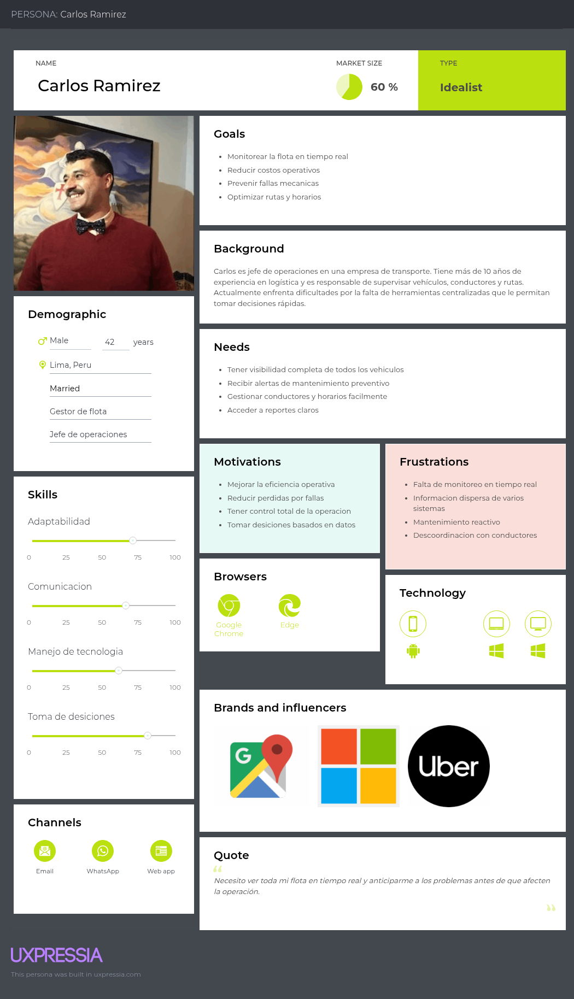
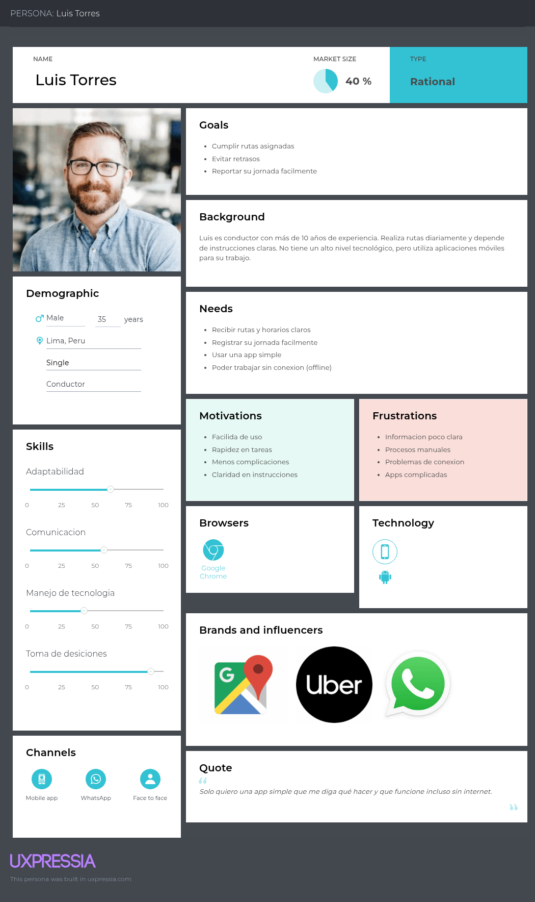
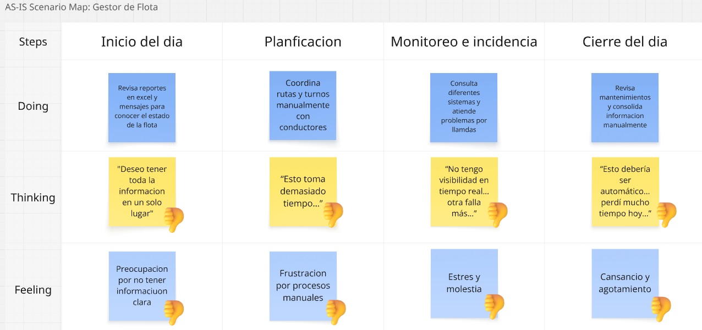
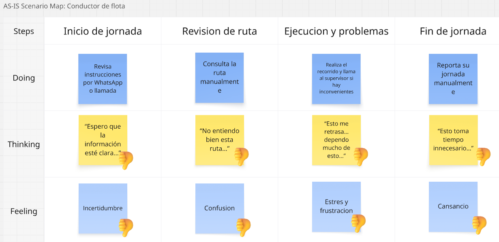
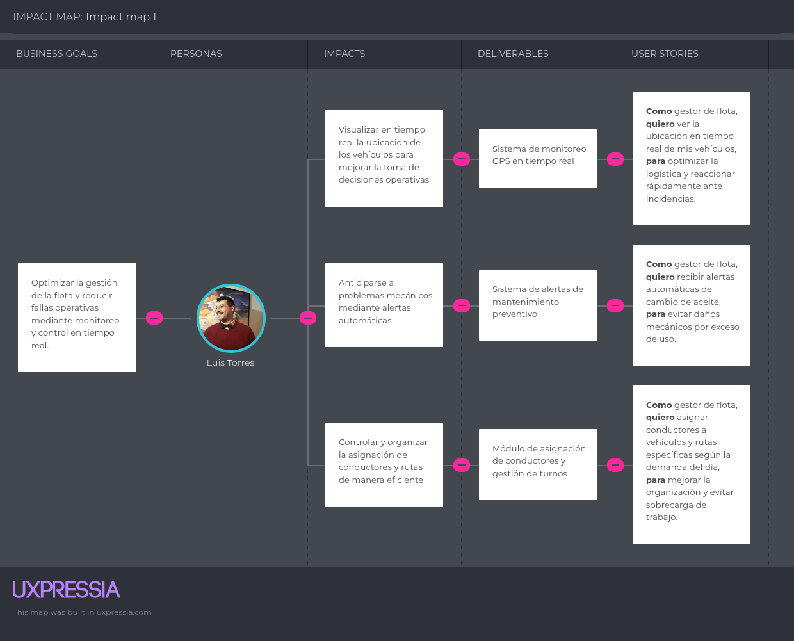
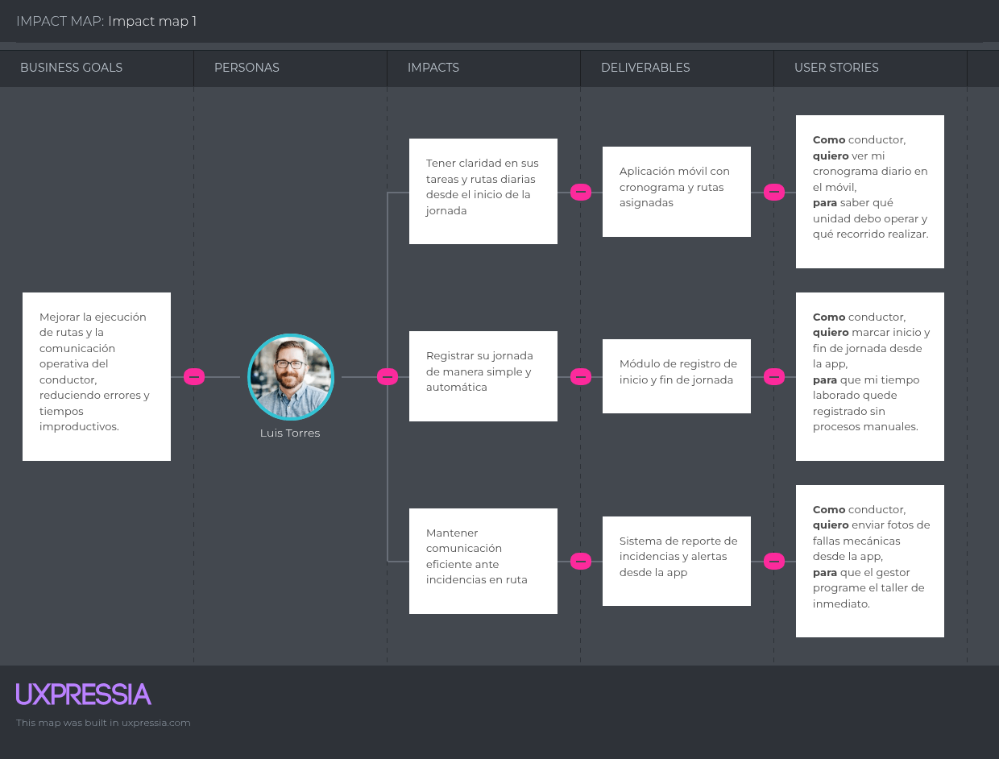

  Project Report

  

  Universidad Peruana de Ciencias Aplicadas

  Ingeniería de Software

  Periodo: 2026-10
  1ASI0657 | Fundamentos de Arquitectura de Software
  NRC: 17949
  Docente: Jorge Luis Delgado Vite

  Informe del Trabajo Final

  Startup: GosLogic
  Producto: Orion

  
Integrantes

  <table align="center" style="margin: 0 auto; border-collapse: collapse; font-size: 1rem; min-width: 420px; max-width: 100%; border: 1px solid currentColor;">
    <thead>
      <tr>
        <th style="text-align: center; padding: 0.65rem 1rem; font-weight: 700; font-size: 0.95rem; text-transform: uppercase; letter-spacing: 0.04em; border-bottom: 1px solid currentColor;">Miembro</th>
        <th style="text-align: center; padding: 0.65rem 1rem; font-weight: 700; font-size: 0.95rem; text-transform: uppercase; letter-spacing: 0.04em; border-bottom: 1px solid currentColor;">Código</th>
      </tr>
    </thead>
    <tbody>
      <tr>
        <td style="text-align: left; padding: 0.6rem 1rem; border-bottom: 1px solid currentColor;">Cossar Sánchez, Eduardo José</td>
        <td style="text-align: center; padding: 0.6rem 1rem; border-bottom: 1px solid currentColor; font-variant-numeric: tabular-nums;">u202312109</td>
      </tr>
      <tr>
        <td style="text-align: left; padding: 0.6rem 1rem; border-bottom: 1px solid currentColor;">Gonzales Castillo, Angel Martin</td>
        <td style="text-align: center; padding: 0.6rem 1rem; border-bottom: 1px solid currentColor; font-variant-numeric: tabular-nums;">u202319724</td>
      </tr>
      <tr>
        <td style="text-align: left; padding: 0.6rem 1rem; border-bottom: 1px solid currentColor;">Iglesias Pérez, Sergio Sebastián</td>
        <td style="text-align: center; padding: 0.6rem 1rem; border-bottom: 1px solid currentColor; font-variant-numeric: tabular-nums;">u202316118</td>
      </tr>
      <tr>
        <td style="text-align: left; padding: 0.6rem 1rem; border-bottom: 1px solid currentColor;">Mostajo Orosco, Maria Fernanda</td>
        <td style="text-align: center; padding: 0.6rem 1rem; border-bottom: 1px solid currentColor; font-variant-numeric: tabular-nums;">u202312874</td>
      </tr>
      <tr>
        <td style="text-align: left; padding: 0.6rem 1rem;">Solano Armas, Angelo Hector</td>
        <td style="text-align: center; padding: 0.6rem 1rem; font-variant-numeric: tabular-nums;">u20231B775</td>
      </tr>
    </tbody>
  </table>

  Mayo, 2026

### Registro de versiones del informe

<table border="1" style="border-collapse: collapse; width: 100%; font-size: 0.95rem;">
  <thead>
    <tr>
      <th style="padding: 0.5rem;">Versión</th>
      <th style="padding: 0.5rem;">Fecha</th>
      <th style="padding: 0.5rem;">Autor</th>
      <th style="padding: 0.5rem;">Descripción de modificación</th>
    </tr>
  </thead>
  <tbody>
    <tr>
      <td style="padding: 0.5rem;">TB1</td>
      <td style="padding: 0.5rem;">15/04/2026</td>
      <td style="padding: 0.5rem;">Todos los integrantes del grupo aportaron</td>
      <td style="padding: 0.5rem;">Completado hasta el Capítulo III: Introducción (Startup Profile, Solution Profile y segmentos objetivo), Requirements & Analysis (competidores, entrevistas y needfinding) y Requirements Specification (To-Be Scenario Mapping, User Stories, Impact Map y Product Backlog).</td>
    </tr>
  </tbody>
  <tbody>
    <tr>
      <td style="padding: 0.5rem;">TB2</td>
      <td style="padding: 0.5rem;">01/05/2026</td>
      <td style="padding: 0.5rem;">Todos los integrantes del grupo aportaron</td>
      <td style="padding: 0.5rem;">Completado hasta el Capítulo IV: Product Architecture Design y realizadas correciones al Capitulo I: Lean UX Process y Capitulo III: Impact Map y Product Backlog.</td>
    </tr>
  </tbody>
</table>

### Contenido

#### Tabla de contenidos

- [**Carátula**](#caratula)
- [**Registro de Versiones del Informe**](#registro-de-versiones-del-informe)
- [**Contenido**](#contenido)
  - [**Tabla de contenidos**](#tabla-de-contenidos)
- [**Student Outcome**](#student-outcome)

- [**Capítulo I: Introducción**](./01-chapter-i.md)
  - [**1.1 Startup Profile**](./01-chapter-i.md#11-startup-profile)
    - [**1.1.1 Descripción de la Startup**](./01-chapter-i.md#111-descripción-de-la-startup)
    - [**1.1.2 Perfiles de integrantes del equipo**](./01-chapter-i.md#112-perfiles-de-integrantes-del-equipo)
  - [**1.2 Solution Profile**](./01-chapter-i.md#12-solution-profile)
    - [**1.2.1 Nombre del producto**](./01-chapter-i.md#121-nombre-del-producto)
    - [**1.2.2 Antecedentes y problemática**](./01-chapter-i.md#122-antecedentes-y-problemática)
    - [**1.2.3 Lean UX Process**](./01-chapter-i.md#123-lean-ux-process)
      - [**1.2.3.1 Lean UX Problem Statement**](./01-chapter-i.md#1231-lean-ux-problem-statement)
      - [**1.2.3.2 Lean UX Assumptions**](./01-chapter-i.md#1232-lean-ux-assumptions)
      - [**1.2.3.3 Lean UX Hypothesis**](./01-chapter-i.md#1233-lean-ux-hypothesis)
      - [**1.2.3.4 Lean UX Canvas**](./01-chapter-i.md#1234-lean-ux-canvas)
  - [**1.3 Segmentos objetivo**](./01-chapter-i.md#13-segmentos-objetivo)

- [**Capítulo II: Requirements  & Analysis**](./02-chapter-ii.md)
  - [**2.1 Competidores**](./02-chapter-ii.md#21-competidores)
  - [**2.2 Entrevistas**](./02-chapter-ii.md#22-entrevistas)
  - [**2.3 Needfinding**](./02-chapter-ii.md#23-needfinding)
    - [**2.3.1 User Personas**](./02-chapter-ii.md#231-user-personas)
    - [**2.3.2 User Task Matrix**](./02-chapter-ii.md#232-user-task-matrix)
    - [**2.3.3 Empathy Maps**](./02-chapter-ii.md#233-empathy-maps)
    - [**2.3.4 As-is Scenario Mapping**](./02-chapter-ii.md#234-as-is-scenario-mapping)

- [**Capítulo III: Requirements Specification**](./03-chapter-iii.md)
  - [**3.1 To-Be Scenario Mapping**](./03-chapter-iii.md#31-to-be-scenario-mapping)
  - [**3.2 User Stories**](./03-chapter-iii.md#32-user-stories)
  - [**3.3 Impact Map**](./03-chapter-iii.md#33-impact-map)
  - [**3.4 Product Backlog**](./03-chapter-iii.md#34-product-backlog)

- [**Capítulo IV: Product Architecture Design**](./04-chapter-iv.md)
  - [**4.1 Desing Concepts, ViewPoints & ER Diagrams**](./04-chapter-iv.md#41-desing-concepts-viewpoints--er-diagrams)
    - [**4.1.1 Principles Statements**](./04-chapter-iv.md#411-principles-statements)
    - [**4.1.2 Approaches Statements Architectural Styles & Patterns**](./04-chapter-iv.md#412-approaches-statements-architectural-styles--patterns)
    - [**4.1.3 Context Diagram**](./04-chapter-iv.md#413-context-diagram)
    - [**4.1.4 Approach driven ViewPoints Diagrams**](./04-chapter-iv.md#414-approach-driven-viewpoints-diagrams)
    - [**4.1.5 Relational/Non Relational Database Diagram**](./04-chapter-iv.md#415-relationalnon-relational-database-diagram)
    - [**4.1.6 Design Patterns**](./04-chapter-iv.md#416-design-patterns)
    - [**4.1.7 Tactics**](./04-chapter-iv.md#417-tactics)
  - [**4.2 Architectural Drivers**](./04-chapter-iv.md#42-architectural-drivers)
  - [**4.1.8 Design Purpose**](./04-chapter-iv.md#418-design-purpose)
  - [**4.1.9 Primary Functionality (Primary User Stories)**](./04-chapter-iv.md#419-primary-functionality-primary-user-stories)
  - [**4.1.10 Quality Attribute Scenarios**](./04-chapter-iv.md#4110-quality-attribute-scenarios)
  - [**4.1.11 Constraints**](./04-chapter-iv.md#4111-constraints)
  - [**4.1.12 Architectural Concerns**](./04-chapter-iv.md#4112-architectural-concerns)
  - [**4.3 ADD Iterations**](./04-chapter-iv.md#43-add-iterations)
    - [**4.2.X Iteration N: &lt;Iteration Name&gt;**](./04-chapter-iv.md#42x-iteration-n)
      - [**4.2.X.1 Architectural Design Backlog N**](./04-chapter-iv.md#42x1-architectural-design-backlog-n)
      - [**4.2.X.2 Establish Iteration Goal by Selecting Drivers**](./04-chapter-iv.md#42x2-establish-iteration-goal-by-selecting-drivers)
      - [**4.2.X.3 Choose One or More Elements of the System to Refine**](./04-chapter-iv.md#42x3-choose-one-or-more-elements-of-the-system-to-refine)
      - [**4.2.X.4 Choose One or More Design Concepts That Satisfy the Selected Drivers**](./04-chapter-iv.md#42x4-choose-one-or-more-design-concepts-that-satisfy-the-selected-drivers)
      - [**4.2.X.5 Instantiate Architectural Elements, Allocate Responsibilities, and Define Interfaces**](./04-chapter-iv.md#42x5-instantiate-architectural-elements-allocate-responsibilities-and-define-interfaces)
      - [**4.2.X.6 Sketch Views (C4 & UML) and Record Design Decisions**](./04-chapter-iv.md#42x6-sketch-views-c4--uml-and-record-design-decisions)
      - [**4.2.X.7 Analysis of Current Design and Review Iteration Goal (Kanban Board)**](./04-chapter-iv.md#42x7-analysis-of-current-design-and-review-iteration-goal-kanban-board)

- [**Capítulo V: Product Implementation, Validation & Deployment**](./05-chapter-v.md)
  - [**5.1 Testing Suites & General Patterns**](./05-chapter-v.md#51-testing-suites--general-patterns)
    - [**5.1.1 Backend Application Core Testing Suite**](./05-chapter-v.md#511-backend-application-core-testing-suite)
    - [**5.1.2 Pattern Based Backend Application(s)**](./05-chapter-v.md#512-pattern-based-backend-applications)
    - [**5.1.3 Pattern Based Custom Software Library**](./05-chapter-v.md#513-pattern-based-custom-software-library)
    - [**5.1.4 Framework Pattern Driven Refactoring Report**](./05-chapter-v.md#514-framework-pattern-driven-refactoring-report)
  - [**5.2 Software Configuration Management**](./05-chapter-v.md#52-software-configuration-management)
    - [**5.2.1 Software Development Environment Configuration**](./05-chapter-v.md#521-software-development-environment-configuration)
    - [**5.2.2 Source Code Management**](./05-chapter-v.md#522-source-code-management)
    - [**5.2.3 Source Code Style Guide & Conventions**](./05-chapter-v.md#523-source-code-style-guide--conventions)
    - [**5.2.4 Software Deployment Configuration**](./05-chapter-v.md#524-software-deployment-configuration)
  - [**5.3 Microservices Implementation**](./05-chapter-v.md#53-microservices-implementation)
    - [**5.2.1 Sprint 1**](./05-chapter-v.md#521-sprint-1)
      - [**5.2.1.1 Sprint Backlog 1**](./05-chapter-v.md#5211-sprint-backlog-1)
      - [**5.2.1.2 Development Evidence for Sprint Review**](./05-chapter-v.md#5212-development-evidence-for-sprint-review)
      - [**5.2.1.3 Testing Suite Evidence for Sprint Review**](./05-chapter-v.md#5213-testing-suite-evidence-for-sprint-review)
      - [**5.2.1.4 Execution Evidence for Sprint Review**](./05-chapter-v.md#5214-execution-evidence-for-sprint-review)
      - [**5.2.1.5 Microservices Documentation Evidence for Sprint Review**](./05-chapter-v.md#5215-microservices-documentation-evidence-for-sprint-review)
      - [**5.2.1.6 Software Deployment Evidence for Sprint Review**](./05-chapter-v.md#5216-software-deployment-evidence-for-sprint-review)
      - [**5.2.1.7 Team Collaboration Insights during Sprint**](./05-chapter-v.md#5217-team-collaboration-insights-during-sprint)
      - [**5.2.1.8 Kanban Board**](./05-chapter-v.md#5218-kanban-board)
    - [**5.2.2 Sprint 2**](./05-chapter-v.md#522-sprint-2)
      - [**5.2.2.1 Sprint Backlog 2**](./05-chapter-v.md#5221-sprint-backlog-2)
      - [**5.2.2.2 Development Evidence for Sprint Review**](./05-chapter-v.md#5222-development-evidence-for-sprint-review)
      - [**5.2.2.3 Testing Suite Evidence for Sprint Review**](./05-chapter-v.md#5223-testing-suite-evidence-for-sprint-review)
      - [**5.2.2.4 Execution Evidence for Sprint Review**](./05-chapter-v.md#5224-execution-evidence-for-sprint-review)
      - [**5.2.2.5 Microservices Documentation Evidence for Sprint Review**](./05-chapter-v.md#5225-microservices-documentation-evidence-for-sprint-review)
      - [**5.2.2.6 Software Deployment Evidence for Sprint Review**](./05-chapter-v.md#5226-software-deployment-evidence-for-sprint-review)
      - [**5.2.2.7 Team Collaboration Insights during Sprint**](./05-chapter-v.md#5227-team-collaboration-insights-during-sprint)
      - [**5.2.2.8 Kanban Board**](./05-chapter-v.md#5228-kanban-board)
    - [**5.2.3 Sprint 3**](./05-chapter-v.md#523-sprint-3)
      - [**5.2.3.1 Sprint Backlog 3**](./05-chapter-v.md#5231-sprint-backlog-3)
      - [**5.2.3.2 Development Evidence for Sprint Review**](./05-chapter-v.md#5232-development-evidence-for-sprint-review)
      - [**5.2.3.3 Testing Suite Evidence for Sprint Review**](./05-chapter-v.md#5233-testing-suite-evidence-for-sprint-review)
      - [**5.2.3.4 Execution Evidence for Sprint Review**](./05-chapter-v.md#5234-execution-evidence-for-sprint-review)
      - [**5.2.3.5 Microservices Documentation Evidence for Sprint Review**](./05-chapter-v.md#5235-microservices-documentation-evidence-for-sprint-review)
      - [**5.2.3.6 Software Deployment Evidence for Sprint Review**](./05-chapter-v.md#5236-software-deployment-evidence-for-sprint-review)
      - [**5.2.3.7 Team Collaboration Insights during Sprint**](./05-chapter-v.md#5237-team-collaboration-insights-during-sprint)
      - [**5.2.3.8 Kanban Board**](./05-chapter-v.md#5238-kanban-board)
    - [**5.2.4 Sprint 4**](./05-chapter-v.md#524-sprint-4)
      - [**5.2.4.1 Sprint Backlog 4**](./05-chapter-v.md#5241-sprint-backlog-4)
      - [**5.2.4.2 Development Evidence for Sprint Review**](./05-chapter-v.md#5242-development-evidence-for-sprint-review)
      - [**5.2.4.3 Testing Suite Evidence for Sprint Review**](./05-chapter-v.md#5243-testing-suite-evidence-for-sprint-review)
      - [**5.2.4.4 Execution Evidence for Sprint Review**](./05-chapter-v.md#5244-execution-evidence-for-sprint-review)
      - [**5.2.4.5 Microservices Documentation Evidence for Sprint Review**](./05-chapter-v.md#5245-microservices-documentation-evidence-for-sprint-review)
      - [**5.2.4.6 Software Deployment Evidence for Sprint Review**](./05-chapter-v.md#5246-software-deployment-evidence-for-sprint-review)
      - [**5.2.4.7 Team Collaboration Insights during Sprint**](./05-chapter-v.md#5247-team-collaboration-insights-during-sprint)
      - [**5.2.4.8 Kanban Board**](./05-chapter-v.md#5248-kanban-board)
  - [**5.4 Microservices Deployment**](./05-chapter-v.md#54-microservices-deployment)
    - [**5.3.1 Cloud Architecture Diagram**](./05-chapter-v.md#531-cloud-architecture-diagram)
    - [**5.3.2 Cloud Architecture Deployment (AWS, Microsoft Azure or Google Cloud)**](./05-chapter-v.md#532-cloud-architecture-deployment-aws-microsoft-azure-or-google-cloud)

- [**Conclusiones**](./06-conclusiones.md#conclusiones)
  - [**Conclusiones y recomendaciones**](./06-conclusiones.md#conclusiones-y-recomendaciones)
  - [**Video About-The-Team**](./06-conclusiones.md#video-about-the-team)
- [**Referencias Bibliográficas**](./07-referencias-bibliograficas.md#referencias-bibliograficas)
- [**Anexos**](./08-anexos.md#anexos)
- [**Links**](./09-links.md#links)

### Student Outcome

El curso contribuye al cumplimiento del **Student Outcome ABET**:

**ABET – EAC – Student Outcome 7**  
**Criterio:** La capacidad de adquirir y aplicar nuevos conocimientos según sea necesario, utilizando estrategias de aprendizaje apropiadas.

<table border="1" style="border-collapse: collapse; width: 100%; font-size: 0.9rem;">
  <thead>
    <tr>
      <th style="padding: 0.5rem; width: 22%;">Criterio específico</th>
      <th style="padding: 0.5rem;">Acciones realizadas</th>
      <th style="padding: 0.5rem; width: 22%;">Conclusiones</th>
    </tr>
  </thead>
  <tbody>
    <tr>
      <td style="padding: 0.5rem; vertical-align: top;">Actualiza conceptos y conocimientos necesarios para su desarrollo profesional y en especial para su proyecto en soluciones de ingeniería de software.</td>
      <td style="padding: 0.5rem; vertical-align: top;">
        <strong>TB1</strong>  
        <strong>Cossar Sánchez, Eduardo José:</strong> · Lean UX Canvas · User Task Matrix · Product Backlog · Entrevistas  
        <strong>Gonzales Castillo, Angel Martin:</strong> · User Personas · Empathy Maps · Entrevistas · As-is Scenario Mapping · To-Be Scenario Mapping  
        <strong>Iglesias Pérez, Sergio Sebastián:</strong> · Descripción de la Startup · Nombre del producto · Antecedentes y problemática · Segmentos objetivo · Competidores  
        <strong>Mostajo Orosco, Maria Fernanda:</strong> · Lean UX Canvas · Impact Map · Entrevistas · User Stories  
        <strong>Solano Armas, Angelo Hector:</strong> · Lean UX Problem Statement · Lean UX Assumptions · Lean UX Hypothesis · Entrevistas · User Stories
          
        <strong>TB2</strong>  
        <strong>Cossar Sánchez, Eduardo José:</strong> · Corrección Impact Map · Corrección Product Backlog · Design Purpose · Primary Functionality  
        <strong>Gonzales Castillo, Angel Martin:</strong> · Corrección del Impact Map · Corrección del Lean UX Process · Principles Statements · Approaches Statements (Architectural Styles & Patterns) ·             Tactics  
        <strong>Iglesias Pérez, Sergio Sebastián:</strong> · Design Patterns · Relational/Non Relational Database Diagram · Architectural Concerns · ADD Iteration 1 · Context Diagram  
        <strong>Mostajo Orosco, Maria Fernanda:</strong> · Corrección Impact Map · Corrección Product Backlog · Quality Attribute Scenarios · Constraints  
        <strong>Solano Armas, Angelo Hector:</strong> · Context Diagram · Approach Driven ViewPoints Diagrams · Relational/Non Relational Database Diagram · Design Patterns
      </td>
      <td style="padding: 0.5rem; vertical-align: top;">
<strong>TB1</strong>  
Durante el TB1, el equipo actualizó y aplicó conocimientos de Lean UX, análisis de requerimientos y especificación de soluciones en el desarrollo del proyecto Orion. La asignación de responsabilidades por integrante permitió transformar conceptos teóricos en entregables verificables, evidenciando dominio progresivo y aplicación pertinente de fundamentos de ingeniería de software.
  
<strong>TB2</strong>  
Durante el TB2, el equipo actualizó y aplicó conocimientos en diseño arquitectónico, atributos de calidad y modelado de soluciones en el desarrollo del proyecto Orion. Actividades como la corrección del Impact Map, Product Backlog y el proceso Lean UX, junto con la elaboración de artefactos como Design Purpose, diagramas, patrones y las iteraciones ADD, permitieron transformar conceptos teóricos en entregables estructurados, evidenciando un dominio progresivo y una aplicación adecuada de los fundamentos de ingeniería de software.
</td>
    </tr>
    <tr>
      <td style="padding: 0.5rem; vertical-align: top;">Reconoce la necesidad del aprendizaje permanente para el desempeño profesional y el desarrollo de proyectos en soluciones de tecnologías de ingeniería de software.</td>
      <td style="padding: 0.5rem; vertical-align: top;">
        <strong>TB1</strong>  
        <strong>Cossar Sánchez, Eduardo José:</strong> · Lean UX Canvas · User Task Matrix · Product Backlog · Entrevistas  
        <strong>Gonzales Castillo, Angel Martin:</strong> · User Personas · Empathy Maps · Entrevistas · As-is Scenario Mapping · To-Be Scenario Mapping  
        <strong>Iglesias Pérez, Sergio Sebastián:</strong> · Descripción de la Startup · Nombre del producto · Antecedentes y problemática · Segmentos objetivo · Competidores  
        <strong>Mostajo Orosco, Maria Fernanda:</strong> · Lean UX Canvas · Impact Map · Entrevistas · User Stories  
        <strong>Solano Armas, Angelo Hector:</strong> · Lean UX Problem Statement · Lean UX Assumptions · Lean UX Hypothesis · Entrevistas · User Stories
          
        <strong>TB2</strong>  
        <strong>Cossar Sánchez, Eduardo José:</strong> · Corrección Impact Map · Corrección Product Backlog · Design Purpose · Primary Functionality  
        <strong>Gonzales Castillo, Angel Martin:</strong> · Corrección del Impact Map · Corrección del Lean UX Process · Principles Statements · Approaches Statements (Architectural Styles & Patterns) ·             Tactics  
        <strong>Iglesias Pérez, Sergio Sebastián:</strong> · Design Patterns · Relational/Non Relational Database Diagram · Architectural Concerns · ADD Iteration 1 · Context Diagram  
        <strong>Mostajo Orosco, Maria Fernanda:</strong> · Corrección Impact Map · Corrección Product Backlog · Quality Attribute Scenarios · Constraints  
        <strong>Solano Armas, Angelo Hector:</strong> · Context Diagram · Approach Driven ViewPoints Diagrams · Relational/Non Relational Database Diagram · Design Patterns
      <td style="padding: 0.5rem; vertical-align: top;">
        <strong>TB1</strong>  
          El trabajo colaborativo del TB1 evidenció una práctica constante de aprendizaje continuo, ya que el equipo investigó, adaptó y aplicó nuevas estrategias según las necesidades del proyecto. La mejora iterativa en             artefactos como User Stories, escenarios AS-IS/TO-BE e Impact Map demostró la capacidad de autoformación y actualización permanente para el desempeño profesional.
              
        <strong>TB2</strong>  
          Durante el TB2, el equipo reafirmó la necesidad del aprendizaje permanente mediante la profundización en temas de diseño arquitectónico, atributos de calidad y patrones de software. La aplicación de metodologías           como ADD, junto con la elaboración de diversos artefactos técnicos, permitió consolidar conocimientos más avanzados, evidenciando una evolución continua en su preparación profesional y en el desarrollo de                   soluciones de ingeniería de software.
      </td>
    </tr>
  </tbody>
</table>

---

# Capítulo I: Introducción

<h2 id="11-startup-profile">1.1 Startup Profile</h2>

<h3 id="111-descripción-de-la-startup">1.1.1 Descripción de la Startup</h3>

GosLogic es una startup de base tecnológica conformada por estudiantes de Ingeniería de Software de la Universidad Peruana de Ciencias Aplicadas (UPC). Nuestra organización nace con el propósito fundamental de optimizar la gestión empresarial a través del desarrollo de software de alta calidad, con un enfoque estratégico y especializado en el sector de la logística.

Nos distinguimos en el mercado por nuestro rigor técnico, priorizando siempre la aplicación de criterios sólidos de ingeniería en cada etapa del ciclo de vida del producto. Para GosLogic, la calidad no es solo un objetivo, sino un estándar que alcanzamos mediante el uso de arquitecturas modernas, patrones de diseño y metodologías ágiles.

Nuestra cultura organizacional se sustenta en dos pilares críticos: el aprendizaje continuo y autónomo, y la búsqueda constante de la excelencia técnica. Esto nos permite integrar rápidamente nuevos conocimientos y tecnologías para resolver problemas complejos de manera eficiente.

A largo plazo, la visión de GosLogic es convertirse en un aliado estratégico para las pequeñas y medianas empresas, liderando su transformación digital y optimizando sus procesos logísticos para hacerlas más competitivas en un entorno globalizado y altamente digitalizado.

<h3 id="112-perfiles-de-integrantes-del-equipo">1.1.2 Perfiles de integrantes del equipo</h3>

<table border="1">
  <tr>
      <td style="text-align:center;"></td>
      <td><strong>Angelo Solano - u20231B775</strong> Mi nombre es Angelo Solano, soy estudiante de Ingeniería de Software en la UPC. Me apasiona la tecnología y todo lo relacionado con el desarrollo de software. Me gusta enfrentarme a desafíos complejos y encontrar soluciones creativas. Estoy en constante aprendizaje, siempre buscando mejorar mis habilidades en programación y análisis de sistemas. Me considero una persona comprometida con mis proyectos y con ganas de crecer tanto profesionalmente como personalmente. Disfruto trabajar en equipo y siempre trato de aportar lo mejor de mí en todo lo que hago.</td>
  </tr>
  <tr>
      <td style="text-align:center;"></td>
      <td><strong>Sergio Iglesias - u202316118</strong> Mi nombre es Sergio Iglesias, tengo 20 años y estoy cursando mi 7to ciclo de la carrera de Ingeniería de Software en la UPC. Soy una persona proactiva, creativa y con gran pasión por la tecnología. Me destaco por mi capacidad de resolver problemas de manera eficiente y mi habilidad para trabajar colaborativamente en proyectos complejos. Estoy comprometido con el aprendizaje continuo y siempre busco aplicar las mejores prácticas en el desarrollo de software. Mi objetivo es contribuir significativamente al éxito de este proyecto y crecer profesionalmente en el campo de la ingeniería de software.</td>
  </tr>
  <tr>
      <td style="text-align:center;"></td>
      <td><strong>Martin Gonzales - u202319724</strong> Mi nombre es Martin Gonzales, tengo 20 años y estoy cursando mi 7to ciclo de la carrera de Ingeniería de Software en la UPC. Me caracterizo por mi interés en la programación, la tecnología y el aprendizaje continuo. Tengo una actitud analítica y organizada, lo que me permite desarrollar proyectos académicos y prácticos con dedicación, buscando siempre aplicar los conocimientos adquiridos de manera efectiva.</td>
  </tr>
    <tr>
      <td style="text-align:center;"></td>
      <td><strong>Eduardo Cossar - u202312109</strong> Mi nombre es Eduardo Cossar. Soy estudiante de la carrera de Ingeniería de Software, tengo 20 años y actualmente estoy cursando el septimo ciclo en la UPC. Me considero una persona responsable y comprometida con un gran interés por la tecnología. Como integrante de este equipo, me comprometo a brindar todo mi apoyo y participación activa para afrontar los desafíos que se presenten y dar lo mejor de mí para lograr el éxito de este proyecto.</td>
  </tr>

  <tr>
      <td style="text-align:center;"></td>
      <td><strong>Maria Fernanda Mostajo - u202312874</strong> Mi nombre es Maria Fernanda Mostajo, estoy estudiando la carrera de Ingeniería de Software en la UPC, tengo conocimientos en los lenguajes de programación C++, Python, HTML, CSS, JavaScript y SQL. Además, cuento con habilidades de trabajo en equipo, el cual me permitira realizar un buen trabajo y cumplir con los objetivos planteados en el tiempo establecido.
</table>

<h2 id="12-solution-profile">1.2 Solution Profile</h2>

<h3 id="121-nombre-del-producto">1.2.1 Nombre del producto</h3>

El producto de software que desarrollaremos como startup es <strong>Orion</strong>. Orion es una plataforma SaaS (Software as a Service) multi-tenant orientada a la gestión logística y monitoreo de flotas en tiempo real, desarrollada bajo una arquitectura de microservicios y principios de Domain-Driven Design (DDD)

<h3 id="122-antecedentes-y-problemática">1.2.2 Antecedentes y problemática</h3>

<h4> Antecedentes </h4>

En el Perú, las PYMES representan el 99.1% del tejido empresarial formal y aportan el 20.2% del PBI nacional (PRODUCE, 2025). Sin embargo, el sector logístico atraviesa una dualidad crítica: mientras el comercio electrónico exige inmediatez, existe una brecha tecnológica profunda donde el 66% de las PYMES aún depende de procesos manuales o herramientas básicas como Excel para gestionar su cadena de suministro. Según el Ministerio de la Producción (PRODUCE), solo el 9% de estas empresas alcanza una madurez digital avanzada. En este escenario, Orion surge como una plataforma diseñada bajo paradigmas de Microservicios y Domain-Driven Design (DDD) para democratizar el acceso a herramientas de alta ingeniería que optimicen la logística y permitan a las PYMES competir en un mercado globalizado.

<h4>Problemática (5W 2h)</h4>

#### **Who (¿Quién?)**

El segmento objetivo son las PYMES peruanas del sector comercial y de servicios logísticos que gestionan un volumen crítico de inventario y distribución, pero que operan con un nivel de madurez digital "incipiente" o "encaminado"

#### **What (¿Qué?)**

Ineficiencia operativa sistémica caracterizada por la falta de trazabilidad en tiempo real, errores críticos de inventario y la incapacidad de integrar sistemas fragmentados (ventas, almacén y distribución).

#### **Where (¿Dónde?)**

El problema se concentra geográficamente en nodos de alta presión como Lima y Callao (donde se ubica el 63.2% de las MYPEs), y se manifiesta técnicamente en la desconexión entre el back-office logístico y el front-office digital.

#### **When (¿Cuándo?)**

La crisis de gestión se agudiza en picos estacionales como la Campaña Escolar (25-40% de ventas anuales), Fiestas Patrias y los Cyber Days, donde el aumento de demanda sobrepasa la capacidad de respuesta de los sistemas manuales.

#### **Why (¿Por qué?)**

La causa raíz es el uso de arquitecturas monolíticas y silos de datos que impiden la escalabilidad. Además, el alto costo de implementación de software tradicional (señalado por el 39% de empresas como barrera principal) limita la adopción tecnológica.

#### **How (¿Cómo?)**

Se manifiesta a través de un 20% de entregas fallidas en el primer intento y retrasos de hasta 15 días en nodos logísticos clave, lo que genera una pérdida de confianza que aleja al 89% de los clientes tras una mala experiencia.

#### **How Much (¿Cuánto?)**

La ineficiencia eleva los costos logísticos hasta un 21.1% sobre las ventas (frente al 15% en grandes corporaciones). Esto incluye pérdidas de aproximadamente 15 euros por cada entrega fallida y tasas de devolución (logística inversa) que alcanzan el 41% en temporadas altas.

<h3 id="123-lean-ux-process">1.2.3 Lean UX Process</h3>

<h4 id="1231-lean-ux-problem-statement">1.2.3.1 Lean UX Problem Statement</h4>

Nuestra solución busca proveer una plataforma SaaS multi-tenant que permita centralizar la gestión operativa y el ciclo de vida vehicular, integrando telemetría en tiempo real y mantenimiento preventivo.

Hemos observado que las empresas de transporte sufren altos costos operativos debido a fallas mecánicas imprevistas y la falta de visibilidad en tiempo real de sus vehículos, lo que repercute en la disponibilidad de sus activos.

¿Cómo podemos optimizar la gestión de mantenimiento y la visibilidad de la flota para reducir paradas no programadas?

Nuestra solución busca garantizar la privacidad y el aislamiento total de los datos mediante una arquitectura basada en TenantId, asegurando que la información sensible de una empresa sea inaccesible para sus competidores.

Hemos observado que las soluciones tradicionales no ofrecen un aislamiento seguro, lo que genera desconfianza y miedo a la fuga de información estratégica entre empresas del mismo sector.

¿Cómo puede nuestra arquitectura asegurar un aislamiento lógico total que brinde seguridad y confianza a cada cliente corporativo?

Nuestra solución busca proveer una herramienta móvil con enfoque offline-first para que los conductores registren eventos y telemetría sin interrupciones, independientemente de la cobertura de red.

Hemos observado que los conductores suelen transitar por zonas sin cobertura, lo que ocasiona la pérdida de registros críticos de jornada, ubicación y eventos de mantenimiento.

¿Cómo podemos garantizar que el registro de datos sea continuo y resiliente en zonas con conectividad intermitente?

<h4 id="1232-lean-ux-assumptions">1.2.3.2 Lean UX Assumptions</h4>

**Business Assumptions:**

- Creemos que nuestros usuarios necesitan un control estricto sobre el ciclo de vida de sus vehículos para evitar reparaciones correctivas costosas.
- Estas necesidades se pueden satisfacer con un motor de reglas preventivas basado en telemetría (KM y tiempo) y un panel de control centralizado.
- Nuestros clientes iniciales serán múltiples empresas de transporte de carga y logística en Perú que buscan optimizar su flota y gestionar personal de campo.
- El valor más importante que un cliente quiere de nuestros servicios es la garantía de privacidad (multi-tenancy) y la reducción de incidentes mecánicos en ruta.
- El cliente también va a obtener reportes de rendimiento por unidad, alertas automáticas y mayor vida útil de sus activos.
- Vamos a obtener la mayoría de los clientes mediante venta directa B2B, demostraciones técnicas de seguridad de datos y presencia en ferias de logística.
- Vamos a obtener ingresos mediante una suscripción mensual escalable basada en la cantidad de vehículos monitoreados.
- Nuestra competencia en el mercado serán sistemas de GPS básicos, hojas de cálculo manuales o software legacy sin capacidades predictivas ni de aislamiento seguro.
- Vamos a tener ventaja frente a nuestra competencia debido a la arquitectura segura por TenantId, la resiliencia offline de la app y la optimización de costos en telemetría (Google Maps).
- El mayor riesgo del servicio es una posible vulneración de seguridad o fuga de información entre tenants, lo que afectaría la confianza de las empresas clientes y la continuidad del negocio.
- Lo resolveremos implementando aislamiento lógico estricto por TenantId en toda la arquitectura, controles de acceso por roles, cifrado de datos en tránsito y en reposo, auditoría de accesos y pruebas periódicas de seguridad.

**User Assumptions:**

- **¿Quién es el usuario?** Los gestores de flota que toman decisiones estratégicas y los conductores que operan las unidades en campo bajo diversas condiciones de red.
- **¿Qué problemas tiene nuestro producto que resolver?** La incertidumbre sobre el estado mecánico de los vehículos, la falta de seguridad en plataformas compartidas y la pérdida de datos en zonas rurales o carreteras sin señal.
- **¿Qué características son importantes?** Aislamiento lógico de datos, alertas preventivas automáticas, visualización en mapas con bajo consumo de datos y una app móvil que funcione sin internet.
- **¿Dónde encaja nuestro producto en su trabajo o vida?** Se integra en la rutina diaria del conductor al iniciar jornada y en la gestión diaria del supervisor para monitorear indicadores de mantenimiento y ubicación.
- **¿Cuándo y cómo es nuestro producto usado?** Se usa en tiempo real durante el trayecto de los vehículos y para la planificación de ingresos a taller. Se accede vía web (gestores) y móvil (conductores).
- **¿Cómo debe verse nuestro producto y cómo debe comportarse?** Debe ser profesional, con dashboards de alto impacto visual para gestores, y una interfaz simplificada de alto contraste para conductores en ruta.

<h4 id="1233-lean-ux-hypothesis">1.2.3.3 Lean UX Hypothesis</h4>

**Hypothesis Statement 01**  
Creemos que implementando aislamiento lógico estricto por TenantId para todas las operaciones de la plataforma, sabremos que hemos tenido éxito cuando el 100% de las pruebas de acceso cruzado entre empresas sean bloqueadas y validadas en QA.

**Hypothesis Statement 02**  
Creemos que activando reglas de mantenimiento preventivo por kilometraje y tiempo (aceite, neumáticos y revisiones), sabremos que hemos tenido éxito cuando las fallas no programadas se reduzcan en al menos 30% durante los primeros seis meses.

**Hypothesis Statement 03**  
Creemos que centralizando en Orion la asignación de rutas, horarios, estado de unidades y alertas operativas, sabremos que hemos tenido éxito cuando el tiempo de planificación diaria del gestor se reduzca en 40%.

**Hypothesis Statement 04**  
Creemos que ofreciendo una capacitación guiada sobre la app móvil de Orion a los conductores, sabremos que hemos tenido éxito cuando al menos el 85% complete correctamente los flujos clave (inicio/fin de jornada, reporte de eventos y confirmación de ruta) en el primer mes.

**Hypothesis Statement 05**  
Creemos que implementando sincronización diferida en la app móvil para operar sin señal, sabremos que hemos tenido éxito cuando el 95% de eventos registrados offline se sincronicen correctamente al recuperar conectividad.

**Hypothesis Statement 06**  
Creemos que aplicando caché y control de frecuencia de actualización en Google Maps, sabremos que hemos tenido éxito cuando el costo mensual de consumo de mapas se reduzca en 35% sin afectar la precisión del monitoreo de flota.

<h4 id="1234-lean-ux-canvas">1.2.3.4 Lean UX Canvas</h4>

  

<h2 id="13-segmentos-objetivo">1.3 Segmentos objetivo</h2>

Con el fin de llegar de manera efectiva a clientes potenciales, hemos definido a los siguientes segmentos objetivos para la plataforma Orion.

### **Segmento objetivo #1: Gestor de flota**

Es el profesional responsable de la toma de decisiones estratégicas y la supervisión de la cadena de suministro dentro de la empresa cliente. Su principal preocupación es la eficiencia operativa y la reducción de los costos logísticos.

<strong>Aspectos demográficos:</strong>

Sexo: Masculino y femenino.

Rango de edad: 30–50 años.

Nivel socioeconómico: Clases B y C.

<strong>Aspectos geográficos: </strong>

Nacionalidad: Perú.

Zona geográfica: Urbana (principalmente Lima y provincias con alta actividad logística).

<strong>Aspectos psicográficos:</strong>

Intereses: Optimización de recursos, monitoreo en tiempo real, análisis de datos para la toma de decisiones y transformación digital.

Estilo de vida: Profesional orientado a resultados, acostumbrado a gestionar múltiples activos y personal bajo presión.

Actitudes: Busca herramientas que eliminen la incertidumbre y los procesos manuales (papel/Excel) para tener un control total sobre la ubicación y estado de sus unidades.

<strong>Necesidades clave:</strong>

Panel de control centralizado para visualizar la flota.

Reportes automáticos de cumplimiento de rutas.

Reducción de costos por kilómetros en vacío y mantenimiento preventivo.

<strong>Comportamiento digital: </strong>

Usuario de herramientas ERP, plataformas SaaS de gestión y aplicaciones de comunicación corporativa.

### **Segmento objetivo #2: Conductor de flota**

Es el personal operativo encargado de la ejecución física del transporte y distribución. Es el usuario principal de la aplicación móvil de Orion durante sus jornadas laborales.

<strong>Aspectos demográficos:</strong>

Sexo: Masculino (mayoría según estadísticas del sector).

Rango de edad: 25–55 años.

Nivel socioeconómico: Clases C y D.

<strong>Aspectos geográficos: </strong>

Nacionalidad: Perú.

Zona geográfica: Rutas urbanas e interprovinciales.

<strong>Aspectos psicográficos: </strong>

Intereses: Facilidad de navegación, rapidez en el reporte de incidencias, herramientas que faciliten su trabajo diario sin añadir burocracia digital.

Estilo de vida: Dinámico, pasa la mayor parte del día en ruta y depende críticamente de su dispositivo móvil.

Actitudes: Práctico y directo; prefiere aplicaciones intuitivas que funcionen con pocos toques y que no consuman excesivos datos móviles.

<strong>Necesidades clave:</strong>

Hojas de ruta digitales claras y actualizadas.

Mecanismo simple para reportar entregas o problemas en la vía.

Navegación asistida y comunicación directa con la central.

<strong>Comportamiento digital: </strong>

Usuario habitual de aplicaciones de mensajería (WhatsApp) y navegación (Waze/Google Maps). Acostumbrado al uso de apps móviles pero con poca paciencia para flujos de usuario complejos.

---

# Capítulo II: Requirements  & Analysis

<h2 id="21-competidores">2.1 Competidores</h2>

## 2.1.2. Análisis Competitivo

<table border="1">
<thead>
<tr>
<th colspan="7" style="text-align: center;"><b>Competitive Analysis Landscape</b></th>
</tr>
</thead>
<tbody>
<tr>
<td colspan="2" align="center">¿Por qué llevar a cabo este análisis?</td>
<td colspan="5" align="center">El objetivo es definir el posicionamiento de Orion frente a soluciones líderes de última milla y telemática, identificando cómo nuestra arquitectura basada en microservicios y DDD resuelve las limitaciones de escalabilidad y altos costos de implementación en el mercado de PYMES logísticas.</td>
</tr>
<tr>
<th></th>
<th></th>
<th><b>Orion (GosLogic)</b></th>
<th><b>Beetrack</b> </th>
<th><b>SimpliRoute</b></th>
<th><b>Samsara</b> </th>
</tr>
<tr>
<td><strong>Perfil</strong></td>
<td>Overview</td>
<td>Plataforma de gestión logística y flotas diseñada bajo principios de microservicios y DDD. Optimiza la última milla y la visibilidad operativa de PYMES peruanas mediante una solución ágil y escalable.</td>
<td>Software chileno (DispatchTrack) líder en Latam para trazabilidad de última milla. Se enfoca en el seguimiento de entregas y notificaciones al cliente final en tiempo real.</td>
<td>Plataforma de optimización de rutas impulsada por Inteligencia Artificial, orientada a reducir tiempos de planificación y costos de combustible mediante algoritmos avanzados.</td>
<td>Líder global en "operaciones conectadas". Combina hardware (sensores/cámaras) con software en la nube para seguridad, telemática y cumplimiento normativo a gran escala.</td>
</tr>
<tr>
<td></td>
<td><strong>Ventaja competitiva – ¿Qué valor ofrece al cliente?</strong></td>
<td>Flexibilidad extrema y escalabilidad horizontal; permite integraciones locales rápidas y manejo de picos de demanda sin degradar el rendimiento del sistema.</td>
<td>Panel de control intuitivo y rapidez en la ejecución de pruebas de entrega (firmas/fotos). Alta presencia y soporte en la región.</td>
<td>Reducción de hasta un 80% en tiempo de planificación de rutas gracias a su potente algoritmo de IA y modelos de precios accesibles por vehículo.</td>
<td>Tecnología de punta en seguridad (IA para fatiga del conductor) y una infraestructura extremadamente robusta para flotas masivas.</td>
</tr>
<tr>
<td><strong>Perfil de marketing</strong></td>
<td><strong>Mercado objetivo</strong></td>
<td>Gestores de flota y conductores de PYMES en retail y distribución en Perú (enfocado en sectores con procesos manuales).</td>
<td>Empresas medianas y grandes de retail, consumo masivo y servicios de courier en Latinoamérica.</td>
<td>Empresas de logística y e-commerce que buscan optimizar rutas de entrega y reducir costos operativos.</td>
<td>Grandes corporaciones de transporte, construcción y logística con altos presupuestos y necesidades de seguridad crítica.</td>
</tr>
<tr>
<td></td>
<td><strong>Estrategias de marketing</strong></td>
<td>Enfoque en ingeniería de software de alta calidad, consultoría técnica y demostración de retorno de inversión (ROI) acelerado.</td>
<td>Marketing de contenidos especializado en última milla, webinars y casos de éxito de grandes retailers.</td>
<td>Pruebas gratuitas basadas en el ahorro de combustible y campañas enfocadas en la eficiencia de su algoritmo de IA.</td>
<td>Ventas corporativas (B2B) de alto nivel, presencia en ferias tecnológicas globales y certificaciones de seguridad.</td>
</tr>
<tr>
<td><strong>Perfil de producto</strong></td>
<td><strong>Productos & servicios</strong></td>
<td>Gestión de flotas, monitoreo de conductores, despacho digital, integración con facturación local y analítica de rutas.</td>
<td>Planner Pro (rutas), Last Mile (seguimiento), widgets de seguimiento para el cliente final y reportes de entrega.</td>
<td>Optimización de rutas por IA, seguimiento en vivo, chat con conductores y módulos de gestión de entregas.</td>
<td>Telemática, cámaras de seguridad con IA, sensores de temperatura, gestión de mantenimiento y cumplimiento (ELD).</td>
</tr>
<tr>
<td></td>
<td><strong>Precios & costos</strong></td>
<td>Modelo SaaS con tiers accesibles para PYMES; sin costos de hardware propietario (software-only).</td>
<td>Suscripción basada en volumen de guías/pedidos; costos adicionales por módulos de planificación avanzada.</td>
<td>Suscripción mensual de aprox. USD $40 por vehículo; costos de implementación que pueden ser elevados.</td>
<td>Costo elevado: requiere inversión inicial en hardware propietario y contratos anuales de software por activo.</td>
</tr>
<tr>
<td><strong>Análisis SWOT</strong></td>
<td><strong>Fortalezas</strong></td>
<td>Arquitectura de microservicios que evita fallos en cascada y diseño orientado al dominio (DDD) adaptado al Perú.</td>
<td>Dominio del mercado regional y plataforma muy fácil de usar para el despachador.</td>
<td>Algoritmo de planificación superior que ofrece resultados inmediatos en ahorro de tiempo.</td>
<td>Ecosistema tecnológico inigualable y estándares de seguridad de nivel mundial.</td>
</tr>
<tr>
<td></td>
<td><strong>Debilidades</strong></td>
<td>Startup en etapa inicial con necesidad de validar marca en un mercado con competidores grandes.</td>
<td>Saturación del sistema (lentitud) ante grandes volúmenes y poca flexibilidad en la personalización de rutas.</td>
<td>Implementación lenta (hasta 3 meses) y ROI de largo plazo (16 meses) para pequeñas empresas.</td>
<td>Precios prohibitivos para PYMES peruanas y falta de conocimiento de las carencias viales locales.</td>
</tr>
<tr>
<td></td>
<td><strong>Oportunidades</strong></td>
<td>Migración de empresas hacia arquitecturas Cloud Native; apertura del Puerto de Chancay.</td>
<td>Expansión global bajo el respaldo de DispatchTrack.</td>
<td>Integración de modelos predictivos de demanda para PYMES.</td>
<td>Creciente regulación de seguridad vial en mercados emergentes.</td>
</tr>
<tr>
<td></td>
<td><strong>Amenazas</strong></td>
<td>Competidores con mayor espalda financiera bajando precios para captar el sector PYME.</td>
<td>Nuevos jugadores tecnológicos con arquitecturas más modernas y ágiles.</td>
<td>Sustitución por módulos logísticos básicos integrados en ERPs genéricos.</td>
<td>Inestabilidad económica regional que frene inversiones en hardware costoso.</td>
</tr>
</tbody>
</table>

## 2.1.2. Estrategias y tácticas frente a competidores

Para competir eficazmente frente a plataformas de última milla consolidadas y soluciones globales de telemática, **Orion** aplicará las siguientes estrategias y tácticas preliminares, considerando nuestras fortalezas y la oportunidad de mercado.

### Modelo de implementación "Software-Only" y bajo costo

**Estrategia:** Eliminar la barrera de inversión en hardware propietario (GPS costosos) permitiendo que cualquier smartphone Android se convierta en un terminal logístico potente.

**Tácticas:**
* Optimizar la aplicación móvil para un consumo mínimo de batería y recursos, compatible con equipos de gama entrada.
* Implementar un importador masivo de rutas y clientes desde Excel para reducir el tiempo de *onboarding* de semanas a minutos.
* Ofrecer un esquema de precios por "unidad activa", permitiendo a las PYMES escalar el costo según su demanda estacional.

### Robustez técnica y disponibilidad (Cloud Native)

**Estrategia:** Garantizar que el sistema soporte picos de tráfico mediante una infraestructura elástica en la nube.

**Tácticas:**
* Desplegar microservicios en contenedores que permitan escalado horizontal automático ante aumentos de carga.
* Implementar una política de Aislamiento de Fallos para que una caída en el módulo de analítica no afecte el registro de entregas del conductor.

### Operación en zonas de baja conectividad

**Estrategia:** Asegurar la continuidad operativa en la accidentada geografía peruana donde la señal móvil es inestable.

**Tácticas:**
* Desarrollar capacidades Offline-First, permitiendo que el conductor registre fotos y firmas sin conexión y se sincronicen automáticamente al recuperar señal.
* Optimizar la transferencia de datos mediante el envío de paquetes ligeros (JSON) para reducir el gasto de datos móviles del conductor.

### Ecosistema e integraciones ágiles

**Estrategia:** Facilitar el flujo de información entre el conductor, el administrador y el cliente final mediante canales de uso cotidiano.

**Tácticas:**
* Desarrollar una API RESTful documentada que facilite la integración futura con sistemas de facturación electrónica locales.
* Implementar notificaciones automáticas vía WhatsApp para informar al administrador sobre incidentes críticos en ruta.

### Adquisición y retención por usabilidad y valor técnico

**Estrategia:** Minimizar la curva de aprendizaje para segmentos con niveles variables de alfabetización digital.

**Tácticas:**
* Diseñar una interfaz móvil intuitiva con botones de gran tamaño y flujos de máximo 3 pasos para confirmar una entrega.
* Proporcionar documentación técnica clara y un centro de ayuda con micro-guías visuales para los gestores de flota.

<h2 id="22-entrevistas">2.2 Entrevistas</h2>

### 2.2.1. Diseño de entrevistas

Se realizó una investigación cualitativa mediante entrevistas a los segmentos objetivo de Orion: gestores de flota y conductores de campo. El objetivo fue identificar ineficiencias en los procesos logísticos actuales y validar cómo una arquitectura distribuida puede resolver la falta de visibilidad en tiempo real.

Se estructuraron bloques de preguntas para recopilar datos objetivos (herramientas y procesos) e información subjetiva (frustraciones y expectativas).

#### Segmento 1: Gestores de flota

**Introducción y Contexto:**

1.	¿Cuál es su rol principal y cuántas unidades tiene a su cargo actualmente?
2.	¿Cómo describe el proceso actual de asignación de rutas y despacho?

**Identificación de Pain Points:**

3.	¿Cómo se entera actualmente si un conductor tiene un retraso o una incidencia en ruta? 
4.	¿Cuál es su mayor dificultad al momento de consolidar la información de las entregas al final del día?
5.	 ¿Ha enfrentado problemas de "kilómetros en vacío" o rutas mal optimizadas que eleven sus costos?

**Validación de la Solución:**

6.	Si pudiera ver en un solo panel el estado de todas sus unidades y recibir alertas automáticas, ¿cómo cambiaría su gestión diaria? 
7. ¿Qué indicadores (KPIs) son los más críticos para usted?

#### Segmento 2: Conductores de flota

**Introducción y Contexto:**

1.	¿Cuántas paradas o entregas realiza en un día promedio?
2.	¿Cómo recibe su hoja de ruta cada mañana?

**Identificación de Pain Points:**

3.	¿Cuál es la tarea que más tiempo le quita durante el proceso de entrega (llenar formatos, buscar direcciones, esperar confirmación)?
4.	  ¿Qué sucede cuando llega a un punto y no puede realizar la entrega? ¿Cómo lo reporta? 
5.	 ¿Qué es lo que más le molesta de las aplicaciones que ha usado anteriormente (ej. consume mucha batería, es lenta, difícil de entender)?

**Validación de la Solución:**

6.	¿Qué tan útil le resultaría tener una lista digital donde solo con un botón pueda confirmar la entrega y adjuntar una foto como evidencia? 
7.	 ¿Preferiría una aplicación que funcione con pocos datos móviles y tenga botones grandes para uso rápido?

### 2.2.2. Registro de entrevistas

**Segmento 1: Gestor de flota**

<table border="1">
  <tr>
    <th>Entrevista</th>
    <td>1</td>
    <th>Nombre</th>
    <td>Melisa Espinoza Arroyo</td>
  </tr>
  <tr>
    <th>Edad</th>
    <td>30</td>
    <th>Distrito</th>
    <td>San Juan de Lurigancho</td>
  </tr>
  <tr>
    <th>Captura de la entrevista: </th>
    <td colspan="3">
        Administradora logística con 8 años de experiencia, supervisa 25 unidades. Identifica como problema crítico la falta de un sistema en tiempo real, generando incertidumbre entre el conductor y la base. Reporta que el desorden en el carguío respecto a la hoja de ruta provoca exceso en consumo de combustible. Valora una solución que centralice el monitoreo de entregas, visualización de rutas y control automatizado de combustible por kilometraje para optimizar la rentabilidad.
    </td>
  </tr>
  <tr>
    <th>URL de la grabación</th>
    <td colspan="3">
      <a href="https://youtu.be/kXKhMsL1lxE">Ver grabación</a>
    </td>
  </tr>
  <tr>
   <th>Timing</th>
    <td colspan="3">00:00 - 08:59</td>
  </tr>
</table>

 

<table border="1">
  <tr>
    <th>Entrevista</th>
    <td>2</td>
    <th>Nombre</th>
    <td>Nathaly Solano Armas</td>
  </tr>
  <tr>
    <th>Edad</th>
    <td>28</td>
    <th>Distrito</th>
    <td>Ate</td>
  </tr>
  <tr>
    <th>Captura de la entrevista: </th>
    <td colspan="3">
      Analista de distribución a cargo de 1,200 unidades. Identifica la fragmentación de aplicaciones y reportes informales por WhatsApp/llamadas como la mayor ineficiencia. El proceso de liquidación es manual basado en guías físicas. Destaca la falta de capacidad de reacción ante incidencias (puntos de entrega cerrados), lo que eleva costos. Busca una herramienta para optimizar tiempos de entrega y llevar un control estructurado en tiempo real para mejorar la capacidad de respuesta.
    </td>
  </tr>
  <tr>
    <th>URL de la grabación</th>
    <td colspan="3">
      <a href="https://youtu.be/wGiuLdgBVDE">Ver grabación</a>
    </td>
  </tr>
  <tr>
   <th>Timing</th>
    <td colspan="3">00:00 - 11:02</td>
  </tr>
</table>

 

<table border="1">
  <tr>
    <th>Entrevista</th>
    <td>3</td>
    <th>Nombre</th>
    <td>Sofía Martínez</td>
  </tr>
  <tr>
    <th>Edad</th>
    <td>41</td>
    <th>Distrito</th>
    <td>Ate</td>
  </tr>
  <tr>
    <th>Captura de la entrevista: </th>
    <td colspan="3">
      Administradora logística con 9 años de experiencia coordinando 28 unidades. Su gestión actual depende de Excel y formatos impresos. Reporta frustración por la información dispersa al cierre del día y la imposibilidad de optimizar rutas manualmente. Valora de Orion la capacidad de centralizar la operación en un solo panel y generar alertas automáticas para reducir el retraso en la toma de decisiones y el retrabajo administrativo.
    </td>
  </tr>
  <tr>
    <th>URL de la grabación</th>
    <td colspan="3">
      <a href="https://upcedupe-my.sharepoint.com/:v:/g/personal/u202312109_upc_edu_pe/IQAhhLw1RUJ8RImftOIbigcHASxcjFstmEzSn-OgRNJY0cA">Ver grabación</a>
    </td>
  </tr>
  <tr>
   <th>Timing</th>
    <td colspan="3">00:00 - 03:40</td>
  </tr>
</table>

 

**Segmento 2: Conductor de flota**

<table border="1">
  <tr>
    <th>Entrevista</th>
    <td>1</td>
    <th>Nombre</th>
    <td>Carlo Garcia</td>
  </tr>
  <tr>
    <th>Edad</th>
    <td>25</td>
    <th>Distrito</th>
    <td>San Borja</td>
  </tr>
  <tr>
    <th>Captura de la entrevista: </th>
    <td colspan="3">
        Conductor con 3 años de experiencia (15-20 paradas diarias). Enfrenta fricción al copiar direcciones de WhatsApp hacia Waze, causando errores. La carga administrativa de llenar formularios manuales le quita 30 minutos al día. Requiere una solución centralizada para evidencias y reportes. Enfatiza la necesidad de funcionamiento offline debido a zonas con baja cobertura y una interfaz simplificada para evitar distracciones durante la conducción.
    </td>
  </tr>
  <tr>
    <th>URL de la grabación</th>
    <td colspan="3">
      <a href="https://www.youtube.com/watch?v=_6LfNBTjb6s">Ver grabación</a>
    </td>
  </tr>
  <tr>
   <th>Timing</th>
    <td colspan="3">00:00 - 08:39</td>
  </tr>
</table>

 

<table border="1">
  <tr>
    <th>Entrevista</th>
    <td>2</td>
    <th>Nombre</th>
    <td>José Luis Pereda</td>
  </tr>
  <tr>
    <th>Edad</th>
    <td>29</td>
    <th>Distrito</th>
    <td>Santiago de Surco</td>
  </tr>
  <tr>
    <th>Captura de la entrevista: </th>
    <td colspan="3">
      Conductor de reparto con 7 años de experiencia (12-18 paradas diarias). Su principal molestia es la dependencia de hojas impresas y la espera de indicaciones por llamada ante entregas fallidas. Considera que Orion debe permitir confirmaciones rápidas con fotos y ser eficiente en el uso de datos móviles. Su disposición al cambio es alta si la herramienta es práctica y elimina los cuellos de botella en la comunicación con el supervisor.
    </td>
  </tr>
  <tr>
    <th>URL de la grabación</th>
    <td colspan="3">
      <a href="https://upcedupe-my.sharepoint.com/:v:/g/personal/u202312109_upc_edu_pe/IQCtmBII4NWTRJOd1p_0c5ZHAY46u89SpsQGZTtVzpUvX8c">Ver grabación</a>
    </td>
  </tr>
  <tr>
   <th>Timing</th>
    <td colspan="3">00:00 - 03:43</td>
  </tr>
</table>

 

<table border="1">
  <tr>
    <th>Entrevista</th>
    <td>3</td>
    <th>Nombre</th>
    <td>Mario Espinoza</td>
  </tr>
  <tr>
    <th>Edad</th>
    <td>26</td>
    <th>Distrito</th>
    <td>Villa El Salvador</td>
  </tr>
  <tr>
    <th>Captura de la entrevista: </th>
    <td colspan="3">
      Conductor de distribución con 3 años de experiencia (10-14 paradas diarias). Reporta dificultades en la validación manual del cliente y el registro de incidencias por medios informales. Su frustración principal son las apps complejas con demasiados pasos que consumen mucha batería. Valora una experiencia ágil de pocos clics para registrar evidencias, validando la necesidad de una arquitectura orientada a la eficiencia operativa en campo.
    </td>
  </tr>
  <tr>
    <th>URL de la grabación</th>
    <td colspan="3">
      <a href="https://upcedupe-my.sharepoint.com/:v:/r/personal/u202312109_upc_edu_pe/Documents/Entrevistas%20Segmento%202/Entrevista%20%231.mp4">Ver grabación</a>
    </td>
  </tr>
  <tr>
   <th>Timing</th>
    <td colspan="3">00:00 - 04:50</td>
  </tr>
</table

### 2.2.3. Análisis de entrevistas

Las entrevistas se realizaron a un total de 6 participantes: tres gestores logísticos y tres conductores de flota con experiencia en el sector de transporte y distribución en Lima. El objetivo fue identificar patrones comunes en sus frustraciones, expectativas y criterios para soluciones digitales en la gestión de última milla.

**Segmento: Gestores de flota**

**Total entrevistados**: 3

**Edades**: 28 a 41 años

**Distritos**: San Juan de Lurigancho, Ate

**Experiencia promedio**: 8.3 años

**Unidades a cargo**: Desde 25 hasta 1,200 unidades

**Características objetivas**

* Reportan falta de visibilidad en tiempo real del estado de las entregas y ubicación de unidades: 3/3 (100%)
* Utilizan herramientas manuales o informales (Excel, WhatsApp, papel) para la liquidación y reportes: 3/3 (100%)
* Identifican que la desorganización en el carguío o rutas mal optimizadas eleva el gasto de combustible: 2/3 (66%)
* Gestionan incidencias (puntos cerrados, retrasos) de forma reactiva mediante llamadas telefónicas: 3/3 (100%)
* Valoran la centralización de indicadores (KPIs) de tiempo y costos en un solo panel: 3/3 (100%)

**Características subjetivas**

* Sienten frustración por la dispersión de la información y el retrabajo administrativo al cierre del día: 3/3 (100%)
* Perciben que la falta de estandarización en los reportes de los conductores dificulta la toma de decisiones: 2/3 (66%)
* Muestran una alta disposición a adoptar tecnología Cloud Native si garantiza rapidez y orden operativo: 3/3 (100%)
* Consideran que la capacidad de respuesta ante imprevistos es el factor más crítico de su éxito: 3/3 (100%)

**Segmento: Conductores de flota**

**Total entrevistados**: 3

**Edades**: 25 a 29 años

**Distritos**: San Borja, Santiago de Surco, Villa El Salvador

**Experiencia promedio**: 4.3 años

**Carga operativa**: Entre 10 y 20 paradas diarias

**Características objetivas**

* Experimentan dificultades al manipular direcciones desde archivos PDF hacia apps de navegación: 2/3 (66%)
* Pierden entre 20 a 30 minutos diarios rellenando formularios manuales o enviando evidencias por chat: 3/3 (100%)
* Operan frecuentemente en zonas con conectividad inestable o nula señal de internet: 2/3 (66%)
* Utilizan smartphones personales (principalmente Android) como herramienta de trabajo principal: 3/3 (100%)
* Requieren capturar fotos o firmas como prueba de entrega (PoD): 3/3 (100%)

**Características subjetivas**

* Frustración ante aplicaciones complejas, lentas o que consumen excesiva batería: 2/3 (66%)
* Valoran una interfaz simplificada ("todo en uno") que evite el uso de múltiples apps simultáneas: 3/3 (100%)
* Priorizan la facilidad de uso y botones visibles por encima de funciones avanzadas: 3/3 (100%)
* Manifiestan desconfianza hacia sistemas que no garantizan el guardado de datos ante caídas de señal: 2/3 (66%)
* Prefieren reportar incidentes mediante flujos predeterminados en lugar de notas de voz o llamadas: 2/3 (66%)

<h2 id="23-needfinding">2.3 Needfinding</h2>

<h3 id="231-user-personas">2.3.1 User Personas</h3>

Para desarrollar la propuesta de solución, se creará un _User Persona_ por cada segmento objetivo. Este tendrá información relacionada a una persona que pertenezca al segmento objetivo respectivo ya sea información personal, gustos, usos tecnológicos u objetivos. De esta forma, se podrá dar una idea más clara de a qué publico nos estamos acercando con la idea de solución. Además, se realiza una conclusión del análisis de cada User Persona.

<b> User Persona 1: Gestor de Flota </b>

  

En esta imagen, se presenta información relacionada al user persona gestor de flota. El cuadro incluye una breve descripción de su perfil, así como sus principales objetivos y frustraciones dentro de su entorno laboral. Esta representación permite comprender mejor sus necesidades, como contar con una visión centralizada de la operación, optimizar la gestión de vehículos y conductores, y reducir fallas mediante mantenimiento preventivo. Esta información fue clave para plantear una solución que mejore la eficiencia operativa y facilite la toma de decisiones en tiempo real.

<b> User Persona 2: Conductor de Flota</b>

  

En esta imagen, se presenta información relacionada al user persona conductor de flota. El cuadro describe su perfil, junto con sus objetivos y frustraciones en su trabajo diario. Esta representación ayuda a entender sus necesidades, como disponer de instrucciones claras, contar con una herramienta simple de usar y poder trabajar incluso en condiciones de conectividad limitada. Esta información fue fundamental para diseñar una solución que simplifique sus tareas, reduzca la dependencia de procesos manuales y mejore su experiencia durante la ejecución de rutas.

<h3 id="232-user-task-matrix">2.3.2 User Task Matrix</h3>
<h3 id="232-user-task-matrix">2.3.2 User Task Matrix</h3>

<table>
  <thead>
    <tr>
      <th><strong>Tarea</strong></th>
      <th><strong>Carlos Ramirez (Gestor de flota / Jefe de operaciones)</strong></th>
      <th><strong>Luis Torres (Conductor)</strong></th>
    </tr>
  </thead>
  <tbody>
    <tr>
      <td><strong>Monitorear vehículos en tiempo real</strong></td>
      <td><strong>Often – High</strong> → Necesita visibilidad constante de la flota para tomar decisiones rápidas y mantener el control operativo.</td>
      <td><strong>Rarely – Low</strong> → No necesita monitorear toda la flota, sino seguir su propia ruta y recibir indicaciones claras.</td>
    </tr>
    <tr>
      <td><strong>Revisar alertas de mantenimiento preventivo</strong></td>
      <td><strong>Often – High</strong> → Es clave para prevenir fallas mecánicas, reducir costos y programar mantenimientos oportunamente.</td>
      <td><strong>Sometimes – Medium</strong> → Puede recibir avisos básicos o detectar señales del vehículo, pero no gestiona el mantenimiento de toda la flota.</td>
    </tr>
    <tr>
      <td><strong>Gestionar rutas y horarios</strong></td>
      <td><strong>Often – High</strong> → Debe optimizar rutas, asignaciones y tiempos para mejorar la eficiencia de la operación.</td>
      <td><strong>Often – High</strong> → Necesita consultar y cumplir las rutas y horarios asignados durante su jornada.</td>
    </tr>
    <tr>
      <td><strong>Registrar inicio y fin de jornada</strong></td>
      <td><strong>Sometimes – Medium</strong> → Le interesa supervisar el cumplimiento, aunque normalmente no realiza el registro directamente.</td>
      <td><strong>Often – High</strong> → Es una acción recurrente en su trabajo diario y debe ser rápida, clara y sencilla.</td>
    </tr>
    <tr>
      <td><strong>Reportar incidencias o eventos en ruta</strong></td>
      <td><strong>Sometimes – High</strong> → Necesita recibir esta información para reaccionar, coordinar soluciones y evitar retrasos mayores.</td>
      <td><strong>Often – High</strong> → Debe reportar problemas, retrasos o incidencias durante el recorrido de forma simple.</td>
    </tr>
    <tr>
      <td><strong>Consultar reportes operativos</strong></td>
      <td><strong>Often – High</strong> → Usa reportes para analizar desempeño, costos, cumplimiento y tomar decisiones basadas en datos.</td>
      <td><strong>Rarely – Low</strong> → No suele requerir reportes analíticos, porque su enfoque principal es la ejecución de la ruta.</td>
    </tr>
    <tr>
      <td><strong>Coordinar con conductores / central</strong></td>
      <td><strong>Often – High</strong> → Requiere comunicación constante con el personal operativo para mantener la operación alineada.</td>
      <td><strong>Often – Medium</strong> → Necesita recibir instrucciones y comunicar avances, dudas o problemas durante el trayecto.</td>
    </tr>
    <tr>
      <td><strong>Usar la plataforma o app de manera sencilla</strong></td>
      <td><strong>Sometimes – Medium</strong> → Valora una interfaz clara, aunque puede adaptarse a herramientas más completas.</td>
      <td><strong>Often – High</strong> → Necesita una app simple, rápida y sin complicaciones para no afectar su trabajo en campo.</td>
    </tr>
    <tr>
      <td><strong>Trabajar sin conexión (offline)</strong></td>
      <td><strong>Sometimes – Medium</strong> → Le importa que la operación no se detenga, aunque no sea quien use directamente el modo offline.</td>
      <td><strong>Often – High</strong> → Es fundamental porque puede transitar por zonas con poca o nula conectividad.</td>
    </tr>
    <tr>
      <td><strong>Tomar decisiones basadas en datos</strong></td>
      <td><strong>Often – High</strong> → Es una de sus principales necesidades para mejorar la eficiencia y reducir pérdidas operativas.</td>
      <td><strong>Rarely – Low</strong> → Sus decisiones suelen ser más inmediatas y operativas que analíticas.</td>
    </tr>
  </tbody>
</table
<table>
  <thead>
    <tr>
      <th><strong>Tarea</strong></th>
      <th><strong>Carlos Ramirez (Gestor de flota / Jefe de operaciones)</strong></th>
      <th><strong>Luis Torres (Conductor)</strong></th>
    </tr>
  </thead>
  <tbody>
    <tr>
      <td><strong>Monitorear vehículos en tiempo real</strong></td>
      <td><strong>Often – High</strong> → Necesita visibilidad constante de la flota para tomar decisiones rápidas y mantener el control operativo.</td>
      <td><strong>Rarely – Low</strong> → No necesita monitorear toda la flota, sino seguir su propia ruta y recibir indicaciones claras.</td>
    </tr>
    <tr>
      <td><strong>Revisar alertas de mantenimiento preventivo</strong></td>
      <td><strong>Often – High</strong> → Es clave para prevenir fallas mecánicas, reducir costos y programar mantenimientos oportunamente.</td>
      <td><strong>Sometimes – Medium</strong> → Puede recibir avisos básicos o detectar señales del vehículo, pero no gestiona el mantenimiento de toda la flota.</td>
    </tr>
    <tr>
      <td><strong>Gestionar rutas y horarios</strong></td>
      <td><strong>Often – High</strong> → Debe optimizar rutas, asignaciones y tiempos para mejorar la eficiencia de la operación.</td>
      <td><strong>Often – High</strong> → Necesita consultar y cumplir las rutas y horarios asignados durante su jornada.</td>
    </tr>
    <tr>
      <td><strong>Registrar inicio y fin de jornada</strong></td>
      <td><strong>Sometimes – Medium</strong> → Le interesa supervisar el cumplimiento, aunque normalmente no realiza el registro directamente.</td>
      <td><strong>Often – High</strong> → Es una acción recurrente en su trabajo diario y debe ser rápida, clara y sencilla.</td>
    </tr>
    <tr>
      <td><strong>Reportar incidencias o eventos en ruta</strong></td>
      <td><strong>Sometimes – High</strong> → Necesita recibir esta información para reaccionar, coordinar soluciones y evitar retrasos mayores.</td>
      <td><strong>Often – High</strong> → Debe reportar problemas, retrasos o incidencias durante el recorrido de forma simple.</td>
    </tr>
    <tr>
      <td><strong>Consultar reportes operativos</strong></td>
      <td><strong>Often – High</strong> → Usa reportes para analizar desempeño, costos, cumplimiento y tomar decisiones basadas en datos.</td>
      <td><strong>Rarely – Low</strong> → No suele requerir reportes analíticos, porque su enfoque principal es la ejecución de la ruta.</td>
    </tr>
    <tr>
      <td><strong>Coordinar con conductores / central</strong></td>
      <td><strong>Often – High</strong> → Requiere comunicación constante con el personal operativo para mantener la operación alineada.</td>
      <td><strong>Often – Medium</strong> → Necesita recibir instrucciones y comunicar avances, dudas o problemas durante el trayecto.</td>
    </tr>
    <tr>
      <td><strong>Usar la plataforma o app de manera sencilla</strong></td>
      <td><strong>Sometimes – Medium</strong> → Valora una interfaz clara, aunque puede adaptarse a herramientas más completas.</td>
      <td><strong>Often – High</strong> → Necesita una app simple, rápida y sin complicaciones para no afectar su trabajo en campo.</td>
    </tr>
    <tr>
      <td><strong>Trabajar sin conexión (offline)</strong></td>
      <td><strong>Sometimes – Medium</strong> → Le importa que la operación no se detenga, aunque no sea quien use directamente el modo offline.</td>
      <td><strong>Often – High</strong> → Es fundamental porque puede transitar por zonas con poca o nula conectividad.</td>
    </tr>
    <tr>
      <td><strong>Tomar decisiones basadas en datos</strong></td>
      <td><strong>Often – High</strong> → Es una de sus principales necesidades para mejorar la eficiencia y reducir pérdidas operativas.</td>
      <td><strong>Rarely – Low</strong> → Sus decisiones suelen ser más inmediatas y operativas que analíticas.</td>
    </tr>
  </tbody>
</table>

<h3 id="233-empathy-maps">2.3.3 Empathy Maps</h3>

El _Empathy Mapping_ ayuda a entender de manera más profunda a nuestro User Persona. Con esta herramienta, capturamos lo que el usuario siente, dice, piensa y hace desde la perspectiva del propio usuario. Además, nos ayuda a identificar dolores y metas qué desea cumplir que nos serán útiles para formar ideas de diseño útiles para el producto que servirá como solución. Finalmente, cada mapa de empatía se diseñó en la aplicación UXPressia.

<b> User Persona 1: Gestor de Flota </b>

En esta primera imagen que se muestra a continuación, se visualiza el empathy map del user persona gestor de flota. En esta misma, se detalla lo que el usuario siente, dice, piensa y hace al momento de gestionar la operación diaria de la flota vehicular. Se busca comprender cómo enfrenta la falta de información centralizada, la presión por mantener la eficiencia y la necesidad de anticiparse a fallas, lo cual permite identificar oportunidades de mejora en la toma de decisiones y en la optimización de procesos.

  

<b> User Persona 2: Conductor de Flota</b>

En esta segunda imagen que se muestra a continuación, se visualiza el empathy map del user persona conductor de flota. En esta, se describe lo que el usuario siente, dice, piensa y hace durante la ejecución de sus rutas y el cumplimiento de sus tareas diarias. Se pretende entender las dificultades que enfrenta, como la falta de claridad en instrucciones, los problemas de conectividad y la dependencia de procesos manuales, con el fin de proponer soluciones que faciliten su trabajo y mejoren su experiencia.

  

<h3 id="234-as-is-scenario-mapping">2.3.4 As-is Scenario Mapping</h3>

En el As-Is Scenario Map se representa la situación actual que experimentan los usuarios antes de la implementación de la solución propuesta. Este mapa permite identificar los principales problemas y limitaciones que enfrentan los user persona, evidenciando aquellos puntos críticos que dificultan el cumplimiento de sus objetivos y que deben ser abordados en el diseño del sistema.

De esta manera, se desarrollaron los mapas AS-IS para cada user persona considerando su contexto dentro de la gestión de flotas. El proceso inició con la identificación de las fases más relevantes en sus actividades diarias. Posteriormente, en cada fase se definieron las acciones que realizan habitualmente. Luego, se analizaron los pensamientos que podrían surgir durante la ejecución de dichas actividades, adoptando la perspectiva de cada usuario. Finalmente, se identificaron las emociones asociadas a estos pensamientos, lo que permitió reconocer los aspectos negativos predominantes en la experiencia actual y detectar oportunidades de mejora que serán consideradas en la propuesta de solución.

<b> User Persona 1: Gestor de Flota </b>

En esta primera imagen que se muestra a continuación, se visualiza el As-Is Scenario Map del user persona gestor de flota. En esta misma, se detalla el proceso que sigue al iniciar su jornada y gestionar la operación diaria sin un sistema centralizado. Para ello, revisa información en distintas fuentes, coordina manualmente con los conductores y atiende incidencias conforme aparecen, lo que genera retrasos, desorganización y una alta carga operativa.

  

<b> User Persona 2: Conductor de Flota</b>

En esta segunda imagen que se muestra a continuación, se visualiza el As-Is Scenario Map del user persona conductor de flota. En esta, se describe el proceso que realiza desde que inicia su jornada hasta que finaliza sus actividades, dependiendo de instrucciones recibidas por medios informales. Para ello, revisa rutas de forma manual, se comunica constantemente con su supervisor y reporta su jornada de manera poco estructurada, lo que dificulta su trabajo y genera ineficiencias.

  

---

# Capítulo III: Requirements Specification

<h2 id="31-to-be-scenario-mapping">3.1 To-Be Scenario Mapping</h2>

En el To-Be Scenario Map se representa la experiencia del usuario considerando la implementación de la solución propuesta. Este mapa se construye a partir del análisis del AS-IS, con el objetivo de evidenciar cómo el sistema puede mejorar las actividades y procesos que realiza cada user persona en su día a día.

De esta manera, se desarrollaron los mapas TO-BE para cada user persona tomando como base las situaciones identificadas previamente. El proceso inició con la revisión de cada fase del AS-IS, identificando oportunidades de mejora que la plataforma Orion podría ofrecer. Posteriormente, se redefinieron aquellas actividades que serían optimizadas mediante el uso del sistema, incorporando automatización, centralización de la información y monitoreo en tiempo real. Luego, se analizaron los pensamientos que surgirían al utilizar la solución, adoptando la perspectiva de cada usuario. A continuación, se identificaron las emociones asociadas a estos nuevos escenarios, permitiendo evidenciar una mejora en la experiencia general. Finalmente, se evaluaron los aspectos positivos predominantes y cómo la solución contribuye a reducir los problemas detectados en la situación actual.

<b> User Persona 1: Gestor de Flota </b>

  

Al comparar ambos mapas, se evidencia una mejora significativa en la gestión de la flota vehicular del gestor de flota. Esta mejora no solo optimiza las tareas operativas, sino que también le permite dedicar más tiempo a actividades estratégicas como la planificación y la toma de decisiones. Además, se reduce la ocurrencia de fallas inesperadas y descoordinaciones, gracias al monitoreo en tiempo real y a las alertas de mantenimiento preventivo, lo que facilita un mayor control de la operación.

<b> User Persona 2: Conductor de Flota </b>

  

Al comparar ambos mapas, se observa una mejora en la experiencia del conductor de flota durante la ejecución de sus actividades. Esta mejora simplifica sus tareas diarias, permitiéndole trabajar con mayor claridad y menor esfuerzo. Asimismo, se reducen problemas como la falta de información o la dependencia de procesos manuales, ya que ahora cuenta con una aplicación que le brinda instrucciones claras, seguimiento de su recorrido y registro automático de su jornada, mejorando así su desempeño y comodidad en el trabajo.

<h2 id="32-user-stories">3.2 User Stories</h2>

En esta sección se presentan las épicas funcionales del producto Orion, redactadas para organizar las User Stories que guían el alcance del proyecto. Los requisitos no funcionales se detallan de forma separada en la sección 3.2.3.

<h3 id="321-epics">3.2.1 Epics</h3>

<table border="1" style="border-collapse: collapse; width: 100%; font-size: 0.95rem;">
  <thead>
    <tr>
      <th style="padding: 0.5rem;">Epic ID</th>
      <th style="padding: 0.5rem;">Título</th>
      <th style="padding: 0.5rem;">Descripción</th>
    </tr>
  </thead>
  <tbody>
    <tr>
      <td style="padding: 0.5rem;">E01</td>
      <td style="padding: 0.5rem;">Gestión Multi-Tenant y Seguridad</td>
      <td style="padding: 0.5rem;">Como administrador de plataforma, quiero gestionar tenants, accesos y protección de información, para garantizar aislamiento seguro entre empresas clientes.</td>
    </tr>
    <tr>
      <td style="padding: 0.5rem;">E02</td>
      <td style="padding: 0.5rem;">Monitoreo y Telemetría</td>
      <td style="padding: 0.5rem;">Como gestor de flota, quiero visualizar posiciones, rutas y eventos en tiempo real, para mejorar el control operativo diario.</td>
    </tr>
    <tr>
      <td style="padding: 0.5rem;">E03</td>
      <td style="padding: 0.5rem;">Mantenimiento Preventivo</td>
      <td style="padding: 0.5rem;">Como gestor de flota, quiero programar mantenimientos y controlar el estado técnico de las unidades, para reducir fallas y evitar multas.</td>
    </tr>
    <tr>
      <td style="padding: 0.5rem;">E04</td>
      <td style="padding: 0.5rem;">Gestión de Despacho Operativo</td>
      <td style="padding: 0.5rem;">Como coordinador de operaciones, quiero asignar conductores, vehículos y rutas de forma dinámica, para optimizar recursos según la demanda.</td>
    </tr>
    <tr>
      <td style="padding: 0.5rem;">E05</td>
      <td style="padding: 0.5rem;">App Móvil del Conductor</td>
      <td style="padding: 0.5rem;">Como conductor, quiero registrar mi jornada y reportar incidencias desde la app, para mantener trazabilidad y respuesta rápida en campo.</td>
    </tr>
  </tbody>
</table>

<h3 id="322-user-stories">3.2.2 User Stories</h3>

Requisitos definidos junto con el conjunto de User Stories y Epics para los requisitos identificados. Los User Stories incluyen Acceptance Criteria.

<table border="1" style="border-collapse: collapse; width: 100%; font-size: 0.95rem;">
  <thead>
    <tr>
      <th style="padding: 0.5rem;">Epic / User Story ID</th>
      <th style="padding: 0.5rem;">Título</th>
      <th style="padding: 0.5rem;">Descripción</th>
      <th style="padding: 0.5rem;">Criterios de Aceptación</th>
      <th style="padding: 0.5rem;">Relacionado con (Epic ID)</th>
    </tr>
  </thead>
  <tbody>
    <tr>
      <td style="padding: 0.5rem;">US01</td>
      <td style="padding: 0.5rem;">Configuración de Tenant</td>
      <td style="padding: 0.5rem;">Como administrador del sistema, quiero crear perfiles de empresa únicos, para que cada cliente tenga su propio espacio de trabajo aislado.</td>
      <td style="padding: 0.5rem;">Escenario 1: Crear tenant con datos válidos DADO que el administrador está autenticado CUANDO registra una empresa con datos completos y válidos ENTONCES el sistema debe crear un tenantId único  Escenario 2: Validar campos obligatorios DADO que el administrador está en el formulario de creación CUANDO intenta guardar sin completar campos obligatorios ENTONCES el sistema debe bloquear el registro y mostrar los campos faltantes  Escenario 3: Evitar duplicidad de empresa DADO que ya existe una empresa con el mismo identificador tributario CUANDO el administrador intenta crearla nuevamente ENTONCES el sistema debe rechazar la operación por duplicidad  Escenario 4: Confirmar estado inicial del tenant DADO que el tenant fue creado correctamente CUANDO el administrador consulta su detalle ENTONCES el sistema debe mostrarlo como activo con configuración base</td>
      <td style="padding: 0.5rem;">E01</td>
    </tr>
    <tr>
      <td style="padding: 0.5rem;">US02</td>
      <td style="padding: 0.5rem;">Aislamiento de Datos</td>
      <td style="padding: 0.5rem;">Como gestor de flota, quiero que mis datos de conductores y rutas sean invisibles para otras empresas, para garantizar la privacidad comercial.</td>
      <td style="padding: 0.5rem;">Escenario 1: Bloquear acceso entre tenants DADO que un usuario pertenece al tenant A CUANDO intenta consultar datos del tenant B ENTONCES el sistema debe denegar el acceso  Escenario 2: Restringir resultados al tenant autenticado DADO que el usuario realiza una búsqueda de rutas o conductores CUANDO el sistema procesa la consulta ENTONCES solo debe devolver información del tenant autenticado  Escenario 3: Verificar fuga de datos DADO que se ejecutan pruebas de seguridad inter-tenant CUANDO se revisan los resultados ENTONCES no debe existir exposición de datos entre empresas</td>
      <td style="padding: 0.5rem;">E01</td>
    </tr>
    <tr>
      <td style="padding: 0.5rem;">US03</td>
      <td style="padding: 0.5rem;">Gestión de Usuarios y Roles</td>
      <td style="padding: 0.5rem;">Como gestor de flota, quiero invitar usuarios con roles específicos, para delegar la supervisión de la flota.</td>
      <td style="padding: 0.5rem;">Escenario 1: Invitar usuario con rol DADO que el gestor tiene permisos de administración CUANDO envía una invitación y asigna un rol ENTONCES el sistema debe registrar la invitación en estado pendiente  Escenario 2: Completar registro del invitado DADO que el usuario recibió su invitación CUANDO acepta y completa sus datos ENTONCES el sistema debe asociarlo al tenant correcto  Escenario 3: Restringir permisos por rol DADO que el usuario tiene rol monitor CUANDO intenta ingresar a módulos administrativos ENTONCES el sistema debe bloquear el acceso  Escenario 4: Auditar cambios de rol DADO que un administrador modifica un rol CUANDO confirma el cambio ENTONCES el sistema debe actualizar permisos y guardar trazabilidad</td>
      <td style="padding: 0.5rem;">E01</td>
    </tr>
    <tr>
      <td style="padding: 0.5rem;">US04</td>
      <td style="padding: 0.5rem;">Autenticación JWT</td>
      <td style="padding: 0.5rem;">Como gestor, quiero acceder mediante tokens JWT, para asegurar autenticación robusta en el sistema.</td>
      <td style="padding: 0.5rem;">Escenario 1: Login exitoso DADO que el usuario ingresa credenciales válidas CUANDO presiona Iniciar sesión ENTONCES el sistema debe emitir un token JWT válido  Escenario 2: Login fallido DADO que el usuario ingresa credenciales incorrectas CUANDO intenta autenticarse ENTONCES el sistema debe mostrar mensaje de error de autenticación  Escenario 3: Acceso con token inválido DADO que el usuario consume una API protegida con token inválido o vencido CUANDO el backend valida el token ENTONCES debe responder con estado no autorizado</td>
      <td style="padding: 0.5rem;">E01</td>
    </tr>
    <tr>
      <td style="padding: 0.5rem;">US05</td>
      <td style="padding: 0.5rem;">Expiración de Sesión</td>
      <td style="padding: 0.5rem;">Como gestor, quiero que la sesión expire automáticamente tras inactividad, para reducir el riesgo de acceso no autorizado.</td>
      <td style="padding: 0.5rem;">Escenario 1: Expirar sesión por inactividad DADO que el usuario tiene sesión activa CUANDO transcurren 30 minutos sin interacción ENTONCES el sistema debe expirar la sesión automáticamente  Escenario 2: Solicitar reautenticación DADO que la sesión ya expiró CUANDO el usuario intenta acceder a un módulo protegido ENTONCES el sistema debe redirigirlo al inicio de sesión  Escenario 3: Mantener sesión con actividad DADO que el usuario mantiene actividad dentro del periodo permitido CUANDO navega entre módulos ENTONCES el sistema debe conservar su sesión activa</td>
      <td style="padding: 0.5rem;">E01</td>
    </tr>
    <tr>
      <td style="padding: 0.5rem;">US06</td>
      <td style="padding: 0.5rem;">Cifrado HTTPS de Telemetría</td>
      <td style="padding: 0.5rem;">Como administrador, quiero que toda la telemetría se transmita vía HTTPS, para evitar interceptación de datos.</td>
      <td style="padding: 0.5rem;">Escenario 1: Aceptar tráfico seguro DADO que la telemetría se envía por HTTPS CUANDO llega al backend ENTONCES el sistema debe procesarla correctamente  Escenario 2: Rechazar tráfico no seguro DADO que se intenta enviar telemetría por HTTP CUANDO el request entra al sistema ENTONCES debe ser rechazado o redirigido a HTTPS  Escenario 3: Verificar cumplimiento de cifrado DADO una auditoría de comunicaciones CUANDO se revisan los endpoints productivos ENTONCES toda transmisión de telemetría debe estar cifrada</td>
      <td style="padding: 0.5rem;">E01</td>
    </tr>
    <tr>
      <td style="padding: 0.5rem;">US07</td>
      <td style="padding: 0.5rem;">Filtro Obligatorio por TenantId</td>
      <td style="padding: 0.5rem;">Como arquitecto, quiero que toda consulta a BD incluya TenantId, para asegurar 0% de fuga entre empresas.</td>
      <td style="padding: 0.5rem;">Escenario 1: Aplicar filtro obligatorio DADO que se ejecuta una consulta de negocio CUANDO accede a la base de datos ENTONCES la consulta debe incluir tenantId obligatoriamente  Escenario 2: Bloquear consultas inseguras DADO que una consulta no incluye tenantId CUANDO intenta ejecutarse ENTONCES el sistema debe rechazarla por política de seguridad  Escenario 3: Validar aislamiento en integración DADO pruebas de integración multi-tenant CUANDO se prueban endpoints de lectura ENTONCES solo deben retornar datos del tenant autenticado  Escenario 4: Registrar accesos críticos DADO una operación sensible sobre datos CUANDO se completa la consulta ENTONCES el sistema debe guardar traza de auditoría</td>
      <td style="padding: 0.5rem;">E01</td>
    </tr>
    <tr>
      <td style="padding: 0.5rem;">US08</td>
      <td style="padding: 0.5rem;">Visualización en Mapa</td>
      <td style="padding: 0.5rem;">Como gestor de flota, quiero ver la ubicación en tiempo real de mis vehículos, para optimizar la logística.</td>
      <td style="padding: 0.5rem;">Escenario 1: Mostrar unidades activas DADO que existen vehículos transmitiendo GPS CUANDO el gestor abre el mapa ENTONCES el sistema debe mostrar marcadores por unidad  Escenario 2: Actualizar posiciones en tiempo real DADO que llegan nuevas coordenadas CUANDO el evento es procesado ENTONCES la ubicación en mapa debe refrescarse automáticamente  Escenario 3: Identificar unidad sin señal DADO que una unidad deja de enviar eventos CUANDO supera el umbral de inactividad ENTONCES el sistema debe marcarla como desactualizada  Escenario 4: Filtrar visualización DADO múltiples unidades visibles CUANDO el gestor aplica filtros por estado o zona ENTONCES el mapa debe mostrar solo las unidades filtradas</td>
      <td style="padding: 0.5rem;">E02</td>
    </tr>
    <tr>
      <td style="padding: 0.5rem;">US09</td>
      <td style="padding: 0.5rem;">Historial de Rutas</td>
      <td style="padding: 0.5rem;">Como gestor de flota, quiero consultar el recorrido histórico de una unidad, para verificar el cumplimiento de las rutas.</td>
      <td style="padding: 0.5rem;">Escenario 1: Consultar por fecha y unidad DADO una unidad seleccionada CUANDO el gestor define un rango de fechas ENTONCES el sistema debe mostrar el recorrido histórico correspondiente  Escenario 2: Ver detalle de traza DADO una ruta histórica disponible CUANDO el gestor abre su detalle ENTONCES debe visualizar hora, posición y eventos asociados  Escenario 3: Manejar consulta sin resultados DADO un rango sin datos registrados CUANDO se ejecuta la búsqueda ENTONCES el sistema debe informar que no existen recorridos</td>
      <td style="padding: 0.5rem;">E02</td>
    </tr>
    <tr>
      <td style="padding: 0.5rem;">US10</td>
      <td style="padding: 0.5rem;">Gestión de Geocercas</td>
      <td style="padding: 0.5rem;">Como gestor de flota, quiero definir zonas permitidas, para recibir alertas cuando un vehículo salga del perímetro autorizado.</td>
      <td style="padding: 0.5rem;">Escenario 1: Crear geocerca DADO que el gestor está en el módulo de geocercas CUANDO define un perímetro válido y lo guarda ENTONCES el sistema debe registrar la geocerca para su tenant  Escenario 2: Editar geocerca DADO una geocerca existente CUANDO el gestor modifica nombre o perímetro ENTONCES el sistema debe actualizar la configuración  Escenario 3: Eliminar geocerca DADO una geocerca activa CUANDO el gestor solicita eliminarla ENTONCES el sistema debe pedir confirmación antes de borrar  Escenario 4: Asociar geocerca a operación DADO una geocerca creada CUANDO se asocia a una flota o ruta ENTONCES debe quedar habilitada para monitoreo</td>
      <td style="padding: 0.5rem;">E02</td>
    </tr>
    <tr>
      <td style="padding: 0.5rem;">US11</td>
      <td style="padding: 0.5rem;">Alertas por Geocerca</td>
      <td style="padding: 0.5rem;">Como gestor de flota, quiero recibir alertas si un vehículo sale del perímetro autorizado, para actuar oportunamente.</td>
      <td style="padding: 0.5rem;">Escenario 1: Detectar salida de perímetro DADO que el vehículo está dentro de una geocerca CUANDO cruza el límite hacia afuera ENTONCES el sistema debe generar una alerta inmediata  Escenario 2: Mostrar información de alerta DADO una alerta generada CUANDO el gestor la revisa ENTONCES debe ver unidad, hora y ubicación exacta  Escenario 3: Registrar reingreso DADO que el vehículo vuelve al perímetro CUANDO reingresa a la geocerca ENTONCES el sistema debe registrar evento de normalización  Escenario 4: Priorizar alertas simultáneas DADO múltiples alertas activas CUANDO se listan en el panel ENTONCES el sistema debe ordenarlas por criticidad y recencia</td>
      <td style="padding: 0.5rem;">E02</td>
    </tr>
    <tr>
      <td style="padding: 0.5rem;">US12</td>
      <td style="padding: 0.5rem;">Alertas de Kilometraje</td>
      <td style="padding: 0.5rem;">Como gestor de flota, quiero recibir alertas automáticas de cambio de aceite, para evitar daños mecánicos por exceso de uso.</td>
      <td style="padding: 0.5rem;">Escenario 1: Generar alerta por umbral DADO un umbral configurado para mantenimiento CUANDO el kilometraje supera el límite ENTONCES el sistema debe crear una alerta automática  Escenario 2: Notificar al responsable DADO una alerta de mantenimiento activa CUANDO el gestor abre notificaciones ENTONCES debe visualizar unidad afectada y tipo de servicio recomendado  Escenario 3: Reiniciar ciclo tras mantenimiento DADO que se registró el servicio realizado CUANDO se confirma el mantenimiento ENTONCES el sistema debe reiniciar el ciclo de control de kilometraje  Escenario 4: Visualizar próximos mantenimientos DADO varias unidades registradas CUANDO el gestor consulta el panel ENTONCES debe ver el orden de prioridad por proximidad al umbral</td>
      <td style="padding: 0.5rem;">E03</td>
    </tr>
    <tr>
      <td style="padding: 0.5rem;">US13</td>
      <td style="padding: 0.5rem;">Registro de Activos</td>
      <td style="padding: 0.5rem;">Como gestor de flota, quiero registrar el estado de neumáticos y frenos, para proyectar gastos de renovación anual.</td>
      <td style="padding: 0.5rem;">Escenario 1: Registrar estado técnico DADO una unidad seleccionada CUANDO el gestor registra estado de frenos y neumáticos ENTONCES el sistema debe guardar estado, fecha y responsable  Escenario 2: Consultar historial técnico DADO que existen inspecciones previas CUANDO el gestor consulta la unidad ENTONCES debe visualizar el historial cronológico de evaluaciones  Escenario 3: Alertar condición crítica DADO que una inspección reporta estado crítico CUANDO se guarda el registro ENTONCES el sistema debe emitir una alerta preventiva</td>
      <td style="padding: 0.5rem;">E03</td>
    </tr>
    <tr>
      <td style="padding: 0.5rem;">US14</td>
      <td style="padding: 0.5rem;">Control de Revisiones Técnicas</td>
      <td style="padding: 0.5rem;">Como gestor de flota, quiero programar revisiones legales, para evitar multas por documentos vencidos.</td>
      <td style="padding: 0.5rem;">Escenario 1: Programar vencimientos DADO un vehículo con documentación vigente CUANDO se registran fechas de revisión ENTONCES el sistema debe programar recordatorios automáticos  Escenario 2: Alertar vencimiento próximo DADO una revisión cercana a su fecha límite CUANDO entra en ventana de alerta ENTONCES el sistema debe notificar al responsable  Escenario 3: Marcar riesgo legal DADO una revisión vencida CUANDO el gestor revisa el estado del vehículo ENTONCES el sistema debe mostrar riesgo legal activo</td>
      <td style="padding: 0.5rem;">E03</td>
    </tr>
    <tr>
      <td style="padding: 0.5rem;">US15</td>
      <td style="padding: 0.5rem;">Asignación Dinámica</td>
      <td style="padding: 0.5rem;">Como gestor de flota, quiero asignar conductores a vehículos y rutas específicas según la demanda del día.</td>
      <td style="padding: 0.5rem;">Escenario 1: Asignar despacho válido DADO conductores, vehículos y rutas disponibles CUANDO el gestor confirma la asignación ENTONCES el sistema debe registrar el despacho exitosamente  Escenario 2: Bloquear conductor no disponible DADO un conductor fuera de turno CUANDO el gestor intenta asignarlo ENTONCES el sistema debe impedir la asignación  Escenario 3: Detectar conflicto de recurso DADO un vehículo ocupado en el mismo horario CUANDO se intenta asignar otra ruta ENTONCES el sistema debe mostrar conflicto de solapamiento  Escenario 4: Reasignar recurso DADO una asignación existente CUANDO el gestor cambia conductor o unidad ENTONCES el sistema debe actualizar el despacho y notificar a involucrados  Escenario 5: Mantener trazabilidad DADO cualquier alta o cambio de asignación CUANDO se guarda la operación ENTONCES el sistema debe registrar usuario, fecha y motivo del cambio</td>
      <td style="padding: 0.5rem;">E04</td>
    </tr>
    <tr>
      <td style="padding: 0.5rem;">US16</td>
      <td style="padding: 0.5rem;">Disponibilidad de Personal</td>
      <td style="padding: 0.5rem;">Como gestor de flota, quiero ver quién está en turno activo, para no sobrepasar las horas permitidas de manejo.</td>
      <td style="padding: 0.5rem;">Escenario 1: Visualizar estado de turnos DADO conductores registrados CUANDO el gestor abre el panel de disponibilidad ENTONCES debe ver estado por turno y zona  Escenario 2: Controlar límite de horas DADO un conductor con horas máximas excedidas CUANDO se intenta asignar una ruta ENTONCES el sistema debe bloquear la asignación  Escenario 3: Reflejar cambios en tiempo real DADO que un conductor cambia de estado CUANDO se actualiza su turno ENTONCES el panel debe reflejar el cambio inmediatamente  Escenario 4: Filtrar personal elegible DADO múltiples conductores activos CUANDO el gestor aplica filtros operativos ENTONCES el sistema debe mostrar solo los aptos para asignación</td>
      <td style="padding: 0.5rem;">E04</td>
    </tr>
    <tr>
      <td style="padding: 0.5rem;">US17</td>
      <td style="padding: 0.5rem;">Reporte de Jornada</td>
      <td style="padding: 0.5rem;">Como conductor, quiero marcar inicio y fin de jornada desde la app, para que mi tiempo laborado quede registrado.</td>
      <td style="padding: 0.5rem;">Escenario 1: Iniciar jornada DADO conductor autenticado en la app CUANDO presiona Iniciar jornada ENTONCES el sistema debe registrar la hora de inicio  Escenario 2: Finalizar jornada DADO una jornada iniciada CUANDO presiona Finalizar jornada ENTONCES el sistema debe registrar hora de cierre y duración  Escenario 3: Evitar cierre inválido DADO que no existe jornada iniciada CUANDO intenta finalizar jornada ENTONCES el sistema debe bloquear la acción e informar el motivo</td>
      <td style="padding: 0.5rem;">E05</td>
    </tr>
    <tr>
      <td style="padding: 0.5rem;">US18</td>
      <td style="padding: 0.5rem;">Recepción de Horarios</td>
      <td style="padding: 0.5rem;">Como conductor, quiero ver mi cronograma diario en el móvil, para saber qué unidad debo operar.</td>
      <td style="padding: 0.5rem;">Escenario 1: Ver cronograma del día DADO que el conductor tiene asignaciones CUANDO abre el módulo de cronograma ENTONCES el sistema debe mostrar ruta, hora y unidad asignada  Escenario 2: Actualizar cambios de despacho DADO que el gestor modifica una asignación CUANDO el cambio se confirma ENTONCES la app del conductor debe reflejar la actualización  Escenario 3: Mostrar ausencia de tareas DADO que el conductor no tiene asignaciones CUANDO ingresa al cronograma ENTONCES el sistema debe mostrar estado sin tareas programadas</td>
      <td style="padding: 0.5rem;">E05</td>
    </tr>
    <tr>
      <td style="padding: 0.5rem;">US19</td>
      <td style="padding: 0.5rem;">Reporte de Incidentes</td>
      <td style="padding: 0.5rem;">Como conductor, quiero enviar fotos de fallas mecánicas desde la app, para que el gestor programe el taller de inmediato.</td>
      <td style="padding: 0.5rem;">Escenario 1: Reportar con evidencia DADO una falla detectada en ruta CUANDO el conductor registra descripción y adjunta fotografía ENTONCES el sistema debe crear el incidente con evidencia  Escenario 2: Validar campos obligatorios DADO un reporte incompleto CUANDO intenta enviarlo ENTONCES el sistema debe bloquear el registro y mostrar errores  Escenario 3: Notificar al gestor DADO un incidente registrado correctamente CUANDO el sistema lo procesa ENTONCES debe notificar al gestor de flota  Escenario 4: Priorizar incidencia crítica DADO una incidencia de severidad alta CUANDO se clasifica el reporte ENTONCES el sistema debe destacarlo con prioridad máxima</td>
      <td style="padding: 0.5rem;">E05</td>
    </tr>
    <tr>
      <td style="padding: 0.5rem;">US20</td>
      <td style="padding: 0.5rem;">Botón de Pánico</td>
      <td style="padding: 0.5rem;">Como conductor, quiero activar una alerta de emergencia, para que la central reciba mi ubicación exacta al instante.</td>
      <td style="padding: 0.5rem;">Escenario 1: Emitir alerta de emergencia DADO conductor en operación CUANDO presiona el botón de pánico ENTONCES el sistema debe enviar alerta con ubicación GPS actual  Escenario 2: Recepción en central DADO una alerta emitida CUANDO llega al centro de monitoreo ENTONCES la central debe visualizar unidad, hora y coordenadas  Escenario 3: Reintento por conectividad DADO conectividad inestable CUANDO falle el primer envío ENTONCES la app debe reintentar automáticamente hasta confirmar recepción  Escenario 4: Trazabilidad de atención DADO que la alerta fue recibida CUANDO el operador inicia atención ENTONCES el sistema debe registrar el estado del caso  Escenario 5: Cancelación controlada DADO una activación accidental CUANDO el conductor solicita cancelar la alerta ENTONCES el sistema debe requerir validación y dejar registro del evento</td>
      <td style="padding: 0.5rem;">E05</td>
    </tr>
    <tr>
      <td style="padding: 0.5rem;">US21</td>
      <td style="padding: 0.5rem;">Persistencia Local Offline</td>
      <td style="padding: 0.5rem;">Como conductor, quiero que la app móvil guarde eventos offline en SQLite, para garantizar la experiencia en zonas sin señal.</td>
      <td style="padding: 0.5rem;">Escenario 1: Guardar evento sin red DADO ausencia de conectividad CUANDO el conductor registra un evento ENTONCES la app debe almacenarlo en SQLite local  Escenario 2: Persistencia tras reinicio DADO eventos pendientes guardados localmente CUANDO la app se cierra y se vuelve a abrir ENTONCES los eventos deben mantenerse disponibles  Escenario 3: Consultar cola local DADO múltiples eventos offline CUANDO el conductor revisa pendientes ENTONCES el sistema debe mostrarlos en orden cronológico</td>
      <td style="padding: 0.5rem;">E05</td>
    </tr>
    <tr>
      <td style="padding: 0.5rem;">US22</td>
      <td style="padding: 0.5rem;">Sincronización Inteligente</td>
      <td style="padding: 0.5rem;">Como conductor, quiero que la app sincronice automáticamente los datos pendientes al recuperar señal, para no perder información registrada en modo offline.</td>
      <td style="padding: 0.5rem;">Escenario 1: Sincronizar al recuperar señal DADO que vuelve la conectividad CUANDO inicia el proceso de sincronización ENTONCES la app debe enviar la cola pendiente automáticamente  Escenario 2: Aplicar backoff exponencial DADO un error temporal del servidor CUANDO falle un intento de envío ENTONCES el sistema debe reintentar con backoff exponencial  Escenario 3: Evitar duplicados DADO un evento ya confirmado por backend CUANDO finaliza la sincronización ENTONCES no debe reenviarse ni duplicarse  Escenario 4: Limpiar pendientes enviados DADO que todos los eventos fueron aceptados CUANDO termina el proceso ENTONCES la app debe marcar la cola local como sincronizada</td>
      <td style="padding: 0.5rem;">E05</td>
    </tr>

  </tbody>
</table>

<h3 id="323-quality-attribute-requirements">3.2.3 Requisitos No Funcionales (Atributos de Calidad)</h3>

<table border="1" style="border-collapse: collapse; width: 100%; font-size: 0.95rem;">
  <thead>
    <tr>
      <th style="padding: 0.5rem;">RNF ID</th>
      <th style="padding: 0.5rem;">Pilar</th>
      <th style="padding: 0.5rem;">Título</th>
      <th style="padding: 0.5rem;">Descripción</th>
      <th style="padding: 0.5rem;">Escenarios de Calidad</th>
    </tr>
  </thead>
  <tbody>
    <tr>
      <td style="padding: 0.5rem;">RNF01</td>
      <td style="padding: 0.5rem;">Interoperabilidad</td>
      <td style="padding: 0.5rem;">Integración Estandarizada con Servicios Externos</td>
      <td style="padding: 0.5rem;">Como integrador de GosLogic, quiero interoperar con APIs externas de mapasx y GPS mediante contratos versionados, para asegurar integración continua con bajo impacto ante cambios de proveedores.</td>
      <td style="padding: 0.5rem;">Escenario 1: DADO que Orion consume Google Maps y GPS de terceros con contratos OpenAPI versionados, CUANDO se despliega una nueva versión de integración, ENTONCES el 100% de pruebas de contrato debe aprobar y no debe haber rupturas backward-compatible en producción.  Escenario 2: DADO que un proveedor externo presenta indisponibilidad temporal, CUANDO se superan 5 errores consecutivos en 60 segundos, ENTONCES Orion debe activar modo degradado en menos de 2 segundos y mantener operativas las funciones internas críticas.  Escenario 3: DADO una actualización mayor de versión en un proveedor externo, CUANDO el equipo ejecuta pruebas de integración en preproducción, ENTONCES el tiempo de adaptación del conector no debe exceder 2 sprints.  Escenario 4: DADO una operación continua con integraciones activas, CUANDO se monitorean transacciones API por día, ENTONCES al menos el 99% de solicitudes válidas debe completarse exitosamente.</td>
    </tr>
    <tr>
      <td style="padding: 0.5rem;">RNF02</td>
      <td style="padding: 0.5rem;">Disponibilidad</td>
      <td style="padding: 0.5rem;">Continuidad del Monitoreo Operativo</td>
      <td style="padding: 0.5rem;">Como gestor de flota, quiero que el monitoreo de unidades esté disponible de forma continua, para supervisar la operación y responder a incidencias sin interrupciones críticas.</td>
      <td style="padding: 0.5rem;">Escenario 1: DADO un periodo mensual de operación 24/7, CUANDO se calcula la disponibilidad del módulo de monitoreo, ENTONCES debe alcanzar al menos 99.5% de uptime mensual.  Escenario 2: DADO una caída de un servicio de monitoreo en producción, CUANDO el sistema detecta el fallo por health checks, ENTONCES la recuperación automática debe restablecer el servicio en un RTO menor o igual a 5 minutos.  Escenario 3: DADO una falla de nodo en hora pico, CUANDO el balanceador redirige tráfico a réplicas saludables, ENTONCES la pérdida de solicitudes no debe superar el 1% durante el incidente.  Escenario 4: DADO una degradación parcial de infraestructura, CUANDO se activa el plan de contingencia, ENTONCES el sistema debe preservar las funciones críticas de monitoreo y alertas en menos de 3 minutos.</td>
    </tr>
    <tr>
      <td style="padding: 0.5rem;">RNF03</td>
      <td style="padding: 0.5rem;">Performance</td>
      <td style="padding: 0.5rem;">Baja Latencia en Telemetría y Alertas</td>
      <td style="padding: 0.5rem;">Como operador de monitoreo, quiero recibir coordenadas y alertas en tiempo real con latencia mínima, para tomar decisiones operativas oportunas durante la ruta.</td>
      <td style="padding: 0.5rem;">Escenario 1: DADO una carga nominal de 2000 eventos de telemetría por minuto, CUANDO se mide el tiempo entre emisión de coordenada y visualización en mapa, ENTONCES la latencia p95 debe ser menor o igual a 3 segundos.  Escenario 2: DADO una alerta de incidente generada por una unidad activa, CUANDO el evento ingresa a la plataforma, ENTONCES la notificación al panel de control debe mostrarse en menos de 2 segundos en el 95% de casos.  Escenario 3: DADO un pico de carga de 5000 eventos por minuto durante 10 minutos, CUANDO se monitorea el procesamiento de cola, ENTONCES el sistema debe mantener una latencia p95 menor o igual a 5 segundos sin pérdida de eventos.  Escenario 4: DADO una versión candidata a producción, CUANDO se ejecuta una prueba de stress en CI/CD, ENTONCES el throughput mínimo debe sostener 300 requests por segundo con tasa de error menor al 1%.</td>
    </tr>
    <tr>
      <td style="padding: 0.5rem;">RNF04</td>
      <td style="padding: 0.5rem;">Seguridad</td>
      <td style="padding: 0.5rem;">Protección de Datos Sensibles y Accesos</td>
      <td style="padding: 0.5rem;">Como administrador de seguridad, quiero proteger los datos sensibles de ubicación y controlar accesos por roles, para prevenir fugas de información y accesos no autorizados.</td>
      <td style="padding: 0.5rem;">Escenario 1: DADO usuarios autenticados mediante JWT/OAuth con roles definidos, CUANDO intentan acceder a un recurso fuera de su perfil, ENTONCES el sistema debe denegar el acceso con código 403 en el 100% de solicitudes no autorizadas.  Escenario 2: DADO el flujo de transmisión y almacenamiento de coordenadas de ubicación, CUANDO se ejecutan auditorías de seguridad trimestrales, ENTONCES el 100% de datos sensibles debe mantenerse cifrado en tránsito (TLS 1.2+) y en reposo (AES-256).  Escenario 3: DADO una sesión autenticada con token JWT, CUANDO el token expira o es inválido, ENTONCES el sistema debe rechazar la solicitud con código 401 en menos de 500 ms.  Escenario 4: DADO un intento de fuerza bruta sobre autenticación, CUANDO se superan 5 intentos fallidos en 10 minutos por usuario, ENTONCES la cuenta debe bloquearse temporalmente por 15 minutos y generar una alerta de seguridad.</td>
    </tr>
    <tr>
      <td style="padding: 0.5rem;">RNF05</td>
      <td style="padding: 0.5rem;">Usabilidad</td>
      <td style="padding: 0.5rem;">Operación Simple para Conductores con Modo Offline</td>
      <td style="padding: 0.5rem;">Como conductor de flota, quiero usar la app de forma simple incluso sin conectividad, para registrar eventos y continuar mi operación sin bloquear mi jornada.</td>
      <td style="padding: 0.5rem;">Escenario 1: DADO un conductor en zona de baja conectividad, CUANDO registra un incidente o actualización de estado, ENTONCES la app debe guardar la acción offline en menos de 1 segundo y confirmar visualmente el registro local.  Escenario 2: DADO una cola de eventos almacenados offline, CUANDO se recupera la conectividad, ENTONCES la app debe sincronizar al menos el 95% de eventos pendientes en menos de 60 segundos sin duplicar registros.  Escenario 3: DADO un conductor que inicia jornada por primera vez, CUANDO completa el flujo principal de registro y reporte, ENTONCES debe finalizarlo en menos de 3 minutos sin asistencia externa en al menos el 90% de pruebas de usabilidad.  Escenario 4: DADO el uso continuo de la app en ruta, CUANDO el conductor ejecuta acciones frecuentes (reportar incidencia, confirmar estado, revisar ruta), ENTONCES cada acción debe completarse en un maximo de 3 toques en el 95% de los casos.</td>
    </tr>
  </tbody>
</table>

<h2 id="33-impact-map">3.3 Impact Map</h2>

En esta sección se presentan los mapas de impacto correspondientes a cada uno de los segmentos objetivo definidos en el proyecto. El propósito de estos mapas es establecer una relación clara entre los objetivos del negocio, los usuarios involucrados y los cambios de comportamiento que se espera generar a partir de la solución propuesta. Asimismo, permiten identificar de manera estructurada los entregables necesarios para lograr dichos objetivos, asegurando que el desarrollo del sistema esté alineado con las necesidades reales de los usuarios.

<b> Segmento Objetivo 1: Gestor de Flota </b>

  

El mapa de impacto del gestor de flota permitió identificar cómo las funcionalidades del sistema contribuyen directamente a mejorar la gestión operativa. A través de este análisis, se definieron comportamientos clave como el monitoreo constante de los vehículos, la anticipación de fallas mediante alertas y la optimización en la asignación de recursos. Esto permitió establecer una conexión clara entre las necesidades del usuario y los entregables del sistema, orientando el desarrollo hacia una solución más eficiente y enfocada en la toma de decisiones en tiempo real.

<b> Segmento Objetivo 2: Conductor de Flota </b>

  

El mapa de impacto del conductor de flota permitió comprender mejor su rol dentro de la operación y las mejoras que la solución puede aportar en su trabajo diario. Mediante este enfoque, se identificaron comportamientos importantes como el seguimiento claro de rutas, el registro sencillo de su jornada y la comunicación eficiente ante incidencias. Esto facilitó la definición de entregables centrados en la simplicidad de uso y en la continuidad operativa, asegurando una mejor experiencia para el usuario en campo.

<h2 id="34-product-backlog">3.4. Product Backlog.</h2>

En esta sección se presenta el Product Backlog priorizado de Orion, organizado a partir de las User Stories funcionales identificadas para el sistema. Cada elemento incluye su orden de prioridad, identificador, título, descripción y estimación en Story Points.

<table border="1" style="border-collapse: collapse; width: 100%; font-size: 0.95rem;">
  <thead>
    <tr>
      <th style="padding: 0.5rem;">Orden</th>
      <th style="padding: 0.5rem;">User Story ID</th>
      <th style="padding: 0.5rem;">Título</th>
      <th style="padding: 0.5rem;">Descripción</th>
      <th style="padding: 0.5rem;">Story Points</th>
    </tr>
  </thead>
  <tbody>
    <tr>
      <td style="padding: 0.5rem;">1</td>
      <td style="padding: 0.5rem;">US01</td>
      <td style="padding: 0.5rem;">Configuración de Tenant</td>
      <td style="padding: 0.5rem;">Como administrador del sistema, quiero crear perfiles de empresa únicos, para que cada cliente tenga su propio espacio de trabajo aislado.</td>
      <td style="padding: 0.5rem;">5</td>
    </tr>
    <tr>
      <td style="padding: 0.5rem;">2</td>
      <td style="padding: 0.5rem;">US04</td>
      <td style="padding: 0.5rem;">Autenticación JWT</td>
      <td style="padding: 0.5rem;">Como gestor, quiero acceder mediante tokens JWT, para asegurar autenticación robusta en el sistema.</td>
      <td style="padding: 0.5rem;">3</td>
    </tr>
    <tr>
      <td style="padding: 0.5rem;">3</td>
      <td style="padding: 0.5rem;">US02</td>
      <td style="padding: 0.5rem;">Aislamiento de Datos</td>
      <td style="padding: 0.5rem;">Como gestor de flota, quiero que mis datos de conductores y rutas sean invisibles para otras empresas, para garantizar la privacidad comercial.</td>
      <td style="padding: 0.5rem;">8</td>
    </tr>
    <tr>
      <td style="padding: 0.5rem;">4</td>
      <td style="padding: 0.5rem;">US07</td>
      <td style="padding: 0.5rem;">Filtro Obligatorio por TenantId</td>
      <td style="padding: 0.5rem;">Como arquitecto, quiero que toda consulta a BD incluya TenantId, para asegurar 0% de fuga entre empresas.</td>
      <td style="padding: 0.5rem;">8</td>
    </tr>
    <tr>
      <td style="padding: 0.5rem;">5</td>
      <td style="padding: 0.5rem;">US03</td>
      <td style="padding: 0.5rem;">Gestión de Usuarios y Roles</td>
      <td style="padding: 0.5rem;">Como gestor de flota, quiero invitar usuarios con roles específicos, para delegar la supervisión de la flota.</td>
      <td style="padding: 0.5rem;">5</td>
    </tr>
    <tr>
      <td style="padding: 0.5rem;">6</td>
      <td style="padding: 0.5rem;">US05</td>
      <td style="padding: 0.5rem;">Expiración de Sesión</td>
      <td style="padding: 0.5rem;">Como gestor, quiero que la sesión expire automáticamente tras inactividad, para reducir el riesgo de acceso no autorizado.</td>
      <td style="padding: 0.5rem;">3</td>
    </tr>
    <tr>
      <td style="padding: 0.5rem;">7</td>
      <td style="padding: 0.5rem;">US06</td>
      <td style="padding: 0.5rem;">Cifrado HTTPS de Telemetría</td>
      <td style="padding: 0.5rem;">Como administrador, quiero que toda la telemetría se transmita vía HTTPS, para evitar interceptación de datos.</td>
      <td style="padding: 0.5rem;">3</td>
    </tr>
    <tr>
      <td style="padding: 0.5rem;">8</td>
      <td style="padding: 0.5rem;">US15</td>
      <td style="padding: 0.5rem;">Asignación Dinámica</td>
      <td style="padding: 0.5rem;">Como gestor de flota, quiero asignar conductores a vehículos y rutas específicas según la demanda del día.</td>
      <td style="padding: 0.5rem;">8</td>
    </tr>
    <tr>
      <td style="padding: 0.5rem;">9</td>
      <td style="padding: 0.5rem;">US16</td>
      <td style="padding: 0.5rem;">Disponibilidad de Personal</td>
      <td style="padding: 0.5rem;">Como gestor de flota, quiero ver quién está en turno activo, para no sobrepasar las horas permitidas de manejo.</td>
      <td style="padding: 0.5rem;">5</td>
    </tr>
    <tr>
      <td style="padding: 0.5rem;">10</td>
      <td style="padding: 0.5rem;">US18</td>
      <td style="padding: 0.5rem;">Recepción de Horarios</td>
      <td style="padding: 0.5rem;">Como conductor, quiero ver mi cronograma diario en el móvil, para saber qué unidad debo operar.</td>
      <td style="padding: 0.5rem;">3</td>
    </tr>
    <tr>
      <td style="padding: 0.5rem;">11</td>
      <td style="padding: 0.5rem;">US17</td>
      <td style="padding: 0.5rem;">Reporte de Jornada</td>
      <td style="padding: 0.5rem;">Como conductor, quiero marcar inicio y fin de jornada desde la app, para que mi tiempo laborado quede registrado.</td>
      <td style="padding: 0.5rem;">3</td>
    </tr>
    <tr>
      <td style="padding: 0.5rem;">12</td>
      <td style="padding: 0.5rem;">US08</td>
      <td style="padding: 0.5rem;">Visualización en Mapa</td>
      <td style="padding: 0.5rem;">Como gestor de flota, quiero ver la ubicación en tiempo real de mis vehículos, para optimizar la logística.</td>
      <td style="padding: 0.5rem;">8</td>
    </tr>
    <tr>
      <td style="padding: 0.5rem;">13</td>
      <td style="padding: 0.5rem;">US09</td>
      <td style="padding: 0.5rem;">Historial de Rutas</td>
      <td style="padding: 0.5rem;">Como gestor de flota, quiero consultar el recorrido histórico de una unidad, para verificar el cumplimiento de las rutas.</td>
      <td style="padding: 0.5rem;">5</td>
    </tr>
    <tr>
      <td style="padding: 0.5rem;">14</td>
      <td style="padding: 0.5rem;">US10</td>
      <td style="padding: 0.5rem;">Gestión de Geocercas</td>
      <td style="padding: 0.5rem;">Como gestor de flota, quiero definir zonas permitidas, para recibir alertas cuando un vehículo salga del perímetro autorizado.</td>
      <td style="padding: 0.5rem;">5</td>
    </tr>
    <tr>
      <td style="padding: 0.5rem;">15</td>
      <td style="padding: 0.5rem;">US11</td>
      <td style="padding: 0.5rem;">Alertas por Geocerca</td>
      <td style="padding: 0.5rem;">Como gestor de flota, quiero recibir alertas si un vehículo sale del perímetro autorizado, para actuar oportunamente.</td>
      <td style="padding: 0.5rem;">5</td>
    </tr>
    <tr>
      <td style="padding: 0.5rem;">16</td>
      <td style="padding: 0.5rem;">US12</td>
      <td style="padding: 0.5rem;">Alertas de Kilometraje</td>
      <td style="padding: 0.5rem;">Como gestor de flota, quiero recibir alertas automáticas de cambio de aceite, para evitar daños mecánicos por exceso de uso.</td>
      <td style="padding: 0.5rem;">5</td>
    </tr>
    <tr>
      <td style="padding: 0.5rem;">17</td>
      <td style="padding: 0.5rem;">US13</td>
      <td style="padding: 0.5rem;">Registro de Activos</td>
      <td style="padding: 0.5rem;">Como gestor de flota, quiero registrar el estado de neumáticos y frenos, para proyectar gastos de renovación anual.</td>
      <td style="padding: 0.5rem;">5</td>
    </tr>
    <tr>
      <td style="padding: 0.5rem;">18</td>
      <td style="padding: 0.5rem;">US14</td>
      <td style="padding: 0.5rem;">Control de Revisiones Técnicas</td>
      <td style="padding: 0.5rem;">Como gestor de flota, quiero programar revisiones legales, para evitar multas por documentos vencidos.</td>
      <td style="padding: 0.5rem;">3</td>
    </tr>
    <tr>
      <td style="padding: 0.5rem;">19</td>
      <td style="padding: 0.5rem;">US19</td>
      <td style="padding: 0.5rem;">Reporte de Incidentes</td>
      <td style="padding: 0.5rem;">Como conductor, quiero enviar fotos de fallas mecánicas desde la app, para que el gestor programe el taller de inmediato.</td>
      <td style="padding: 0.5rem;">5</td>
    </tr>
    <tr>
      <td style="padding: 0.5rem;">20</td>
      <td style="padding: 0.5rem;">US20</td>
      <td style="padding: 0.5rem;">Botón de Pánico</td>
      <td style="padding: 0.5rem;">Como conductor, quiero activar una alerta de emergencia, para que la central reciba mi ubicación exacta al instante.</td>
      <td style="padding: 0.5rem;">8</td>
    </tr>
    <tr>
      <td style="padding: 0.5rem;">21</td>
      <td style="padding: 0.5rem;">US21</td>
      <td style="padding: 0.5rem;">Persistencia Local Offline</td>
      <td style="padding: 0.5rem;">Como conductor, quiero que la app móvil guarde eventos offline en SQLite, para garantizar la experiencia en zonas sin señal.</td>
      <td style="padding: 0.5rem;">8</td>
    </tr>
    <tr>
      <td style="padding: 0.5rem;">22</td>
      <td style="padding: 0.5rem;">US22</td>
      <td style="padding: 0.5rem;">Sincronización Inteligente</td>
      <td style="padding: 0.5rem;">Como conductor, quiero que la app sincronice automáticamente los datos pendientes al recuperar señal, para no perder información registrada en modo offline.</td>
      <td style="padding: 0.5rem;">8</td>
    </tr>
  </tbody>
</table>

**Link del Trello:https://trello.com/invite/b/69f432bbe4fbd84d7926aa2c/ATTI61d4b7dffe97b1c335c47c6925e0e96d7AC04AE7/goslogic** 

---

# Capítulo IV: Product Architecture Design

<h2 id="41-desing-concepts-viewpoints--er-diagrams">4.1 Desing Concepts, ViewPoints & ER Diagrams</h2>

<em>Esta sección define las estructuras, elementos y relaciones fundamentales de la arquitectura de Orion
. Aplicando el método ADD v3, presentaremos nuestras decisiones de diseño a través de múltiples vistas (principios, patrones y diagramas), ya que un sistema complejo no puede representarse en una única perspectiva</em>

<h3 id="411-principles-statements">4.1.1 Principles Statements</h3>

1. **Aislamiento Lógico por Defecto (Seguridad Multi-Tenant)**
   - **Descripción:** Queda estrictamente prohibida la dependencia en el filtrado manual a nivel de código. Toda operación debe inyectar implícitamente el TenantId desde el API Gateway.
   - **Justificación de Negocio:** Protege el secreto industrial entre empresas competidoras en el modelo SaaS.

2. **Identidad Centralizada y Desacoplada (Atributo: Seguridad/Mantenibilidad)**
  - **Descripción**: La autenticación y autorización se delegan exclusivamente a un servicio de IAM (Identity and Access Management) independiente. Los microservicios de negocio (Bounded Contexts) solo consumen tokens validados por el API Gateway.
  - **Justificación de Negocio:** Permite que el sistema crezca sin replicar lógica de seguridad en cada microservicio y facilita la auditoría de accesos.

3. **Aislamiento de Proveedores Externos (Interoperabilidad)**
   - **Descripción:** Las integraciones con servicios de terceros deberán canalizarse obligatoriamente a través de un patrón de Capa Anticorrupción (Anti-Corruption Layer).
   - **Justificación de Negocio:** Independencia tecnológica y control de costos frente a terceros.

4. **Diseño para el Fallo y Degradación Elegante (Resiliencia)**
   - **Descripción:** Implementación de Circuit Breaker en llamadas externas. Si el mapa falla, se usa caché.
   - **Justificación de Negocio:** Continuidad operativa crítica en la gestión de flotas.

5. **Llamadas Asincrónicas sobre Sincrónicas para Alta Carga (Performance)**
   - **Descripción:** Ingesta masiva de GPS mediante Event-Driven Architecture y Message Brokers.
   - **Justificación de Negocio:** Absorción de picos de carga durante horas punta sin degradar la UI del gestor
6. **Persistencia Local como Estándar Móvil u "Offline-First" (Operatividad)**
   - **Descripción:** Almacenamiento local en dispositivos móviles (SQLite) y sincronización con Retry & Backoff
   - **Justificación de Negocio:** Garantiza trazabilidad en rutas con baja conectividad.

<h3 id="412-approaches-statements-architectural-styles--patterns">4.1.2 Approaches Statements Architectural Styles & Patterns</h3>

<h4>4.1.2.1 Approaches Statements</h4>

Para Orion, la aplicación de **Domain-Driven Design (DDD)**  constituye el marco estratégico fundamental para gestionar la complejidad de una plataforma SaaS multi-tenant orientada al sector logístico.

*   **Modelado Basado en el Dominio:**
    Priorizamos el desarrollo del Core Domain, compuesto por los contextos de **Dispatch & Routing**, **Telemetry & Tracking** y **Maintenance**. Estos representan la ventaja competitiva y la lógica crítica de Orion. Los aspectos comunes y transversales se delegan al subdominio genérico de **Identity & Tenancy**, permitiendo que la lógica de negocio logística evolucione de forma independiente a la infraestructura de seguridad y gestión de organizaciones.

*   **Límites de Contexto Estrictos (Bounded Contexts):**
    Se establecen fronteras explícitas para evitar la contaminación de modelos y asegurar la cohesión. Orion se descompone en seis contextos especializados:
    *   **Identity & Tenancy:** Responsable único de la jerarquía de organizaciones y la emisión de claims de seguridad mediante tokens JWT.
    *   **Fleet Management:** Gestiona el inventario de activos físicos y perfiles de conductores, aplicando políticas de **Row-Level Security (RLS)** para el aislamiento de datos.
    *   **Dispatch & Routing:** Modela la planificación y ejecución de viajes, protegido de la volatilidad de APIs externas mediante una **Anti-Corruption Layer (ACL)**.
    *   **Telemetry & Tracking:** Contexto optimizado para la ingesta de eventos de alta frecuencia, utilizando un enfoque asíncrono para garantizar la escalabilidad.
    *   **Maintenance:** Orquesta la salud de la flota y la programación de servicios técnicos a través del consumo de eventos de kilometraje provenientes de telemetría.
    *   **Alerts & Notifications:** Servicio transversal encargado del despacho de mensajes críticos y operativos hacia los usuarios finales.

*   **Estrategia de Comunicación y Resiliencia:**
    Adoptamos un enfoque híbrido: comunicaciones sincrónicas vía **REST APIs** para procesos transaccionales y administrativos, y comunicaciones asíncronas basadas en eventos para la telemetría y el motor de alertas. Se implementan tácticas de **Circuit Breaker** en los puntos de integración con servicios de terceros para asegurar que una falla externa no provoque una degradación sistémica de la plataforma.

*   **Lenguaje Ubicuo (Ubiquitous Language):**
    Se garantiza que términos críticos como **Tenant, Despacho, Geocerca, Viaje y Alerta** mantengan una definición única y consistente desde los requerimientos funcionales hasta la implementación técnica en el código fuente y los contratos de las APIs. Esto elimina la fricción semántica entre los stakeholders del negocio y el equipo de desarrollo.

<h4>4.1.2.2 Architectural Styles & Patterns</h4>

**A. Estilos Arquitectónicos**

*   **Microservices Architecture:** Se adopta este estilo para permitir el despliegue y escalado independiente de los seis bounded contexts. Esto asegura que la alta carga del servicio de Telemetría no afecte la disponibilidad del módulo de Mantenimiento o Fleet Management.
*   **Event-Driven Architecture:** Utilizado para el procesamiento asíncrono de coordenadas GPS y generación de alertas. Este estilo permite desacoplar los servicios productores (Telemetry) de los consumidores (Alerts, Maintenance), absorbiendo picos de tráfico sin degradar la experiencia del usuario.
*   **RESTful API:** Estilo de comunicación predominante para las interacciones sincrónicas entre el frontend (Web/Mobile) y el API Gateway.

**B. Patrones Arquitectónicos y Tácticas de Diseño**

*   **API Gateway Pattern:** Actúa como el punto de entrada único para todos los clientes. Implementa la lógica de enrutamiento hacia los microservicios y actúa como el primer nivel de seguridad al validar tokens JWT en conjunto con el IAM.
*   **Identity and Access Management (IAM):** Patrón centralizado para la gestión de identidades que garantiza que el `TenantId` sea inyectado en cada petición. Esto asegura que la autenticación sea agnóstica a la lógica de negocio de los microservicios.
*   **Row-Level Security (RLS):** Táctica de persistencia aplicada en el motor de base de datos SQL para garantizar el aislamiento multi-tenant. Filtra automáticamente los registros basándose en el contexto de sesión, mitigando el riesgo de exposición de datos entre empresas competidoras.
*   **Anti-Corruption Layer (ACL):** Aplicado en el contexto de Dispatch & Routing para interactuar con proveedores externos de mapas. Traduce los contratos de terceros a un modelo interno estable, protegiendo el Core Domain de cambios externos.
*   **Circuit Breaker:** Implementado en las integraciones con servicios externos. Previene fallos en cascada al "abrir el circuito" ante errores recurrentes, permitiendo que Orion opere en modo degradado o utilice datos en caché.

<h3 id="413-context-diagram">4.1.3 Context Diagram</h3>

El <strong>Context Diagram</strong> ilustra las principales entidades externas, sistemas y usuarios que interactúan con la plataforma Orion, así como sus canales de integración y límites de contexto clave. Este diagrama ayuda a comprender el alcance del sistema y su relación con el entorno organizacional y tecnológico.

  

<h3 id="414-approach-driven-viewpoints-diagrams">4.1.4 Approach driven ViewPoints Diagrams</h3>

Para complementar la visión estática de la arquitectura, se han elaborado diagramas de comportamiento que detallan la dinámica operativa de Orion.

Diagrama de contenedores

  

Diagramas de actividades
  - Gestión de incidente y mantenimiento correctivo
  - Procesamiento de telemetría
Diagramas de estado:
  - Ciclo de vida del vehículo
  - Parada en hoja de ruta
  
<h3 id="415-relationalnon-relational-database-diagram">4.1.5 Relational/Non Relational Database Diagram</h3>

#### **I. Argumentación de la decisión tecnológica**

Para nuestra plataforma, se ha decidido implementar una arquitectura de persistencia políglota basada en **PostgreSQL** y su extensión **TimescaleDB**, descartando soluciones puramente NoSQL debido a la complejidad de las relaciones y la necesidad de integridad transaccional.

Esta decisión se basa en los siguientes aspectos: 

*   **Integridad Multi-Tenant**: El sistema exige vínculos estrictos e inquebrantables entre la empresa (Tenant), sus activos y los datos de despacho. El modelo relacional garantiza esta integridad referencial mediante llaves foráneas (FK), asegurando que los datos de un cliente nunca se filtren a otro.
*   **Tratamiento de Series Temporales**: A diferencia de una base de datos relacional estándar, el uso de **TimescaleDB** permite manejar la telemetría masiva mediante *hypertables*. Esto ofrece el rendimiento de una base de datos NoSQL para escrituras, manteniendo la potencia de las consultas SQL para el historial de rutas.
*   **Cómputo Geoespacial Eficiente**: La gestión de geocercas y el monitoreo de arribos se resuelven de forma nativa mediante **PostGIS**. Esto permite calcular si un camión entró en su zona de entrega directamente en la base de datos, optimizando el rendimiento antes de procesar alertas en el backend.
*   **Agregación Analítica para Logística**: La generación de reportes (kilómetros recorridos por flota, cumplimiento de mantenimiento y eficiencia de conductores) se beneficia de las capacidades de agregación complejas que ofrece el lenguaje SQL, cruciales para la toma de decisiones del Gestor de Flota.

#### **II. Diagramas de Base de Datos**

##### IAM database diagram

  

##### Fleet database diagram

  

##### Dispatch database diagram

  

##### Maintenance database diagram

  

##### Telemetry database diagram

  

<h3 id="416-design-patterns">4.1.6 Design Patterns</h3>

Para la construcción de Orion, se ha decidido implementar un conjunto de patrones de diseño de software basados en los lineamientos de GoF y arquitecturas empresariales que garantizan el desacoplamiento, la mantenibilidad y el aislamiento de dominios en un entorno Multi-Tenant. Los patrones seleccionados para el contexto específico de este proyecto son los siguientes:

#### **1. Repository Pattern - Patrón Repositorio**
*   **Propósito**: Actuar como un intermediario entre la capa de dominio y la capa de persistencia de datos, ocultando los detalles técnicos del acceso a las distintas bases de datos.
*   **Aplicación en el proyecto**: Es crítico para gestionar la persistencia políglota del sistema. Se utiliza para encapsular consultas complejas en PostgreSQL  y, especialmente, para manejar las funciones de agregación de tiempo en TimescaleDB dentro del microservicio de Telemetría. Esto permite que la lógica de negocio permanezca intacta si se decide cambiar el ORM o la estructura de las tablas en el futuro.

#### **2. Adapt Pattern - Patrón adaptador**
*   **Propósito**: Convertir la interfaz de una clase en otra interfaz que el cliente espera, permitiendo que clases con interfaces incompatibles trabajen juntas.
*   **Aplicación en el proyecto**: Se implementa para la integración con servicios externos como la API de Google Maps. Esto garantiza que si el proveedor externo cambia su contrato o si se decide migrar a otra plataforma como Mapbox, solo se deba modificar el adaptador, manteniendo el núcleo del backend intacto.

#### **3. Observer Pattern (Patrón Observador)**
*   **Propósito**: Definir una dependencia de uno-a-muchos entre objetos, de forma que cuando el objeto principal cambie su estado, todos sus dependientes sean notificados automáticamente.
*   **Aplicación en el proyecto**: Es el motor de la arquitectura *Event-Driven* de Orion. Cuando el `TelemetryService` procesa una coordenada y detecta un evento, actúa como el sujeto que publica un mensaje en el **Message Broker**. Los microservicios de Notification y Dispatch actúan como observadores que reaccionan de forma desacoplada para actualizar el estado de la entrega o enviar alertas al gestor en tiempo real.

#### **4. Strategy Pattern (Patrón Estrategia)**
*   **Propósito**: Definir una familia de algoritmos, encapsular cada uno y hacerlos intercambiables en tiempo de ejecución, permitiendo que el algoritmo varíe independientemente de los clientes que lo utilizan.
*   **Aplicación en el proyecto**: Se utiliza para el cálculo del Próximo Servicio de Mantenimiento. Dependiendo del tipo de vehículo o de las políticas específicas de cada Tenant, el sistema inyecta una estrategia de cálculo diferente (basada en kilometraje acumulado, tiempo transcurrido o reglas personalizadas), permitiendo que el microservicio de mantenimiento sea altamente flexible ante nuevos requerimientos de negocio

#### **5. Dependency Injection (Inyección de Dependencias)**
*   **Propósito**: Externalizar la creación y gestión de las dependencias de una clase, pasándolas dinámicamente en tiempo de ejecución en lugar de instanciarlas manualmente.
*   **Aplicación en el proyecto**: Es el eje central de los frameworks utilizados en el Backend. El contenedor de Inversión de Control (IoC) inyecta automáticamente los repositorios y adaptadores necesarios según el contexto. Esto es fundamental para cumplir con el atributo de calidad de testeabilidad, ya que permite inyectar Mocks o simulaciones durante las pruebas unitarias de la lógica de ruteo y telemetría sin depender de bases de datos o APIs externas activas.

<h3 id="417-tactics">4.1.7 Tactics</h3>

Según la taxonomía del SEI, una táctica arquitectónica es una decisión de diseño atómica destinada a controlar la respuesta del sistema ante estímulos que afectan sus atributos de calidad. Mientras que los patrones resuelven problemas de composición global, las tácticas son mecanismos específicos que, en conjunto, forman la estrategia para satisfacer los architectural drivers de Orion. La siguiente tabla detalla las tácticas seleccionadas, vinculándolas directamente con los componentes definidos en el modelo C4.

<table border="1" style="border-collapse: collapse; width: 100%; font-size: 0.95rem;">
  <thead>
    <tr>
      <th style="padding: 0.55rem; width: 14%; text-align: left;">Atributo de Calidad</th>
      <th style="padding: 0.55rem; width: 22%; text-align: left;">Táctica Seleccionada</th>
      <th style="padding: 0.55rem; width: 18%; text-align: left;">Componente Asociado (Artefacto)</th>
      <th style="padding: 0.55rem; width: 46%; text-align: left;">Justificación / Aplicación</th>
    </tr>
  </thead>
  <tbody>
    <tr>
      <td style="padding: 0.55rem; vertical-align: top;">Disponibilidad</td>
      <td style="padding: 0.55rem; vertical-align: top;">Redundancia Activa (<em>Active Redundancy</em>)</td>
      <td style="padding: 0.55rem; vertical-align: top;"><em>Load Balancer</em> y réplicas de microservicios (contenedores backend Orion)</td>
      <td style="padding: 0.55rem; vertical-align: top;">Se despliegan múltiples instancias homogéneas de los microservicios detrás de un balanceador de carga, de modo que la indisponibilidad de una réplica no constituye un punto único de fallo (SPOF). Esta táctica materializa tolerancia a fallos mediante redundancia activa y distribución de peticiones, alineada con la continuidad operativa exigida por el modelo SaaS.</td>
    </tr>
    <tr>
      <td style="padding: 0.55rem; vertical-align: top;">Disponibilidad</td>
      <td style="padding: 0.55rem; vertical-align: top;">Degradación Controlada</td>
      <td style="padding: 0.55rem; vertical-align: top;">Contenedor <strong>TelemetryService</strong></td>
      <td style="padding: 0.55rem; vertical-align: top;">Se aplica  <em>Circuit Breaker</em> sobre las invocaciones a la API de Google Maps: ante latencia extrema o errores sostenidos, el circuito abre y el sistema evita propagar la falla en cascada, operando en modo degradado para preservar la disponibilidad percibida del monitoreo cartográfico.</td>
    </tr>
    <tr>
      <td style="padding: 0.55rem; vertical-align: top;">Performance</td>
      <td style="padding: 0.55rem; vertical-align: top;">Introducir Concurrencia (<em>Introduce Concurrency</em>)</td>
      <td style="padding: 0.55rem; vertical-align: top;">Contenedor <strong>Message Broker</strong></td>
      <td style="padding: 0.55rem; vertical-align: top;">La ingesta masiva de telemetría GPS se procesa asíncronamente. Los productores publican eventos en el broker y los consumidores los procesan concurrentemente. Ello absorbe picos de carga y evita la degradación de respuessta bajo alta concurrencia.</td>
    </tr>
    <tr>
      <td style="padding: 0.55rem; vertical-align: top;">Performance</td>
      <td style="padding: 0.55rem; vertical-align: top;">Múltiples Copias de Datos (<em>Caching</em>)</td>
      <td style="padding: 0.55rem; vertical-align: top;">Almacén en memoria <strong>Redis</strong> (caché)</td>
      <td style="padding: 0.55rem; vertical-align: top;">Se replica temporalmente el resultado de operaciones costosas y repetidas —notablemente respuestas de geocodificación y datos cartográficos derivados— para reducir la latencia end-to-end y la presión sobre APIs externas y bases de datos, mejorando el tiempo de respuesta bajo consultas frecuentes desde los paneles de gestión.</td>
    </tr>
    <tr>
      <td style="padding: 0.55rem; vertical-align: top;">Interoperabilidad</td>
      <td style="padding: 0.55rem; vertical-align: top;">Uso de un Intermediario</td>
      <td style="padding: 0.55rem; vertical-align: top;">Contenedor <strong>API Gateway</strong></td>
      <td style="padding: 0.55rem; vertical-align: top;">El gateway actúa como fachada única de entrada: centraliza enrutamiento, políticas transversales (autenticación, límites de tasa, versionado) y uniformidad de contratos hacia los microservicios internos, facilitando que clientes heterogéneos y sistemas externos interactúen con Orion sin conocer la topología fina del backend.</td>
    </tr>
    <tr>
      <td style="padding: 0.55rem; vertical-align: top;">Interoperabilidad</td>
      <td style="padding: 0.55rem; vertical-align: top;">Manejo de Interfaces / Capa Anticorrupción</td>
      <td style="padding: 0.55rem; vertical-align: top;">Interfaces públicas REST/JSON (expuestas vía API Gateway y servicios de integración)</td>
      <td style="padding: 0.55rem; vertical-align: top;">Los sistemas corporativos de terceros (p. ej., ERPs) consumen recursos en formato JSON estándar sobre HTTP, mientras una capa anticorrupción aísla el modelo canónico interno de Orion de representaciones propietarias o evolutivas. Así se minimiza el acoplamiento semántico y se estabiliza el contrato de intercambio de datos de kilometraje y activos frente a cambios en el dominio interno.</td>
    </tr>
    <tr>
      <td style="padding: 0.55rem; vertical-align: top;">Usabilidad</td>
      <td style="padding: 0.55rem; vertical-align: top;">Iniciativa del Sistema (<em>System Initiative</em>)</td>
      <td style="padding: 0.55rem; vertical-align: top;">Contenedor <strong>MobileApp</strong> (cliente)</td>
      <td style="padding: 0.55rem; vertical-align: top;">La aplicación adopta un modelo <em>offline-first</em> con persistencia local en SQLite. Al recuperar la conexión, el sistema inicia la sincronización sin que el conductor deba reintentar manualmente.
    </tr>
  </tbody>
</table>

La conjugación coherente de las tácticas anteriores define la estrategia arquitectónica de Orion: la redundancia y degradación controlada aseguran un servicio continuo; la concurrencia mediada por broker y la persistencia especializada en series temporales sostienen el rendimiento bajo picos de telemetría; la intermediación a través del Gateway garantiza el aislamiento lógico de datos por Tenant y habilita integraciones empresariales predecibles; finalmente, la iniciativa del sistema en el cliente móvil cierra la brecha de usabilidad en entornos de conectividad débil. En conjunto, estas decisiones constituyen el cimiento técnico que hace viable el despliegue escalable y seguro del producto.

<h2 id="42-architectural-drivers">4.2 Architectural Drivers</h2>

Los <em>Architectural Drivers</em> son aquellos requisitos funcionales o de calidad cuyo impacto es tan elevado que condicionan de forma directa la estructura, las tecnologías y los riesgos aceptables del sistema. En el marco de ADD v3, identificarlos y priorizarlos permite centrar el diseño de Orion en las decisiones que realmente importan para una plataforma SaaS de telemetría vehicular. En esta sección se sintetiza ese conjunto motriz que alinea negocio, operación del servicio y atributos de calidad priorizados.

<h2 id="418-design-purpose">4.1.8 Design Purpose</h2>

Orion es un proyecto desarrollado desde cero (<em>greenfield</em>) dentro de un dominio logístico maduro. Al no existir un sistema legado que condicione nuestra topología, el diseño arquitectónico inicial es crucial para definir la estructura general de la plataforma. Siguiendo la metodología Attribute-Driven Design (ADD v3) del Software Engineering Institute (SEI), el propósito de este diseño no es solo documentar, sino generar un artefacto lo suficientemente detallado que guíe al equipo de desarrollo durante la fase de construcción. De esta forma, establecemos la topología base (componentes, flujos de comunicación y responsabilidades) que conectará nuestras necesidades de negocio SaaS con las soluciones técnicas Cloud-Native.

De acuerdo con los lineamientos de este documento, el objetivo de esta sección es explicar el propósito del proceso de diseño de la aplicación para permitir la implementación coherente con las entidades arquitectónicas definidas en los modelos y vistas de la arquitectura del sistema. En la práctica, esto significa que todas las decisiones que tomemos durante las iteraciones del ADD deben mantener una trazabilidad directa con las vistas del modelo C4 (especialmente el diagrama de contenedores). El diseño actuará como nuestra regla de coherencia: evitará que, durante la etapa de programación, el equipo tome decisiones aisladas, cree acoplamientos innecesarios o implemente bases de datos que rompan el estilo arquitectónico acordado.

Finalmente, esta arquitectura funciona como una herramienta de comunicación y gestión de riesgos para todo el equipo técnico. Nos permite enfrentar los principales retos de Orion de manera estructurada y no como tareas improvisadas. Estos retos incluyen:

<ul>
  <li>garantizar el aislamiento de datos (<em>multi-tenant</em>);</li>
  <li>construir nuestro propio módulo de seguridad (<em>AuthService</em> <em>in-house</em>);</li>
  <li>asegurar el funcionamiento de la app móvil en zonas sin cobertura (<em>offline-first</em>); y</li>
  <li>soportar la ingesta asíncrona de telemetría masiva.</li>
</ul>

Por lo tanto, el propósito de este diseño es trazar la hoja de ruta para construir los microservicios principales como Fleet y Dispatch, garantizando que el sistema final cumpla estrictamente con los atributos de calidad priorizados.

<h2 id="419-primary-functionality-primary-user-stories">4.1.9 Primary Functionality (Primary User Stories)</h2>

En la metodología ADD v3, la <em>funcionalidad primaria</em> no lista todo lo que hará el sistema, sino que aísla únicamente las capacidades que definen su arquitectura base. Por ello, de acuerdo con la rúbrica de evaluación, en esta sección se <strong>identifican los requisitos que afectan la estructura de la aplicación</strong>; es decir, aquellas decisiones que nos obligaron a definir contenedores, componentes y bases de datos.

Se han seleccionado cuatro historias de usuario clave que dictan la topología de Orion. Para garantizar la coherencia del diseño, todas mantienen una trazabilidad directa con el <em>Product Backlog</em> del Capítulo III (sección 3.2.2) y sus detalles operativos se sustentan en los Requisitos No Funcionales (<strong>RNF01</strong> a <strong>RNF05</strong>) previamente documentados.

<table border="1" style="border-collapse: collapse; width: 100%; font-size: 0.95rem;">
  <thead>
    <tr>
      <th style="padding: 0.55rem; width: 10%; text-align: left;">ID original</th>
      <th style="padding: 0.55rem; width: 18%; text-align: left;">Funcionalidad primaria</th>
      <th style="padding: 0.55rem; width: 30%; text-align: left;">Descripción representativa (User Story)</th>
      <th style="padding: 0.55rem; width: 42%; text-align: left;">Impacto arquitectónico y driver</th>
    </tr>
  </thead>
  <tbody>
    <tr>
      <td style="padding: 0.55rem; vertical-align: top;"><strong>US-09</strong></td>
      <td style="padding: 0.55rem; vertical-align: top;">Ingesta masiva y consulta de telemetría</td>
      <td style="padding: 0.55rem; vertical-align: top;">Como gestor de flota, quiero consultar el recorrido histórico de una unidad para verificar el cumplimiento de las rutas asignadas.</td>
      <td style="padding: 0.55rem; vertical-align: top;">Impacta el <strong>Performance</strong>: la consulta histórica sobre un volumen creciente de posiciones nos exige desacoplar la escritura de la telemetría del hilo principal. Esto justifica una arquitectura orientada a eventos con un <strong>MessageBroker</strong> y la persistencia en una base de datos de series de tiempo (<strong>TimescaleDB</strong>), alineado a las métricas del <strong>RNF03</strong>.</td>
    </tr>
    <tr>
      <td style="padding: 0.55rem; vertical-align: top;"><strong>US-08</strong></td>
      <td style="padding: 0.55rem; vertical-align: top;">Monitoreo cartográfico y despacho</td>
      <td style="padding: 0.55rem; vertical-align: top;">Como gestor de flota, quiero visualizar la ubicación de mis vehículos en tiempo real sobre Google Maps para optimizar la logística.</td>
      <td style="padding: 0.55rem; vertical-align: top;">Impacta la <strong>Disponibilidad</strong>: la capa cartográfica introduce un punto de fragilidad crítico por la dependencia de una API externa. Esto nos obliga a implementar la táctica de <strong>Circuit Breaker</strong> en el <strong>TelemetryMapsService</strong> para limitar la propagación de fallos y preservar el servicio perimetral (<strong>RNF01</strong> y <strong>RNF02</strong>).</td>
    </tr>
    <tr>
      <td style="padding: 0.55rem; vertical-align: top;"><strong>US-21</strong></td>
      <td style="padding: 0.55rem; vertical-align: top;">Sincronización de operatividad en campo</td>
      <td style="padding: 0.55rem; vertical-align: top;">Como conductor, quiero que la app móvil guarde eventos offline en SQLite para garantizar la experiencia en zonas sin señal.</td>
      <td style="padding: 0.55rem; vertical-align: top;">Impacta la <strong>Usabilidad</strong>: afecta directamente la continuidad operativa en campo (<strong>RNF05</strong>). Nos obliga a modelar el contenedor <strong>MobileApp</strong> con un enfoque <em>offline-first</em> (<strong>SQLite</strong>) y diseñar una resincronización automática con la táctica de <strong>Retry</strong> con <strong>Backoff Exponencial</strong>.</td>
    </tr>
    <tr>
      <td style="padding: 0.55rem; vertical-align: top;"><strong>US-04</strong></td>
      <td style="padding: 0.55rem; vertical-align: top;">Aislamiento multi-tenant y control de acceso</td>
      <td style="padding: 0.55rem; vertical-align: top;">Como gestor, quiero acceder mediante tokens JWT para asegurar una autenticación robusta y aislada.</td>
      <td style="padding: 0.55rem; vertical-align: top;">Impacta la <strong>Seguridad</strong> e <strong>Interoperabilidad</strong>: la validación segura de usuarios motiva la construcción de un <strong>AuthService</strong> <em>in-house</em> y un <strong>ApiGateway</strong> como fachada. Además, el aislamiento lógico entre empresas se asegura aplicando políticas de <strong>Row-Level Security</strong> en la base de datos según el <strong>TenantId</strong> (<strong>RNF04</strong>).</td>
    </tr>
  </tbody>
</table>

<strong>Conclusión:</strong> En conjunto, estas cuatro funcionalidades primarias conforman el núcleo operativo de Orion y justifican la elección de un estilo arquitectónico basado en Microservicios. Las necesidades estrictas de desempeño asíncrono, resiliencia ante proveedores externos, integración limpia con terceros, aislamiento multi-tenant y soporte operativo sin conexión hacen inviable la elección de una arquitectura monolítica tradicional.

<h2 id="4110-quality-attribute-scenarios">4.1.10 Quality Attribute Scenarios</h2>

En ADD v3, un <em>escenario de atributo de calidad</em> fija estímulo, medioambiente, artefacto afectado, respuesta esperada y medida verificable, lo que permite evaluar el diseño sin ambigüedad. A continuación, cinco escenarios para Orion; cada uno aísla un solo atributo, distingue la <strong>fuente</strong> (siempre externa al sistema) del <strong>artefacto</strong> (componente interno) y se presenta en una tabla de <strong>seis filas</strong>: fuente, estímulo, medioambiente, artefacto, respuesta y medida de respuesta.

<strong>Escenario 1 — Performance (latencia en telemetría)</strong>

<table border="1" style="border-collapse: collapse; width: 100%; font-size: 0.95rem; margin-bottom: 1.1rem;">
  <tbody>
    <tr>
      <td style="padding: 0.55rem; width: 28%; vertical-align: top; font-weight: 600;">Fuente de estímulo</td>
      <td style="padding: 0.55rem; vertical-align: top;">Dispositivos GPS del conductor (terminales en borde de red).</td>
    </tr>
    <tr>
      <td style="padding: 0.55rem; vertical-align: top; font-weight: 600;">Estímulo</td>
      <td style="padding: 0.55rem; vertical-align: top;">Envío continuo de coordenadas de posición hacia la plataforma.</td>
    </tr>
    <tr>
      <td style="padding: 0.55rem; vertical-align: top; font-weight: 600;">Medioambiente</td>
      <td style="padding: 0.55rem; vertical-align: top;">Carga nominal equivalente a 2000 eventos de telemetría por minuto.</td>
    </tr>
    <tr>
      <td style="padding: 0.55rem; vertical-align: top; font-weight: 600;">Artefacto</td>
      <td style="padding: 0.55rem; vertical-align: top;">Contenedores <strong>MessageBroker</strong> y <strong>TelemetryMapsService</strong>.</td>
    </tr>
    <tr>
      <td style="padding: 0.55rem; vertical-align: top; font-weight: 600;">Respuesta</td>
      <td style="padding: 0.55rem; vertical-align: top;">El sistema ingiere y procesa las coordenadas por vías asíncronas, sin bloquear los hilos principales de los servicios de consulta ni de la interfaz de monitoreo.</td>
    </tr>
    <tr>
      <td style="padding: 0.55rem; vertical-align: top; font-weight: 600;">Medida de respuesta</td>
      <td style="padding: 0.55rem; vertical-align: top;">Latencia percentil 95 entre la emisión del evento y su visualización en el mapa menor o igual a 3 segundos.</td>
    </tr>
  </tbody>
</table>

<strong>Escenario 2 — Disponibilidad (circuito de apertura ante fallo del proveedor cartográfico)</strong>

<table border="1" style="border-collapse: collapse; width: 100%; font-size: 0.95rem; margin-bottom: 1.1rem;">
  <tbody>
    <tr>
      <td style="padding: 0.55rem; width: 28%; vertical-align: top; font-weight: 600;">Fuente de estímulo</td>
      <td style="padding: 0.55rem; vertical-align: top;">API de Google Maps (servicio de terceros fuera del perímetro de despliegue de Orion).</td>
    </tr>
    <tr>
      <td style="padding: 0.55rem; vertical-align: top; font-weight: 600;">Estímulo</td>
      <td style="padding: 0.55rem; vertical-align: top;">El proveedor devuelve cinco errores consecutivos en un intervalo de 60 segundos.</td>
    </tr>
    <tr>
      <td style="padding: 0.55rem; vertical-align: top; font-weight: 600;">Medioambiente</td>
      <td style="padding: 0.55rem; vertical-align: top;">Operación normal de monitoreo cartográfico de la flota.</td>
    </tr>
    <tr>
      <td style="padding: 0.55rem; vertical-align: top; font-weight: 600;">Artefacto</td>
      <td style="padding: 0.55rem; vertical-align: top;">Contenedor <strong>TelemetryMapsService</strong>.</td>
    </tr>
    <tr>
      <td style="padding: 0.55rem; vertical-align: top; font-weight: 600;">Respuesta</td>
      <td style="padding: 0.55rem; vertical-align: top;">Activación del modo degradado mediante la táctica de <em>circuit breaker</em> y atención de solicitudes de mapa desde caché local.</td>
    </tr>
    <tr>
      <td style="padding: 0.55rem; vertical-align: top; font-weight: 600;">Medida de respuesta</td>
      <td style="padding: 0.55rem; vertical-align: top;">El modo de contingencia queda activo en menos de 2 segundos desde el cumplimiento de la condición de error.</td>
    </tr>
  </tbody>
</table>

<strong>Escenario 3 — Usabilidad (sincronización tras operación offline)</strong>

<table border="1" style="border-collapse: collapse; width: 100%; font-size: 0.95rem; margin-bottom: 1.1rem;">
  <tbody>
    <tr>
      <td style="padding: 0.55rem; width: 28%; vertical-align: top; font-weight: 600;">Fuente de estímulo</td>
      <td style="padding: 0.55rem; vertical-align: top;">Dispositivo móvil del conductor.</td>
    </tr>
    <tr>
      <td style="padding: 0.55rem; vertical-align: top; font-weight: 600;">Estímulo</td>
      <td style="padding: 0.55rem; vertical-align: top;">Recuperación de la conectividad de red tras un periodo de operación sin enlace de datos.</td>
    </tr>
    <tr>
      <td style="padding: 0.55rem; vertical-align: top; font-weight: 600;">Medioambiente</td>
      <td style="padding: 0.55rem; vertical-align: top;">Zona con señal restablecida y cola de eventos pendientes de sincronización almacenada localmente.</td>
    </tr>
    <tr>
      <td style="padding: 0.55rem; vertical-align: top; font-weight: 600;">Artefacto</td>
      <td style="padding: 0.55rem; vertical-align: top;">Contenedor <strong>MobileApp</strong> con motor de persistencia local <strong>SQLite</strong>.</td>
    </tr>
    <tr>
      <td style="padding: 0.55rem; vertical-align: top; font-weight: 600;">Respuesta</td>
      <td style="padding: 0.55rem; vertical-align: top;">Inicio automático de la resincronización en segundo plano mediante reintentos con <em>backoff</em> exponencial.</td>
    </tr>
    <tr>
      <td style="padding: 0.55rem; vertical-align: top; font-weight: 600;">Medida de respuesta</td>
      <td style="padding: 0.55rem; vertical-align: top;">Sincronización exitosa de al menos el 95 % de los eventos pendientes en menos de 60 segundos, sin duplicados en el registro remoto.</td>
    </tr>
  </tbody>
</table>

<strong>Escenario 4 — Usabilidad (facilidad de aprendizaje en primer uso)</strong>

<table border="1" style="border-collapse: collapse; width: 100%; font-size: 0.95rem; margin-bottom: 1.1rem;">
  <tbody>
    <tr>
      <td style="padding: 0.55rem; width: 28%; vertical-align: top; font-weight: 600;">Fuente de estímulo</td>
      <td style="padding: 0.55rem; vertical-align: top;">Conductor de flota sin experiencia previa en la aplicación.</td>
    </tr>
    <tr>
      <td style="padding: 0.55rem; vertical-align: top; font-weight: 600;">Estímulo</td>
      <td style="padding: 0.55rem; vertical-align: top;">Primer intento de iniciar la jornada laboral desde la aplicación móvil.</td>
    </tr>
    <tr>
      <td style="padding: 0.55rem; vertical-align: top; font-weight: 600;">Medioambiente</td>
      <td style="padding: 0.55rem; vertical-align: top;">Operación en campo bajo condiciones habituales de iluminación y conectividad.</td>
    </tr>
    <tr>
      <td style="padding: 0.55rem; vertical-align: top; font-weight: 600;">Artefacto</td>
      <td style="padding: 0.55rem; vertical-align: top;">Interfaz de usuario del contenedor <strong>MobileApp</strong>.</td>
    </tr>
    <tr>
      <td style="padding: 0.55rem; vertical-align: top; font-weight: 600;">Respuesta</td>
      <td style="padding: 0.55rem; vertical-align: top;">La aplicación guía al conductor mediante un flujo paso a paso hasta completar el registro inicial de jornada.</td>
    </tr>
    <tr>
      <td style="padding: 0.55rem; vertical-align: top; font-weight: 600;">Medida de respuesta</td>
      <td style="padding: 0.55rem; vertical-align: top;">Finalización del reporte inicial en menos de 3 minutos sin asistencia de un instructor ni de soporte remoto.</td>
    </tr>
  </tbody>
</table>

<strong>Escenario 5 — Seguridad (aislamiento multi-tenant)</strong>

<table border="1" style="border-collapse: collapse; width: 100%; font-size: 0.95rem; margin-bottom: 1.25rem;">
  <tbody>
    <tr>
      <td style="padding: 0.55rem; width: 28%; vertical-align: top; font-weight: 600;">Fuente de estímulo</td>
      <td style="padding: 0.55rem; vertical-align: top;">Usuario autenticado perteneciente al inquilino «Empresa A» (gestor de flota).</td>
    </tr>
    <tr>
      <td style="padding: 0.55rem; vertical-align: top; font-weight: 600;">Estímulo</td>
      <td style="padding: 0.55rem; vertical-align: top;">Solicitud de acceso deliberada a un recurso de datos atribuido al inquilino «Empresa B».</td>
    </tr>
    <tr>
      <td style="padding: 0.55rem; vertical-align: top; font-weight: 600;">Medioambiente</td>
      <td style="padding: 0.55rem; vertical-align: top;">Operación rutinaria bajo modelo de despliegue SaaS multi-organización.</td>
    </tr>
    <tr>
      <td style="padding: 0.55rem; vertical-align: top; font-weight: 600;">Artefacto</td>
      <td style="padding: 0.55rem; vertical-align: top;">Contenedores <strong>ApiGateway</strong> y <strong>TenantService</strong>, en coordinación con políticas de <strong>Row-Level Security</strong> en el motor de base de datos.</td>
    </tr>
    <tr>
      <td style="padding: 0.55rem; vertical-align: top; font-weight: 600;">Respuesta</td>
      <td style="padding: 0.55rem; vertical-align: top;">Validación de políticas de aislamiento por identificador de inquilino y denegación de la solicitud antes de materializar datos ajenos.</td>
    </tr>
    <tr>
      <td style="padding: 0.55rem; vertical-align: top; font-weight: 600;">Medida de respuesta</td>
      <td style="padding: 0.55rem; vertical-align: top;">Código de estado HTTP 403 en el 100 % de los intentos indebidos y registro del evento en el log de auditoría del sistema.</td>
    </tr>
  </tbody>
</table>

<h2 id="4111-constraints">4.1.11 Constraints</h2>

En el diseño de la arquitectura de software, las restricciones (<em>constraints</em>) son decisiones o condiciones impuestas por el entorno, el cliente o el modelo de negocio que poseen cero grados de libertad. Es decir, no son objeto de negociación y el arquitecto debe adaptar la solución técnica para cumplirlas de manera estricta.

Para el proyecto Orion se han identificado las siguientes restricciones críticas y su impacto directo sobre los atributos de calidad prioritarios:

<table border="1" style="border-collapse: collapse; width: 100%; font-size: 0.95rem;">
  <thead>
    <tr>
      <th style="padding: 0.55rem; text-align: left; width: 10%;">ID</th>
      <th style="padding: 0.55rem; text-align: left; width: 26%;">Restricción impuesta</th>
      <th style="padding: 0.55rem; text-align: left;">Descripción e impacto arquitectónico</th>
    </tr>
  </thead>
  <tbody>
    <tr>
      <td style="padding: 0.55rem; vertical-align: top;">CON-01</td>
      <td style="padding: 0.55rem; vertical-align: top;">Uso de software de terceros (Google Maps)</td>
      <td style="padding: 0.55rem; vertical-align: top;">Dependencia innegociable de una API externa para la visualización cartográfica y geocodificación.  <strong>Impacto en Disponibilidad e Interoperabilidad:</strong> Obliga a construir una capa de abstracción para estandarizar la comunicación y aplicar tácticas de <em>Circuit Breaker</em> para que el sistema siga operando si el proveedor falla.</td>
    </tr>
    <tr>
      <td style="padding: 0.55rem; vertical-align: top;">CON-02</td>
      <td style="padding: 0.55rem; vertical-align: top;">Topología de red intermitente</td>
      <td style="padding: 0.55rem; vertical-align: top;">Los conductores operan en zonas rurales y carreteras sin cobertura móvil garantizada de forma continua.  <strong>Impacto en Usabilidad:</strong> Impone como restricción innegociable que la aplicación móvil soporte operación <em>offline-first</em> con persistencia local (<strong>SQLite</strong>) para asegurar que el usuario siempre pueda registrar sus eventos sin bloqueos.</td>
    </tr>
    <tr>
      <td style="padding: 0.55rem; vertical-align: top;">CON-03</td>
      <td style="padding: 0.55rem; vertical-align: top;">Entorno de despliegue Cloud-Native</td>
      <td style="padding: 0.55rem; vertical-align: top;">Por definición académica y comercial del proyecto, la solución debe existir íntegramente en la nube mediante microservicios.  <strong>Impacto en Performance y Disponibilidad:</strong> Obliga a utilizar balanceadores de carga y un esquema elástico que soporte escalamiento dinámico ante altas cargas de tráfico logístico.</td>
    </tr>
    <tr>
      <td style="padding: 0.55rem; vertical-align: top;">CON-04</td>
      <td style="padding: 0.55rem; vertical-align: top;">Aislamiento multi-tenant (privacidad de datos)</td>
      <td style="padding: 0.55rem; vertical-align: top;">Por mandato estricto del modelo de negocio SaaS, es obligatorio particionar lógicamente los datos de clientes competidores.  <strong>Impacto en Performance y Seguridad:</strong> Exige implementar políticas de <em>Row-Level Security</em> según el <strong>TenantId</strong> en la base de datos transaccional, lo cual requerirá estrategias de indexación avanzadas para que las validaciones cruzadas no degraden el desempeño general.</td>
    </tr>
    <tr>
      <td style="padding: 0.55rem; vertical-align: top;">CON-05</td>
      <td style="padding: 0.55rem; vertical-align: top;">Uso de tecnologías Open Source (presupuesto)</td>
      <td style="padding: 0.55rem; vertical-align: top;">Por restricciones de presupuesto y viabilidad del modelo SaaS comercial, se prohíbe el uso de bases de datos o gestores propietarios costosos.  <strong>Impacto en el diseño:</strong> Restringe la elección de tecnología a un <em>stack</em> Open Source, forzando el uso de <strong>PostgreSQL</strong>, <strong>Redis</strong> y <strong>Apache ActiveMQ</strong> para toda la persistencia relacional principal, la caché y la mensajería orientada a eventos.</td>
    </tr>
    <tr>
      <td style="padding: 0.55rem; vertical-align: top;">CON-06</td>
      <td style="padding: 0.55rem; vertical-align: top;">Estándares de integración (interoperabilidad)</td>
      <td style="padding: 0.55rem; vertical-align: top;">Por mandato de interoperabilidad con sistemas externos de terceros (ERP de las empresas), la comunicación debe darse mediante protocolos específicos.  <strong>Impacto en Interoperabilidad:</strong> Obliga a que los microservicios expongan sus contratos estrictamente a través de APIs <strong>RESTful</strong> en formato <strong>JSON</strong> y especificación <strong>OpenAPI</strong>.</td>
    </tr>
  </tbody>
</table>

<h2 id="4112-architectural-concerns">4.1.12 Architectural Concerns</h2>

Según la teoría que sistematiza el Software Engineering Institute (SEI), una **architectural concern** (*preocupación arquitectónica*) es un interés del arquitecto con **alto impacto** en la forma del sistema: el **primer lugar** en el que el **problema** (requisitos, contexto, restricciones) y la **solución** (abstracciones arquitectónicas, estilos, descomposición en contenedores) se articulan de manera explícita. No se trata de un comentario accesorio, sino del eje donde decidimos **qué** tensiona el diseño y **cómo** lo abordamos.

En nuestro trabajo hemos incorporado esas preocupaciones **dentro del diseño de la arquitectura**: cada decisión documentada en vistas, tácticas y asignación de responsabilidades a contenedores constituye la respuesta deliberada a una preocupación reconocida.

Un **riesgo** surge cuando **aceptamos formalmente** convivir con una preocupación que, de materializarse sin contramedida, tendría **impacto negativo** en metas y requisitos (p. ej. confianza del cliente, continuidad del servicio o costo operativo). El diseño no borra el riesgo: lo **explicita** y le asocia **mitigaciones** arquitectónicas que podemos inspeccionar y verificar.

<table border="1" style="border-collapse: collapse; width: 100%; font-size: 0.95rem; margin-bottom: 1rem;">
  <thead>
    <tr>
      <th style="padding: 0.55rem; text-align: left; width: 9%;">ID</th>
      <th style="padding: 0.55rem; text-align: left; width: 22%;">Preocupación arquitectónica</th>
      <th style="padding: 0.55rem; text-align: left; width: 34%;">Riesgo</th>
      <th style="padding: 0.55rem; text-align: left; width: 35%;">Mitigación arquitectónica</th>
    </tr>
  </thead>
  <tbody>
    <tr>
      <td style="padding: 0.55rem; vertical-align: top;"><strong>CRN-01</strong></td>
      <td style="padding: 0.55rem; vertical-align: top;">Aislamiento y fuga de datos corporativos (<strong>Seguridad</strong>)</td>
      <td style="padding: 0.55rem; vertical-align: top;">Al operar como sistema <strong>multi-tenant</strong>, un error en consultas o en la propagación del contexto de inquilino podría exponer la flota de una empresa frente a un competidor, destruyendo la confianza en el modelo SaaS.</td>
      <td style="padding: 0.55rem; vertical-align: top;">Hemos establecido el <strong>TenantId</strong> como eje transversal, con políticas de <strong>Row-Level Security</strong> en <strong>PostgreSQL</strong> y validación estricta mediante el contenedor <strong>AuthService</strong> <em>in-house</em> y el <strong>ApiGateway</strong>.</td>
    </tr>
    <tr>
      <td style="padding: 0.55rem; vertical-align: top;"><strong>CRN-02</strong></td>
      <td style="padding: 0.55rem; vertical-align: top;">Dependencia crítica y costos de proveedores externos (<strong>Disponibilidad</strong>)</td>
      <td style="padding: 0.55rem; vertical-align: top;">La dependencia intensiva de <strong>Google Maps</strong> para ruteo y cartografía puede generar costos insostenibles por sobreconsumo de cuotas de API y, si el proveedor falla, provocar <strong>caídas en cascada</strong> en el monitoreo.</td>
      <td style="padding: 0.55rem; vertical-align: top;">Hemos introducido una capa de <strong>caché</strong> con <strong>Redis</strong> para optimizar consultas de geocodificación inversa y aplicado la táctica de <strong>Circuit Breaker</strong> en el contenedor <strong>TelemetryMapsService</strong>.</td>
    </tr>
    <tr>
      <td style="padding: 0.55rem; vertical-align: top;"><strong>CRN-03</strong></td>
      <td style="padding: 0.55rem; vertical-align: top;">Sobrecarga por ingesta masiva concurrente (<strong>Performance</strong>)</td>
      <td style="padding: 0.55rem; vertical-align: top;">Recibir coordenadas GPS cada cinco segundos desde miles de vehículos en paralelo puede <strong>bloquear los hilos principales</strong> de la base de datos y colapsar el monitoreo en tiempo real.</td>
      <td style="padding: 0.55rem; vertical-align: top;">Hemos <strong>desacoplado</strong> la ingesta mediante un <strong>MessageBroker</strong> (<strong>Apache ActiveMQ</strong>) bajo una arquitectura <strong>orientada a eventos</strong>, delegando la persistencia histórica en una base de datos de series de tiempo (<strong>TimescaleDB</strong>).</td>
    </tr>
    <tr>
      <td style="padding: 0.55rem; vertical-align: top;"><strong>CRN-04</strong></td>
      <td style="padding: 0.55rem; vertical-align: top;">Continuidad operativa en zonas sin cobertura (<strong>Usabilidad</strong> / operatividad)</td>
      <td style="padding: 0.55rem; vertical-align: top;">Los conductores transitan con frecuencia por <strong>áreas rurales</strong> sin red de datos, lo que ocasionaría pérdida de eventos de telemetría y de reportes de entrega.</td>
      <td style="padding: 0.55rem; vertical-align: top;">Hemos diseñado el contenedor <strong>MobileApp</strong> en modelo <strong>offline-first</strong> con persistencia local en <strong>SQLite</strong> y <strong>resincronización automática</strong> mediante la táctica de <strong>Retry</strong> con <strong>Backoff Exponencial</strong>.</td>
    </tr>
  </tbody>
</table>

<h2 id="43-add-iterations">4.3 ADD Iterations</h2>

Esta sección documenta las iteraciones del método Attribute-Driven Design (ADD v3) aplicadas al proyecto Orion: en cada ciclo se seleccionan drivers, se eligen conceptos de diseño y se refinan elementos arquitectónicos hasta satisfacer el objetivo acotado de la iteración. Lo que sigue expone de manera secuencial esas decisiones y su justificación, preservando la trazabilidad entre requisitos y estructura del sistema.

<h3 id="431-iteration-1-establishing-initial-system-structure">4.3.1 Iteration 1: Establishing Initial System Structure</h3>

En la primera iteración del Attribute-Driven Design (ADD v3), el objetivo declarado por el SEI es <em>Establishing Initial System Structure</em>: fijar la estructura inicial del sistema. Nos centramos, por tanto, en delinear la <strong>topología base Cloud-Native</strong> de Orion, el <strong>patrón de despliegue</strong> (microservicios, contenedores y puntos de entrada) y la <strong>arquitectura de referencia</strong> mínima capaz de sostener el modelo <strong>multi-tenant</strong> y la <strong>ingesta de telemetría</strong> sin comprometer de antemano iteraciones posteriores de refinamiento.

<h4 id="4311-architectural-design-backlog-1">4.3.1.1 Architectural Design Backlog 1</h4>

El <em>Architectural Design Backlog</em> de esta iteración no es un backlog de Scrum de historias de usuario: es el conjunto acotado de <strong>drivers arquitectónicos</strong> (funcionalidad primaria, escenarios de atributos de calidad, restricciones y preocupaciones) que hemos elegido <strong>resolver solo en esta vuelta</strong> de ADD. La tabla siguiente enumera esos drivers con su tipo y una descripción operativa.

<table border="1" style="border-collapse: collapse; width: 100%; font-size: 0.95rem; margin-bottom: 1rem;">
  <thead>
    <tr>
      <th style="padding: 0.55rem; text-align: left; width: 14%;">Driver ID</th>
      <th style="padding: 0.55rem; text-align: left; width: 22%;">Tipo de driver</th>
      <th style="padding: 0.55rem; text-align: left;">Descripción del driver</th>
    </tr>
  </thead>
  <tbody>
    <tr>
      <td style="padding: 0.55rem; vertical-align: top;"><strong>CRN-General</strong></td>
      <td style="padding: 0.55rem; vertical-align: top;">Concern (<em>architectural concern</em>)</td>
      <td style="padding: 0.55rem; vertical-align: top;">Establecer la estructura inicial general del sistema (base <em>greenfield</em> / delimitación del alcance estructural de la primera iteración).</td>
    </tr>
    <tr>
      <td style="padding: 0.55rem; vertical-align: top;"><strong>US-04</strong></td>
      <td style="padding: 0.55rem; vertical-align: top;">Primary functionality</td>
      <td style="padding: 0.55rem; vertical-align: top;">Aislamiento multi-tenant y control de acceso mediante tokens <strong>JWT</strong>.</td>
    </tr>
    <tr>
      <td style="padding: 0.55rem; vertical-align: top;"><strong>US-09</strong></td>
      <td style="padding: 0.55rem; vertical-align: top;">Primary functionality</td>
      <td style="padding: 0.55rem; vertical-align: top;">Ingesta masiva y consulta histórica de telemetría de vehículos.</td>
    </tr>
    <tr>
      <td style="padding: 0.55rem; vertical-align: top;"><strong>QA-01</strong> (Escenario 1)</td>
      <td style="padding: 0.55rem; vertical-align: top;">Quality attribute</td>
      <td style="padding: 0.55rem; vertical-align: top;"><strong>Performance:</strong> soportar la carga nominal de 2000 eventos/min sin bloquear hilos críticos y con latencia p95 entre emisión y visualización ≤ 3 s.</td>
    </tr>
    <tr>
      <td style="padding: 0.55rem; vertical-align: top;"><strong>QA-05</strong> (Escenario 5)</td>
      <td style="padding: 0.55rem; vertical-align: top;">Quality attribute</td>
      <td style="padding: 0.55rem; vertical-align: top;"><strong>Seguridad:</strong> aislamiento estricto multi-tenant; denegación del <strong>100 %</strong> de accesos cruzados indebidos (HTTP <strong>403</strong>) con trazabilidad en auditoría.</td>
    </tr>
    <tr>
      <td style="padding: 0.55rem; vertical-align: top;"><strong>CON-03</strong></td>
      <td style="padding: 0.55rem; vertical-align: top;">Constraint</td>
      <td style="padding: 0.55rem; vertical-align: top;">Entorno de despliegue <strong>Cloud-Native</strong> basado íntegramente en <strong>microservicios</strong>.</td>
    </tr>
    <tr>
      <td style="padding: 0.55rem; vertical-align: top;"><strong>CON-05</strong></td>
      <td style="padding: 0.55rem; vertical-align: top;">Constraint</td>
      <td style="padding: 0.55rem; vertical-align: top;">Uso exclusivo de tecnologías <strong>Open Source</strong> (<strong>PostgreSQL</strong>, <strong>Redis</strong>, <strong>Apache ActiveMQ</strong>) para persistencia principal, caché y mensajería orientada a eventos.</td>
    </tr>
    <tr>
      <td style="padding: 0.55rem; vertical-align: top;"><strong>CRN-01</strong></td>
      <td style="padding: 0.55rem; vertical-align: top;">Concern (<em>architectural concern</em>)</td>
      <td style="padding: 0.55rem; vertical-align: top;">Riesgo de <strong>fuga de datos corporativos</strong> entre inquilinos (<strong>seguridad</strong> multi-tenant).</td>
    </tr>
    <tr>
      <td style="padding: 0.55rem; vertical-align: top;"><strong>CRN-03</strong></td>
      <td style="padding: 0.55rem; vertical-align: top;">Concern (<em>architectural concern</em>)</td>
      <td style="padding: 0.55rem; vertical-align: top;">Riesgo de <strong>sobrecarga</strong> por ingesta masiva concurrente de telemetría (<strong>performance</strong>).</td>
    </tr>
  </tbody>
</table>

<h4 id="4312-establish-iteration-goal-by-selecting-drivers">4.3.1.2 Establish Iteration Goal by Selecting Drivers</h4>

<strong>Objetivo de la iteración.</strong> Nuestro objetivo principal en esta iteración es abordar la preocupación arquitectónica general (<strong>CRN-General</strong>) de establecer la estructura inicial del sistema (<em>establishing an overall initial system structure</em>). Esto implica definir la arquitectura de referencia, el patrón de despliegue principal en la nube y las tecnologías base de Orion antes de profundizar en tácticas locales.

<strong>Justificación de los drivers seleccionados.</strong> Hemos seleccionado los drivers del Backlog 1 porque representan el núcleo innegociable del sistema, el cual no puede postergarse sin riesgo de refactorización masiva.

<strong>Seguridad multi-tenant.</strong> El aislamiento lógico de los clientes (<strong>US-04</strong>, <strong>QA-05</strong>, <strong>CRN-01</strong>) debe resolverse desde el día cero. El <strong>TenantId</strong> condiciona el diseño transversal de todas las bases de datos y obliga a definir un <strong>ApiGateway</strong> que centralice las políticas de acceso.

<strong>Performance por alta concurrencia.</strong> La ingesta masiva de telemetría (<strong>US-09</strong>, <strong>QA-01</strong>, <strong>CRN-03</strong>) dicta la topología del <em>backend</em>. Soportar esta carga exige definir tempranamente una arquitectura orientada a eventos (<em>Event-Driven</em>) apoyada en un <strong>MessageBroker</strong> para desacoplar las coordenadas del hilo transaccional principal.

<strong>Restricciones innegociables.</strong> El diseño de estos contenedores estará gobernado obligatoriamente por el entorno <strong>Cloud-Native</strong> (<strong>CON-03</strong>) y el uso estricto de tecnologías <strong>Open Source</strong> como <strong>PostgreSQL</strong>, <strong>Redis</strong> y <strong>Apache ActiveMQ</strong> (<strong>CON-05</strong>), en coherencia con la restricción documentada en el Backlog 1.

<strong>Nota de exclusión.</strong> Hemos diferido de manera estratégica a la Iteración 2 los requerimientos vinculados al modo <em>offline</em> de la aplicación móvil y al <strong>Circuit Breaker</strong> de <strong>Google Maps</strong>. Abordarlos ahora dispersaría el foco; su diseño óptimo requiere que el núcleo del <em>backend</em> (mensajería y multi-tenant) ya esté cimentado.

<h4 id="4313-choose-one-or-more-elements-of-the-system-to-refine">4.3.1.3 Choose One or More Elements of the System to Refine</h4>

Dado que el proyecto Orion se desarrolla bajo un enfoque *greenfield* (desde cero), hemos seleccionado **el sistema completo** (*the entire system*) como único elemento a refinar en esta iteración, conforme al paso 3 de ADD v3. Aún no existen contenedores ni subsistemas formalmente instanciados; por ello las decisiones de esta etapa se aplican a la delimitación de la **arquitectura de referencia** general y al **patrón de despliegue** principal.

<h4 id="4314-choose-one-or-more-design-concepts-that-satisfy-the-selected-drivers">4.3.1.4 Choose One or More Design Concepts That Satisfy the Selected Drivers</h4>

En el paso 4 de ADD v3 hemos identificado los enfoques de diseño (arquitecturas de referencia, patrón de despliegue, tácticas y familias tecnológicas) que materializan los drivers del Backlog 1, priorizando coherencia técnica frente a los escenarios de telemetría, multi-tenant y restricciones de nube y stack abierto. La tabla siguiente consolida cada concepto con su categoría ADD, la trazabilidad a identificadores de driver y la justificación adoptada en Orion.

<table border="1" style="border-collapse: collapse; width: 100%; font-size: 0.95rem;">
  <thead>
    <tr>
      <th style="padding: 0.5rem;">Concepto de diseño</th>
      <th style="padding: 0.5rem;">Categoría</th>
      <th style="padding: 0.5rem;">Drivers satisfechos</th>
      <th style="padding: 0.5rem;">Justificación (<em>rationale</em>)</th>
    </tr>
  </thead>
  <tbody>
    <tr>
      <td style="padding: 0.5rem;"><em>Microservices Architecture</em></td>
      <td style="padding: 0.5rem;">Arquitectura de referencia</td>
      <td style="padding: 0.5rem;">CRN-General, CON-03</td>
      <td style="padding: 0.5rem;">Permite dividir el sistema en módulos independientes (despacho, telemetría, inquilinos) que escalan por separado, cumpliendo la restricción de diseño en la nube.</td>
    </tr>
    <tr>
      <td style="padding: 0.5rem;"><em>Event-Driven Architecture</em> (EDA)</td>
      <td style="padding: 0.5rem;">Arquitectura de referencia</td>
      <td style="padding: 0.5rem;">US-09, QA-01, CRN-03</td>
      <td style="padding: 0.5rem;">Desacopla la ingesta masiva de coordenadas GPS del procesamiento síncrono del negocio, garantizando latencias menores a 3 segundos bajo alta carga.</td>
    </tr>
    <tr>
      <td style="padding: 0.5rem;"><em>Public Cloud &amp; Container Orchestration</em></td>
      <td style="padding: 0.5rem;">Patrón de despliegue</td>
      <td style="padding: 0.5rem;">CON-03</td>
      <td style="padding: 0.5rem;">El despliegue de contenedores distribuidos garantiza alta disponibilidad y auto-escalamiento dinámico frente a picos de tráfico de la flota.</td>
    </tr>
    <tr>
      <td style="padding: 0.5rem;"><em>Row-Level Security</em> y autenticación centralizada (JWT)</td>
      <td style="padding: 0.5rem;">Táctica arquitectónica (seguridad)</td>
      <td style="padding: 0.5rem;">US-04, QA-05, CRN-01</td>
      <td style="padding: 0.5rem;">Establece el <em>TenantId</em> como barrera lógica a nivel de base de datos y puerta de enlace, impidiendo accesos cruzados entre empresas competidoras (SaaS).</td>
    </tr>
    <tr>
      <td style="padding: 0.5rem;"><em>Message Queuing</em> (mensajería asíncrona)</td>
      <td style="padding: 0.5rem;">Táctica arquitectónica (rendimiento)</td>
      <td style="padding: 0.5rem;">QA-01, CRN-03</td>
      <td style="padding: 0.5rem;">Introduce concurrencia y evita el bloqueo de hilos en el <em>backend</em> principal al encolar los eventos de telemetría.</td>
    </tr>
    <tr>
      <td style="padding: 0.5rem;"><em>Open Source Data &amp; Broker Stack</em></td>
      <td style="padding: 0.5rem;">Familia tecnológica</td>
      <td style="padding: 0.5rem;">CON-05</td>
      <td style="padding: 0.5rem;">Instanciaremos bases relacionales (PostgreSQL) para el <em>core</em>, bases de series de tiempo (TimescaleDB) para históricos de GPS y un <em>message broker</em> (Apache ActiveMQ) para cumplir la restricción presupuestal de no usar software propietario.</td>
    </tr>
  </tbody>
</table>

#### 4.3.1.5 Instantiate Architectural Elements, Allocate Responsibilities, and Define Interfaces

A partir de la arquitectura de microservicios y del enfoque orientado a eventos seleccionados en el paso anterior, en esta etapa procedemos a instanciar los elementos arquitectónicos reales que conformarán la estructura base del sistema (alineados directamente con el Nivel 2 de Contenedores del modelo C4).

A cada elemento instanciado se le ha asignado una responsabilidad cohesionada y exclusiva. Asimismo, se han definido sus interfaces de comunicación preliminares (protocolos y sintaxis), garantizando el cumplimiento de los drivers prioritarios de seguridad multi-tenant, disponibilidad y rendimiento bajo alta carga.

<table border="1" style="border-collapse: collapse; width: 100%; font-size: 0.95rem;">
  <thead>
    <tr>
      <th style="padding: 0.5rem;">Elemento instanciado (Contenedor C4)</th>
      <th style="padding: 0.5rem;">Responsabilidad asignada</th>
      <th style="padding: 0.5rem;">Interfaz preliminar (Protocolo)</th>
    </tr>
  </thead>
  <tbody>
    <tr>
      <td style="padding: 0.5rem; vertical-align: top;"><strong>ApiGateway</strong></td>
      <td style="padding: 0.5rem; vertical-align: top;">Punto de entrada único que enruta las peticiones de los clientes. Inyecta el TenantId en el contexto, gestiona el rate limiting y centraliza la validación de tokens JWT.</td>
      <td style="padding: 0.5rem; vertical-align: top;">Expone HTTPS/REST hacia el exterior y enruta vía HTTP/REST hacia los microservicios internos.</td>
    </tr>
    <tr>
      <td style="padding: 0.5rem; vertical-align: top;"><strong>TenantService</strong></td>
      <td style="padding: 0.5rem; vertical-align: top;">Gestiona el ciclo de vida de las empresas clientes (inquilinos) y administra las políticas transversales de Row-Level Security para el aislamiento estricto de datos.</td>
      <td style="padding: 0.5rem; vertical-align: top;">Expone HTTP/REST y se conecta vía JDBC a la base de datos central.</td>
    </tr>
    <tr>
      <td style="padding: 0.5rem; vertical-align: top;"><strong>FleetDispatchService</strong></td>
      <td style="padding: 0.5rem; vertical-align: top;">Orquesta la creación de hojas de ruta, el despacho de vehículos y la asignación dinámica de conductores de forma particionada y aislada por Tenant.</td>
      <td style="padding: 0.5rem; vertical-align: top;">Expone HTTP/REST y se conecta vía JDBC a la base de datos central.</td>
    </tr>
    <tr>
      <td style="padding: 0.5rem; vertical-align: top;"><strong>TelemetryMapsService</strong></td>
      <td style="padding: 0.5rem; vertical-align: top;">Procesa las coordenadas GPS en tiempo real, aplica lógica de negocio sobre la telemetría e integra cartografía aplicando la táctica de Circuit Breaker contra fallas de Google Maps.</td>
      <td style="padding: 0.5rem; vertical-align: top;">Consume eventos asíncronos vía AMQP, expone HTTP/REST y escribe vía TCP en la BD de series de tiempo.</td>
    </tr>
    <tr>
      <td style="padding: 0.5rem; vertical-align: top;"><strong>MessageBroker</strong> (Apache ActiveMQ)</td>
      <td style="padding: 0.5rem; vertical-align: top;">Encola masivamente los eventos de telemetría bajo alta concurrencia para desacoplar la ingesta de las coordenadas GPS del hilo transaccional principal del sistema.</td>
      <td style="padding: 0.5rem; vertical-align: top;">Recibe mensajes vía MQTT (desde dispositivos móviles) y despacha vía AMQP a los consumidores.</td>
    </tr>
    <tr>
      <td style="padding: 0.5rem; vertical-align: top;"><strong>CoreDB</strong> (PostgreSQL)</td>
      <td style="padding: 0.5rem; vertical-align: top;">Almacenamiento transaccional ACID del core del negocio (flotas, usuarios, rutas), aplicando políticas innegociables de Row-Level Security mediante el TenantId.</td>
      <td style="padding: 0.5rem; vertical-align: top;">JDBC / TCP (Puerto 5432).</td>
    </tr>
    <tr>
      <td style="padding: 0.5rem; vertical-align: top;"><strong>TelemetryDB</strong> (TimescaleDB)</td>
      <td style="padding: 0.5rem; vertical-align: top;">Almacenamiento histórico masivo de posiciones GPS, optimizado específicamente para altas tasas de ingesta y consultas analíticas de series de tiempo.</td>
      <td style="padding: 0.5rem; vertical-align: top;">TCP / Protocolo nativo de Postgres.</td>
    </tr>
  </tbody>
</table>

<h4 id="4316-sketch-views-c4--uml-and-record-design-decisions">4.3.1.6 Sketch Views (C4 & UML) and Record Design Decisions</h4>

Diseño inicial de la arquitectura de Orion:

  
   
  <em>Context Diagram de la arquitectura de Orion. 
  </em>

Diagrama de contenedores:

  
   
  <em>Containers Diagram de la arquitectura de Orion. 
  </em>

Diagramas de componentes:

<h5 id="iam-component">IAMService (Identity & Access Management)</h5>

  
   
  <em></em>

<h5 id="telemetry-component">TelemetryService</h5>

  
   
  <em></em>

<h5 id="fleet-component">FleetService</h5>

  
   
  <em></em>

<h5 id="dispatch-component">DispatchService</h5>

  
   
  <em></em>

<h5 id="maintenance-component">MaintenanceService</h5>

  
   
  <em></em>

<h5 id="notification-component">NotificationService</h5>

  
   
  <em></em>

<h4 id="4317-analysis-of-current-design-and-review-iteration-goal-kanban-board">4.3.1.7 Analysis of Current Design and Review Iteration Goal (Kanban Board)</h4>

En el Paso 7 de ADD v3 hemos evaluado el diseño actual frente a los drivers seleccionados en el <em>Architectural Design Backlog</em> de la iteración, clasificando si cada preocupación queda abordada de manera completa, parcial o aún no resuelta. La tabla siguiente resume el resultado de esa revisión y vincula cada agrupación de drivers con las decisiones arquitectónicas instrumentadas durante el ciclo:

<table border="1" style="border-collapse: collapse; width: 100%; font-size: 0.95rem;">
  <thead>
    <tr>
      <th style="padding: 0.55rem; text-align: left; width: 22%;">Driver ID</th>
      <th style="padding: 0.55rem; text-align: left; width: 18%;">Estado (Status)</th>
      <th style="padding: 0.55rem; text-align: left;">Decisiones de Diseño Tomadas (Design Decisions)</th>
    </tr>
  </thead>
  <tbody>
    <tr>
      <td style="padding: 0.55rem; vertical-align: top;"><strong>CRN-General</strong> (Estructura Inicial)</td>
      <td style="padding: 0.55rem; vertical-align: top;">Completely Addressed</td>
      <td style="padding: 0.55rem; vertical-align: top;">Se estableció la topología base del sistema mediante una arquitectura de Microservicios y Orientada a Eventos, identificando los contenedores principales (C4 Nivel 2) y el patrón de despliegue Cloud-Native.</td>
    </tr>
    <tr>
      <td style="padding: 0.55rem; vertical-align: top;"><strong>US-04</strong>, <strong>QA-05</strong>, <strong>CRN-01</strong> (Seguridad Multi-Tenant)</td>
      <td style="padding: 0.55rem; vertical-align: top;">Completely Addressed</td>
      <td style="padding: 0.55rem; vertical-align: top;">Se instanció el TenantService y el ApiGateway, delegando el aislamiento estricto de datos mediante la táctica de Row-Level Security en PostgreSQL (CoreDB).</td>
    </tr>
    <tr>
      <td style="padding: 0.55rem; vertical-align: top;"><strong>CON-03</strong>, <strong>CON-05</strong> (Cloud-Native y Open Source)</td>
      <td style="padding: 0.55rem; vertical-align: top;">Completely Addressed</td>
      <td style="padding: 0.55rem; vertical-align: top;">Se seleccionó un stack tecnológico 100% Open Source (PostgreSQL, TimescaleDB, Apache ActiveMQ) y una estructura basada en contenedores para cumplir las restricciones de entorno y presupuesto.</td>
    </tr>
    <tr>
      <td style="padding: 0.55rem; vertical-align: top;"><strong>US-09</strong>, <strong>QA-01</strong>, <strong>CRN-03</strong> (Performance por Alta Concurrencia)</td>
      <td style="padding: 0.55rem; vertical-align: top;">Partially Addressed</td>
      <td style="padding: 0.55rem; vertical-align: top;">Se introdujo el MessageBroker (ActiveMQ) para encolar la telemetría masiva y desacoplar la ingesta, pero aún es necesario refinar el diseño interno de la base de datos de series de tiempo (TelemetryDB) en la siguiente iteración para garantizar los tiempos de respuesta.</td>
    </tr>
  </tbody>
</table>

<h3>Revisión del Objetivo y Kanban Board</h3>

Hemos constatado que el objetivo de esta primera iteración se cumple con éxito: la arquitectura de referencia y los contenedores definidos cubren de forma integral los bloques base del sistema. Asimismo, dejan explícitamente como objetivo central para la Iteración 2 el refinamiento de la base de datos de telemetría y el diseño del componente <em>offline-first</em> con persistencia local para la aplicación móvil del conductor.

Para preservar la trazabilidad entre el modelo arquitectónico y la ejecución operativa, hemos actualizado en el tablero ágil del equipo las historias de usuario asociadas y los refinamientos pendientes. De este modo, el seguimiento de las tareas de diseño de esta y las futuras iteraciones se gestiona de forma transparente.

Enlace de trello: https://trello.com/invite/b/69f56589e0cac55f7b1a3608/ATTI3155f3901eeb23694ea9a16fa5d2a589076C55C5/architectural-design-backlog-1-goslogic

    

---

# Capítulo V: Product Implementation, Validation & Deployment

<h2 id="51-testing-suites--general-patterns">5.1 Testing Suites & General Patterns</h2>

<em>Contenido por desarrollar.</em>

<h3 id="511-backend-application-core-testing-suite">5.1.1 Backend Application Core Testing Suite</h3>

<em>Contenido por desarrollar.</em>

<h3 id="512-pattern-based-backend-applications">5.1.2 Pattern Based Backend Application(s)</h3>

<em>Contenido por desarrollar.</em>

<h3 id="513-pattern-based-custom-software-library">5.1.3 Pattern Based Custom Software Library</h3>

<em>Contenido por desarrollar.</em>

<h3 id="514-framework-pattern-driven-refactoring-report">5.1.4 Framework Pattern Driven Refactoring Report</h3>

<em>Contenido por desarrollar.</em>

<h2 id="52-software-configuration-management">5.2 Software Configuration Management</h2>

<em>Contenido por desarrollar.</em>

<h3 id="521-software-development-environment-configuration">5.2.1 Software Development Environment Configuration</h3>

<em>Contenido por desarrollar.</em>

<h3 id="522-source-code-management">5.2.2 Source Code Management</h3>

<em>Contenido por desarrollar.</em>

<h3 id="523-source-code-style-guide--conventions">5.2.3 Source Code Style Guide & Conventions</h3>

<em>Contenido por desarrollar.</em>

<h3 id="524-software-deployment-configuration">5.2.4 Software Deployment Configuration</h3>

<em>Contenido por desarrollar.</em>

<h2 id="53-microservices-implementation">5.3 Microservices Implementation</h2>

<em>Contenido por desarrollar.</em>

<h3 id="521-sprint-1">5.2.1 Sprint 1</h3>

<em>Contenido por desarrollar.</em>

<h4 id="5211-sprint-backlog-1">5.2.1.1 Sprint Backlog 1</h4>

<em>Contenido por desarrollar.</em>

<h4 id="5212-development-evidence-for-sprint-review">5.2.1.2 Development Evidence for Sprint Review</h4>

<em>Contenido por desarrollar.</em>

<h4 id="5213-testing-suite-evidence-for-sprint-review">5.2.1.3 Testing Suite Evidence for Sprint Review</h4>

<em>Contenido por desarrollar.</em>

<h4 id="5214-execution-evidence-for-sprint-review">5.2.1.4 Execution Evidence for Sprint Review</h4>

<em>Contenido por desarrollar.</em>

<h4 id="5215-microservices-documentation-evidence-for-sprint-review">5.2.1.5 Microservices Documentation Evidence for Sprint Review</h4>

<em>Contenido por desarrollar.</em>

<h4 id="5216-software-deployment-evidence-for-sprint-review">5.2.1.6 Software Deployment Evidence for Sprint Review</h4>

<em>Contenido por desarrollar.</em>

<h4 id="5217-team-collaboration-insights-during-sprint">5.2.1.7 Team Collaboration Insights during Sprint</h4>

<em>Contenido por desarrollar.</em>

<h4 id="5218-kanban-board">5.2.1.8 Kanban Board</h4>

<em>Contenido por desarrollar.</em>

<h3 id="522-sprint-2">5.2.2 Sprint 2</h3>

<em>Contenido por desarrollar.</em>

<h4 id="5221-sprint-backlog-2">5.2.2.1 Sprint Backlog 2</h4>

<em>Contenido por desarrollar.</em>

<h4 id="5222-development-evidence-for-sprint-review">5.2.2.2 Development Evidence for Sprint Review</h4>

<em>Contenido por desarrollar.</em>

<h4 id="5223-testing-suite-evidence-for-sprint-review">5.2.2.3 Testing Suite Evidence for Sprint Review</h4>

<em>Contenido por desarrollar.</em>

<h4 id="5224-execution-evidence-for-sprint-review">5.2.2.4 Execution Evidence for Sprint Review</h4>

<em>Contenido por desarrollar.</em>

<h4 id="5225-microservices-documentation-evidence-for-sprint-review">5.2.2.5 Microservices Documentation Evidence for Sprint Review</h4>

<em>Contenido por desarrollar.</em>

<h4 id="5226-software-deployment-evidence-for-sprint-review">5.2.2.6 Software Deployment Evidence for Sprint Review</h4>

<em>Contenido por desarrollar.</em>

<h4 id="5227-team-collaboration-insights-during-sprint">5.2.2.7 Team Collaboration Insights during Sprint</h4>

<em>Contenido por desarrollar.</em>

<h4 id="5228-kanban-board">5.2.2.8 Kanban Board</h4>

<em>Contenido por desarrollar.</em>

<h3 id="523-sprint-3">5.2.3 Sprint 3</h3>

<em>Contenido por desarrollar.</em>

<h4 id="5231-sprint-backlog-3">5.2.3.1 Sprint Backlog 3</h4>

<em>Contenido por desarrollar.</em>

<h4 id="5232-development-evidence-for-sprint-review">5.2.3.2 Development Evidence for Sprint Review</h4>

<em>Contenido por desarrollar.</em>

<h4 id="5233-testing-suite-evidence-for-sprint-review">5.2.3.3 Testing Suite Evidence for Sprint Review</h4>

<em>Contenido por desarrollar.</em>

<h4 id="5234-execution-evidence-for-sprint-review">5.2.3.4 Execution Evidence for Sprint Review</h4>

<em>Contenido por desarrollar.</em>

<h4 id="5235-microservices-documentation-evidence-for-sprint-review">5.2.3.5 Microservices Documentation Evidence for Sprint Review</h4>

<em>Contenido por desarrollar.</em>

<h4 id="5236-software-deployment-evidence-for-sprint-review">5.2.3.6 Software Deployment Evidence for Sprint Review</h4>

<em>Contenido por desarrollar.</em>

<h4 id="5237-team-collaboration-insights-during-sprint">5.2.3.7 Team Collaboration Insights during Sprint</h4>

<em>Contenido por desarrollar.</em>

<h4 id="5238-kanban-board">5.2.3.8 Kanban Board</h4>

<em>Contenido por desarrollar.</em>

<h3 id="524-sprint-4">5.2.4 Sprint 4</h3>

<em>Contenido por desarrollar.</em>

<h4 id="5241-sprint-backlog-4">5.2.4.1 Sprint Backlog 4</h4>

<em>Contenido por desarrollar.</em>

<h4 id="5242-development-evidence-for-sprint-review">5.2.4.2 Development Evidence for Sprint Review</h4>

<em>Contenido por desarrollar.</em>

<h4 id="5243-testing-suite-evidence-for-sprint-review">5.2.4.3 Testing Suite Evidence for Sprint Review</h4>

<em>Contenido por desarrollar.</em>

<h4 id="5244-execution-evidence-for-sprint-review">5.2.4.4 Execution Evidence for Sprint Review</h4>

<em>Contenido por desarrollar.</em>

<h4 id="5245-microservices-documentation-evidence-for-sprint-review">5.2.4.5 Microservices Documentation Evidence for Sprint Review</h4>

<em>Contenido por desarrollar.</em>

<h4 id="5246-software-deployment-evidence-for-sprint-review">5.2.4.6 Software Deployment Evidence for Sprint Review</h4>

<em>Contenido por desarrollar.</em>

<h4 id="5247-team-collaboration-insights-during-sprint">5.2.4.7 Team Collaboration Insights during Sprint</h4>

<em>Contenido por desarrollar.</em>

<h4 id="5248-kanban-board">5.2.4.8 Kanban Board</h4>

<em>Contenido por desarrollar.</em>

<h2 id="54-microservices-deployment">5.4 Microservices Deployment</h2>

<em>Contenido por desarrollar.</em>

<h3 id="531-cloud-architecture-diagram">5.3.1 Cloud Architecture Diagram</h3>

<em>Contenido por desarrollar.</em>

<h3 id="532-cloud-architecture-deployment-aws-microsoft-azure-or-google-cloud">5.3.2 Cloud Architecture Deployment (AWS, Microsoft Azure or Google Cloud)</h3>

<em>Contenido por desarrollar.</em>

---

<h1 id="conclusiones">Conclusiones</h1>

Cierre del informe (archivo separado de <code>00-introduction.md</code>).

<em>Resumen o cierre general: por desarrollar.</em>

<h2 id="conclusiones-y-recomendaciones">Conclusiones y recomendaciones</h2>

<em>Contenido por desarrollar.</em>

<h2 id="video-about-the-team">Video About-The-Team</h2>

<em>Contenido por desarrollar.</em>

---

<h1 id="referencias-bibliograficas">Referencias Bibliográficas</h1>

- Arvis, J.-F., Ojala, L., Wiederer, C., Shepherd, B., Raj, A., Dairabayeva, K., & Kiiski, T. (2018). *Connecting to compete 2018: Trade logistics in the global economy*. The World Bank. https://openknowledge.worldbank.org/handle/10986/29971
- Bass, L., Clements, P., & Kazman, R. (2021). *Software architecture in practice* (4th ed.). Addison-Wesley. https://www.informit.com/store/software-architecture-in-practice-9780136886097
- Chopra, S. (2019). *Supply chain management: Strategy, planning, and operation* (7th ed.). Pearson. https://www.pearson.com/en-us/subject-catalog/p/supply-chain-management-strategy-planning-and-operation/P200000003481
- Christopher, M. (2016). *Logistics & supply chain management* (5th ed.). Pearson. https://www.pearson.com/en-gb/subject-catalog/p/logistics-and-supply-chain-management/P200000003537
- Dantzig, G. B., & Ramser, J. H. (1959). The truck dispatching problem. *Management Science, 6*(1), 80-91. https://doi.org/10.1287/mnsc.6.1.80
- International Organization for Standardization. (2011). *ISO/IEC 25010:2011 Systems and software engineering-Systems and software Quality Requirements and Evaluation (SQuaRE)-System and software quality models*. ISO. https://www.iso.org/standard/35733.html
- International Organization for Standardization. (2011). *ISO/IEC/IEEE 42010:2011 Systems and software engineering-Architecture description*. ISO. https://www.iso.org/standard/50508.html
- Laporte, G. (2009). Fifty years of vehicle routing. *Transportation Science, 43*(4), 408-416. https://doi.org/10.1287/trsc.1090.0308
- Sommerville, I. (2016). *Software engineering* (10th ed.). Pearson. https://www.pearson.com/en-us/subject-catalog/p/software-engineering/P200000003420
- Toth, P., & Vigo, D. (Eds.). (2014). *Vehicle routing: Problems, methods, and applications* (2nd ed.). SIAM. https://doi.org/10.1137/1.9781611973592
- Womack, J. P., & Jones, D. T. (2003). *Lean thinking: Banish waste and create wealth in your corporation* (2nd ed.). Free Press. https://www.simonandschuster.com/books/Lean-Thinking/James-P-Womack/9780743249278
- Yin, R. K. (2018). *Case study research and applications: Design and methods* (6th ed.). SAGE. https://us.sagepub.com/en-us/nam/case-study-research-and-applications/book250150

---

<h1 id="anexos">Anexos</h1>

<em>Contenido por desarrollar.</em>

---

<h1 id="links">Links</h1>

- **Entrevista 1:** https://youtu.be/kXKhMsL1lxE
- **Entrevista 2:** https://youtu.be/wGiuLdgBVDE
- **Entrevista 3:** https://www.youtube.com/watch?v=_6LfNBTjb6s
- **Entrevista 4:** https://upcedupe-my.sharepoint.com/:v:/g/personal/u202312109_upc_edu_pe/IQAhhLw1RUJ8RImftOIbigcHASxcjFstmEzSn-OgRNJY0cA
- **Entrevista 5:** https://upcedupe-my.sharepoint.com/:v:/g/personal/u202312109_upc_edu_pe/IQCtmBII4NWTRJOd1p_0c5ZHAY46u89SpsQGZTtVzpUvX8c
- **Entrevista 6:** https://upcedupe-my.sharepoint.com/:v:/r/personal/u202312109_upc_edu_pe/Documents/Entrevistas%20Segmento%202/Entrevista%20%231.mp4

---

